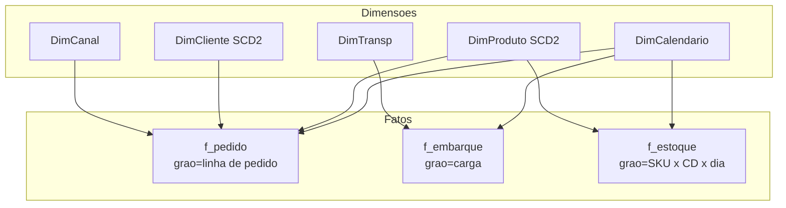

# Modelo de dados para supply chain no Power BI — estrela, calendário e uma só verdade

Power BI brilha quando o **modelo semântico** está limpo: fato **estreito**, dimensões **largas**, **calendário** explícito, relacionamentos **muitos-para-um** sem ambiguidade. Para supply chain, o modelo é o **mapa** que permite ao analista dizer «o número subiu **porque**» — e ao executivo confiar que **não** há dupla contagem escondida. Esta aula formaliza um *star schema* de referência para `f_pedido`, `f_embarque`, `f_estoque`, com **DimCalendario**, **SCD2**, **RLS** e **agregações** — base para [Aula 3.2 (DAX)](aula-02-medidas-dax-supply-chain.md) e [Aula 3.3 (operacional × estratégico)](aula-03-operacional-vs-estrategico-power-bi.md).

---

## Objetivos e resultado de aprendizagem

- Desenhar **star schema** com 3 fatos e 5 dimensões para supply chain.
- Implementar **DimCalendario** com semana operacional, fechamento contábil e feriados BR.
- Aplicar **SCD tipo 2** em `DimProduto` e `DimCliente`.
- Configurar **RLS** (*Row-Level Security*) por região + papel.
- Escolher entre **Import**, **DirectQuery**, **Composite** e **Direct Lake** (Fabric).
- Definir **agregações** para fatos grandes (>50 M linhas).
- Versionar `.pbip` no Git via **Power BI Project**.

**Duração:** 70–90 min. **Pré-requisitos:** [Aula 2.1](../modulo-02-excel-avancado-para-logistica/aula-01-modelagem-tabular-logistica.md) (modelagem tabular); Power BI Desktop instalado.

---

## Mapa do conteúdo

1. Gancho — duas tabelas de «data».
2. Star schema mínimo viável com 3 fatos.
3. Diagrama do modelo (Mermaid).
4. DimCalendario completa com `CALENDAR` + colunas BR.
5. SCD2 — quando e como usar.
6. Cardinalidade, *cross-filter*, ambiguidade.
7. Modos de armazenamento — Import × DQ × Composite × Direct Lake.
8. RLS — papéis, *USERPRINCIPALNAME*, validação.
9. Agregações para grandes fatos.
10. Versionamento `.pbip` + Tabular Editor.
11. Caso prático com gabarito (modelo TechLar).
12. Trade-offs, erros, dicionário, ferramentas.
13. Exercícios, reflexão, fechamento, referências, pontes.

---

## Gancho — duas tabelas de «data»

Na TechLar existiam **DataPedido** na fato e **Data** na dim produto (erro de importação). O visual de série temporal **duplicava** vendas ao filtrar. A correção foi **uma** `DimCalendario` relacionada à **data ativa** do fato — e **desligar** auto-datetime se a política da organização exigir (performance e clareza).

> **Analogia do GPS:** dois mapas com escalas diferentes na mesma viagem garantem que **alguém vai chegar atrasado**. Modelo semântico é **um** mapa.

---

## Star schema mínimo viável (3 fatos × 5 dimensões)



| Tabela | Tipo | Grão | Colunas-chave principais |
|--------|------|------|--------------------------|
| `f_pedido` | Fato | linha de pedido | `pedido_id`, `linha_id`, `sku_sk`, `cliente_sk`, `canal_sk`, `data_promessa_sk`, `data_pod_sk`, `qtd_pedida`, `qtd_entregue` |
| `f_embarque` | Fato | carga (NF) | `nf_id`, `transp_sk`, `data_embarque_sk`, `peso_kg`, `cubagem_m3`, `frete_brl` |
| `f_estoque` | Fato (snapshot) | SKU × CD × dia | `sku_sk`, `cd_id`, `data_sk`, `qtd_disp`, `qtd_reservada`, `valor_brl` |
| `DimCalendario` | Dim | dia | `data`, `data_sk`, `ano`, `mes`, `ano_mes`, `semana_op`, `feriado_br`, `dia_util` |
| `DimProduto` | Dim SCD2 | SKU + versão | `sku_sk`, `sku_natural`, `familia`, `categoria_abc`, `ativo_de`, `ativo_ate`, `is_atual` |
| `DimCliente` | Dim SCD2 | cliente + versão | `cliente_sk`, `canal`, `regiao_uf`, `segmento`, `ativo_de`, `ativo_ate` |
| `DimTransp` | Dim | transportadora | `transp_sk`, `modal`, `parceiro` |
| `DimCanal` | Dim | canal de venda | `canal_sk`, `nome` (site, marketplace, B2B) |

> **Surrogate key (`*_sk`):** chave inteira gerada no Power Query / SQL; preserva histórico SCD2 e garante junção rápida.

---

## DimCalendario completa — DAX

```dax
DimCalendario =
ADDCOLUMNS (
    CALENDAR ( DATE ( 2024, 1, 1 ), DATE ( 2027, 12, 31 ) ),
    "ano",            YEAR ( [Date] ),
    "mes",            MONTH ( [Date] ),
    "ano_mes",        FORMAT ( [Date], "yyyy-MM" ),
    "trimestre",      "T" & FORMAT ( [Date], "Q" ),
    "dia_semana",     WEEKDAY ( [Date], 2 ),
    "dia_util_br",    NOT ( WEEKDAY ( [Date], 2 ) IN { 6, 7 } ),
    "semana_op",      "S" & FORMAT ( WEEKNUM ( [Date], 21 ), "00" ),
    "data_sk",        FORMAT ( [Date], "yyyyMMdd" ) * 1
)
```

Marcar como **Tabela de Datas** (`Modeling → Mark as date table`). Adicionar coluna `feriado_br` por *merge* com lista (Anbima, gov.br) no Power Query.

> **Regra:** uma única `DimCalendario` ativa por modelo; **role-playing** (`data_promessa`, `data_embarque`, `data_pod`) com `USERELATIONSHIP` em medidas DAX (Aula 3.2).

---

## SCD2 — quando e como usar

**Cenário:** SKU `ABC123` muda de família «alimentos» para «mercearia» em 2025-08-01. Sem SCD2, **toda** venda histórica passa a ser de «mercearia» — falsifica análise comparativa.

**Estrutura:**

| sku_sk | sku_natural | familia | ativo_de | ativo_ate | is_atual |
|--------|-------------|---------|----------|-----------|----------|
| 1001 | ABC123 | alimentos | 2024-01-01 | 2025-07-31 | false |
| 1078 | ABC123 | mercearia | 2025-08-01 | 9999-12-31 | true |

A `f_pedido` referencia **`sku_sk`** (não `sku_natural`). Análise de 2024 mantém «alimentos»; análise de 2026 mostra «mercearia». Implementação: `MERGE` no SQL upstream ou no Power Query (mais lento, mas viável).

**SCD tipo 1 (sobrescrever):** ok para correção de digitação.  
**SCD tipo 3 (coluna anterior):** raro em logística.  
**SCD tipo 2 (versão):** padrão para atributos com valor analítico.

---

## Modos de armazenamento

| Modo | Latência | Volume | Quando usar |
|------|----------|--------|-------------|
| **Import** | refresh | até ~10 GB | maioria dos casos; performance ótima |
| **DirectQuery** | tempo real | grande | dados sensíveis no fonte; latência crítica |
| **Composite** | misto | grande | dim Import + fato DQ |
| **Direct Lake** (Fabric) | quase tempo real | bilhões | OneLake / Lakehouse Delta |

**Heurística:** **Import** por padrão; **Composite** quando latência for crítica em **um** fato; **Direct Lake** se o cliente já tem Fabric/OneLake.

---

## Cardinalidade e ambiguidade

- **Muitos-para-um (*):1**: padrão e desejado.
- **Muitos-para-muitos**: usar **bridge table** quando inevitável; explicitar.
- **Bidirecional**: **evitar**; ative só com critério (segurança RLS, role-playing).
- **Inativo (`USERELATIONSHIP`)**: para *role-playing* dates (promessa, embarque, POD).

---

## RLS — Row-Level Security

```dax
// Role: Gerente_Sul
[regiao_uf] IN { "RS", "SC", "PR" }

// Role: Gerente_NE
[regiao_uf] IN { "BA", "PE", "CE", "RN", "PB", "AL", "SE", "PI", "MA" }

// Role: dynamic (pelo e-mail)
[gerente_email] = USERPRINCIPALNAME()
```

**Validação:** `View as → Other user` no Desktop; **teste** com cada papel antes de publicar. **LGPD:** não exponha dados pessoais (CPF, e-mail) sem mascaramento; combine RLS com **Object-Level Security (OLS)** se necessário.

---

## Agregações para grandes fatos

Quando `f_pedido` tem **300 M linhas**, crie tabela agregada `f_pedido_diario` (1 linha por dia × canal × CD) com mesma **medidas** essenciais. Configure em **Manage Aggregations** → Power BI roteia consultas:

- Filtro por **dia × canal**: usa `f_pedido_diario` (ms).
- Filtro por **pedido específico**: cai em `f_pedido` (lento, mas raro).

Resultado: **dashboards em <1 s** sem perder *drill* até a linha.

---

## Versionamento `.pbip`

`Power BI Project` (`.pbip`) salva o modelo como **pasta de ficheiros JSON/TMDL** versionáveis no **Git**. Padrão recomendado:

```
modelo-techlar/
  ├── definition/
  │   ├── tables/
  │   ├── relationships/
  │   └── measures/
  ├── reports/
  └── README.md
```

- **Tabular Editor 3** para editar TMDL e medidas em massa.
- **DAX Studio** para profiling.
- *Pull request* mostra **diff** legível das medidas — fim do «quem mudou esta medida?».

---

## Caso prático — modelo TechLar (esqueleto)

**Pergunta:** «Calcular OTIF e fill rate por canal × semana com *drill* até linha de pedido, mantendo histórico de família de SKU.»

**Modelo proposto:**

- `f_pedido` (linha) Import — 18 M linhas.
- `f_estoque` (snapshot diário) Import — 12 M.
- `DimProduto` SCD2 — 80 mil versões.
- `DimCliente` SCD2 — 250 mil.
- `DimCalendario` 2024–2027.
- `DimCanal`, `DimTransp`.
- **RLS** por `regiao_uf` (Norte, NE, CO, SE, Sul) + role admin.
- Agregação `f_pedido_diario` para dashboards executivos.

**Validação rápida:**

```dax
TestUnicidadePedidoLinha :=
IF (
    DISTINCTCOUNT ( f_pedido[pk] ) = COUNTROWS ( f_pedido ),
    "OK",
    "DUPLICADO"
)
```

---

## Trade-offs e decisão

| Decisão | Mais simples | Mais robusto | Quando vale subir |
|---------|--------------|--------------|--------------------|
| Snowflake (encadear dim) | Star puro | Snowflake parcial | Atributos hierárquicos com volume |
| Auto-datetime | Ligado | Desligado + DimCalendario | Sempre desligado em produção |
| Bidirecional | Off | On controlado | Bridge table; evitar de outra forma |
| Storage | Import | Composite/Direct Lake | Latência crítica ou volume bilhões |

---

## Erros comuns e armadilhas

- **Snowflake** excessivo no primeiro modelo (muitas dimensões encadeadas).
- Medidas em **colunas calculadas** duplicadas por linha.
- Auto-datetime gerando **20 tabelas escondidas**.
- Relacionamento **bidirecional** no fato → ambiguidade silenciosa.
- Chaves naturais com **espaços** ou **case** divergente entre fonte e dim.
- Esquecer **SCD2** e perder história de cadastro.
- Publicar **sem RLS** e expor dados sensíveis.
- Modelo de 30 GB sem **agregações**.

---

## Dicionário operacional do modelo

| Campo | Valor |
|-------|-------|
| **Modelo** | `dm_techlar_supply_v1` |
| **Storage** | Import (com agregação `f_pedido_diario`) |
| **Granularidade fatos** | f_pedido = linha; f_embarque = NF; f_estoque = SKU×CD×dia |
| **SCD** | DimProduto SCD2; DimCliente SCD2; restantes SCD1 |
| **Refresh** | 06h00 BRT (incremental últimos 7 dias) |
| **RLS** | por `regiao_uf` (5 papéis) + admin |
| **Acesso** | Workspace Premium `WS_LOG_PROD` |
| **Versão** | v1.0 — abr/2026 |
| **Dono** | Engenharia de Dados Logística |

---

## Ferramentas e tecnologias

- **Power BI Desktop** + `.pbip`.
- **Tabular Editor 2/3** — edição em massa, *Best Practice Analyzer*.
- **DAX Studio** — profiling, server timings.
- **Microsoft Fabric** — OneLake, Direct Lake, Dataflows Gen2, Copilot.
- **dbt** + **Snowflake/Databricks** — preparação upstream.
- **Purview / Atlan** — catálogo e linhagem corporativa.

---

## Glossário rápido

- **Star schema:** modelo dimensional com fato central e dim raiadas.
- **SCD2:** *Slowly Changing Dimension* tipo 2, versionada por linha.
- **Surrogate key:** chave inteira artificial.
- **Direct Lake:** modo do Fabric que lê Delta Lake sem importar.
- **Role-playing date:** mesma DimCalendario referenciada por várias datas via `USERELATIONSHIP`.
- **RLS / OLS:** Row / Object Level Security.

---

## Aplicação — exercícios

1. Liste **7 colunas obrigatórias** em `f_pedido` para suportar OTIF e fill rate ao nível de linha.
2. Implemente `DimCalendario` com o snippet acima e marque como tabela de datas.
3. Desenhe SCD2 para `DimProduto` (ao menos 2 versões).
4. Defina **3 papéis RLS** para a sua operação (Norte, Sul, admin).
5. Crie agregação `f_pedido_diario` e teste com DAX Studio.

**Gabarito pedagógico exercício 1:** `pedido_id`, `linha_id`, `sku_sk`, `cliente_sk`, `data_promessa_ini`, `data_promessa_fim`, `data_pod`, `qtd_pedida`, `qtd_entregue`, `ind_substituicao_autorizada` (+ flags de cancelamento).

---

## Pergunta de reflexão

Qual dimensão hoje está **mesclada no fato** e devia nascer? E quem perderia poder se a história fosse preservada (SCD2)?

---

## Fechamento — takeaways

- Modelo ruim **teletransporta** lixo do ERP para o ecrã bonito.
- **Calendário próprio + SCD2 + RLS + agregações** = quarteto de ouro.
- `.pbip` + Git acaba com modelo de produção em pasta compartilhada.

---

## Referências

1. Microsoft — [Modelagem em estrela](https://learn.microsoft.com/power-bi/guidance/star-schema).
2. Microsoft — [Row-level security (RLS)](https://learn.microsoft.com/power-bi/admin/service-admin-rls).
3. Microsoft — [Power BI Project (`.pbip`)](https://learn.microsoft.com/power-bi/developer/projects/projects-overview).
4. Microsoft — [Direct Lake no Fabric](https://learn.microsoft.com/fabric/get-started/direct-lake-overview).
5. KIMBALL, R.; ROSS, M. *The Data Warehouse Toolkit*. Wiley.
6. RUSSO, M.; FERRARI, A. *The Definitive Guide to DAX* / *Analyzing Data with PBI*. Microsoft Press.
7. SQLBI — [Best practices for star schema](https://www.sqlbi.com/articles/).

---

## Pontes para outras trilhas

- Anterior: [Aula 2.3 — Painéis operacionais Excel](../modulo-02-excel-avancado-para-logistica/aula-03-paineis-operacionais-excel.md).
- Próxima: [Aula 3.2 — Medidas DAX](aula-02-medidas-dax-supply-chain.md).
- [Aula 1.1 — Do problema ao dataset](../modulo-01-data-analytics-para-logistica/aula-01-do-problema-ao-dataset.md).
