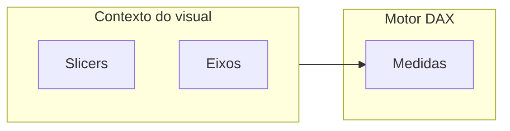

# Medidas DAX que não quebram com o negócio — OTIF, fill e a cauda do lead time

DAX não é «fórmula de Excel com chique»: é **contexto de filtro**. Em supply chain, medidas mal escritas **mudam** quando alguém clica num slicer de produto — às vezes isso é desejado, às vezes é **catástrofe** silenciosa. Esta aula fixa **padrões** para OTIF, fill rate e percentis de lead time, com **dicionário** obrigatório.

---

## Gancho — o fill rate que contava linhas duas vezes

Na TechLar, uma medida usou `SUMX` sobre tabela **desnormalizada** com **produto repetido** por causa de *merge* errado. O fill rate **subiu** artificialmente. A lição: **validar** medida com **tabela de teste** pequena (10 linhas) antes de publicar.

---

## Dicionário de medidas (template)

| Nome | Definição de negócio | Comentários DAX |
|------|----------------------|-----------------|
| `NumPedidosOTIF` | Pedidos **a tempo** e **completos** segundo contrato interno | Filtrar *grain* = pedido |
| `FillRateLinhas` | Soma `QtdEntregue` / soma `QtdPedida` ao nível **linha** | Excluir substituições não autorizadas se política exigir |
| `LeadTimeHoras` | `DataEntrega - DataEmbarque` (ou outra janela definida) | Uniformizar fuso |
| `LeadTimeP90` | Percentil 90 do lead time **no contexto** do visual | Usar `PERCENTILEX.INC` com cuidado de performance |

**Nota:** fórmulas exatas dependem do modelo; o valor pedagógico é a **definição** acoplada ao nome da medida.

---

## Semi-aditivas — saldo de estoque

**Inventário** não soma no tempo como vendas: usar padrões como último dia do período (`LASTDATE` + `CALCULATE`). Erro típico: **somar** saldos diários como se fossem fluxo.

---

## Comparadores inteligentes

`SAMEPERIODLASTYEAR` na **DimCalendario** para **série**; para **OTIF** vs meta, usar **medida** de meta armazenada numa tabela de **parâmetros** ou *What-if parameter*.

---

## Exercício

Escreva em **português** (sem código) o algoritmo de **OTIF ao nível de pedido** para a TechLar: «a tempo» = entrega entre `PromessaInicio` e `PromessaFim`; «completo» = todas as linhas com `QtdEntregue >= QtdPedida` sem substituição não autorizada. Depois, indique **um** risco de implementação em DAX.

**Gabarito pedagógico:** agregação em duas fases — primeiro **linha** completa, depois **pedido** completo; risco: relacionamentos **ativam** filtros indesejados (usar `REMOVEFILTERS` com critério).

---

## Erros comuns

- `COUNTROWS` em tabela errada.  
- Misturar **moedas** sem conversão explícita.  
- Medidas lentas sem **agregações** (*aggregations*) quando o modelo cresce — tópico avançado.

---

## Referências

1. Microsoft — **DAX** guide: https://learn.microsoft.com/dax/  
2. SQLBI — artigos e padrões DAX: https://www.sqlbi.com/  
3. Trilha Fundamentos — [KPIs](../../trilha-fundamentos-e-estrategia/modulo-04-custos-logisticos-performance/aula-03-nivel-servico-kpis-logisticos.md).  

---

## Fechamento

Medida sem **dicionário** é **dívida técnica** emocional: alguém vai explicar o número na sala quente.

**Pergunta:** qual medida hoje **ninguém** consegue explicar com uma frase?
