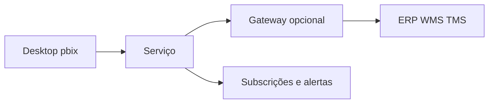

# Operacional *versus* estratégico no Power BI — duas audiências, um modelo

O mesmo **modelo semântico** pode alimentar **duas** experiências: o **painel de turno** (curto, exceções em vermelho, *drill* rápido) e o **painel executivo** (poucos KPIs, tendência, cenários). O erro é **duplicar** lógica em dois ficheiros `.pbix` divergentes — aí nasce a «versão do CFO» e a «versão da doca».

---

## Gancho — o CEO que pediu «só mais um número»

Na TechLar, o CEO pediu **fill rate** semanal no mesmo ecrã que **OTIF** diário. O modelo aguentou; o **layout** não: escalas diferentes confundiram a leitura. A solução foi **duas páginas** com **cruzamento** explícito (sincronizar slicer de canal) e **títulos** com definição.

---

## Página operacional — padrão

- **Topo:** 3–5 cartões + **última atualização** (*refresh*).  
- **Meio:** tabela de **exceções** (pedidos em risco, linhas em *backorder*).  
- **Base:** tendência **curta** (14 dias) para contexto.

**Analogia da UTI:** alarmes poucos e altos; detalhe sob demanda.

---

## Página estratégica — padrão

- **KPIs** com comparador (meta, ano anterior).  
- **Mapa** ou barras por **região** (se fizer sentido de negócio).  
- **Narrativa** inteligente (*smart narrative*) só como **rascunho** — revise sempre o texto.

---

## Publicação, *workspace* e cadência

Fluxo típico: **Desktop** → validação com **roles** → **Serviço** → *gateway* on-prem se necessário → **subscrição** por e-mail para donos. Documente **janela** de *refresh* (ex.: após fecho WMS 23h).

---

## Mobile e alertas

**Layout mobile** separado evita «pinçar» gráfico inútil. **Alertas** de dados em KPIs críticos (ex.: OTIF < 92%) exigem **definição estável** — mudar definição sem aviso gera **fadiga** de alarme.

---

## Exercício

Descreva **duas páginas** (operacional e estratégica) para o mesmo modelo da TechLar: liste **títulos** dos visuais e **um** slicer comum + **um** slicer exclusivo de cada página.

**Gabarito pedagógico:** operacional com tabela de exceções; estratégico com tendência longa; comum = canal; exclusivo = turno *vs.* visão trimestral.

---

## Erros comuns

- Dois `.pbix` com medidas **diferentes** com o mesmo nome.  
- Publicar sem **versão** no nome ou comentário de alteração.  
- **RLS** esquecido e dados sensíveis expostos — risco grave.

---

## Referências

1. Microsoft — **Publicar** do Desktop: https://learn.microsoft.com/power-bi/create-reports/desktop-upload-desktop-files  
2. Microsoft — **Alertas** de dados: https://learn.microsoft.com/power-bi/create-reports/service-set-data-alerts  
3. FEW, S. *Information Dashboard Design*.  

---

## Fechamento

Um modelo, **várias** histórias — desde que a **definição** seja uma só.

**Pergunta:** qual KPI hoje existe em **duas versões** não documentadas?
