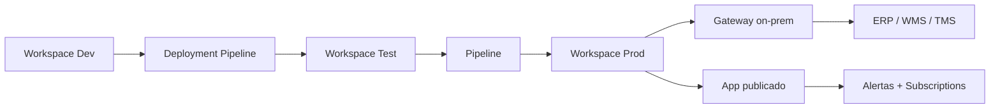

# Operacional *versus* estratégico no Power BI — duas audiências, um modelo

O mesmo **modelo semântico** pode alimentar **duas** experiências: o **painel de turno** (curto, exceções em vermelho, *drill* rápido, *refresh* contínuo) e o **painel executivo** (poucos KPIs, tendência, cenários, *refresh* mensal). O erro comum é **duplicar** lógica em dois `.pbix` divergentes — aí nasce a «versão do CFO» e a «versão da doca», com OTIF diferente para o **mesmo** período.

Esta aula encerra o Módulo 3 com **padrões de layout**, **publicação**, **alertas**, **mobile**, **deployment pipelines** e **subscrições** — alinhados às definições da [Aula 3.2 (DAX)](aula-02-medidas-dax-supply-chain.md) e ao modelo da [Aula 3.1](aula-01-modelo-dados-supply-chain-power-bi.md).

---

## Objetivos e resultado de aprendizagem

- Desenhar **duas páginas** (operacional × estratégica) sobre o mesmo modelo.
- Aplicar **drill-through**, **bookmarks** e **page navigator**.
- Configurar **alertas** em KPIs com limiar e *actionable insight*.
- Implementar **layout mobile** para uso em campo.
- Configurar **scheduled refresh**, **gateway** e **incremental refresh**.
- Operar **deployment pipeline** Dev → Test → Prod.
- Gerenciar **subscrições por e-mail** sem virar spam.
- Saber quando usar **Copilot / smart narrative** sem comprometer rigor.

**Duração:** 60–80 min. **Pré-requisitos:** [Aula 3.1](aula-01-modelo-dados-supply-chain-power-bi.md), [Aula 3.2](aula-02-medidas-dax-supply-chain.md).

---

## Mapa do conteúdo

1. Gancho — o CEO que pediu «só mais um número».
2. Operacional × tático × estratégico (recapitulação).
3. Layout operacional — padrão e wireframe.
4. Layout estratégico — padrão e wireframe.
5. Drill-through, bookmarks, *page navigator*.
6. Mobile — quando faz sentido.
7. Publicação: workspace, gateway, incremental refresh.
8. Deployment pipeline (Dev/Test/Prod).
9. Alertas e subscrições sem fadiga.
10. AI Copilot e smart narrative — usos e limites.
11. Caso prático — duas páginas TechLar.
12. Trade-offs, erros, dicionário, ferramentas.
13. Exercícios, reflexão, fechamento, referências, pontes.

---

## Gancho — o CEO que pediu «só mais um número»

Na TechLar, o CEO pediu **fill rate semanal** no mesmo ecrã que **OTIF diário**. O modelo aguentou; o **layout** não: escalas diferentes confundiram a leitura. A solução foi **duas páginas** com **cruzamento explícito** (slicer de canal sincronizado) e **títulos com definição** — não com adjetivo.

> **Analogia da UTI × consultório:** UTI tem alarmes **poucos e altos** (operacional); consultório tem **conversa longa** (estratégico). Misturar os dois fatiga o médico e mata o paciente.

---

## Operacional × tático × estratégico

| Painel | Pergunta | Cadência | Latência | Layout | Visuais típicos |
|--------|----------|----------|----------|--------|-----------------|
| **Operacional** | «O que precisa de ação **agora**?» | tempo real / hora | minutos | denso, em vermelho | tabela de exceções; cartões; backlog por idade |
| **Tático** | «Como está a semana / canal?» | diária | D−1 | médio | tendência 14d; small multiples; *drill* |
| **Estratégico** | «Cumprimos a meta do trimestre?» | mensal | mês fechado | espaçoso | bullet vs meta; YoY; mapa; narrativa |

---

## Layout operacional — padrão

```
┌──────────────────────────────────────────────────────────────┐
│ TechLar · Expedicao · [VERDE selo]   Refresh: 07:42 BRT  ⟳   │
├──────────────────────────────────────────────────────────────┤
│ [OTIF dia 93,2% ▼1pp] [Fill 91,5% ▲0,5pp] [SLA POD 88,0%]    │
│  Meta 95%               Meta 93%             Meta 90%        │
├──────────────────────────────────────────────────────────────┤
│ Tabela exceções (top 30 por idade do backlog)               │
│ pedido | cliente | linhas | idade | causa | ação | dono     │
├──────────────────────────────────────────────────────────────┤
│ Tendência 14d small multiples por canal                      │
└──────────────────────────────────────────────────────────────┘
Slicers (topo dir.): canal · regiao_uf · transportadora
```

**Princípios:**

- **3–5 cartões** com `anchor + delta + ação`.
- **Tabela de exceções** ordenada pela **dor**.
- *Refresh* visível e **selo de qualidade**.
- **Drill-through** do cartão para detalhe da semana.

---

## Layout estratégico — padrão

```
┌──────────────────────────────────────────────────────────────┐
│ TechLar · Performance · Mes fechado abr/2026                 │
├──────────────────────────────────────────────────────────────┤
│ [Bullet OTIF mes vs meta]     [Capital estoque BRL]          │
│ [Bullet Fill rate]            [Cobertura dias]               │
├──────────────────────────────────────────────────────────────┤
│ Linha YoY OTIF + banda confianca                             │
├──────────────────────────────────────────────────────────────┤
│ Mapa BR: cobertura em dias por CD                            │
├──────────────────────────────────────────────────────────────┤
│ Narrativa BLUF (3 bullets) + acoes recomendadas              │
└──────────────────────────────────────────────────────────────┘
```

**Princípios:**

- **Bullets** (Stephen Few) substituem velocímetros.
- **Mapa** com **denominador** (não bolha bonita).
- **Narrativa BLUF** — bullet com conclusão antes da explicação.
- Slicer comum (canal); slicer exclusivo (trimestre, ano fiscal).

---

## Drill-through, bookmarks, page navigator

- **Drill-through:** página de detalhe filtrada por seleção (ex.: clicar em SKU → página com histórico, fornecedor, ruptura).
- **Bookmarks:** salvam estado de filtros/visuais. Use para **«visão CFO»** vs **«visão Diretor»** num mesmo relatório.
- **Page navigator:** botões para navegar entre operacional/estratégico — usuário não precisa decorar.
- **Tooltips personalizados:** página oculta com mini-painel ao passar mouse.

---

## Mobile — quando faz sentido

- **Coordenador em campo / motorista no CD** ⇒ sim.
- CEO num jato? Sim, mas **nunca** seu único canal.
- **Layout mobile** específico: 1–2 cartões grandes, tabela curta, **sem** mapa complexo.
- **Power BI Mobile app** + **alertas push** para KPI crítico.

---

## Publicação — workspace, gateway, incremental refresh



| Item | Recomendação |
|------|--------------|
| **Workspaces** | Dev / Test / Prod separados; **Premium** ou **Fabric capacity** para deployment pipeline |
| **Gateway** | On-prem para fontes locais (SAP, Oracle on-prem); cloud para SaaS |
| **Incremental refresh** | janela móvel (ex.: últimos 5 anos completos + últimos 7 dias incrementais) |
| **Refresh schedule** | 06h00 BRT após fecho WMS; 2x/dia se SLA exigir |
| **Apps** | publicar como App; usuário consome o App, não o Workspace |
| **Versão** | tag `v1.2-2026-04` no nome do relatório; changelog em página `_about` |

---

## Deployment pipeline (Dev/Test/Prod)

1. **Dev:** desenvolvedor faz alterações no `.pbip`, commit no Git.
2. **Test:** *deploy* via pipeline Power BI; validação por **product owner** logístico com checklist.
3. **Prod:** *deploy* aprovado; **rule** de troca de fonte (Dev→Test→Prod).
4. **Rollback:** pipeline mantém versão anterior; reverter em 1 clique.
5. **Auditoria:** Activity Log capturando quem publicou e quando.

---

## Alertas e subscrições sem fadiga

| Princípio | Aplicação |
|-----------|-----------|
| **Limiar acionável** | Alerta dispara quando **decisão muda**, não ao primeiro pixel |
| **Definição estável** | Mudou definição → resetar alerta + comunicar |
| **Dono nominal** | Cada alerta tem dono que **age** (não só recebe e-mail) |
| **Fadiga** | > 3 alertas/semana sem ação → revisar limiar |
| **Subscrição** | E-mail diário 07h30 com cartões snapshot; texto curto BLUF |
| **Canal** | Power Automate → Teams → canal da operação (preferível a e-mail) |

Exemplo: `OTIF semana < 92%` → notifica `Coord. Performance` no Teams, com link direto para a página operacional.

---

## AI Copilot e smart narrative — usos e limites

**Power BI Copilot / Microsoft Fabric Copilot** (2025–2026):

- ✅ **Bom para:** rascunho de narrativa («OTIF caiu 2pp esta semana, principalmente em B2B»), sugestão de medida DAX, geração de visual a partir de prompt.
- ⚠️ **Cuidado com:** **definição** de KPI (humano valida); **causalidade** (Copilot infere, não prova); **dados sensíveis** (verifique configuração de privacidade do tenant).
- ❌ **Nunca para:** definir métrica contratual; assinar relatório regulatório.

> **Regra do estagiário brilhante:** Copilot é como estagiário sênior — **rapidíssimo**, **convincente**, **às vezes errado**. Sem revisão humana, vira **automação de erro**.

---

## Caso prático — TechLar, duas páginas

**Página operacional («Expedicao Hoje»):**

- Cartões: `[PctOTIF]` dia, `[FillRateLinha]` dia, `[SLAPodHoras]`, `[BacklogIdade]`.
- Tabela exceções com **drill-through** para detalhe do pedido.
- Tendência 14 d com `USERELATIONSHIP` para `data_embarque`.
- Slicer comum: `canal`. Exclusivo: `turno`.

**Página estratégica («Performance Mensal»):**

- Bullets `[PctOTIF]` mês × meta 95%, `[FillRatePedido]` × meta 93%.
- Cartão `[CapitalEstoque_BRL]` com YoY.
- Linha `[PctOTIF]` 24 meses + `[PctOTIF_LY]`.
- Mapa: `[CoberturaDias]` por CD.
- Narrativa BLUF (3 bullets) + 2 ações recomendadas.

**Validação:** ambas as páginas usam a **mesma medida** `[PctOTIF]` — não há `OTIF_v2`.

---

## Trade-offs

| Decisão | Mais simples | Mais robusto | Quando subir |
|---------|--------------|--------------|--------------|
| Workspaces | um só | Dev/Test/Prod | quando 2+ pessoas editam |
| Refresh | full diário | incremental | volume > 1 GB ou refresh > 30 min |
| Mobile | nenhum | layout próprio | usuário móvel real |
| Copilot | desligado | piloto controlado | tenant pronto para LGPD |
| Deployment | publicação manual | pipeline | mudança recorrente |

---

## Erros comuns e armadilhas

- Dois `.pbix` com medidas **diferentes** com o mesmo nome.
- Publicar sem **versão** no nome ou comentário de alteração.
- **RLS** esquecido e dados sensíveis expostos — risco grave.
- **Alertas excessivos** levam usuários a criar regra de e-mail «arquivar tudo».
- Layout mobile abandonado.
- Copilot publicando narrativa sem revisão — **risco reputacional**.
- Refresh full em fato grande estourando capacidade.

---

## Dicionário operacional do relatório

| Campo | Valor |
|-------|-------|
| **Relatório** | `rel_techlar_supply_v1.pbix` |
| **Modelo** | `dm_techlar_supply_v1` |
| **Workspace prod** | `WS_LOG_PROD` |
| **App publicado** | `App TechLar Supply` |
| **Páginas** | Expedição Hoje · Performance Mensal · Detalhe Pedido (DT) |
| **Refresh** | 06h00 BRT (incremental últimos 7 dias) |
| **Alertas** | OTIF dia < 92% → Teams Coord. Performance |
| **Subscrição** | E-mail diário 07h30 BLUF (3 KPIs) |
| **Mobile** | Layout específico para Coord. Expedição |
| **RLS** | 5 papéis regionais + admin |
| **Versão** | v1.0 — abr/2026 |

---

## Ferramentas e tecnologias

- **Power BI Service** + **Premium / Fabric capacity**.
- **Deployment Pipelines**, **Git integration**, `.pbip`.
- **Tabular Editor 3** + **Best Practice Analyzer**.
- **Power Automate** + **Teams** (alertas).
- **Power BI Mobile** (Android/iOS).
- **Microsoft Purview** — catálogo, *endorsement* (Promoted/Certified).
- **Power BI Copilot** (preview/GA conforme tenant).

---

## Glossário rápido

- **Workspace:** contêiner de relatórios e datasets no serviço.
- **App:** experiência publicada para consumidores.
- **Gateway:** ponte para fontes on-prem.
- **Incremental refresh:** atualização parcial por janela.
- **Endorsement:** selo «Promovido» ou «Certificado» (governança).
- **Smart narrative:** texto gerado automaticamente sobre visual.

---

## Aplicação — exercícios

1. Desenhe **duas páginas** (operacional e estratégica) para a sua operação.
2. Configure **um alerta** com limiar acionável e dono nominal.
3. Implemente **drill-through** de cartão para detalhe.
4. Configure **incremental refresh** num fato real.
5. Crie um **deployment pipeline** Dev/Test/Prod.

**Gabarito pedagógico:** verifique se (a) ambas as páginas usam **mesma medida**, (b) alerta dispara **decisão**, (c) refresh incremental cobre janela suficiente para histórico comparativo.

---

## Pergunta de reflexão

Qual KPI hoje existe em **duas versões** não documentadas — e quem da diretoria vai descobrir primeiro?

---

## Fechamento — takeaways

- Um modelo, **várias** histórias — desde que a **definição** seja **uma só**.
- **Deployment pipeline + Git + RLS** = a maturidade que separa POC de produto.
- Copilot acelera, **não** define — humano assina.

---

## Referências

1. Microsoft — [Publicar do Desktop](https://learn.microsoft.com/power-bi/create-reports/desktop-upload-desktop-files).
2. Microsoft — [Alertas de dados](https://learn.microsoft.com/power-bi/create-reports/service-set-data-alerts).
3. Microsoft — [Deployment pipelines](https://learn.microsoft.com/power-bi/create-reports/deployment-pipelines-overview).
4. Microsoft — [Incremental refresh](https://learn.microsoft.com/power-bi/connect-data/incremental-refresh-overview).
5. Microsoft — [Power BI Copilot](https://learn.microsoft.com/power-bi/create-reports/copilot-introduction).
6. FEW, S. *Information Dashboard Design*. Analytics Press.
7. Gartner — *Magic Quadrant for Analytics and BI Platforms* (edição vigente).

---

## Pontes para outras trilhas

- Anterior: [Aula 3.2 — Medidas DAX](aula-02-medidas-dax-supply-chain.md).
- Próximo módulo: [Indicadores logísticos (KPIs)](../modulo-04-indicadores-logisticos-kpis/README.md) — definições contratuais que o relatório implementa.
- Trilha Fundamentos — [KPIs logísticos](../../trilha-fundamentos-e-estrategia/modulo-04-custos-logisticos-performance/aula-03-nivel-servico-kpis-logisticos.md).
