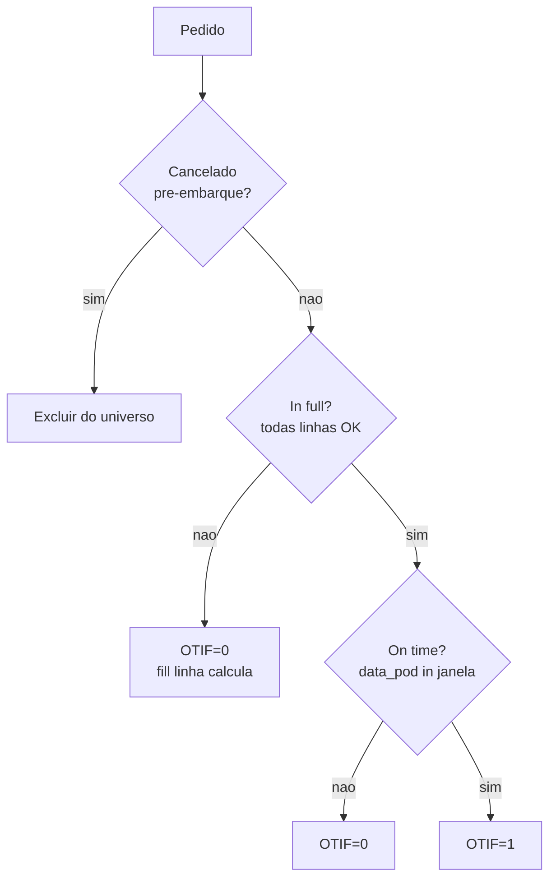

# OTIF e fill rate com contrato interno — a mesma sigla, três definições honestas

**OTIF** (*on time in full*) e **fill rate** são KPIs «óbvios» até a primeira briga entre comercial e logística. Esta aula **fecha o ciclo** da trilha: o que desenhaste em **Excel/Power BI** deve refletir **definições** que caberiam num **anexo de contrato interno** — sem ser assessoria jurídica, mas com **rigor operacional**. A trilha [Fundamentos e estratégia](../../trilha-fundamentos-e-estrategia/modulo-04-custos-logisticos-performance/aula-03-nivel-servico-kpis-logisticos.md) já introduziu o vocabulário; aqui aprofundamos **implementação**, **denominadores**, **benchmarks BR** e **dicionário** publicável.

---

## Objetivos e resultado de aprendizagem

- Escrever **dicionário operacional** de OTIF e fill rate ao nível de **linha** e **pedido**.
- Distinguir os três níveis: **OTIF cliente**, **OTIF interno**, **OTIF comercial**.
- Definir tratamento para **antecipação**, **substituição**, **parcial autorizado**, **cancelamento tardio**.
- Calcular OTIF e fill rate em laboratório numérico controlado.
- Comparar com **benchmarks brasileiros** (varejo, farma, B2B industrial).
- Operacionalizar via DAX (referência: [Aula 3.2](../modulo-03-power-bi-para-supply-chain/aula-02-medidas-dax-supply-chain.md)).

**Duração:** 60–80 min. **Pré-requisitos:** [Módulo 3](../modulo-03-power-bi-para-supply-chain/README.md); noção de cláusula de SLA em contratos.

---

## Mapa do conteúdo

1. Gancho — «cedo demais» quebrou a janela B2B.
2. OTIF: três versões honestas (cliente, interno, comercial).
3. Componentes — *on time* + *in full* + casos limite.
4. Fill rate: linha × pedido × valor.
5. Diagrama de decisão (Mermaid).
6. Laboratório tabular — 10 pedidos, 4 cenários.
7. Dicionário operacional (template + exemplo TechLar).
8. Benchmarks BR e setoriais.
9. Implementação DAX (ponteiro).
10. Trade-offs, erros, ferramentas.
11. Exercícios, reflexão, fechamento, referências, pontes.

---

## Gancho — «cedo demais» quebrou a janela B2B

Cliente B2B da TechLar recusou recebimento porque o caminhão chegou **doze horas cedo** fora do *slot*. O OTIF interno contava «a tempo» (data ≤ promessa). O cliente contava «**dentro da janela** [ini, fim]». **Definição** não é detalhe; é **fronteira** entre **verde e vermelho** — e entre **bonificação e multa**.

> **Analogia do voo comercial:** decolar **30 minutos antes** sem aviso é tão ruim quanto atrasar — passageiros ficam em terra. Em logística B2B, **antecipação** desconfigura linha de produção do cliente.

---

## OTIF — três versões honestas

| Versão | Quem mede | Numerador | Denominador | Quando usar |
|--------|-----------|-----------|-------------|-------------|
| **OTIF Cliente** | Cliente final | Pedidos entregues *dentro da janela acordada* AND *completos* | Pedidos prometidos | SLA contratual; multa |
| **OTIF Interno** | Operação | Pedidos embarcados ≤ promessa interna AND *in full* na separação | Pedidos liberados | Performance interna; bônus |
| **OTIF Comercial** | Comercial | Pedidos faturados ≤ data prometida pelo vendedor | Pedidos vendidos | Compromisso comercial |

**Regra de ouro:** **três indicadores separados** com **três nomes distintos**. Mesma sigla com **três cálculos** = guerra civil em reunião.

---

## Componentes mínimos

### *On time*

Comparação entre **data/hora efetiva** e **janela acordada** `[Início, Fim]`. Considere:

- **Atraso** (`data_pod > Fim`): falha clara.
- **Antecipação** (`data_pod < Início`): falha em B2B com janela; tolerada em e-commerce.
- **Tolerância**: ± 30 min, ± 2 h, etc. — documentar **antes** do dashboard.

### *In full*

**Quantidade** e **mix** conforme pedido. Considere:

- **Substituição autorizada** (mesma referência funcional): conta como completo? Política.
- **Parcial autorizado**: cliente concorda em receber parte agora, parte depois — duas entregas, dois OTIF.
- **Cancelamento tardio**: linha cancelada após separação — exclui do denominador? Política.

> **Princípio:** OTIF do **pedido** é `1` apenas se **TODAS** as linhas elegíveis cumprem *in full* AND o pedido é *on time* segundo a janela do **pedido** (ou da **entrega consolidada** — escolha e documente).

---

## Fill rate — três variantes

| Nível | Numerador | Denominador | Quando usar |
|-------|-----------|-------------|-------------|
| **Linha** | `qtd_entregue` (ajustada por substituição) | `qtd_pedida` | Operação fina; ponderado por volume |
| **Pedido** | `1` se todas as linhas OK | `1` por pedido | Visão do cliente; relacionamento |
| **Valor** | `valor_entregue_brl` | `valor_pedido_brl` | Financeiro; mix com preços diferentes |

**Misturar níveis no mesmo gráfico sem rótulo é erro de desenho** — não de Excel ou Power BI.

---

## Diagrama de decisão



---

## Laboratório tabular — TechLar (10 pedidos, 4 cenários)

| Pedido | Linhas pedidas | Linhas completas | Janela | Data POD | Substituição | Cancelamento tardio | OnTime | InFull | OTIF |
|--------|---------------|------------------|--------|----------|--------------|---------------------|--------|--------|------|
| 201 | 3 | 3 | [10,12] | 11 | – | – | sim | sim | 1 |
| 202 | 5 | 4 | [10,12] | 12 | – | – | sim | não | 0 |
| 203 | 2 | 2 | [10,12] | 14 | – | – | não | sim | 0 |
| 204 | 4 | 4 | [10,12] | 09 | – | – | não (cedo) | sim | 0 |
| 205 | 6 | 6 | [10,12] | 11 | autorizada | – | sim | sim | 1 |
| 206 | 3 | 2 | [10,12] | 11 | – | 1 linha cancelada | sim | sim* | 1 |
| 207 | 1 | 1 | [10,12] | 12 | – | – | sim | sim | 1 |
| 208 | 8 | 7 | [10,12] | 13 | não autorizada | – | não | não | 0 |
| 209 | 2 | 2 | [10,12] | 11 | – | – | sim | sim | 1 |
| 210 | 5 | 5 | [10,12] | 10 | – | – | sim | sim | 1 |

*\* Cancelamento tardio reduz `qtd_pedida` de 3 → 2 — política «excluir do denominador».*

**Cálculos:**

- `PedidosTotal` = 10
- `PedidosOTIF` = 6 → `PctOTIF` = **60%**
- `QtdPedida` (ajustada por cancelamento tardio) = 38; `QtdEntregue` = 36 → `FillRateLinha` = **94,7%**
- Pedidos completos = 7 → `FillRatePedido` = **70%**

**Lições:**

- `FillRateLinha` (94,7%) parece bom; `PctOTIF` (60%) revela sofrimento real.
- **Mostrar uma só métrica** = manipular.
- **Antecipação** (pedido 204) e **substituição não autorizada** (208) são casos comuns ignorados.

---

## Dicionário operacional — exemplo TechLar

| Campo | Valor |
|-------|-------|
| **Nome** | `[PctOTIF_Cliente]` |
| **Descrição** | % pedidos *on time* (dentro da janela [ini,fim]) AND *in full* segundo contrato cliente |
| **Numerador** | Pedidos com `data_pod ∈ [janela_ini, janela_fim]` AND `qtd_entregue ≥ qtd_pedida` em todas as linhas |
| **Denominador** | Pedidos no período com `status_final ∈ (entregue, devolvido)` |
| **Tolerância on time** | ± 30 min na janela B2B; e-commerce só `fim` (sem `ini`) |
| **Substituição** | autorizada conta; não autorizada não conta |
| **Parcial** | cada entrega parcial é avaliada individualmente |
| **Cancelamento tardio** | exclui da fração da linha; preserva pedido se ≥ 80% das linhas mantidas |
| **Fonte** | `f_pedido` (origem ERP+WMS+TMS+carrier) |
| **Granularidade** | pedido |
| **Cadência** | diária 06h00 |
| **Latência** | ≤ 2 h após POD |
| **Meta interna** | 95% (alerta < 92%) |
| **Dono** | Coord. Performance Logística |
| **Aprovador definição** | Diretoria Comercial + Diretoria Operações |
| **Versão** | v1.0 — abr/2026 (ata #042) |

> **Analogia:** dicionário de KPI é como **bula de remédio**: sem ele, o usuário automedica e a culpa é dele. Com ele, há **rastreabilidade**.

---

## Benchmarks brasileiros (orientativos)

| Setor | OTIF cliente típico | Fill rate linha | Observações |
|-------|---------------------|-----------------|-------------|
| **Varejo grande** (Carrefour, Pão de Açúcar, Atacadão) | 92–97% | 94–97% | < 95% gatilho de **multa** contratual |
| **Farmácia** (drogarias rede) | 95–98% | 95–98% | Giro 8x/ano; ruptura é tabu |
| **Indústria B2B** (auto, branca) | 90–96% | 90–95% | Janelas estreitas; antecipação penalizada |
| **E-commerce capital BR** | 88–95% | – | Janela só `fim`; multa por reembolso |
| **Marketplace 1P** | 92–97% | – | Penalização por *de-rank* automático |

> Números são **orientativos**, não normativos; cada contrato manda. Use como **calibração** ao desenhar metas internas.

---

## Implementação DAX (ponteiro)

Ver [Aula 3.2 — Medidas DAX](../modulo-03-power-bi-para-supply-chain/aula-02-medidas-dax-supply-chain.md) para o padrão completo. Esqueleto:

```dax
PctOTIF_Cliente :=
DIVIDE (
    [PedidosOTIF_ComJanela],
    [PedidosTotal_Validos]
)
```

Onde `[PedidosOTIF_ComJanela]` valida `data_pod` contra `[ini, fim]` (não só `fim`).

---

## Trade-offs

| Decisão | Mais simples | Mais correto | Quando subir |
|---------|--------------|--------------|--------------|
| Cedo conta como falha | Não | Sim em B2B | Sempre que houver janela contratual |
| Substituição autorizada | Conta tudo | Política explícita | Quando houver categoria com substitutos comuns |
| Pedido vs linha | Só linha (mostra bem) | Ambos com rótulo | Sempre que houver dor real do cliente |
| Métrica única | Útil para slide | Múltiplas métricas | Reuniões com mais de uma área |

---

## Erros comuns e armadilhas

- Bonificar **embarque** em vez de **entrega comprovada (POD)**.
- OTIF global que **esconde** canal crítico (B2B com 70%, marketplace com 95% → média 88%).
- Ignorar **antecipação** em B2B com janela.
- Tratar **substituição não autorizada** como completa.
- Excluir **cancelamento tardio** sem critério (afeta tanto numerador quanto denominador).
- Definição mudada **sem versão** — KPI vira número novo com nome velho.
- Comparar OTIF de **canais distintos** sem normalização.

---

## Ferramentas e tecnologias

- **Power BI** + **DAX** (Aula 3.2).
- **Excel + Power Pivot** (Módulo 2).
- **dbt + dbt-metrics / dbt semantic layer** quando a definição precisa morar fora do BI.
- **Cube / Looker** para camada semântica corporativa.
- **Power Automate / Teams** para alerta `< 92%`.

---

## Glossário rápido

- **OTIF:** *On Time In Full*.
- **Fill rate:** taxa de atendimento.
- **Janela:** intervalo `[ini, fim]` acordado.
- **POD:** *proof of delivery*.
- **SLA interno:** acordo entre áreas, sem força contratual externa.
- **Multa de OTIF:** valor cobrado pelo cliente quando indicador cai abaixo do mínimo.

---

## Aplicação — exercícios

1. Redija o parágrafo **«On time»** do dicionário da TechLar para **marketplace** *vs.* **B2B** com janelas diferentes.
2. Calcule OTIF para os 10 pedidos do laboratório usando **outra** política (substituição não autorizada conta).
3. Defina o tratamento de **devolução parcial** no seu dicionário.
4. Identifique no seu painel atual **uma definição não documentada**.
5. Proponha **versão v1.1** do dicionário com aprovação cruzada.

**Gabarito pedagógico:** revise se o aluno escreveu **duas sub-definições** ou **dois KPIs** separados (nunca média sem peso explícito). Política «substituição não autorizada conta» eleva OTIF mas **mente** ao cliente.

---

## Pergunta de reflexão

Que parte da definição do seu OTIF hoje está **só no e-mail** de alguém — e o que acontece quando essa pessoa muda de área?

---

## Fechamento — takeaways

- OTIF bonito sem **dicionário** é **decoração**; com dicionário, vira **governança**.
- **Três versões honestas** com **três nomes** evitam guerra civil.
- **Antecipação, substituição, parcial e cancelamento tardio** são as armadilhas que decidem 80% das discussões.

---

## Referências

1. CHOPRA, S.; MEINDL, P. *Supply Chain Management*. Pearson.
2. CSCMP — [Glossary](https://cscmp.org/CSCMP/cscmp/educate/scm_definitions_and_glossary_of_terms.aspx).
3. APQC — [PCF: Supply Chain Metrics](https://www.apqc.org/).
4. ILOS — [Indicadores logísticos no Brasil](https://www.ilos.com.br/).
5. ABRALOG — Associação Brasileira de Logística.
6. Trilha Fundamentos — [KPIs logísticos](../../trilha-fundamentos-e-estrategia/modulo-04-custos-logisticos-performance/aula-03-nivel-servico-kpis-logisticos.md).
7. Microsoft — [DAX guide](https://learn.microsoft.com/dax/).

---

## Pontes para outras trilhas

- Próxima: [Aula 4.2 — Lead time e variabilidade](aula-02-lead-time-variabilidade-logistica.md).
- [Aula 3.2 — Medidas DAX](../modulo-03-power-bi-para-supply-chain/aula-02-medidas-dax-supply-chain.md).
- Trilha Fundamentos — [Custos logísticos](../../trilha-fundamentos-e-estrategia/modulo-04-custos-logisticos-performance/aula-01-estrutura-custos-logisticos.md).
