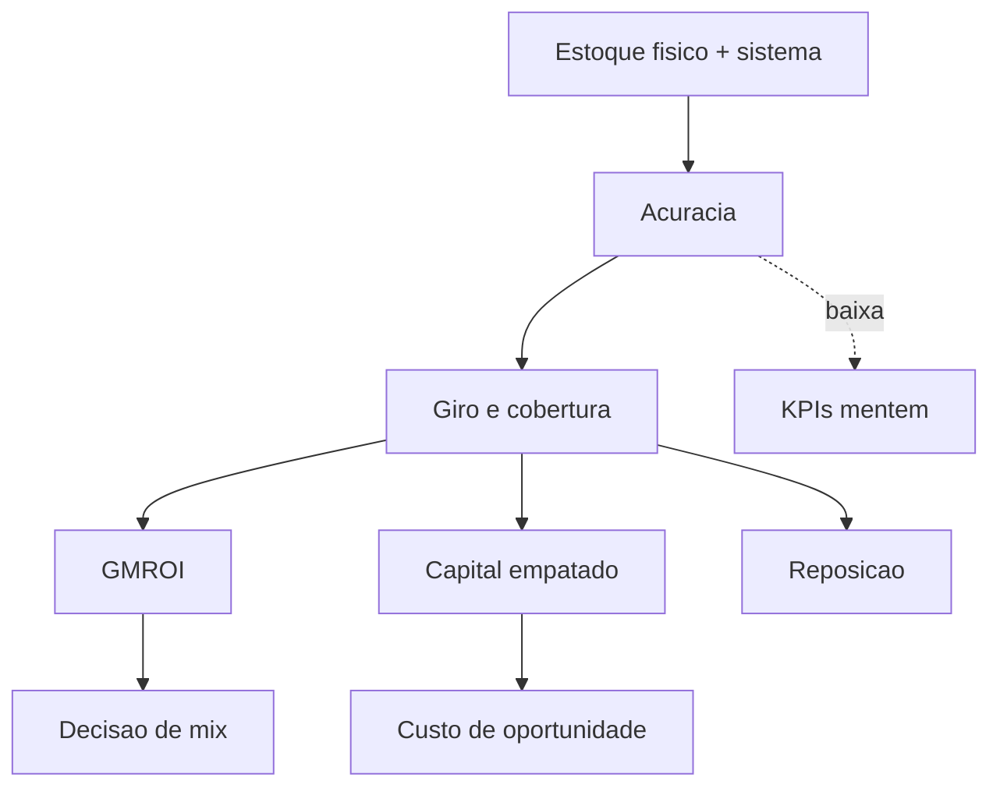

# Giro e cobertura de estoque — ligar prateleira, dias e dinheiro no mesmo quadro

**Giro** (*inventory turns*) e **cobertura** (*days of supply*, DOS) são faces do mesmo fenômeno: **velocidade** com que o estoque **roda** em relação ao **fluxo** que o consome. Para finanças, ligam-se a **capital empatado em inventário**; para operações, a **ruptura** e **espaço**. Para vendas, a **frescor** (perecíveis) e **disponibilidade** (rupturas). Esta aula encerra a trilha com **definições**, **fórmulas**, **GMROI** (rentabilidade de estoque), **acurácia de inventário** e **ponte** ao módulo de custos da trilha Fundamentos.

---

## Objetivos e resultado de aprendizagem

- Calcular **giro anual** com **COGS** ou **vendas** (e saber a diferença).
- Calcular **cobertura em dias** segmentada por SKU/família/CD.
- Aplicar **GMROI** (Gross Margin Return on Inventory Investment) para decisão de mix.
- Avaliar **acurácia de inventário** (cycle counting + ABC).
- Estimar **capital empatado** e impacto financeiro de redução de cobertura.
- Documentar tudo em **dicionário operacional** publicável.

**Duração:** 60–80 min. **Pré-requisitos:** [Aula 4.1](aula-01-otif-fill-rate-contrato-interno.md) e [Aula 4.2](aula-02-lead-time-variabilidade-logistica.md); contabilidade básica (COGS, margem).

---

## Mapa do conteúdo

1. Gancho — «giro subiu» com vendas em queda.
2. Definições — giro com COGS × vendas.
3. Cobertura em dias e relação com LT.
4. GMROI — rentabilidade do estoque.
5. Acurácia de inventário — pré-requisito silencioso.
6. Diagrama (Mermaid).
7. Capital empatado e cálculo de oportunidade.
8. Caso prático — TechLar, 5 SKUs e decisão financeira.
9. Dicionário operacional.
10. Trade-offs, erros, ferramentas.
11. Exercícios, reflexão, fechamento, referências, pontes.

---

## Gancho — «giro subiu» com vendas em queda

Na TechLar, o **giro** melhorou em janeiro porque **COGS** caiu menos que o estoque — mas a queda de vendas foi **má notícia**. KPI sem **numerador** e **denominador** explícitos convida a **autoengano**.

> **Analogia da garrafa:** **giro** é «quantas vezes por ano esvazio e encho»; **cobertura** é «**quantos dias** de sede esta água aguenta». Esvaziar mais rápido **não** significa estar bem hidratado — pode significar estar com sede.

---

## Definições — escolha **uma** e documente

### Giro anual

| Variante | Fórmula | Quando usar |
|----------|---------|-------------|
| **Giro com COGS** | `COGS_12m / Estoque_medio_12m` (em unidades monetárias) | Padrão financeiro; comparável entre setores |
| **Giro com vendas** | `Vendas_12m / Estoque_medio_12m` | Comum em varejo; **sobrestima** giro (margem inflada) |
| **Giro com unidades** | `Unidades_vendidas_12m / Estoque_medio_unidades` | Por SKU; ignora preço |

**Atenção:** giro em **valor** com **vendas** ≠ giro em **valor** com **COGS** ≠ giro em **unidades**. Em farma BR, padrão é giro com **COGS** ≈ **8x/ano**; varejo grande supermercado FMCG ≈ **15–25x/ano** para perecíveis.

### Cobertura (Days of Supply)

\[
DOS = \frac{\text{Estoque atual}}{\text{Consumo médio diário}}
\]

Onde **consumo médio diário** pode ser:

- Últimas **N semanas** (suavização).
- Forecast da próxima janela (mais correto se houver sazonalidade).

**Relação prática:** `DOS ≈ 365 / Giro` (aproximação).

---

## GMROI — rentabilidade do estoque

\[
GMROI = \frac{\text{Margem bruta anual}}{\text{Custo médio do estoque}}
\]

- `GMROI = 1`: cada R$ em estoque gera R$ 1 de margem/ano.
- `GMROI > 3`: padrão saudável em varejo.
- `GMROI < 1`: SKU **destrói valor** (mantém capital sem retorno).

**Decisão de mix:** SKUs com **alto giro + alta margem** → **expansão**; **baixo giro + baixa margem** → **descontinuar** ou **revisar fornecedor**.

---

## Acurácia de inventário — pré-requisito silencioso

Sem **acurácia** de saldo, giro e cobertura **mentem** — e o MRP/ATP **alucina**, gerando rupturas e excessos simultaneamente.

| Métrica | Fórmula | Meta |
|---------|---------|------|
| **Acurácia por SKU** | `1 − (|saldo_físico − saldo_sistema|/saldo_físico)` | ≥ 98% para A; ≥ 95% para B |
| **% SKUs acurados** | `n_SKUs_acurados / n_SKUs` | ≥ 95% |
| **Cycle count cobertura** | `% SKUs contados no mês` | A: 100%/mês, B: trimestral, C: anual |

**Ligação:** reconciliar **contagem** com **sistema** **antes** de heroísmo em *dashboard* (ver [Aula 1.2](../modulo-01-data-analytics-para-logistica/aula-02-qualidade-vies-demanda-fantasma.md)).

---

## Diagrama — métrica → decisão → risco

| Métrica | Decisão típica | Risco se mal medida |
|---------|----------------|---------------------|
| Giro por família | Política de reposição | Mix errado no denominador |
| Cobertura por CD | Transferências | *Double count* entre CD |
| Capital em estoque | Financiamento | Preço médio × custo padrão |
| GMROI | Mix de portfólio | Margem mascarada por mix |
| Acurácia | Cycle counting | Decisão sobre dado falso |

---

## Capital empatado — quanto custa o estoque parado?

\[
\text{Custo de carregar} = \text{Estoque médio (BRL)} \times \text{Taxa de carregamento (\%)}
\]

**Taxa de carregamento** típica BR: **20–35% ao ano** (custo capital + armazenagem + obsolescência + seguro + perdas + impostos diferidos). Em farma com perecíveis, pode chegar a **40%**.

**Exemplo:** estoque médio de **R$ 50 milhões** com taxa **25%** = **R$ 12,5 milhões/ano** de custo escondido. Reduzir cobertura de **45 → 30 dias** com mesmo giro libera **~R$ 16 milhões** de capital — financia campanha, paga dívida, ou reduz necessidade de capital de giro.

---

## Caso prático — TechLar, 5 SKUs

| SKU | Família | Custo unit (BRL) | Margem unit (BRL) | Vendas anuais (un) | Estoque médio (un) |
|-----|---------|------------------|-------------------|--------------------|--------------------|
| A1 | eletrônicos | 200 | 80 | 12.000 | 1.500 |
| B2 | eletrônicos | 50  | 25 | 30.000 | 1.250 |
| C3 | utilidade   | 30  | 9  | 60.000 | 5.000 |
| D4 | brinquedo   | 80  | 20 | 8.000  | 4.000 |
| E5 | sazonal     | 120 | 60 | 5.000  | 3.000 |

**Cálculos:**

| SKU | Giro (un) | Cobertura (dias)¹ | COGS anual (BRL) | Estoque médio (BRL) | Margem anual | GMROI |
|-----|-----------|--------------------|------------------|---------------------|--------------|-------|
| A1 | 12.000/1.500 = **8,0x** | 365/8 = **46** | 2.400.000 | 300.000 | 960.000 | **3,2** |
| B2 | 24,0x | 15 | 1.500.000 | 62.500 | 750.000 | **12,0** |
| C3 | 12,0x | 30 | 1.800.000 | 150.000 | 540.000 | **3,6** |
| D4 | 2,0x | 183 | 640.000 | 320.000 | 160.000 | **0,5** |
| E5 | 1,7x | 219 | 600.000 | 360.000 | 300.000 | **0,8** |

¹ `cobertura ≈ 365 / giro_em_unidades`

**Custo de carregar (taxa 25%/ano):**

- A1: R$ 75 mil  
- B2: R$ 15,6 mil  
- C3: R$ 37,5 mil  
- D4: R$ 80 mil ⚠️  
- E5: R$ 90 mil ⚠️  

**Decisões:**

- **B2:** estrela (alto giro + alto GMROI) → garantir abastecimento, expandir mix similar.
- **A1, C3:** saudáveis; manter.
- **D4:** GMROI 0,5 (destrói valor). Avaliar **descontinuar** ou **renegociar fornecedor**.
- **E5:** sazonal — esperado giro baixo, mas avaliar **liquidação** pós-temporada para reduzir capital.

---

## Dicionário operacional — exemplo

| Campo | Valor |
|-------|-------|
| **Nome** | `[CoberturaDias_SKU_CD]` |
| **Descrição** | Dias de estoque por SKU × CD com base em consumo das últimas 8 semanas |
| **Numerador** | `qtd_disp` (snapshot fim do dia D) |
| **Denominador** | `media_diaria(qtd_vendida[ultimas_56_dias])` |
| **Exclusões** | SKUs descontinuados; cortesia |
| **Granularidade** | SKU × CD × dia |
| **Cadência** | diária 06h00 |
| **Limiar verde** | DOS ∈ [LT_fornecedor + SS, 1,5 × LT_fornecedor + SS] |
| **Limiar amarelo** | DOS < LT_fornecedor + SS (risco ruptura) |
| **Limiar vermelho** | DOS < LT_fornecedor (ruptura iminente) ou DOS > 90 dias (excesso) |
| **Dono** | Coord. Suprimentos |
| **Aprovador** | Diretoria Operações + CFO |
| **Versão** | v1.0 — abr/2026 |

---

## Trade-offs

| Decisão | Mais simples | Mais correto | Quando trocar |
|---------|--------------|--------------|---------------|
| Giro com vendas | Comum no varejo | Giro com COGS | Sempre que comparar setores |
| Cobertura média | Cartão único | Cobertura por SKU/CD | Decisão é por SKU, não médias |
| Estoque médio | Aritmético | Ponderado por dias | Quando há sazonalidade forte |
| Forecast no denominador | Histórico | Forecast + histórico | Quando há campanha programada |

---

## Erros comuns e armadilhas

- Misturar **valor** e **unidade** na mesma série.
- Ignorar **em trânsito** entre CDs (estoque «escondido»).
- Cobertura «bonita» com **obsolescência** escondida.
- **Giro mascarado** por queda de vendas (numerador ↓ mais rápido que denominador).
- GMROI sem revisão de **margem real** (descontos, devoluções).
- **Acurácia sistêmica** sem cycle counting físico.
- Decisão de mix usando giro **agregado** sem segmentar por **família/canal**.

---

## Ferramentas e tecnologias

- **WMS** (SAP EWM, Oracle, Manhattan, Bluesoft) — fonte primária de saldo.
- **ERP** (SAP, Oracle, Totvs, Senior) — COGS e margem.
- **Power BI / Tableau / Qlik** — dashboards.
- **dbt + Snowflake/Databricks** — modelos materializados.
- **Microsoft Fabric / Power BI** — Direct Lake para volume.
- **Notebooks Python** — análise ABC, XYZ, Pareto.

---

## Glossário rápido

- **COGS:** *Cost of Goods Sold*; custo dos produtos vendidos.
- **DOS:** *Days of Supply*; cobertura em dias.
- **GMROI:** *Gross Margin Return on Inventory Investment*.
- **Cycle counting:** contagem rotativa.
- **ABC:** classificação por valor (Pareto).
- **XYZ:** classificação por variabilidade de demanda.
- **Carrying cost:** custo de carregar estoque (% sobre valor médio).

---

## Aplicação — exercícios

1. Calcule **giro com COGS** e **giro com vendas** para 5 SKUs reais — qual diferença encontra?
2. Estime **DOS** por SKU e compare com **LT fornecedor** + **SS**.
3. Calcule **GMROI** para sua família principal — há SKU destruindo valor?
4. Estime **custo de carregar** com taxa 25% e proponha redução de cobertura para liberar capital.
5. Verifique **acurácia** real do seu inventário (% SKUs acurados nos últimos 90 dias).

**Gabarito pedagógico:** se giro com vendas vs COGS diverge muito, sua **margem** é alta (varejo). Se DOS < LT + SS, há **risco de ruptura**. GMROI < 1 = candidato a corte.

---

## Pergunta de reflexão

O seu giro usa **COGS** ou **vendas** — e quem da diretoria sabe a diferença? Quanto capital está empatado em SKUs com **GMROI < 1**?

---

## Fechamento — takeaways

- Giro e cobertura são **bússola** — desde que o **norte** (definição e acurácia) esteja calibrado.
- **GMROI** revela SKUs que **parecem inocentes** mas destroem valor.
- Reduzir **cobertura** é tão financeiro quanto operacional — capital empatado tem custo escondido de **20–35% ao ano**.

---

## Referências

1. BOWERSOX, D. J.; et al. *Supply Chain Logistics Management*. McGraw-Hill.
2. CHOPRA, S.; MEINDL, P. *Supply Chain Management*. Pearson.
3. SILVER, E. A.; PYKE, D. F.; PETERSON, R. *Inventory Management*. Wiley.
4. NAHMIAS, S. *Production and Operations Analysis*. McGraw-Hill.
5. APICS / ASCM — *Dictionary*; *CPIM body of knowledge*.
6. APQC — [PCF: Supply Chain](https://www.apqc.org/).
7. ILOS — Indicadores logísticos no Brasil.
8. Trilha Fundamentos — [custos totais](../../trilha-fundamentos-e-estrategia/modulo-04-custos-logisticos-performance/aula-01-estrutura-custos-logisticos.md).

---

## Pontes para outras trilhas

- Anterior: [Aula 4.2 — Lead time](aula-02-lead-time-variabilidade-logistica.md).
- Trilha Fundamentos — [custos totais](../../trilha-fundamentos-e-estrategia/modulo-04-custos-logisticos-performance/aula-01-estrutura-custos-logisticos.md) e [KPIs logísticos](../../trilha-fundamentos-e-estrategia/modulo-04-custos-logisticos-performance/aula-03-nivel-servico-kpis-logisticos.md).
- [Aula 3.2 — Medidas DAX](../modulo-03-power-bi-para-supply-chain/aula-02-medidas-dax-supply-chain.md) — implementação de saldo semi-aditivo.
- Próximo passo (capstone): construir painel + dicionário com KPIs OTIF, fill rate, LT P90, giro, cobertura, GMROI.
