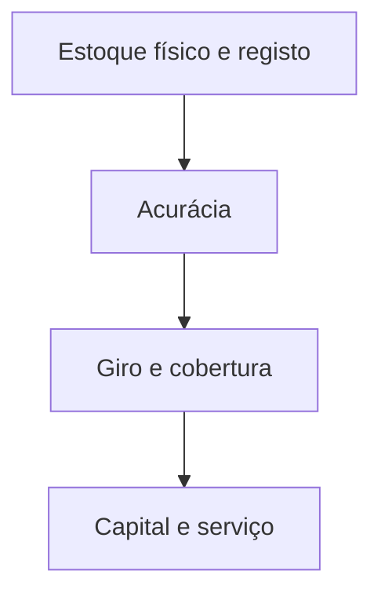

# Giro e cobertura de estoque — ligar prateleira, dias e dinheiro no mesmo quadro

**Giro** (*inventory turns*) e **cobertura** (*days of supply*) são faces do mesmo fenômeno: **velocidade** com que o estoque **roda** em relação ao **fluxo** que o consome. Para finanças, o mesmo quadro liga-se a **capital em inventário**; para operações, a **ruptura** e ao **espaço**. Esta aula fecha a trilha com a **ponte** explícita ao módulo de custos da trilha Fundamentos.

---

## Gancho — «giro subiu» com vendas em queda

Na TechLar, o **giro** melhorou porque **COGS** caiu menos que o estoque — mas a queda de vendas foi **má notícia**. KPI sem **numerador** e **denominador** explícitos convida a **autoengano**.

---

## Definições comuns (escolha e documente uma)

- **Giro anual (vezes/ano):** `COGS_12m / Estoque médio_12m` **ou** `Vendas_12m / Estoque médio_12m` — **não** são equivalentes; **margem** e **valor** mudam a leitura.  
- **Cobertura (dias):** `Estoque médio / Consumo médio diário` com a mesma base de **SKU** ou **família**.

**Analogia da garrafa:** giro é «quantas vezes por ano esvazio e encho**»; cobertura é «**quantos dias** de sede esta água aguenta».

---

## Acurácia de inventário — pré-requisito silencioso

Sem **acurácia** de saldo, giro e cobertura **mentem** — e o MRP/ATP **alucina**. Ligar à [aula de KPIs](../../trilha-fundamentos-e-estrategia/modulo-04-custos-logisticos-performance/aula-03-nivel-servico-kpis-logisticos.md): reconciliar **contagem** com **sistema** antes de heroísmo em *dashboard*.

---

## Quadro «métrica → decisão → risco»

| Métrica | Decisão típica | Risco se mal medida |
|---------|----------------|----------------------|
| Giro por família | Política de reposição | Mix errado no denominador |
| Cobertura por CD | Transferências | *Double count* entre CD |
| Capital em estoque | Financiamento | Preço médio *vs.* custo padrão |

---

## Exercício

Com números inventados mas **consistentes**, calcule **cobertura em dias** para um SKU com estoque médio 1.200 unidades e consumo médio diário 80 unidades. Escreva **uma** frase ligando o resultado a **decisão** de compra.

**Gabarito pedagógico:** 1.200 / 80 = **15 dias**; decisão depende de **LT** e política de segurança — texto deve mencionar comparação com LT ou política.

---

## Erros comuns

- Misturar **valor** e **unidade** na mesma série.  
- Ignorar **em trânsito** entre CD.  
- Cobertura «bonita» com **obsolescência** escondida no armazém.

---

## Referências

1. BOWERSOX, D. J.; et al. *Supply Chain Logistics Management*. McGraw-Hill.  
2. CHOPRA, S.; MEINDL, P. *Supply Chain Management*. Pearson.  
3. Trilha Fundamentos — [custos totais](../../trilha-fundamentos-e-estrategia/modulo-04-custos-logisticos-performance/aula-01-estrutura-custos-logisticos.md).  

---

## Fechamento

Giro e cobertura são **bússola** — desde que o **norte** (definição e acurácia) esteja calibrado.

**Pergunta:** o seu giro usa **COGS** ou **vendas** — e quem sabe?
