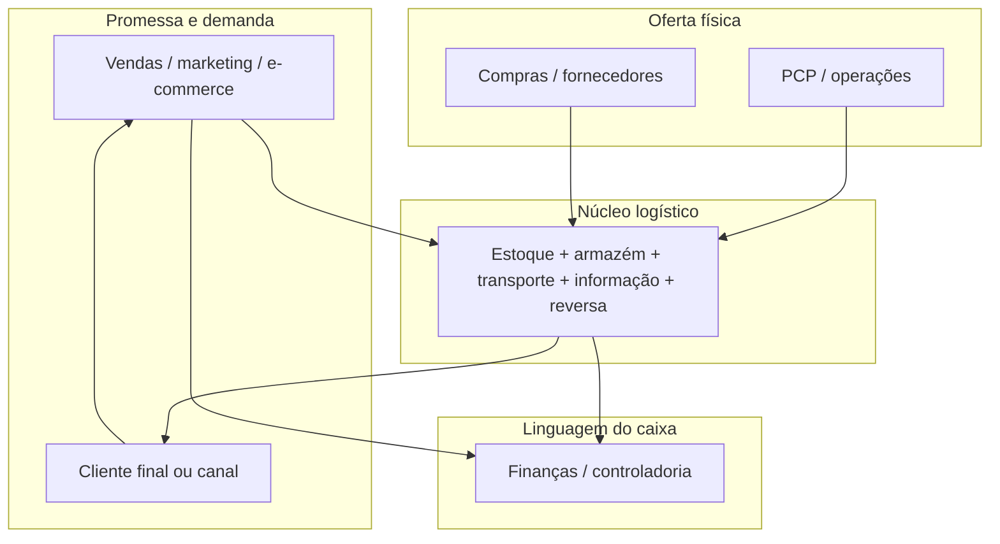
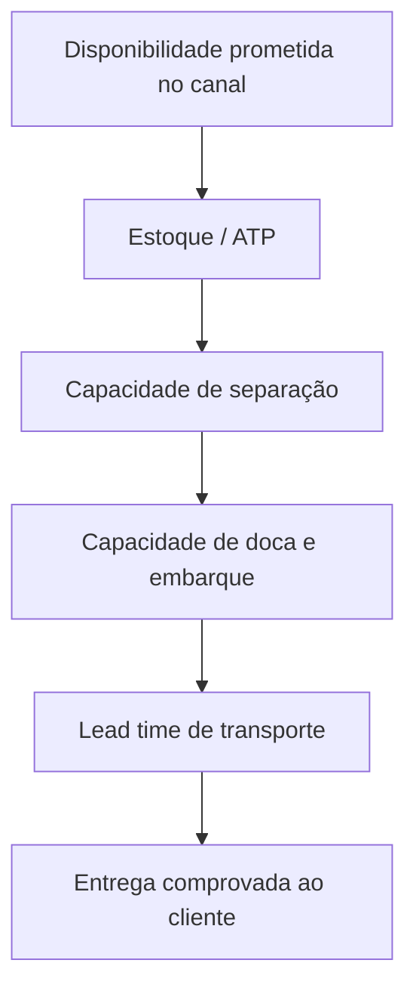

# Conceitos e papel da logística na empresa — da promessa ao custo que ninguém vê

Há um tipo de frase que aparece em slides de marketing e depois “cai” no chão da empresa como se fosse problema exclusivo de expedição: *“Entrega em vinte e quatro horas em todo o país.”* Em geral, quem escreveu a frase estava pensando em **conversão** e em **branding**; quem ouviu no corredor foi o gerente de armazém, que imediatamente imagina **mais caminhões**, **mais horas de picking** e **mais stress* — e ninguém, ainda, falou em **malha**, em **estoque de posição**, em **forecast**, em **capacidade de doca** ou em **custo de capital**. Esta desconexão não é acidente: ela nasce de uma confusão antiga entre **promessa** (o que o mercado ouve) e **sistema físico-informacional-financeiro** (o que a empresa realmente consegue sustentar de forma repetível). A logística empresarial, quando bem ensinada, é justamente a disciplina que **traduz promessa em restrições e restrições em decisões** — sem mágica e sem heroísmo solitário na doca.

Ao longo deste texto vamos usar, de forma recorrente, uma empresa fictícia chamada **TechLar** (e-commerce de utilidades domésticas, um centro de distribuição no interior, forte sazonalidade de campanhas). Ela não existe para ser memorizada; existe para dar **textura** aos conceitos. Sempre que você ler “a TechLar fez X”, tente substituir mentalmente pela empresa que você conhece: o mecanismo cognitivo é o mesmo.

---

## Por trás das palavras: o que a profissão quis dizer com “logística” e “supply chain”

O inglês empresarial popularizou *supply chain* antes que o português digestasse totalmente o conceito; por isso, em muitas salas de reunião, as duas expressões viram **sinônimos ornamentais**. Para a construção de currículo, de indicadores e de contratos com fornecedores, essa imprecisão custa caro. O *Council of Supply Chain Management Professionals* (CSCMP), que concentra décadas de consenso entre acadêmicos e executivos, separa as ideias com cuidado deliberado.

O **Supply Chain Management** é descrito como o planejamento e a gestão de **todas** as atividades envolvidas no *sourcing* e *procurement*, na conversão (produção/serviço) e em **toda** a gestão logística, incluindo coordenação e colaboração com parceiros do canal (fornecedores, intermediários, terceiros, clientes) e integrando a gestão da oferta e da demanda **dentro e entre** organizações. Repare no que isso **não** é: não é “departamento de importação”, não é “compras sozinhas”, não é “PCP olhando só a fábrica”. É uma definição **ecossistêmica** — quase política, no sentido de que trata alinhamento entre entidades com interesses parcialmente divergentes. Fontes: [What is SCM?](https://cscmp.org/CSCMP/CSCMP/Certify/Fundamentals/What_is_Supply_Chain_Management.aspx) e o [glossário](https://cscmp.org/CSCMP/cscmp/educate/scm_definitions_and_glossary_of_terms.aspx).

Já a **Logistics Management** é, dentro desse guarda-chuva maior, a parte que **planeja, implementa e controla** o fluxo e o armazenamento **eficiente e eficaz** de bens, serviços e informações associadas, **direta e reversamente**, entre o ponto de origem e o ponto de consumo, para satisfazer requisitos de clientes (mesmas fontes). Note o par **eficiente/eficaz**: não basta barato se entrega errado; não basta “perfeito” se quebra o negócio. Note também o **fluxo reverso**: devolução, recall, embalagem retornável, pós-venda — tudo isso é logística, embora raramente apareça na capa do folder institucional.

**Analogia da cidade:** pense no SCM como o **planejamento urbano** de um bairro inteiro — zoneamento, transporte coletivo, comércio, escolas, convivência entre grupos. A logística seria, então, a **malha viária e os semáforos** que fazem o tráfego fluir: sem ela, o bairro existe no mapa, mas vive em congestionamento permanente. Quem confunde “rua” com “cidade” costuma subfinanciar manutenção de pavimento e depois reclamar do “trânsito caótico” — o equivalente corporativo é subinvestir em cadastro, em WMS e em política de estoque, e depois culpar “o caminhão”.

Martin Christopher, cuja obra *Logistics and Supply Chain Management* (Pearson) atravessou gerações de cursos, insiste na ideia de que competição moderna frequentemente é **cadeia contra cadeia**, não empresa isolada contra empresa. Sunil Chopra e Peter Meindl, em *Supply Chain Management: Strategy, Planning, and Operation* (Pearson), organizam o pensamento em **drivers** (instalações, estoque, transporte, informação, *sourcing*, preço) que são alavancas de desenho. Donald Bowersox e coautores, em *Supply Chain Logistics Management* (McGraw-Hill), reforçam a leitura integrada da logística como **processo transversal** medido em custo e serviço. Você não precisa decorar autores; precisa saber que **há um corpo de conhecimento** atrás do que parece “senso comum da indústria”.

---

## Onde a logística “mora” quando a organização ainda acha que ela mora só na doca

Em organogramas, logística aparece numa caixinha ao lado de operações ou de compras. Na **realidade econômica**, ela é uma **encruzilhada**: recebe decisões comerciais (prazo, mix, condição de pagamento), transformações operacionais (lote, calendário de produção, qualidade na saída da linha), escolhas de compras (fornecedor, modal, contrato) e devolve para o mercado **disponibilidade** e para o caixa **capital parado**, **custo de frete**, **custo de ruptura** e **risco**. O diagrama abaixo é propositalmente simples; use-o como **mapa de conversa**, não como desenho de sistema.

**Leitura:** as setas são **dependências** — “vendas precisa de L para cumprir promessa”, “L precisa de P e S para ter o que movimentar”, “F sente L no capital e no custo”. Quando a TechLar coloca “24 h” no site sem recalcular cobertura regional, o diagrama mostra onde o estresse aparece primeiro: na seta **V → L**, porque a promessa atravessou a encruzilhada **sem** revisão simultânea em **S** e **P**.

---

## A cozinha que não para: analogia da capacidade escondida atrás do cardápio

Restaurantes populares em horário de pico ensinam logística sem saber. O cardápio anuncia trinta pratos, mas a cozinha tem **três fogões**, **dois passadores** e uma **geladeira de prep** limitada. Se o salão “vende” dez pedidos diferentes por minuto sem conversar com a cozinha, o resultado não é “mais vendas felizes”; é **tempo de espera** que destrói a experiência, **pratos devolvidos**, **ingredientes que acabam no meio do serviço** e, no fim da noite, **lixo** (desperdício) e **hora extra**. A logística corporativa é parecida: o “cardápio” (SKU, canais, promessas de entrega) cresce mais rápido que a **capacidade física e informacional** de preparar e entregar com qualidade.

Na TechLar, o equivalente é o catálogo de marketplace com **milhares** de SKUs ativos, mas um CD com **poucas docas** e um time de expedição que já opera no limite em campanhas. A analogia ajuda a explicar para um diretor comercial **por que** “só mais uma promoção” não é neutra: cada promoção altera o **mix** que passa pelo mesmo funil físico. Mix desbalanceado aumenta **tempo de ciclo de pedido** e erros de separação — ou seja, piora **serviço** e **custo** ao mesmo tempo, um empate que ninguém quer.

---

## Sangue, geladeira e prazo: quando o serviço não é “luxo”, é *constraint* dura

Em hospital, certos insumos não podem faltar nem por minuto — a analogia é útil porque remove a ideia romântica de que “serviço excelente” é sempre um **escolha de marketing**. Às vezes, é **constraint regulatória e ética**: falta de item crítico não gera “cliente insatisfeito”; gera evento adverso. A logística aprende com isso a distinção entre **nível de serviço desejado** (o que a estratégia gostaria) e **nível de serviço mínimo** (o que a realidade tolera). Na indústria comum, o “equivalente ao sangue” pode ser um componente que para a linha inteira, um **SKU** que alimenta grandes contratos B2B, ou um canal e-commerce cuja queda de OTIF desencadeia **multa contratual**.

A lição portátil: quando você discute **estoque de segurança**, não está discutindo apenas “dinheiro parado”; está discutindo **probabilidade de violação de uma restrição dura** — e o preço de violar essa restrição pode ser linear (atraso) ou não linear (perda de cliente, multa, recall). A literatura de gestão de estoques (clássicos como Silver, Pyke & Peterson, *Inventory Management and Production Planning and Scheduling*, Wiley) formaliza essa intuição em modelos; aqui, basta que você carregue a imagem mental: **geladeira de sangue** — capacidade finita, criticidade alta, custo de falha desproporcional.

---

## A mudança de apartamento: quando todos prometem e só existe um elevador

Outra analogia útil é a mudança de casa em prédio. Cada cômodo empacotado é um **lote**; o elevador é a **doca**; a rua estreita é o **último trecho** de distribuição; o prédio de destino tem **janela de recebimento** (como B2B). Se três famílias combinarem chegar ao mesmo tempo “porque é mais cedo”, o sistema colapsa — não por maldade, mas por **pico não coordenado**. A logística chama isso, com frequência, de problema de ** nivelamento** (*leveling*) ou de **janela de tempo**; em vendas, chama-se “fim de mês”. A TechLar, ao concentrar **todo** o desconto na mesma semana sem nivelar pedidos, reproduz exatamente o prédio com elevador único: o atraso não é “preguiça do motorista”, é **sobreposição de picos**.

---

## Trade-offs: o triângulo que não some só porque o slide sumiu

É tentador acreditar que “inovação” ou “digitalização” eliminaram trade-offs. Elas mudaram **ferramentas**, não **lei de conservação** no sentido econômico: melhorar serviço sem mexer em nada costuma **consumir** capital ou custo; reduzir custo sem redesenhar serviço costuma **consumir** tempo ou risco. O triângulo abaixo é pedagógico, mas honesto.

Na TechLar, **reduzir capital** sem aceitar piora de serviço frequentemente implica **aumentar frequência de reposição** ou **melhorar forecast** — ou seja, mexe em **custo** (mais viagens, mais sistema) ou em **capacidade de informação**. Se ninguém escolhe explicitamente, a empresa escolhe implicitamente — e aí o “triângulo” aparece como **surpresa** no fechamento do mês.

Um segundo diagrama ajuda a ver **serviço** não como um número mágico, mas como **cadeia de cumprimento**:

Se qualquer elo falha, o cliente vivencia **falha de serviço** mesmo que o slide diga “excelência”.

---

## Porter sem medo: logística como custo, como risco e como diferenciação

Michael Porter, em *Competitive Advantage* (1985), popularizou a cadeia de valor como ferramenta para entender onde se cria margem. As atividades primárias incluem logística interna (*inbound*) e externa (*outbound*). O ponto que muitos alunos perdem é que **a mesma função** pode ser, em momentos diferentes da história da empresa, **centro de custo** e **diferencial**. A Amazon, para citar exemplo extremo que todo mundo reconhece, erigiu a logística como parte da proposição de valor; uma commodity industrial pode escolher o oposto — logística enxuta e padronizada — e ainda assim ser **estratégica**, porque protege margem.

Na TechLar, se a estratégia for “**preço baixo com entrega previsível**”, a logística outbound precisa ser **extremamente estável**, não necessariamente “rápida demais”. Se a estratégia for “**surpreender com velocidade**”, o desenho muda: mais pontos de estoque, mais transporte time-definite, mais custo fixo. **Hipótese pedagógica** (não é lei): empresas medianas sofrem quando copiam o discurso da segunda estratégia sem aceitar o **P&L** da segunda.

---

## Funções logísticas: o pacote completo (e por que cada uma “dói” de um jeito)

Em vez de decorar definições, pense em **dor** e em **medida**. Transporte dói em **frete e variabilidade**; armazém dói em **espaço e hora-homem**; estoque dói em **capital e obsolescência**; informação dói em **latência e erro**; embalagem dói em **avaria e cubagem**; reversa dói em **custo duplo** e em **imagem**. Uma tabela compacta serve de mapa de estudo — volte a ela depois de ler os parágrafos.

| Função | Dor típica | Medida que educa |
|--------|------------|-------------------|
| Transporte | Atraso, quebra, custo oculto de redespacho | Custo por entrega, OTIF do transportador, variância de LT |
| Armazenagem | Espaço caro, picking lento | Custo por palete-dia, linhas por hora |
| Estoque | Capital, validade, obsolescência | Cobertura em dias, giro, idade do estoque |
| Informação | Promessa errada, retrabalho | Latência pedido→status real, % pedidos sem doca agendada |
| Embalagem | Avaria, cubagem inflada | Taxa de devolução por motivo físico |
| Reversa | Devolução, recall | Custo por devolução, lead time de crédito |

---

## O fio da TechLar: quando “24 horas” encontra um CD único no interior

Volta a campanha. A TechLar tem **um** CD, picking majoritariamente manual, transporte rodoviário consolidado barato, prazo médio de **72 horas** para capitais e **96%** de fill rate. O marketing propõe “24 h nas capitais”. O que a frase **exige**, mesmo antes de Excel?

Ela exige, no mínimo, **uma** entre: **posição de estoque** mais perto do consumidor (novo CD, *cross-dock* com parceiro, *fulfillment* externo), **transporte** mais rápido e caro em parte do mix, **corte** de SKUs elegíveis à promessa, ou **aceitação** de que o OTIF vai cair até o sistema se reequilibrar. Se ninguém nomear o trade-off, a empresa fará a escolha pelo **atraso** e pelo **custo de urgência** — que são os “impostos” da desconexão.

---

## Erros que parecem senso comum

A **metonímia** (“logística = caminhão”) é o erro mais caro porque esconde metade do trabalho: **informação**, **contrato**, **estoque**, **reversa**. Outro erro é tratar *supply chain* como etiqueta de **moda** em LinkedIn sem mapa de atores — SCM sem rede desenhada vira só palavra. O terceiro é a **otimização local**: o transportador ganha bônus por frete barato, o armazém ganha por ocupação, vendas ganha por volume — e ninguém mede **margem líquida após logística** por canal. Por fim, **prometer ATP** sem dados integrados é ilusão tecnológica; prometer prazo sem capacidade é ilusão humana.

---

## Exercícios (como praticar de verdade)

**1) Verdadeiro ou falso, uma linha cada**

- Logística é sinônimo de transporte.  
- SCM limita-se à empresa.  
- Mais estoque melhora sempre o serviço.

**2) Desenho:** reproduza o diagrama da encruzilhada no papel e insira **um** risco (ex.: greve em fornecedor) — descreva qual seta quebra primeiro.

**3) Caso TechLar:** liste cinco alavancas para aproximar 24 h e, ao lado, o **custo ou capital** que sobe.

**Gabarito orientativo:** (1) Falso — CSCMP inclui armazenagem, reversa, informação; Falso — SCM é interorganizacional; Falso — obsolescência, danos, capital. (2) respostas variadas, avalie coerência causal. (3) exemplos: segundo CD (capex + estoque duplicado), transporte expresso (custo), menos SKUs na promessa (receita), mais pessoas em picking (custo fixo), melhor forecast (custo de dados/tempo).

---

## Glossário express

**SKU**, **lead time**, **OTIF**, **fill rate**, **ATP**, **cobertura** — guarde estes termos como “alfabeto”; você vai reciclá-los em todas as aulas da trilha.

---

## Referências

1. CSCMP — *SCM Definitions and Glossary of Terms*: https://cscmp.org/CSCMP/cscmp/educate/scm_definitions_and_glossary_of_terms.aspx  
2. CSCMP — *What is Supply Chain Management?*: https://cscmp.org/CSCMP/CSCMP/Certify/Fundamentals/What_is_Supply_Chain_Management.aspx  
3. CHRISTOPHER, M. *Logistics and Supply Chain Management*. 6.ª ed. Pearson, 2022. https://www.pearson.com/en-us/subject-catalog/p/logistics-and-supply-chain-management/P200000007134  
4. CHOPRA, S.; MEINDL, P. *Supply Chain Management: Strategy, Planning, and Operation*. Pearson. https://www.pearson.com/en-us/subject-catalog/p/supply-chain-management-strategy-planning-and-operation/P200000012829  
5. BOWERSOX, D. J.; CLOSS, D. J.; COOPER, M. B.; BOWERSOX, J. C. *Supply Chain Logistics Management*. McGraw-Hill. https://www.mheducation.com/highered/product/supply-chain-logistics-management-bowersox.html  
6. PORTER, M. E. *Competitive Advantage*. Free Press, 1985.  
7. SILVER, E. A.; PYKE, D. F.; PETERSON, R. *Inventory Management and Production Planning and Scheduling*. Wiley, 1998 — aprofundamento de estoque e serviço.

Em trabalhos acadêmicos, acrescente **data de consulta** às URLs.

---

## Síntese: o que ficou no corpo

Você agora carrega três ideias no corpo: (1) **definições CSCMP** distinguem SCM e logística com seriedade profissional; (2) a logística é **encruzilhada** entre promessa, operação e caixa; (3) **trade-offs** não desaparecem — só migram de slide para P&L quando ignorados.

**Pergunta final:** na sua empresa, qual promessa recente **nunca passou** pela encruzilhada logística antes de ir ao ar?
