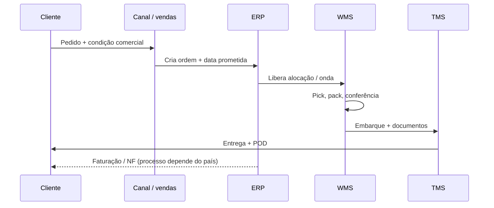
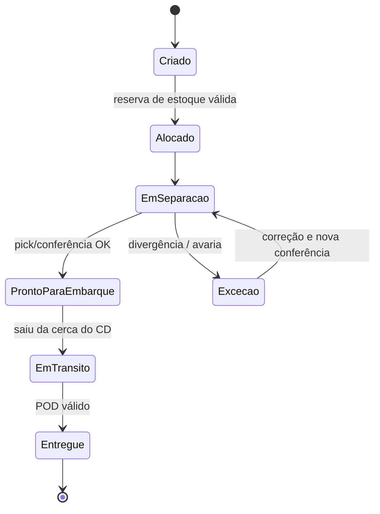
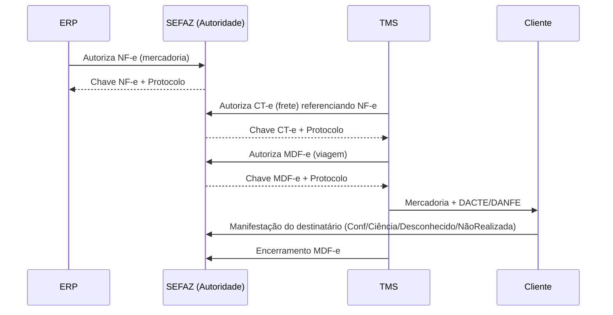

# Fluxos físicos e de informação — quando o caminhão é só a ponta visível do iceberg

## Objetivos e resultado de aprendizagem

Ao final da aula, o aluno será capaz de:

- **Mapear** fluxo físico e fluxo informacional como dois sistemas acoplados.
- **Identificar** pontos de latência informacional e seus efeitos em serviço e custo.
- **Diferenciar** lead time físico de **latência de visibilidade**.
- **Reconhecer** as principais armadilhas de integração ERP/WMS/TMS no Brasil (eventos NF-e/CT-e/MDF-e).
- **Propor** SLAs de informação por estado do pedido.

**Duração sugerida:** 60–75 min.
**Pré-requisitos:** [Aula 1.1 — Conceitos e papel da logística](aula-01-conceitos-papel-logistica.md).

## Mapa do conteúdo

- Fluxo físico (direto e reverso) sem romantismo.
- Fluxo de informação como sistema nervoso (ERP/OMS/WMS/TMS).
- Sequência mínima pedido → entrega e estados do pedido.
- Latência física vs. latência de informação.
- Efeito chicote começa no dado.
- Eventos fiscais BR (NF-e, CT-e, MDF-e, eventos SEFAZ).
- Caso TechLar B2B — “rastreio verde, caminhão parado”.

## Ponte

Conecta com [Tecnologia e sistemas](../../trilha-tecnologia-e-sistemas/README.md) para integração e rastreabilidade; com [SCM — integração e colaboração](../modulo-02-supply-chain-management/aula-02-integracao-colaboracao-cadeia.md) para o efeito chicote em rede; com [KPIs e nível de serviço](../modulo-04-custos-logisticos-performance/aula-03-nivel-servico-kpis-logisticos.md) para definição operacional de “no prazo”.

Quase toda gente já viveu a seguinte situação: o rastreador diz **“saiu para entrega”**, mas o motorista só aparece no dia seguinte. Às vezes a culpa é do trânsito; com frequência maior, a culpa é **do dado** — o sistema marcou um evento que **ainda não ocorreu** ou marcou com **atraso** tal que a promessa ao cliente foi calculada em cima de um **fantasma**. Este capítulo trata desse fantasma com respeito: ele é um dos maiores produtores de **custo oculto** e de **desconfiança** entre áreas na empresa moderna.

A **TechLar** volta aqui como fio condutor. Imagine um pedido B2B de utensílios para uma rede de lojas: o pedido é grande, a janela de recebimento na loja é curta, e o comercial prometeu **status em tempo real** porque o concorrente prometeu. A operação física pode ser competente; se o **estado do pedido** no portal for mentiroso, o cliente vivencia **atraso** mesmo quando o caminhão é pontual — e o NPS cai sobre a logística, não sobre o bug de integração.

---

## O que é “fluxo físico” sem romantizar a palavra “fluxo”

Fluxo físico não é poesia; é **sequência de transformações e movimentações** que alteram lugar, tempo e condição da mercadoria. No direto: fornecedor → entrada → armazenagem → separação → consolidação → expedição → cliente. No reverso: devolução, recall, embalagem retornável, **reprocesso** (retrabalho, reembalagem). O reverso custa caro porque muitas empresas ainda o tratam como **exceção** administrada no improviso — quando, em e-commerce, pode ser **30%** do volume em certas categorias (número ilustrativo; o importante é que **não** é marginal).

**Analogia da mudança (de novo, mas agora no sentido inverso):** devolução é como levar móveis de volta: ocupa caminhão no sentido contrário, exige **inspeção**, gera **dúvida** (“riscou?”), atrasa o reembolso. Quem só planeja “ida” planeja metade da vida real.

---

## O fluxo de informação: o verdadeiro sistema nervoso

Sem informação confiável, o fluxo físico até pode “acontecer”, mas acontece **cego**: compra-se demais porque não se vê o estoque certo; promete-se data porque o sistema **não** mostra gargalo de doca; paga-se multa porque o **POD** chegou tarde ao financeiro. Christopher enfatiza **visibility** como tema estrutural da SCM moderna; Bowersox e coautores tratam integração logística e desempenho como **processo mediado por dados**. A analogia que mais funciona em sala é a do **prontuário médico**: o paciente (carga) pode estar bem, mas se o prontuário diz errado, o próximo profissional toma decisão errada — o erro não é “no corpo”, é no **registo**.

### Sequência mínima (pedido → entrega)

O diagrama abaixo é **genérico**; adapte os nomes aos seus sistemas (ERP, OMS, WMS, TMS, CRM).

**Leitura:** cada seta tem **latência** e **qualidade**. Uma latência pequena no TMS pode ser enorme no negócio se o cliente recebe **promessa** baseada no ERP.

### Estados do pedido (por que “em trânsito” é um momento, não um sentimento)

**Armadilha clássica:** integração mal parametrizada que coloca **EmTransito** quando o caminhão ainda está na doca. Do lado do cliente, isso é indistinguível de **mentira** — e destrói a credibilidade do *tracking*.

---

## Latência física vs. latência de informação: duas músicas diferentes

O lead time físico mede **tempo entre acontecimentos reais** (ex.: saiu do CD, chegou ao cliente). A latência de informação mede **tempo entre o acontecimento real e o registo confiável** visível para quem decide. Se a segunda latência for alta, a empresa compensa com **estoque de defesa**, **expediente urgente** ou **atendente humano** apagando incêndio — todos **custos** que raramente entram na discussão do “custo de transporte médio”.

**Analogia do banco:** imagine filas físicas curtas, mas o painel eletrônico atrasado cinco minutos em relação à fila real. O caos emocional não vem do tamanho da fila; vem da **informação defasada**. Centros de distribuição sofrem o mesmo sintoma quando **onda** e **doca** não conversam com o **portal**.

---

## O efeito chicote começa muitas vezes no dado, não só no pedido

O artigo clássico de Lee, Padmanabhan e Whang (*Management Science*, 1997, DOI `10.1287/mnsc.43.4.546`) é citado como **bullwhip** — amplificação da variabilidade das ordens a montante. As causas incluem processamento de sinal, racionamento, loteamento e variação de preço. Aqui, acrescentamos uma leitura **operacional**: **atraso de visibilidade** entre elos funciona como **ruído** no sinal de demanda. Não substitui o paper — complementa a intuição de que **integrar dados** não é “projeto de TI”, é **estabilização da cadeia**.

---

## Interfaces: vendas, compras, produção — cada uma fala um dialeto

**Vendas** fala em **SKU**, **preço**, **campanha**, **prazo**; **compras** fala em **MOQ**, **lead time**, **fornecedor aprovado**; **produção** fala em **lote econômico**, **setup**, **capacidade**; **logística** fala em **onda**, **doca**, **cubagem**, **agrupamento de entregas**. O fluxo de informação bom é aquele que **traduz** dialetos sem perder significado. Quando isso falha, nasce a frase fatídica: “mas eu enviei o e-mail” — ou seja, humano compensando ausência de **evento de sistema**.

Na TechLar, quando o marketing cria uma campanha sem **calendário promocional** no ERP, o forecast “vê” uma demanda estranha e o armazém vê **pico** sem explicação — o bullwhip interno começa **antes** do fornecedor, dentro da própria casa.

---

## Colaboração digital em alto nível (sem manual de API)

EDI, APIs, portais de fornecedor, ASN (*Advance Ship Notice*), agendamento de docas e rastreio em TMS são **instrumentos** para reduzir incerteza. O ponto pedagógico: cada instrumento compra **visibilidade** com **custo fixo** de implementação e **custo variável** de governança (cadastro, versão, teste). Não existe “só ligar integração” sem **regra de negócio** — quem diz o contrário vende **projeto**, não **resultado sustentável**.

---

## Eventos fiscais brasileiros: o fluxo de informação que o Estado obriga

Há um pedaço do fluxo informacional que, no Brasil, **não é opcional**. A SEFAZ orquestra um carrossel de eventos eletrônicos cujo objetivo originário é fiscal, mas cuja **subutilização operacional** custa caro. Vale conhecer (visão funcional, não fiscal):

- **NF-e** (Modelo 55): autoriza a saída da mercadoria; gera **chave de 44 dígitos** que segue a carga até o destino. Eventos importantes: **autorização**, **cancelamento** (até 24h em regra geral), **carta de correção**, **manifestação do destinatário** (confirmação, ciência, operação não realizada, desconhecimento).
- **CT-e** (Modelo 57): autoriza o **frete**, identifica tomador, transportador, valor do serviço, ICMS de transporte, GRIS, ad valorem. Liga-se à(s) NF-e(s) transportada(s).
- **MDF-e** (Modelo 58): manifesto da **viagem** — agrega todos os CT-e/NF-e em um veículo + motorista + percurso; obrigatório para transporte interestadual e intermunicipal de carga própria/terceiros.
- **Eventos de transporte:** *averbação* de seguro, *registro de passagem* (RNTRC + pedágio eletrônico), encerramento do MDF-e na chegada.

**Por que isso importa para fluxo de informação?** Porque cada evento é uma **fonte gratuita e confiável** de status. Empresas que **não** usam os eventos da SEFAZ como gatilho de status para o cliente B2B continuam a depender de e-mail manual, mesmo tendo um sinal **autenticado pelo Estado** disponível. A **manifestação do destinatário** (em especial **“ciência”** e **“confirmação”**), por exemplo, é evidência **digital** de recebimento que **antecede** ou **complementa** o POD físico — e poucos times usam.

> **Armadilha clássica brasileira:** confiar **só** no “status do TMS” quando o **CT-e** já foi cancelado por divergência de CFOP/peso. O caminhão pode estar a caminho com documento **sem validade fiscal**, sujeito a **apreensão** em barreira interestadual. Integração SEFAZ → TMS não é luxo; é **compliance + visibilidade**.

---

## Caso integrado — “rastreio verde, caminhão parado” (TechLar, B2B)

**Fatos:** integração WMS→TMS marca “em trânsito” ao **gerar documento**, não ao **atravessar portão**; comercial informa cliente com base no portal; janela de recebimento na loja é estreita.

**Perguntas para você:** (1) qual evento físico deveria disparar “em trânsito”? (2) que KPI de **processo** mede a qualidade dessa transição? (3) que regra de negócio corrige?

**Síntese:** “em trânsito” deve refletir **saída da responsabilidade do CD** conforme contrato interno; KPI de processo pode ser o **delta** entre horário de cruzamento de portão e timestamp do status; a correção mistura **parametrização** e **cultura** (ninguém promete ao cliente o que o portal não comprova).

---

## O que vira dado no sistema (mapa de eventos × campos)

| Evento físico | Quem registra | Onde vira dado | Latência saudável | Latência tóxica |
|---------------|---------------|----------------|--------------------|------------------|
| Pedido entrou | Canal/vendas | OMS/ERP — cabeçalho + linhas | < 1 min | > 30 min (cliente refresha o site) |
| Reserva de estoque | OMS/ERP/WMS | Tabela de reserva por SKU/centro | < 5 min | > 1h (overbooking) |
| Picking concluído | WMS via coletor | Onda concluída + container ID | tempo real | > 1h (pacote “sumido” no CD) |
| NF-e autorizada | ERP/emissor | Chave NF-e + protocolo SEFAZ | < 5 min | > 30 min (caminhão parado na cancela) |
| CT-e/MDF-e autorizados | TMS/emissor | Chaves CT-e e MDF-e | < 15 min | falha = caminhão sai sem CT-e válido |
| Saída do CD (cerca/portão) | WMS/portaria | Evento *gate-out* | tempo real | > 30 min (status “em trânsito” mente) |
| Trânsito | TMS + telemetria/rastreador | Geolocalização + checkpoints | 5–15 min | > 1h (cliente ouve “sem informação”) |
| Entrega + POD | App motorista / TMS | POD digital (foto, assinatura, geo) | < 30 min | > 24h (financeiro não fatura, multa do varejo) |
| Manifestação do destinatário | Cliente via SEFAZ | Status no portal SEFAZ | até 180 dias | atraso → ICMS-ST sem confirmação |

---

## KPIs e decisão (kit mínimo desta aula)

| KPI | Pergunta que responde | Dono | Fonte | Cadência | Playbook de ação |
|-----|------------------------|------|-------|----------|-------------------|
| **Tempo de ciclo do pedido** (OCT) | Quanto demora pedido→entrega? | Logística | ERP+TMS | Diária | Identificar etapa-gargalo no histograma; campanha PDCA na pior etapa |
| **Acurácia de inventário** (%) | O sistema reflete o físico? | WMS/Operações | WMS + inventário rotativo | Mensal | Inventário rotativo ABC; bloqueio de SKU para ATP até reconciliar |
| **Latência de status** (min entre evento real e visível) | Quanto o portal “mente”? | TI + Operações | TMS + portal | Semanal | Auditar gatilhos de integração; corrigir parametrização |
| **Taxa de retrabalho operacional** (%) | Quanto refazemos? | Operações | WMS (motivos) | Semanal | Top 3 motivos vão para A3 |
| **% pedidos sem manifestação SEFAZ em D+15** | Cliente B2B confirma? | Fiscal + Comercial | Portal SEFAZ | Mensal | Régua automatizada de cobrança ao destinatário |
| **% CT-e válido na chegada** | Compliance fiscal de transporte | Logística + Fiscal | TMS | Mensal | Fluxo de revalidação antes da expedição |

---

## Ferramentas e tecnologias relevantes

| Necessidade | Pode começar em | Cresce para | Quando NÃO usar |
|-------------|-----------------|-------------|------------------|
| Integração ERP↔WMS↔TMS | Arquivos CSV/XML em horário fixo | Fila de mensagens (RabbitMQ/Kafka), API REST/Webhook | Volume baixíssimo onde planilha resolve |
| Eventos SEFAZ | Manifestador manual no portal | TecnoSpeed, Migrate, Mastersaf, NDD ou módulos do ERP | Sem cultura de tratar evento — vira ruído |
| Rastreio cliente | Link ao TMS do parceiro | Portal próprio (Intelipost, Frenet, Olist Tiny, Eu Entrego) | Status fonte não é confiável |
| Telemetria | Rastreador básico do caminhão | Telemetria veicular + geocerca + integração TMS (Sascar, Onixsat, Cobli) | Frota terceira sem contrato de compartilhamento |
| EDI B2B | Planilhas para grandes varejistas | EDI VAN (Neogrid, Nimbi), API moderna (REST/GraphQL) | Parceiro pequeno sem capacidade de aderir |

---

## Exercícios

1. Desenhe (papel ou ferramenta) o fluxo físico da sua empresa em **dez caixas** no máximo; depois, adicione **um evento de dados** entre cada caixa, marcando se a fonte é ERP, WMS, TMS ou SEFAZ.
2. Explique em **um parágrafo** por que ERP único não elimina divergência físico-informacional.
3. Liste **cinco** dados mínimos que deveriam circular entre TechLar e seu transportador principal.
4. **Cenário BR:** o caminhão da TechLar é parado em barreira interestadual. O CT-e foi cancelado pela transportadora há 4h por divergência de peso. O motorista não sabe. Que **três** controles preventivos teriam evitado o evento?

**Gabarito orientativo:** (2) ERP integra módulos, mas **disciplina operacional**, cadastro, UOM, vigência de BOM e cultura de evento continuam humanos e frágeis; ERP único também não cobre eventos do parceiro (transportadora, fornecedor) sem EDI/API. (3) exemplo: ID de viagem, peso cubado, quantidade de volumes, janela, contato de recebimento, ocorrências, chave CT-e. (4) bloqueio de saída sem CT-e válido confirmado por consulta SEFAZ; alerta automático ao motorista quando CT-e sofre evento de cancelamento; SLA de 30 min para reemissão e nova validação.

---

## Glossário express

- **ASN** (*Advance Ship Notice*): aviso eletrônico de embarque enviado ao cliente antes da chegada da carga (no Brasil, frequentemente derivado da NF-e + EDI).
- **POD** (*Proof of Delivery*): comprovante de entrega válido (assinatura, foto, geolocalização).
- **Latência:** tempo entre o **acontecimento real** e o **registro confiável visível** para quem decide.
- **WMS** (*Warehouse Management System*): sistema de gestão de armazém — onda, separação, conferência, estoque por endereço.
- **TMS** (*Transportation Management System*): sistema de gestão de transporte — roteirização, frete, CT-e, tracking.
- **OTIF** (*On Time In Full*): % de pedidos no prazo e completos (definição contratual).
- **NF-e / CT-e / MDF-e:** documentos fiscais eletrônicos brasileiros — mercadoria, transporte, manifesto da viagem.
- **Manifestação do destinatário:** evento eletrônico via portal SEFAZ com 4 estados (confirmação, ciência, operação não realizada, desconhecimento).
- **Pegging:** rastrear de onde vem uma necessidade ou ordem (cliente, ordem de venda, ordem de produção).
- **EDI** (*Electronic Data Interchange*): troca estruturada de mensagens B2B (clássico) — ainda muito usado em varejo grande.

---

## Referências

1. CSCMP — Glossário: https://cscmp.org/CSCMP/cscmp/educate/scm_definitions_and_glossary_of_terms.aspx  
2. CHRISTOPHER, M. *Logistics and Supply Chain Management*. Pearson, 2022. https://www.pearson.com/en-us/subject-catalog/p/logistics-and-supply-chain-management/P200000007134  
3. CHOPRA, S.; MEINDL, P. *Supply Chain Management*. Pearson. https://www.pearson.com/en-us/subject-catalog/p/supply-chain-management-strategy-planning-and-operation/P200000012829  
4. LEE, H. L.; PADMANABHAN, V.; WHANG, S. (1997). *Management Science*, 43(4), 546–558. https://doi.org/10.1287/mnsc.43.4.546  
5. BOWERSOX, D. J.; et al. *Supply Chain Logistics Management*. McGraw-Hill. https://www.mheducation.com/highered/product/supply-chain-logistics-management-bowersox.html
6. SEFAZ — *Portal Nacional da NF-e*: https://www.nfe.fazenda.gov.br/portal/principal.aspx
7. SEFAZ — *Portal Nacional do CT-e*: https://www.cte.fazenda.gov.br/
8. SEFAZ — *Portal Nacional do MDF-e*: https://dfe-portal.svrs.rs.gov.br/Mdfe
9. ABRALOG — Notas técnicas sobre integração logística: https://www.abralog.com.br/
10. APQC — *Logistics Process Performance Benchmarks*: https://www.apqc.org/

---

## Síntese

Fluxo físico sem informação alinhada gera **atividade sem valor**; informação bonita sem evento físico honesto gera **desconfiança**. A logística madura trata **estado do pedido** como **produto** — com SLA, teste e dono. No Brasil, eventos da SEFAZ (NF-e, CT-e, MDF-e e manifestação do destinatário) são uma **camada de visibilidade** já paga e subutilizada — usá-la bem é diferencial competitivo barato.

**Pergunta final:** qual evento da sua cadeia tem o maior **gap** entre “aconteceu” e “ficou visível”?

---

## Pontes para outras trilhas

- [Trilha Tecnologia e Sistemas](../../trilha-tecnologia-e-sistemas/README.md) — integração ERP/WMS/TMS, EDI, manifestador.
- [Trilha Dados e Analytics](../../trilha-dados-analytics-logistica/README.md) — medir latência de status, dashboards de processo.
- [Trilha Melhoria Contínua](../../trilha-melhoria-continua-e-processos/README.md) — A3 sobre acurácia e retrabalho.
