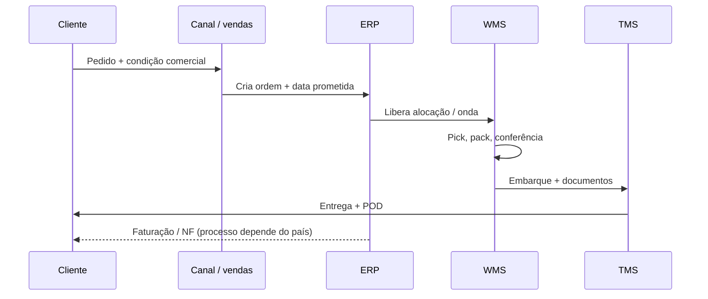
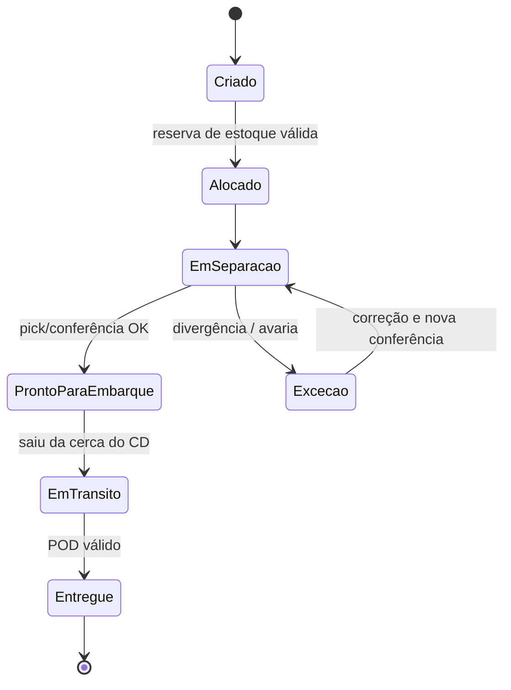

# Fluxos físicos e de informação — quando o caminhão é só a ponta visível do iceberg

Quase toda gente já viveu a seguinte situação: o rastreador diz **“saiu para entrega”**, mas o motorista só aparece no dia seguinte. Às vezes a culpa é do trânsito; com frequência maior, a culpa é **do dado** — o sistema marcou um evento que **ainda não ocorreu** ou marcou com **atraso** tal que a promessa ao cliente foi calculada em cima de um **fantasma**. Este capítulo trata desse fantasma com respeito: ele é um dos maiores produtores de **custo oculto** e de **desconfiança** entre áreas na empresa moderna.

A **TechLar** volta aqui como fio condutor. Imagine um pedido B2B de utensílios para uma rede de lojas: o pedido é grande, a janela de recebimento na loja é curta, e o comercial prometeu **status em tempo real** porque o concorrente prometeu. A operação física pode ser competente; se o **estado do pedido** no portal for mentiroso, o cliente vivencia **atraso** mesmo quando o caminhão é pontual — e o NPS cai sobre a logística, não sobre o bug de integração.

---

## O que é “fluxo físico” sem romantizar a palavra “fluxo”

Fluxo físico não é poesia; é **sequência de transformações e movimentações** que alteram lugar, tempo e condição da mercadoria. No direto: fornecedor → entrada → armazenagem → separação → consolidação → expedição → cliente. No reverso: devolução, recall, embalagem retornável, **reprocesso** (retrabalho, reembalagem). O reverso custa caro porque muitas empresas ainda o tratam como **exceção** administrada no improviso — quando, em e-commerce, pode ser **30%** do volume em certas categorias (número ilustrativo; o importante é que **não** é marginal).

**Analogia da mudança (de novo, mas agora no sentido inverso):** devolução é como levar móveis de volta: ocupa caminhão no sentido contrário, exige **inspeção**, gera **dúvida** (“riscou?”), atrasa o reembolso. Quem só planeja “ida” planeja metade da vida real.

---

## O fluxo de informação: o verdadeiro sistema nervoso

Sem informação confiável, o fluxo físico até pode “acontecer”, mas acontece **cego**: compra-se demais porque não se vê o estoque certo; promete-se data porque o sistema **não** mostra gargalo de doca; paga-se multa porque o **POD** chegou tarde ao financeiro. Christopher enfatiza **visibility** como tema estrutural da SCM moderna; Bowersox e coautores tratam integração logística e desempenho como **processo mediado por dados**. A analogia que mais funciona em sala é a do **prontuário médico**: o paciente (carga) pode estar bem, mas se o prontuário diz errado, o próximo profissional toma decisão errada — o erro não é “no corpo”, é no **registo**.

### Sequência mínima (pedido → entrega)

O diagrama abaixo é **genérico**; adapte os nomes aos seus sistemas (ERP, OMS, WMS, TMS, CRM).

**Leitura:** cada seta tem **latência** e **qualidade**. Uma latência pequena no TMS pode ser enorme no negócio se o cliente recebe **promessa** baseada no ERP.

### Estados do pedido (por que “em trânsito” é um momento, não um sentimento)

**Armadilha clássica:** integração mal parametrizada que coloca **EmTransito** quando o caminhão ainda está na doca. Do lado do cliente, isso é indistinguível de **mentira** — e destrói a credibilidade do *tracking*.

---

## Latência física vs. latência de informação: duas músicas diferentes

O lead time físico mede **tempo entre acontecimentos reais** (ex.: saiu do CD, chegou ao cliente). A latência de informação mede **tempo entre o acontecimento real e o registo confiável** visível para quem decide. Se a segunda latência for alta, a empresa compensa com **estoque de defesa**, **expediente urgente** ou **atendente humano** apagando incêndio — todos **custos** que raramente entram na discussão do “custo de transporte médio”.

**Analogia do banco:** imagine filas físicas curtas, mas o painel eletrônico atrasado cinco minutos em relação à fila real. O caos emocional não vem do tamanho da fila; vem da **informação defasada**. Centros de distribuição sofrem o mesmo sintoma quando **onda** e **doca** não conversam com o **portal**.

---

## O efeito chicote começa muitas vezes no dado, não só no pedido

O artigo clássico de Lee, Padmanabhan e Whang (*Management Science*, 1997, DOI `10.1287/mnsc.43.4.546`) é citado como **bullwhip** — amplificação da variabilidade das ordens a montante. As causas incluem processamento de sinal, racionamento, loteamento e variação de preço. Aqui, acrescentamos uma leitura **operacional**: **atraso de visibilidade** entre elos funciona como **ruído** no sinal de demanda. Não substitui o paper — complementa a intuição de que **integrar dados** não é “projeto de TI”, é **estabilização da cadeia**.

---

## Interfaces: vendas, compras, produção — cada uma fala um dialeto

**Vendas** fala em **SKU**, **preço**, **campanha**, **prazo**; **compras** fala em **MOQ**, **lead time**, **fornecedor aprovado**; **produção** fala em **lote econômico**, **setup**, **capacidade**; **logística** fala em **onda**, **doca**, **cubagem**, **agrupamento de entregas**. O fluxo de informação bom é aquele que **traduz** dialetos sem perder significado. Quando isso falha, nasce a frase fatídica: “mas eu enviei o e-mail” — ou seja, humano compensando ausência de **evento de sistema**.

Na TechLar, quando o marketing cria uma campanha sem **calendário promocional** no ERP, o forecast “vê” uma demanda estranha e o armazém vê **pico** sem explicação — o bullwhip interno começa **antes** do fornecedor, dentro da própria casa.

---

## Colaboração digital em alto nível (sem manual de API)

EDI, APIs, portais de fornecedor, ASN (*Advance Ship Notice*), agendamento de docas e rastreio em TMS são **instrumentos** para reduzir incerteza. O ponto pedagógico: cada instrumento compra **visibilidade** com **custo fixo** de implementação e **custo variável** de governança (cadastro, versão, teste). Não existe “só ligar integração” sem **regra de negócio** — quem diz o contrário vende **projeto**, não **resultado sustentável**.

---

## Caso integrado — “rastreio verde, caminhão parado” (TechLar, B2B)

**Fatos:** integração WMS→TMS marca “em trânsito” ao **gerar documento**, não ao **atravessar portão**; comercial informa cliente com base no portal; janela de recebimento na loja é estreita.

**Perguntas para você:** (1) qual evento físico deveria disparar “em trânsito”? (2) que KPI de **processo** mede a qualidade dessa transição? (3) que regra de negócio corrige?

**Síntese:** “em trânsito” deve refletir **saída da responsabilidade do CD** conforme contrato interno; KPI de processo pode ser o **delta** entre horário de cruzamento de portão e timestamp do status; a correção mistura **parametrização** e **cultura** (ninguém promete ao cliente o que o portal não comprova).

---

## Exercícios

1. Desenhe (papel ou ferramenta) o fluxo físico da sua empresa em **dez caixas** no máximo; depois, adicione **um evento de dados** entre cada caixa.  
2. Explique em **um parágrafo** por que ERP único não elimina divergência físico-informacional.  
3. Liste **cinco** dados mínimos que deveriam circular entre TechLar e seu transportador principal.

**Gabarito orientativo:** (2) ERP integra módulos, mas **disciplina operacional**, cadastro, UOM, vigência de BOM e cultura de evento continuam humanos e frágeis. (3) exemplo: ID de viagem, peso cubado, quantidade de volumes, janela, contato de recebimento, ocorrências.

---

## Glossário express

**ASN**, **POD**, **latência**, **WMS**, **TMS**, **OTIF** — volte ao glossário da aula anterior se precisar de definições base.

---

## Referências

1. CSCMP — Glossário: https://cscmp.org/CSCMP/cscmp/educate/scm_definitions_and_glossary_of_terms.aspx  
2. CHRISTOPHER, M. *Logistics and Supply Chain Management*. Pearson, 2022. https://www.pearson.com/en-us/subject-catalog/p/logistics-and-supply-chain-management/P200000007134  
3. CHOPRA, S.; MEINDL, P. *Supply Chain Management*. Pearson. https://www.pearson.com/en-us/subject-catalog/p/supply-chain-management-strategy-planning-and-operation/P200000012829  
4. LEE, H. L.; PADMANABHAN, V.; WHANG, S. (1997). *Management Science*, 43(4), 546–558. https://doi.org/10.1287/mnsc.43.4.546  
5. BOWERSOX, D. J.; et al. *Supply Chain Logistics Management*. McGraw-Hill. https://www.mheducation.com/highered/product/supply-chain-logistics-management-bowersox.html  

---

## Síntese

Fluxo físico sem informação alinhada gera **atividade sem valor**; informação bonita sem evento físico honesto gera **desconfiança**. A logística madura trata **estado do pedido** como **produto** — com SLA, teste e dono.

**Pergunta final:** qual evento da sua cadeia tem o maior **gap** entre “aconteceu” e “ficou visível”?
