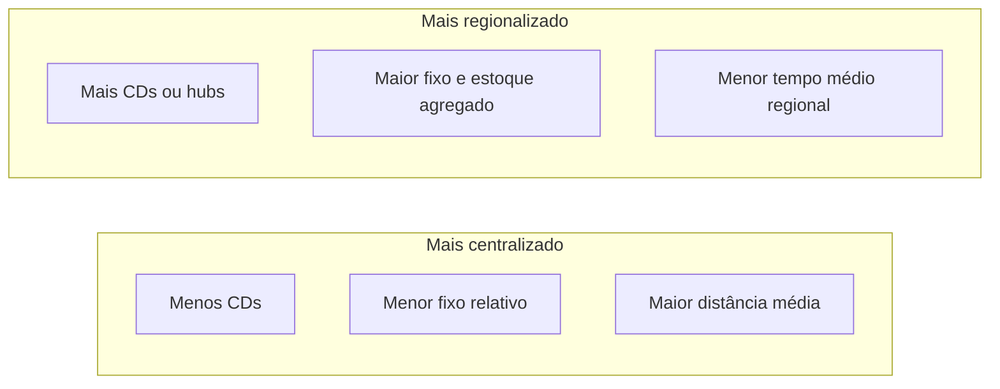

# Planejamento logístico e níveis de decisão — do conselho à onda de picking

Há decisões que, uma vez tomadas, **viram tijolo** — literalmente, no caso de um novo centro de distribuição. Outras decisões mudam toda semana, como a ordem das ondas de separação. Misturar o **nível** dessas decisões na mesma reunião, sem rótulo, é como discutir **arquitetura de prédio** e **cor da tinta da sala** na mesma frase: todo mundo fala, ninguém decide, e o projeto custa o dobro. A logística empresarial sofre muito desse ruído porque ela é, ao mesmo tempo, **infraestrutura lenta** e **operação rápida**.

---

## Horizonte, reversibilidade e “custo de desfazer”

Uma forma útil de pensar — sem amarrar a literatura a um único autor — é a tríade **estratégico / tático / operacional** baseada em **horizonte de tempo**, **reversibilidade** e **intensidade de capex**. Estratégico: anos; reversão cara; exemplo: **número e localização de CDs**. Tático: meses; ajustes de contrato, políticas de estoque por família, acordos sazonais com transporte. Operacional: dias ou horas; reversível com mais esforço humano, mas sem mudar tijolo; exemplo: **sequência de ondas**, alocação de doca.

**Analogia orquestral:** estratégico é escolher **quantos violinistas** contratar para a temporada; tático é **ensaiar o repertório** por mês; operacional é **dirigir o gesto** da batuta em cada noite. Se o maestro tentar resolver “quantos violinistas” durante o concerto, o resultado é ruído — na empresa, vira **reunião eterna** e **burnout**.

---

## Malha: o que você compra quando “compra proximidade”

Regionalizar costuma **comprar tempo** ao cliente e **vender** duplicação de estoque, sistemas, pessoas e complexidade de **replenishment**. Centralizar costuma **comprar economia de escala** e **vender** distância média e risco de **ponto único**. Não existe “melhor” universal — existe encaixe com a **promessa** e com o **custo total** (o módulo 4 da trilha será o lugar de quantificar isso com mais fôlego).

Na **TechLar**, um diretor propõe “três CDs” para cumprir campanha de 24 h nas capitais. A pergunta estratégica imediata não é “quantos caminhões?” — é: **o forecast e o mix por região** suportam três pools de estoque sem virar obsolescência regional de **cor** e **tamanho** que não giram igual no Nordeste e no Sul?

---

## Capacidade não é só “metros quadrados”

Capacidade logística inclui **docas**, **horas de picking**, **equipamentos de movimentação**, **balanças**, **pessoas por turno**, **sistemas que não travam** no pico. Um armazém pode ter “vazio” de paletes e, ainda assim, estar **capacitivo** na expedição porque **docas** são o gargalo — fila de caminhões é fila de **dinheiro** e de **promessa**.

**Analogia hospitalar (recepção):** leitos vazios não adiantam se a **triagem** é o gargalo; pacientes acumulam na entrada. Na logística, pedidos acumulam na **área de staging** se a doca não desenha.

---

## Políticas e promessa: SLO interno como “gramática” do que pode ser dito ao cliente

**SLO** (*service level objective*) interno traduz estratégia em linguagem operacional: “95% das linhas do canal X em até 48h úteis, exceto SKU listados em anexo”. Sem SLO, vendas fala **português**, logística fala **japonês**, e o cliente ouve **promessa** no site. Quando a empresa amadurece, isso conversa com **ATP**; por ora, basta internalizar: **promessa sem política** é dívida.

---

## Desalinhamento vertical: sintomas que todo mundo reconhece mas raramente nomeia

- Estratégia diz **regionalizar**, mas compras ainda negocia **frete nacional único** como se o CD fosse um.  
- Marketing promove **SKU pesado**, mas o layout do armazém foi desenhado para **SKU leve** de alta rotação.  
- Finanças corta **headcount** no CD na mesma semana em que vendas **dobra meta** — OTIF despenca e cada área tem narrativa inocente.

Isso não é “falta de boa vontade”; é **ausência de ritmo** que conecte níveis — exatamente o problema que o **S&OP** veio endereçar no módulo seguinte.

---

## Caso numérico — “um CD ou três?” (TechLar)

| Cenário | Nº CDs | LT médio ao cliente (dias) | Estoque médio (unid.) | Fixo mensal (índice) |
|---------|--------|----------------------------|------------------------|------------------------|
| A | 1 | 4 | 8.000 | 100 |
| B | 3 | 1,5 | 12.000 | 148 |

Use valor unitário médio **$50** e custo de capital **1%/mês** sobre estoque médio como **proxy** pedagógico; some ao fixo e discuta **serviço** e **risco** além do número.

**Leitura:** regionalizar sem **SKU regionalizado** é como abrir **três cozinhas** com o mesmo cardápio de SP para o Nordeste — pode funcionar, ou pode gerar **prato parado** na vitrine.

---

## Exercícios

1. Classifique cinco decisões do seu ambiente real em **E/T/O** e discuta um caso em que dois grupos discordam do rótulo — por quê?  
2. Explique por que S&OP **não** é “só tático” nem “só operacional”.

**Gabarito orientativo:** (2) S&OP reconcilia volume/mix/capacidade em horizonte **mensal/trimestral** com papel de **média e alta gestão**; não substitui onda diária nem decide tijolo sozinho, mas informa **ambos**.

---

## Referências

1. CHOPRA, S.; MEINDL, P. *Supply Chain Management*. Pearson. https://www.pearson.com/en-us/subject-catalog/p/supply-chain-management-strategy-planning-and-operation/P200000012829  
2. BALLOU, R. H. *Business Logistics / Supply Chain Management*. Pearson.  
3. CHRISTOPHER, M. *Logistics and Supply Chain Management*. Pearson, 2022. https://www.pearson.com/en-us/subject-catalog/p/logistics-and-supply-chain-management/P200000007134  
4. CSCMP — Glossário: https://cscmp.org/CSCMP/cscmp/educate/scm_definitions_and_glossary_of_terms.aspx  
5. GARTNER — *Supply Chain Planning*: https://www.gartner.com/en/supply-chain/topics/supply-chain-planning  

---

## Síntese

Níveis de decisão existem para **proteger** a empresa de otimizar o dia e quebrar o triênio; malha e capacidade são **alavancas** com preço explícito e oculto.

**Pergunta:** qual decisão na sua empresa está claramente no **nível errado** da mesa?
