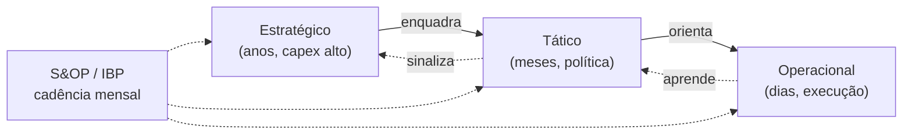
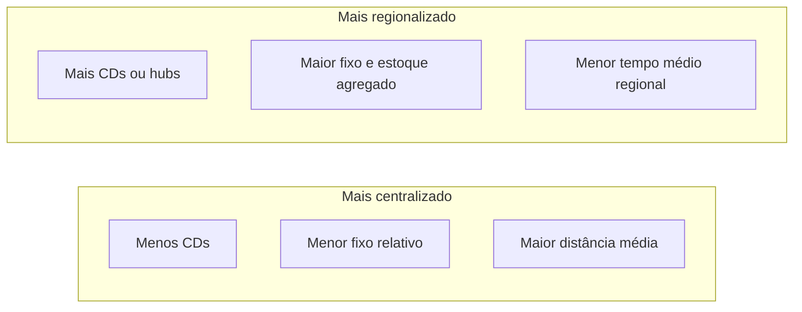

# Planejamento logístico e níveis de decisão — do conselho à onda de picking

## Objetivos e resultado de aprendizagem

Ao final da aula, o aluno será capaz de:

- **Distinguir** decisões estratégicas, táticas e operacionais em logística (3 níveis × horizonte × reversibilidade).
- **Justificar** implicações de prazo, capex e reversibilidade em escolhas reais.
- **Avaliar** trade-off centralização vs. regionalização de rede (incluindo efeito ICMS BR).
- **Identificar** desalinhamentos verticais comuns entre estratégia, vendas e operações.
- **Posicionar** o S&OP como ponte entre níveis (preparando o módulo 3).

**Duração sugerida:** 60–75 min.
**Pré-requisitos:** [Aula 1.1](aula-01-conceitos-papel-logistica.md) e [Aula 1.2](aula-02-fluxos-fisicos-informacao.md).

## Mapa do conteúdo

- Horizonte e nível de decisão (E/T/O).
- Reversibilidade e custo de desfazer.
- Centralização vs. regionalização de malha (com efeito ICMS-BR).
- Capacidade não é só metro quadrado.
- SLO interno como “gramática” da promessa.
- Desalinhamentos verticais.
- Caso TechLar — “um CD ou três?”.

## Ponte

Conecta com [Logística estratégica](../../trilha-logistica-estrategica/README.md) para decisões de rede e sourcing; com [S&OP](../modulo-03-planejamento-demanda-sop/aula-03-sop-processo-alinhamento.md) para o ritual que conecta os níveis; com [Estrutura de custos](../modulo-04-custos-logisticos-performance/aula-01-estrutura-custos-logisticos.md) para quantificar trade-offs.

Há decisões que, uma vez tomadas, **viram tijolo** — literalmente, no caso de um novo centro de distribuição. Outras decisões mudam toda semana, como a ordem das ondas de separação. Misturar o **nível** dessas decisões na mesma reunião, sem rótulo, é como discutir **arquitetura de prédio** e **cor da tinta da sala** na mesma frase: todo mundo fala, ninguém decide, e o projeto custa o dobro. A logística empresarial sofre muito desse ruído porque ela é, ao mesmo tempo, **infraestrutura lenta** e **operação rápida**.

---

## Horizonte, reversibilidade e “custo de desfazer”

Uma forma útil de pensar — sem amarrar a literatura a um único autor — é a tríade **estratégico / tático / operacional** baseada em **horizonte de tempo**, **reversibilidade** e **intensidade de capex**. Estratégico: anos; reversão cara; exemplo: **número e localização de CDs**. Tático: meses; ajustes de contrato, políticas de estoque por família, acordos sazonais com transporte. Operacional: dias ou horas; reversível com mais esforço humano, mas sem mudar tijolo; exemplo: **sequência de ondas**, alocação de doca.

**Analogia orquestral:** estratégico é escolher **quantos violinistas** contratar para a temporada; tático é **ensaiar o repertório** por mês; operacional é **dirigir o gesto** da batuta em cada noite. Se o maestro tentar resolver “quantos violinistas” durante o concerto, o resultado é ruído — na empresa, vira **reunião eterna** e **burnout**.

### Tabela executiva — três níveis lado a lado

| Dimensão | Estratégico | Tático | Operacional |
|----------|-------------|--------|-------------|
| Horizonte | 2–10 anos | 3–18 meses | dias a semanas |
| Reversibilidade | Baixa (capex, contratos longos) | Média (contrato anual, política) | Alta (próxima onda) |
| Capex | Alto (CD, frota, sistema) | Médio (espaço alugado, IT minor) | Baixo (re-arranjo, hora extra) |
| Decisão típica | Nº/localização de CDs, modal predominante, *make or buy*, ERP/WMS/TMS | Política de estoque por família, RFP de transporte, sazonal extra, capacidade contratada | Onda de picking, alocação de doca, expedição emergencial |
| Quem decide | Conselho/CEO | Diretoria + S&OP | Supervisor/coord. de turno |
| Métrica de saúde | ROIC, custo logístico/receita, market access | Aderência ao plano, OTIF mensal, custo/pedido | OTIF diário, lead time intra-CD, retrabalho |
| Sintoma de erro | Rede mal desenhada → custo crônico | Plano não casa com capacidade → war room virou regra | Operação “heroica” → burnout, multas |

**Leitura:** as setas sólidas vão **de cima para baixo** (decisão enquadra ação); as tracejadas vão **de baixo para cima** (aprendizado e sinal). O **S&OP** é a junta que mantém os três níveis em ritmo — sem ele, cada nível otimiza por conta própria.

---

## Malha: o que você compra quando “compra proximidade”

Regionalizar costuma **comprar tempo** ao cliente e **vender** duplicação de estoque, sistemas, pessoas e complexidade de **replenishment**. Centralizar costuma **comprar economia de escala** e **vender** distância média e risco de **ponto único**. Não existe “melhor” universal — existe encaixe com a **promessa** e com o **custo total** (o módulo 4 da trilha será o lugar de quantificar isso com mais fôlego).

Na **TechLar**, um diretor propõe “três CDs” para cumprir campanha de 24 h nas capitais. A pergunta estratégica imediata não é “quantos caminhões?” — é: **o forecast e o mix por região** suportam três pools de estoque sem virar obsolescência regional de **cor** e **tamanho** que não giram igual no Nordeste e no Sul?

### Brasil: malha + ICMS + benefício fiscal regional

A decisão de malha no Brasil **nunca é puramente logística** — o ICMS estadual e os **benefícios fiscais regionais** entram no cálculo. Estados como **ES** (FUNDAP histórico), **SC** (TTD), **GO** (COMEXPRODUZIR), **MG**, **PE** (PRODEPE) e **AL** ofereceram (e em alguns casos ainda oferecem) **regimes especiais** que reduzem a alíquota efetiva de ICMS para empresas que **operam logisticamente** a partir desses estados. Resultado: muitas redes de e-commerce brasileiras têm CD em ES ou SC **não** porque é o melhor ponto físico, mas porque o **ICMS efetivo** sobre saídas interestaduais é menor.

> **A Reforma Tributária (LC 214/2025) muda o jogo.** Com o **IBS/CBS** cobrados no **destino** (e não na origem), o incentivo de localizar CD por benefício fiscal estadual tende a **diminuir** durante a transição (2026–2033). Empresas estão sendo orientadas (Deloitte, EY, KPMG, FGV CCiF) a reavaliar projetos de rede com horizonte para depois de 2033 considerando **custo logístico líquido** sem o atalho fiscal. Esta é uma decisão claramente **estratégica** — congelar capex grande em rede sem entender o cenário fiscal pós-reforma é arriscado.

**Prática global comparativa:** EUA usam o conceito de *DC network design* baseado em **time-to-customer** e custo de transporte (sem grandes distorções de imposto sobre vendas estaduais para B2B). UE adiciona **VAT** com regras de origem/destino e considerações de fronteira intra-UE. China combina escala logística (rede densa) com incentivos regionais (zonas econômicas). O Brasil é **atípico** pelo peso do ICMS interestadual no cálculo de rede.

---

## Framework Chopra — fases do projeto de cadeia (relembrar)

Chopra & Meindl propõem 4 fases de projeto de cadeia que mapeiam exatamente nos níveis E/T/O:

1. **Estratégia competitiva → estratégia de cadeia** (E): definir promessa (responsiva vs. eficiente).
2. **Configuração da cadeia / desenho de rede** (E): número, localização, função de instalações.
3. **Planejamento da cadeia** (T): políticas operacionais — estoque por família, fornecedores, transporte contratado.
4. **Operação da cadeia** (O): execução semanal/diária — pedidos, ondas, expedição.

Esta cascata é **didática** (na vida há laços de retorno), mas ajuda a **rotular** uma reunião antes de entrar nela.

---

## Capacidade não é só “metros quadrados”

Capacidade logística inclui **docas**, **horas de picking**, **equipamentos de movimentação**, **balanças**, **pessoas por turno**, **sistemas que não travam** no pico. Um armazém pode ter “vazio” de paletes e, ainda assim, estar **capacitivo** na expedição porque **docas** são o gargalo — fila de caminhões é fila de **dinheiro** e de **promessa**.

**Analogia hospitalar (recepção):** leitos vazios não adiantam se a **triagem** é o gargalo; pacientes acumulam na entrada. Na logística, pedidos acumulam na **área de staging** se a doca não desenha.

---

## Políticas e promessa: SLO interno como “gramática” do que pode ser dito ao cliente

**SLO** (*service level objective*) interno traduz estratégia em linguagem operacional: “95% das linhas do canal X em até 48h úteis, exceto SKU listados em anexo”. Sem SLO, vendas fala **português**, logística fala **japonês**, e o cliente ouve **promessa** no site. Quando a empresa amadurece, isso conversa com **ATP**; por ora, basta internalizar: **promessa sem política** é dívida.

---

## Desalinhamento vertical: sintomas que todo mundo reconhece mas raramente nomeia

- Estratégia diz **regionalizar**, mas compras ainda negocia **frete nacional único** como se o CD fosse um.  
- Marketing promove **SKU pesado**, mas o layout do armazém foi desenhado para **SKU leve** de alta rotação.  
- Finanças corta **headcount** no CD na mesma semana em que vendas **dobra meta** — OTIF despenca e cada área tem narrativa inocente.

Isso não é “falta de boa vontade”; é **ausência de ritmo** que conecte níveis — exatamente o problema que o **S&OP** veio endereçar no módulo seguinte.

---

## Caso numérico — “um CD ou três?” (TechLar)

| Cenário | Nº CDs | LT médio ao cliente (dias) | Estoque médio (unid.) | Fixo mensal (índice) |
|---------|--------|----------------------------|------------------------|------------------------|
| A | 1 | 4 | 8.000 | 100 |
| B | 3 | 1,5 | 12.000 | 148 |

Use valor unitário médio **$50** e custo de capital **1%/mês** sobre estoque médio como **proxy** pedagógico; some ao fixo e discuta **serviço** e **risco** além do número.

**Leitura:** regionalizar sem **SKU regionalizado** é como abrir **três cozinhas** com o mesmo cardápio de SP para o Nordeste — pode funcionar, ou pode gerar **prato parado** na vitrine.

---

## O que vira dado no sistema

| Decisão | Onde fica registrada | Quem mantém |
|---------|----------------------|-------------|
| Localização de CDs | Cadastro de **centros/almoxarifados** no ERP; mapa de rede | Logística + TI |
| Política de estoque por família | **Política ABC**, ponto de pedido, MOQ por SKU | Planejamento |
| Sazonalidade contratada | Contratos no TMS + **calendário** S&OP | Compras + Logística |
| SLO interno | Tabela de **promessa por canal** + ATP | Comercial + Logística |
| Capacidade de doca | Calendário **dock scheduling** (módulo TMS/WMS) | Operações |
| Onda do dia | Plano de onda no **WMS** | Supervisão CD |

---

## KPIs e decisão (kit mínimo desta aula)

| KPI | Pergunta que responde | Dono | Fonte | Cadência | Playbook de ação |
|-----|------------------------|------|-------|----------|-------------------|
| **Tempo médio de decisão por nível** | Reunião certa, na cadência certa? | Diretoria | Ata S&OP/PMO | Trimestral | Refundar fórum se decisão estratégica vira pauta semanal |
| **Aderência ao plano tático** (% volume planejado vs. realizado) | Plano S&OP cumpre? | Plan + Operações | ERP/S&OP | Mensal | Análise de variância, ajuste de pré-S&OP |
| **OTIF por região / CD** | Malha está balanceada? | Logística | TMS/ERP | Mensal | Rebalancear estoque, revisar SLO regional |
| **Custo logístico % receita por região** | Rede paga o preço da promessa? | CFO + Logística | BI | Trimestral | Reavaliar localização de CD; testar 3PL regional |
| **Taxa de re-planejamento emergencial** | Curto prazo está consertando o médio? | S&OP owner | PMO | Mensal | > 20% indica falha de tático/estratégico |
| **Capex executado vs. planejado em rede** | Estratégia avança? | Conselho/CFO | Controladoria | Anual | Revisar premissas e go/no-go |

---

## Ferramentas e tecnologias relevantes

| Decisão | Pode começar em | Cresce para | Quando NÃO usar |
|---------|-----------------|-------------|------------------|
| Desenho de rede | Excel + Google Maps + custo médio | LLamasoft (Coupa Supply Chain Design), AnyLogistix, Optilogic | Sem dados de demanda confiáveis |
| Política de estoque | Excel ABC | Módulo de **Inventory Optimization** do ERP/APS (SAP IBP, Oracle, Anaplan, Slimstock) | Cadastro de SKU sujo |
| Calendário S&OP | Excel + reunião mensal | APS (SAP IBP, Anaplan, Kinaxis, o9, Demand Solutions) | Sem dono de processo S&OP |
| Capacidade de doca | Planilha + telefone | Dock Scheduling (Manhattan, Brudam) + portal de transportadoras | Volume baixíssimo |

---

## Exercícios

1. Classifique cinco decisões do seu ambiente real em **E/T/O** e discuta um caso em que dois grupos discordam do rótulo — por quê?
2. Explique por que S&OP **não** é “só tático” nem “só operacional”.
3. **Caso BR:** sua empresa estuda abrir um CD no Espírito Santo aproveitando regime especial de ICMS. Liste **três** premissas que precisam ser **assinadas** antes do investimento, considerando a Reforma Tributária 2026–2033.
4. **Trade-off explícito:** elabore um quadro 2x2 (centralizar vs. regionalizar) × (ESG/baixo carbono vs. velocidade de entrega) e classifique a TechLar.

**Gabarito orientativo:** (2) S&OP reconcilia volume/mix/capacidade em horizonte **mensal/trimestral** com papel de **média e alta gestão**; não substitui onda diária nem decide tijolo sozinho, mas informa **ambos**. (3) (a) horizonte de payback do CD vs. data prevista de fim do incentivo (alguns regimes têm sunset); (b) custo logístico **líquido** (sem ICMS reduzido) — o CD ainda faz sentido?; (c) **flexibilidade contratual** (galpão alugado vs. próprio) para reverter se a reforma alterar drasticamente o cálculo.

---

## Glossário express

- **E/T/O:** Estratégico, Tático, Operacional — três níveis de decisão.
- **SLO** (*Service Level Objective*): meta interna acordada de nível de serviço.
- **ATP** (*Available to Promise*): saldo disponível para promessa.
- **Capex / Opex:** investimento (capital) vs. despesa operacional.
- **Pool de estoque:** conjunto de saldo agregado em um único centro lógico, base para risk-pooling.
- **Risk-pooling:** efeito estatístico de **redução** de estoque de segurança ao agregar demanda em pontos centralizados.
- **DIFAL:** diferencial de alíquota de ICMS em operações interestaduais (relevante para venda B2C interestadual).
- **3PL** (*Third-Party Logistics*): operador logístico terceirizado.

---

## Referências

1. CHOPRA, S.; MEINDL, P. *Supply Chain Management*. Pearson. https://www.pearson.com/en-us/subject-catalog/p/supply-chain-management-strategy-planning-and-operation/P200000012829
2. BALLOU, R. H. *Business Logistics / Supply Chain Management*. Pearson.
3. CHRISTOPHER, M. *Logistics and Supply Chain Management*. Pearson, 2022. https://www.pearson.com/en-us/subject-catalog/p/logistics-and-supply-chain-management/P200000007134
4. CSCMP — Glossário: https://cscmp.org/CSCMP/cscmp/educate/scm_definitions_and_glossary_of_terms.aspx
5. GARTNER — *Supply Chain Planning*: https://www.gartner.com/en/supply-chain/topics/supply-chain-planning
6. ANTHONY, R. N. *Planning and Control Systems: A Framework for Analysis*. HBS, 1965 — origem da hierarquia E/T/O em gestão.
7. FGV CCiF — *Reforma Tributária do Consumo* (estudos): https://ccif.com.br/
8. ILOS — *Panorama de Operadores Logísticos no Brasil*: https://www.ilos.com.br/web/
9. MIT CTL — *Center for Transportation & Logistics* (network design): https://ctl.mit.edu/

---

## Síntese

Níveis de decisão existem para **proteger** a empresa de otimizar o dia e quebrar o triênio; malha e capacidade são **alavancas** com preço explícito e oculto. No Brasil, **fiscal e logística** decidem rede juntos — e a Reforma Tributária reescreve o tabuleiro até 2033.

**Pergunta:** qual decisão na sua empresa está claramente no **nível errado** da mesa?

---

## Pontes para outras trilhas

- [Trilha Logística Estratégica](../../trilha-logistica-estrategica/README.md) — *network design* avançado, SRM.
- [Trilha Tecnologia e Sistemas](../../trilha-tecnologia-e-sistemas/README.md) — APS, S&OP em sistema.
- [Trilha Dados e Analytics](../../trilha-dados-analytics-logistica/README.md) — modelos de localização e custo.
