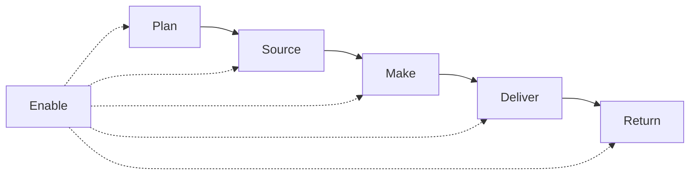
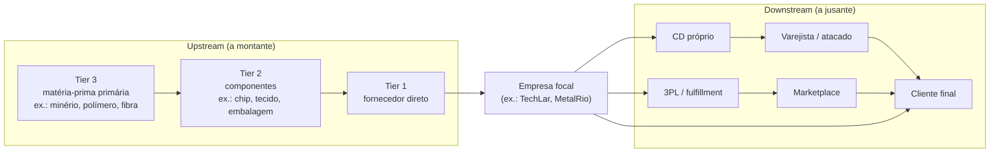

# Cadeia de suprimentos ponta a ponta — além do muro da fábrica

## Objetivos e resultado de aprendizagem

Ao final da aula, o aluno será capaz de:

- **Desenhar** a cadeia ponta a ponta com tiers de fornecedores e canais de saída.
- **Interpretar** dependências entre atores e gargalos sistêmicos.
- **Explicar** efeitos de otimização local sobre o desempenho global.
- **Posicionar** push/pull e o ponto de desacoplamento em casos reais.
- **Aplicar** SCOR como checklist de conversa entre áreas.

**Duração sugerida:** 70–85 min.
**Pré-requisitos:** Aulas 1.1, 1.2, 1.3.

## Mapa do conteúdo

- Definição e escopo de SCM (CSCMP).
- Mapa visual da cadeia (tiers, focal firm, canais).
- Leitura por processos (SCOR — ASCM).
- Push, pull e ponto de desacoplamento (postponement).
- Tipologia de cadeias (Fisher: eficiente vs. responsiva).
- Caso longo MetalRio + caso BR (Embraer/Vale/Natura/JBS).
- Conflitos de objetivo entre áreas.

## Ponte

Conecta com [Planejamento de Demanda (S&OP)](../modulo-03-planejamento-demanda-sop/README.md), com [Integração e colaboração](aula-02-integracao-colaboracao-cadeia.md) e com [Logística estratégica — desenho de rede](../../trilha-logistica-estrategica/README.md).

Quando alguém diz “supply chain” em tom solene, muitas vezes o desenho mental ainda é uma **caixa** com setas entrando e saindo. A SCM real é mais parecida com um **ecossistema**: fornecedores de vários *tiers*, transportadoras, armazéns próprios e de terceiros, canais on-line e físicos, **informação** que atravessa fronteiras e **dinheiro** que atravessa mais devagar que o produto. O CSCMP define SCM como planejamento e gestão de **todas** as atividades desde *sourcing* e *procurement* até a logística, incluindo coordenação com parceiros e integração oferta–demanda **dentro e entre** empresas — definição que, pela própria sintaxe, **proíbe** o muro da fábrica como limite mental.

---

## SCOR como “mapa de trilhas” (ASCM)

O modelo **SCOR** (*Supply Chain Operations Reference*) organiza processos em **Plan, Source, Make, Deliver, Return, Enable**. Você não precisa “implementar SCOR” para se beneficiar: use como **checklist de conversa**. “Onde estamos falhando em **Plan**?” muitas vezes revela que a empresa discute **capacidade** sem **forecast** honesto; “onde estamos frágeis em **Return**?” revela devolução como **desenhador de custo** invisível.

**Leitura:** *Enable* é tudo que sustenta os outros processos — dados, qualidade, risco, **gestão de parceiros**. Logística aparece forte em **Deliver** e **Return**, mas não só.

---

## Mapa visual da cadeia — tiers e focal firm

Antes de SCOR, vale **desenhar** a cadeia como ela é: uma rede com **tiers** de fornecedores a montante (T1, T2, T3+) e **canais** a jusante.

**Leitura:** uma falha em **Tier 3** pode demorar meses até “gritar” na **focal firm** porque há buffers no caminho — mas quando grita, é geralmente **tarde demais**. A pandemia de 2020–2022 ensinou isso ao mundo com o **chip de semicondutor** (Tier 2 oculto da indústria automotiva); no Brasil, o caso **canetas BIC × poliestireno** durante a COVID e os impactos da **greve dos caminhoneiros de 2018** mostram quão sensível a cadeia é a tiers “invisíveis”.

**Analogia da raiz da árvore:** o que se vê é o tronco (T1); o que sustenta é a raiz (T2/T3). Empresas maduras fazem **mapeamento multi-tier** (Resilinc, Interos, EverstreamAI; em escala mais simples, planilhas com pegging de fornecedores críticos).

---

## Push, pull e o ponto onde a cadeia “respira”

**Push** antecipa com base em **forecast** e economias de escala; **pull** aciona reposição com base em **consumo** real ou sinal próximo do consumo. Na prática, misturas dominam. O **ponto de desacoplamento** (*decoupling point*) é onde a estratégia muda de “empurrar” para “puxar” — por exemplo, estoque de SKU semi-acabado genérico antes da personalização final (*postponement*, tema que reaparece em estratégia de produto).

**Analogia da padaria:** a fornada empurrada de manhã é **push**; o sanduíche montado sob pedido no almoço é **pull** com ingredientes semi-preparados — o desacoplamento é a **bancada** entre “massa” e “nome do cliente no copo”.

### Tipologia de Fisher — eficiente vs. responsiva

Marshall Fisher (HBR, 1997 — *What Is the Right Supply Chain for Your Product?*) propôs uma classificação que envelheceu bem:

| Característica | Cadeia eficiente | Cadeia responsiva |
|----------------|------------------|-------------------|
| Produto típico | **Funcional** (commodity, longo ciclo, demanda estável) | **Inovador** (ciclo curto, demanda volátil) |
| Estratégia logística | Custo mínimo | Velocidade de reposição |
| Estoque | Alta rotatividade, baixo nível | Buffer estratégico, ágil |
| Fornecedor | Menor custo total | Velocidade e flexibilidade |
| Exemplo BR | **JBS** (proteína), **Klabin** (papel/celulose), commodities agrícolas | **Magalu** marketplace fashion, **Renner**/Hering ciclo curto, eletrônicos |

**Implicação:** copiar a estratégia de uma sem entender em qual lado seu produto vive é receita para **estoque encalhado** ou **ruptura crônica**.

---

## SCOR detalhado — níveis de maturidade

O **SCOR-DS** (versão atual) da **ASCM** opera em quatro níveis: (1) **processo** (Plan, Source, Make, Deliver, Return, Enable), (2) **categoria de processo** (ex.: Make-to-Stock, Make-to-Order, Engineer-to-Order), (3) **elemento de processo** (passos detalhados), (4) **implementação** (sistema/customização local). Empresas usam SCOR principalmente para:

- **Benchmarking** com métricas padronizadas (ex.: Perfect Order Fulfillment, Cash-to-Cash Cycle Time, Total SCM Cost).
- **Mapear maturidade** de processos (gap analysis).
- **Estruturar transformação** (consultorias usam SCOR como esqueleto).

> **Quando NÃO usar SCOR:** quando a empresa ainda não tem o **alfabeto** (cadastro, NF, processo de pedido). SCOR sobre cadastro sujo é exercício de slide.

---

## Objetivos múltiplos: disponibilidade, custo, risco, capital — e a ilusão de “tudo verde”

Chopra & Meindl insistem em **trade-offs** entre *drivers*; Christopher enfatiza competição **cadeia a cadeia**. Na prática, **vendas** quer disponibilidade, **finanças** quer giro, **produção** quer estabilidade de volume, **logística** quer previsibilidade de mix. SCM não “resolve” conflitos por mágica — cria **cadência** para que conflitos apareçam como **números** e não como **lendas de corredor**.

---

## Caso longo — **MetalRio** (fictícia): insumo importado, promessa curta

**Enredo:** fabricante de componentes; insumo crítico importado da China com **LT 90 dias** (35–45 dias de transit time porto a porto Shanghai–Santos + ~30–45 dias de processo aduaneiro/transit interno + buffer); vendas promete **30 dias** ao cliente final para SKU acabado; CFO pressiona por **baixo capital**.

**Perguntas:** (1) onde está o **risco** concentrado? (2) que alavancas existem além de “pedir para compras comprar mais cedo”? (3) que métrica financeira simples ajuda a conversar com o conselho?

**Síntese:** sem **buffer** de MP, **segundo fornecedor** em qualificação (preferencialmente em geografia diferente — *China + 1*), **postponement** de mix, **nacionalização parcial** do insumo, ou **revisão** da promessa comercial, a cadeia resolve no **premium freight** (aéreo a 5–8x o custo marítimo) ou na **ruptura** — ambos caros, mas um deles destrói **marca**. Métrica útil para conselho: **Cash-to-Cash Cycle Time** (DSO + DIO − DPO) — mostra capital amarrado na cadeia em **dias**, linguagem direta do CFO.

### Caso brasileiro real — “Embraer e o supply chain global”

A Embraer compra peças de centenas de fornecedores em ~30 países. O E-Jet E2 é montado em São José dos Campos (SP) com fuselagem composite Tier 1 (Spirit AeroSystems EUA), motores PW1900G (Pratt & Whitney EUA), aviônicos (Honeywell EUA), trem de pouso (UTC França). A cadeia é literalmente **global** e **militar em rastreabilidade** (cada peça tem certificado e *traceability* fim-a-fim). Lições para o aluno BR: rastreabilidade multi-tier não é luxo aeroespacial — começa a ser exigência em **automotivo** (recall), **farma** (ANVISA RDC 157), **alimentos** (CDC, lote/validade) e **construção civil** (NBR 14724).

---

## Trade-offs sintéticos da SCM ponta a ponta

| Eixo | Mais (custo) | Menos (custo) | Quando vale |
|------|--------------|---------------|-------------|
| Verticalização | Comprar fábrica de insumo (Tier 2 dentro) | Outsourcing | Quando insumo é estratégico e oferta concentrada |
| Multi-sourcing | 2–3 fornecedores qualificados | Single source | Insumo crítico, geografia diversa |
| Postponement | Estoque semi-acabado + customização final | Acabado por SKU | Catálogo amplo + variabilidade alta |
| Visibilidade multi-tier | Plataforma de mapeamento (Resilinc, etc.) | "Confio no T1" | Cadeia complexa, regulação, riscos sistêmicos |
| Cadeia curta | Nearshoring/onshoring | Offshoring agressivo | Lead time importa mais que custo unitário |

---

## KPIs e decisão (kit mínimo)

| KPI | Pergunta que responde | Dono | Fonte | Cadência | Playbook de ação |
|-----|------------------------|------|-------|----------|-------------------|
| **Perfect Order Fulfillment** (% pedidos sem qualquer falha — completo, on time, sem dano, com docs) | Cumpriu integralmente? | Diretoria SCM | ERP+TMS+CS | Mensal | Análise de falha por componente (in full, on time, perfeito, doc) |
| **Lead time ponta a ponta** (P50, P90) | Quanto tempo da matéria-prima ao cliente? | SCM | ERP fim-a-fim | Trimestral | Identificar etapa-gargalo no histograma |
| **Cash-to-Cash Cycle Time** (DSO+DIO−DPO) | Quantos dias de capital amarrado? | CFO | ERP financeiro | Mensal | Negociar prazos a montante e a jusante |
| **Variabilidade do pedido** (CV de ordens por elo) | Quanto bullwhip estamos amplificando? | Plan + SCM | ERP | Mensal | CPFR, smoothing, política de lote |
| **% receita de fornecedor único** | Estou exposto a single source? | Procurement | ERP compras | Trimestral | Plano de qualificação de 2º fornecedor |
| **Total SCM Cost % receita** | Cadeia paga o preço da promessa? | CFO + SCM | BI integrado | Trimestral | Decompor por elo |

---

## Ferramentas e tecnologias relevantes

| Necessidade | Pode começar em | Cresce para | Quando NÃO usar |
|-------------|-----------------|-------------|------------------|
| Mapeamento da cadeia | Excel/Miro | Resilinc, Interos, EverstreamAI, Sourcemap | Cadeia simples e estável |
| SCOR / benchmark | ASCM SCOR DS PDF | APQC PCF, plataformas de benchmarking | Sem maturidade básica de processo |
| Visibilidade de pedido B2B | E-mail | Portal próprio + EDI/API + Project44/FourKites | Volume baixo |
| Planejamento integrado | Excel | SAP IBP, Oracle, o9, Kinaxis, Anaplan | Sem dono de S&OP |
| Postponement | Layout fabril e BOM | Configurador de produto (PLM + ERP) | Sem variedade real de mix |

---

## Erros comuns e armadilhas

- **Mapear só Tier 1** e ficar surpreso com falha em T2/T3.
- **Copiar estratégia** (responsiva) de competidor sem entender o produto (funcional).
- **SCOR como projeto de slide** sem maturidade básica.
- **Push em produto inovador** → estoque encalhado em fim de ciclo.
- **Pull em produto funcional** → ruptura por falta de buffer barato.
- **Bônus por elo** sem KPI sistêmico → bullwhip auto-induzido.

---

## Exercícios

1. Desenhe **duas** cadeias do mesmo setor com **gargalos** diferentes (ex.: frio vs. não frio).
2. Defina SCM numa frase **sem** usar “empresa” como limite.
3. Dê exemplo de otimização **local** que prejudica a cadeia.
4. **Caso BR — café:** desenhe a cadeia ponta a ponta de café especial brasileiro exportado para a Europa (do produtor à xícara em Berlim). Identifique pelo menos **três** atores, **dois** pontos de incoterm e **dois** riscos sistêmicos.
5. Classifique sua empresa em **eficiente vs. responsiva** (Fisher) e justifique se a estratégia logística atual é coerente.

**Gabarito:** (2) "Coordenação de oferta e demanda entre múltiplos atores ao longo do tempo, com fluxo bidirecional de bens, informação e dinheiro." (3) compras ganham bônus por lote gigante → estoque e obsolescência sobem; ou transporte ganha por veículo cheio → frequência cai → ruptura no canal. (4) atores: produtor/cooperativa, beneficiamento, exportador, agente de carga, naviera, importador europeu, torrefador, varejo. Incoterms típicos: FOB Santos (responsabilidade até embarque), CIF/CIP Hamburgo. Riscos: clima/produtividade, oscilação cambial USD/BRL, certificação (Rainforest, Fair Trade), regulação europeia (EUDR — *EU Deforestation Regulation* a partir de 2025/26).

---

## Glossário express

- **SCOR-DS:** *Supply Chain Operations Reference – Digital Standard* (ASCM).
- **Tier 1/2/3:** níveis de fornecedor a montante.
- **Focal firm:** empresa central de análise da cadeia.
- **Push / Pull:** antecipar (forecast) vs. reagir a consumo.
- **Postponement:** adiar customização final até o último momento possível.
- **Decoupling point:** fronteira entre push e pull no fluxo.
- **Cash-to-Cash (C2C):** dias entre pagar fornecedor e receber do cliente.
- **Perfect Order Fulfillment:** % pedidos sem **nenhuma** falha.
- **3PL / 4PL:** operador logístico tradicional / orquestrador.
- **Multi-sourcing:** múltiplos fornecedores qualificados para o mesmo insumo.

---

## Referências

1. CSCMP — *What is SCM?*: https://cscmp.org/CSCMP/CSCMP/Certify/Fundamentals/What_is_Supply_Chain_Management.aspx
2. ASCM — *SCOR Digital Standard*: https://www.ascm.org/learning-development/scor/
3. CHOPRA, S.; MEINDL, P. *Supply Chain Management*. Pearson. https://www.pearson.com/en-us/subject-catalog/p/supply-chain-management-strategy-planning-and-operation/P200000012829
4. CHRISTOPHER, M. *Logistics and Supply Chain Management*. Pearson, 2022. https://www.pearson.com/en-us/subject-catalog/p/logistics-and-supply-chain-management/P200000007134
5. BOWERSOX, D. J.; et al. *Supply Chain Logistics Management*. McGraw-Hill. https://www.mheducation.com/highered/product/supply-chain-logistics-management-bowersox.html
6. FISHER, M. L. (1997). *What Is the Right Supply Chain for Your Product?* — Harvard Business Review, March-April. https://hbr.org/1997/03/what-is-the-right-supply-chain-for-your-product
7. ILOS — *Panorama de cadeias logísticas no Brasil*: https://www.ilos.com.br/web/
8. APQC — *Process Classification Framework*: https://www.apqc.org/process-frameworks
9. MIT CTL — pesquisa em cadeias globais e resiliência: https://ctl.mit.edu/

---

## Síntese

SCM é **rede + tempo + dados + dinheiro**; o mapa começa **fora** do muro; trade-offs são o **material** da profissão. Cadeia certa para o produto certo (Fisher); SCOR como linguagem; multi-tier como seguro.

**Pergunta:** qual ator da sua cadeia você mais trata como “fundo pintado”?

---

## Pontes para outras trilhas

- [Trilha Logística Estratégica](../../trilha-logistica-estrategica/README.md) — SRM, sourcing global.
- [Trilha Tecnologia e Sistemas](../../trilha-tecnologia-e-sistemas/README.md) — APS, TMS, EDI/API.
- [Trilha Dados e Analytics](../../trilha-dados-analytics-logistica/README.md) — KPI sistêmico vs. local.
