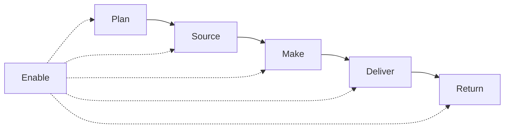

# Cadeia de suprimentos ponta a ponta — além do muro da fábrica

**Trilha:** Fundamentos e estratégia · **Módulo:** Supply Chain Management  
**Público / nível:** Intermediário — recomenda-se ter consolidado o vocabulário de logística empresarial.  
**Duração sugerida:** duas horas, se você desenhar duas cadeias diferentes (ex.: alimentar vs. autopeças) ao final.  
**Resultado de aprendizagem:** você será capaz de **descrever** a cadeia do insumo ao consumidor final com **atores**, **lead times** e **objetivos múltiplos**; **usar** a linguagem **SCOR** (Plan, Source, Make, Deliver, Return, Enable) como mapa mental sem confundir com software; **explicar** push, pull e **ponto de desacoplamento**; e **articular** conflitos típicos entre funções sem escolher “vilões”.

---

Quando alguém diz “supply chain” em tom solene, muitas vezes o desenho mental ainda é uma **caixa** com setas entrando e saindo. A SCM real é mais parecida com um **ecossistema**: fornecedores de vários *tiers*, transportadoras, armazéns próprios e de terceiros, canais on-line e físicos, **informação** que atravessa fronteiras e **dinheiro** que atravessa mais devagar que o produto. O CSCMP define SCM como planejamento e gestão de **todas** as atividades desde *sourcing* e *procurement* até a logística, incluindo coordenação com parceiros e integração oferta–demanda **dentro e entre** empresas — definição que, pela própria sintaxe, **proíbe** o muro da fábrica como limite mental.

---

## SCOR como “mapa de trilhas” (ASCM)

O modelo **SCOR** (*Supply Chain Operations Reference*) organiza processos em **Plan, Source, Make, Deliver, Return, Enable**. Você não precisa “implementar SCOR” para se beneficiar: use como **checklist de conversa**. “Onde estamos falhando em **Plan**?” muitas vezes revela que a empresa discute **capacidade** sem **forecast** honesto; “onde estamos frágeis em **Return**?” revela devolução como **desenhador de custo** invisível.

**Leitura:** *Enable* é tudo que sustenta os outros processos — dados, qualidade, risco, **gestão de parceiros**. Logística aparece forte em **Deliver** e **Return**, mas não só.

---

## Push, pull e o ponto onde a cadeia “respira”

**Push** antecipa com base em **forecast** e economias de escala; **pull** aciona reposição com base em **consumo** real ou sinal próximo do consumo. Na prática, misturas dominam. O **ponto de desacoplamento** (*decoupling point*) é onde a estratégia muda de “empurrar” para “puxar” — por exemplo, estoque de SKU semi-acabado genérico antes da personalização final (*postponement*, tema que reaparece em estratégia de produto).

**Analogia da padaria:** a fornada empurrada de manhã é **push**; o sanduíche montado sob pedido no almoço é **pull** com ingredientes semi-preparados — o desacoplamento é a **bancada** entre “massa” e “nome do cliente no copo”.

---

## Objetivos múltiplos: disponibilidade, custo, risco, capital — e a ilusão de “tudo verde”

Chopra & Meindl insistem em **trade-offs** entre *drivers*; Christopher enfatiza competição **cadeia a cadeia**. Na prática, **vendas** quer disponibilidade, **finanças** quer giro, **produção** quer estabilidade de volume, **logística** quer previsibilidade de mix. SCM não “resolve” conflitos por mágica — cria **cadência** para que conflitos apareçam como **números** e não como **lendas de corredor**.

---

## Caso longo — **MetalRio** (fictícia): insumo importado, promessa curta

**Enredo:** fabricante de componentes; insumo crítico importado com **LT 90 dias**; vendas promete **30 dias** ao cliente final para SKU acabado; CFO pressiona por **baixo capital**.

**Perguntas:** (1) onde está o **risco** concentrado? (2) que alavancas existem além de “pedir para compras comprar mais cedo”? (3) que métrica financeira simples ajuda a conversar com o conselho?

**Síntese:** sem **buffer** de MP, **segundo fornecedor** em qualificação, **postponement** de mix ou **revisão** da promessa comercial, a cadeia resolve no **premium freight** ou na **ruptura** — ambos caros, mas um deles destrói **marca**.

---

## Exercícios

1. Desenhe **duas** cadeias do mesmo setor com **gargalos** diferentes (ex.: frio vs. não frio).  
2. Defina SCM numa frase **sem** usar “empresa” como limite.  
3. Dê exemplo de otimização **local** que prejudica a cadeia.

**Gabarito:** (2) ver capítulo anterior; (3) exemplo: compras ganham bônus por lote gigante → estoque e obsolescência sobem.

---

## Referências

1. CSCMP — *What is SCM?*: https://cscmp.org/CSCMP/CSCMP/Certify/Fundamentals/What_is_Supply_Chain_Management.aspx  
2. ASCM — SCOR: https://www.ascm.org/  
3. CHOPRA, S.; MEINDL, P. *Supply Chain Management*. Pearson. https://www.pearson.com/en-us/subject-catalog/p/supply-chain-management-strategy-planning-and-operation/P200000012829  
4. CHRISTOPHER, M. *Logistics and Supply Chain Management*. Pearson, 2022. https://www.pearson.com/en-us/subject-catalog/p/logistics-and-supply-chain-management/P200000007134  
5. BOWERSOX, D. J.; et al. *Supply Chain Logistics Management*. McGraw-Hill. https://www.mheducation.com/highered/product/supply-chain-logistics-management-bowersox.html  

---

## Síntese

SCM é **rede + tempo + dados + dinheiro**; o mapa começa **fora** do muro; trade-offs são o **material** da profissão.

**Pergunta:** qual ator da sua cadeia você mais trata como “fundo pintado”?
