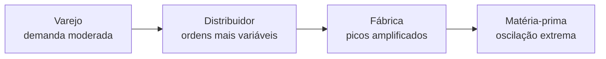

# Integração e colaboração na cadeia — quando a planilha da sexta-feira mente na segunda

## Objetivos e resultado de aprendizagem

Ao final da aula, o aluno será capaz de:

- **Identificar** pré-requisitos de colaboração interfuncional e interorganizacional.
- **Propor** uma rotina de integração com papéis, dados e cadência (RACI funcional).
- **Reconhecer** as 4 causas clássicas do efeito chicote (Lee et al.) em casos reais.
- **Diferenciar** CPFR, VMI e JMI como formatos de colaboração com fornecedor/varejo.
- **Avaliar** o papel do EDI e dos portais de fornecedor na realidade BR (varejo, indústria).

**Duração sugerida:** 60–80 min.
**Pré-requisitos:** [Aula 2.1](aula-01-cadeia-suprimentos-ponta-a-ponta.md) e [Aula 1.2](../modulo-01-fundamentos-logistica-empresarial/aula-02-fluxos-fisicos-informacao.md).

## Mapa do conteúdo

- Integração como governança de número.
- Bullwhip — fenômeno econômico, não curiosidade.
- CPFR, VMI, JMI — três formatos de colaboração.
- EDI/API e portais de fornecedor (BR).
- Retail compliance no Brasil — multas e SLAs.
- Lab numérico e caso MetalRio.

## Ponte

Conecta com [S&OP](../modulo-03-planejamento-demanda-sop/README.md) para ritual de reconciliação; com [Tecnologia e sistemas](../../trilha-tecnologia-e-sistemas/README.md) para EDI/API; com [KPIs](../modulo-04-custos-logisticos-performance/aula-03-nivel-servico-kpis-logisticos.md) para retail compliance/OTIF.

Integração não é “todo mundo se gostar”. É **governança de número**: uma versão publicada de forecast, uma política de revisão, um conjunto de exceções tratadas com dono. Sem isso, cada função otimiza **a sua** planilha — e a cadeia, que não tem planilha própria, absorve o **choque**.

---

## O bullwhip como fenômeno econômico, não como curiosidade académica

Lee, Padmanabhan e Whang, em *Information Distortion in a Supply Chain: The Bullwhip Effect* (*Management Science*, 1997, DOI `10.1287/mnsc.43.4.546`), mostraram como a variabilidade das **ordens** pode amplificar a variabilidade da **demanda** a jusante quando se sobe a cadeia. As causas clássicas: **processamento de sinal** (forecast e política de revisão), **jogo de racionamento** (pedidos inflados na escassez), **loteamento** (acumular para frete ou processamento), **variação de preço** (promoções que distorcem o padrão de compra).

**Analogia do telefone sem fio em escada:** cada andar “melhora” a história; no último andar, o monstro tem dez metros — exceto que aqui o monstro é **pedido ao fornecedor**.

---

## CPFR, VMI, JMI — três formatos com nomes diferentes

A **colaboração** entre fornecedor e cliente (varejo, indústria) tem tradição. Três formatos clássicos vale conhecer:

| Formato | Quem decide a reposição | Estoque pertence a | Quem assume custo de excesso | Casos típicos |
|---------|-------------------------|----------------------|--------------------------------|----------------|
| **CPFR** (Collaborative Planning, Forecasting and Replenishment) | Decisão **conjunta** com forecast compartilhado | Cliente após compra | Negociado | Walmart × P&G nos EUA; varejo BR × indústria de bens de consumo |
| **VMI** (Vendor Managed Inventory) | **Fornecedor** decide quando e quanto repor | Cliente (consigna ou compra na entrada) | Geralmente fornecedor (consigna) | Indústria automotiva, hospitais (medicamentos), consumibles industriais |
| **JMI** (Jointly Managed Inventory) | Comitê conjunto com regras pré-acordadas | Híbrido | Compartilhado | Cadeias maduras (varejo+CPG sofisticado) |
| **Consignação** (forma simples de VMI) | Fornecedor abastece, cliente paga ao consumir | Fornecedor até venda | Fornecedor | Drogarias, materiais de uso e consumo industrial |

**CPFR** pressupõe compartilhamento de **POS** (ponto de venda), **estoque em trânsito**, **pedidos abertos**, **calendário promocional** e **lead times** — e pressupõe **sanções** suaves ou fortes quando dados mentem. A literatura de SCM (Chopra & Meindl; Christopher) descreve o arcabouço; a vida real exige **IT** e **jurídico** alinhados (NDA, política de uso de dado, SLA de informação).

**Analogia do gerente de bar (VMI):** o cervejeiro Brahma envia caminhão semanal e **decide** quanto repor pela contagem do que sobrou; o dono do bar não precisa “fazer pedido”, mas confia ao fornecedor a decisão. Ganha-se em frequência, perde-se em controle. **Quando NÃO usar VMI:** insumo crítico para diferenciação, fornecedor sem maturidade de dados, ou sem SLA contratual de OTIF.

---

## EDI, API e portais — a infraestrutura da integração no Brasil

**EDI** (Electronic Data Interchange) ainda é dominante em **varejo grande** e **automotivo**: Walmart, Carrefour, GPA, Atacadão, Assaí esperam que o fornecedor troque mensagens em padrões como **EDIFACT** (internacional) ou **VDA** (automotivo) — no Brasil, frequentemente intermediado por **VANs** como **Neogrid**, **Nimbi**, **Mercado Eletrônico**, **Soluti** ou pelo padrão **EANCOM**.

Mensagens EDI clássicas:

- **ORDERS / 850:** pedido do varejo ao fornecedor.
- **DESADV / 856 (ASN):** aviso de embarque do fornecedor.
- **INVOIC / 810:** fatura.
- **RECADV / 861:** aviso de recebimento.

**APIs REST/JSON** ganham espaço, especialmente entre **e-commerce** e **3PL/marketplace** (Mercado Livre, Magalu, Amazon BR, Shopee). A diferença pedagógica importa pouco; o que importa é que **mensagem mal mapeada = pedido errado, fatura errada, multa**. Empresas que integram com Walmart, GPA e Carrefour conhecem bem o **scorecard de qualidade EDI** (% mensagens com erro, tempo de envio do ASN antes da chegada, etc.).

**Portais de fornecedor** (Ariba, Coupa, Mercado Eletrônico, Nimbi) são versão "leve" do EDI para fornecedores menores, com login web — viáveis quando a frequência não justifica integração full.

---

## Retail compliance no Brasil — quando colaboração vira multa

Os grandes varejistas brasileiros operam scorecards de fornecedor com **multas pesadas** por descumprimento. Exemplos públicos (políticas variam por contrato):

- **GPA / Carrefour / Atacadão / Walmart Brasil (hoje Grupo Big/Carrefour):** multas de **2% a 10%** sobre o valor da nota fiscal por **atraso**, **entrega incompleta**, **avaria**, **falta de paletização**, **etiquetagem fora do padrão**, **ASN ausente** ou **fora do prazo**.
- **OTIF mínimo contratual** geralmente em **95–98%** mensal; abaixo disso, escala-se para multas progressivas.
- **Janela de recebimento** estreita (CDs do varejo recebem em janelas de 2 horas; chegar **fora** — antes ou depois — gera multa por reagendamento).

> **Observação:** os percentuais e regras variam por contrato e por varejista; aqui são **ordens de grandeza** baseadas em práticas amplamente discutidas em fóruns como **ABRAS**, **ABRALOG** e **GS1 Brasil**. Sempre consulte o contrato vigente.

A colaboração CPFR, VMI ou simples **portal de fornecedor + EDI** é o que **previne** essas multas. Sem visibilidade compartilhada, o fornecedor descobre que falhou no **boleto da multa**, não no **alerta operacional**.

---

## Laboratório numérico — o lote como amplificador

Use a série de demanda ao varejo: 100, 105, 95, 110 (semanal). Compare **Regra A** (pedido = média móvel de ordem 3) com **Regra B** (pedidos em lotes de 300). Calcule a amplitude dos pedidos ao distribuidor. **Leia o resultado como narrativa:** “economizei processamento” pode ser “inflamei o fornecedor”.

---

## Caso — duas verdades do forecast (MetalRio de novo)

Vendas crê em **+18%** YoY; operações crê em **+8%** de capacidade instalada. Sem **Pré-S&OP**, isso vira **dois** pedidos de matéria-prima diferentes na cabeça de dois compradores. A integração aqui é **ritual + número único**, não “mais uma ferramenta”.

---

## RACI funcional — quem faz o quê em integração

| Atividade | Vendas | Compras | Logística | Plan/S&OP | TI | Fiscal |
|-----------|--------|---------|-----------|-----------|----|---------|
| Calendário promocional | **R/A** | C | I | C | I | I |
| Forecast consensual | C | I | I | **R/A** | I | I |
| Compartilhamento POS com fornecedor | C | C | I | **R/A** | C | I |
| Integração EDI/API | I | C | C | I | **R/A** | C |
| ASN no prazo | I | I | **R/A** | C | C | I |
| Manifestação SEFAZ pelo destinatário | I | I | C | I | C | **R/A** |
| Score retail compliance | C | C | **R/A** | C | I | I |

R = Responsável; A = Aprovador; C = Consultado; I = Informado.

---

## O que vira dado no sistema

| Conceito | Onde fica | Quem mantém |
|----------|-----------|-------------|
| Forecast consensual | Módulo APS / planilha versionada | Plan/S&OP |
| POS compartilhado | EDI 852 / portal fornecedor | TI + Comercial |
| Calendário promocional | ERP comercial + APS | Marketing/Vendas |
| ASN | EDI 856 / DESADV / NF-e | Logística/TI |
| Score retail | Portal varejo + BI interno | Comercial + Logística |
| Política de devolução | Cláusula contrato + ERP | Jurídico + Comercial |

---

## KPIs e decisão (kit mínimo)

| KPI | Pergunta | Dono | Fonte | Cadência | Playbook |
|-----|----------|------|-------|----------|----------|
| **Aderência ao plano** (% volume realizado vs. publicado) | O plano vale algo? | S&OP | ERP/APS | Mensal | < 90% → revisão de processo |
| **Forecast accuracy / WMAPE** por família | Sabemos prever? | Plan | APS | Mensal | Decompor em viés + erro |
| **Frequência de re-planejamento** | Quão volátil o curto prazo? | S&OP | PMO | Mensal | > 2/mês = sintoma de gap S&OP |
| **CV das ordens vs. CV da demanda** (proxy de bullwhip) | Estamos amplificando? | Plan | ERP | Trimestral | Política de lote, smoothing |
| **Score de retail compliance** (varejo) | Estamos no “verde” do parceiro? | Comercial + Log | Portal varejo | Mensal | A3 sobre top 3 falhas |
| **% mensagens EDI com erro** | Integração sangra? | TI + Logística | Plataforma EDI | Semanal | Top causas → correção raiz |
| **Tempo médio entre POS e reposição** | Cadeia respira no ritmo do consumo? | Plan | EDI 852 + ERP | Mensal | Reduzir = menos bullwhip |

---

## Ferramentas e tecnologias relevantes

| Necessidade | Pode começar em | Cresce para | Quando NÃO usar |
|-------------|-----------------|-------------|------------------|
| EDI BR | VAN básica (Neogrid Class, Nimbi) | EDI completo + monitoramento (Neogrid, Mercado Eletrônico, Soluti) | Volume baixíssimo — portal resolve |
| Portal de fornecedor | Login web simples | SAP Ariba, Coupa, Oracle Procurement | Sem catálogo de fornecedor formal |
| Forecast colaborativo | Excel compartilhado | Anaplan, o9, SAP IBP, Demand Solutions | Sem dado limpo de POS |
| VMI | Planilha + reposição manual | Módulo VMI no APS + integração estoque cliente | Insumo crítico estratégico |

---

## Erros comuns

- Tratar EDI como “projeto de TI” sem **dono de negócio**.
- Usar VMI sem **acordo de SLA** (risco vira do fornecedor sem poder).
- Compartilhar POS sujo (sem reconciliação) — o ruído amplia decisões erradas.
- Ignorar **scorecard de varejo** até a multa chegar no boleto.
- **Pré-S&OP** sem dados → vira reunião política.

---

## Exercícios

1. Mapeie cada causa de Lee et al. a um episódio real (anonimizado) da sua experiência.
2. Liste **cinco** dados mínimos para CPFR entre varejista e fornecedor.
3. **Caso BR:** sua empresa fornece para o GPA e tem OTIF mensal de 89% (limite contratual 95%). Multas projetadas: R$ 350.000 no trimestre. Proponha um **plano de 90 dias** com 5 ações concretas (operacionais, de informação e de relacionamento).
4. Diferencie em **uma frase** cada um: CPFR, VMI, JMI, Consignação.

**Gabarito:** (2) POS limpo, estoque em trânsito, pedidos abertos, promoções, LT, fill rate histórico, política de devolução — escolha cinco e justifique. (3) ações típicas: integrar ASN antes da chegada; revisar política de paletização para evitar multa de "fora do padrão"; rever janelas de coleta com transportador; comitê semanal com comprador do GPA; ABC dos motivos de falha com PDCA. (4) CPFR: forecast e reposição **conjuntos**; VMI: **fornecedor decide** reposição; JMI: comitê com regras pré-acordadas; Consignação: estoque do **fornecedor** no cliente até venda.

---

## Glossário express

- **Bullwhip:** amplificação de variabilidade das ordens a montante (Lee et al., 1997).
- **CPFR:** *Collaborative Planning, Forecasting and Replenishment*.
- **VMI / JMI:** *Vendor / Jointly Managed Inventory*.
- **EDI:** Electronic Data Interchange — troca estruturada de mensagens.
- **ASN / DESADV / 856:** aviso de embarque eletrônico.
- **POS / 852:** dado de ponto de venda compartilhado pelo varejo.
- **Retail compliance:** conformidade com as regras do varejo cliente (multas e SLAs).
- **VAN:** *Value Added Network* — operadora de EDI (no BR: Neogrid, Nimbi, Soluti, Mercado Eletrônico).
- **Scorecard de fornecedor:** painel de KPIs do varejo sobre o fornecedor.

---

## Referências

1. LEE, H. L.; PADMANABHAN, V.; WHANG, S. (1997). *Information Distortion in a Supply Chain: The Bullwhip Effect*. *Management Science*, 43(4). https://doi.org/10.1287/mnsc.43.4.546
2. CHOPRA, S.; MEINDL, P. *Supply Chain Management*. Pearson.
3. CHRISTOPHER, M. *Logistics and Supply Chain Management*. Pearson, 2022.
4. CSCMP — Glossário: https://cscmp.org/CSCMP/cscmp/educate/scm_definitions_and_glossary_of_terms.aspx
5. ASCM — CPIM: https://www.ascm.org/learning-development/certifications-credentials/cpim/
6. VICS — *CPFR Guidelines* (legacy, GS1 / VICS): https://www.gs1.org/standards
7. GS1 Brasil — padrões de identificação, EDI e ASN: https://gs1br.org/
8. ABRAS — Associação Brasileira de Supermercados: https://www.abras.com.br/
9. ABRALOG — Associação Brasileira de Logística: https://www.abralog.com.br/
10. Neogrid — papers e cases sobre integração varejo-indústria no BR: https://www.neogrid.com/

---

## Síntese

Integração é **sistema**; bullwhip é **sinal**; CPFR/VMI/JMI são **contratos de dados** com governança. No Brasil, o varejo cobra a colaboração via **multa contratual** — quem entende isso não terceiriza para “TI”.

**Pergunta:** qual número hoje tem **três versões** vivas na sua empresa?

---

## Pontes para outras trilhas

- [Trilha Tecnologia e Sistemas](../../trilha-tecnologia-e-sistemas/README.md) — EDI, API, integrações.
- [Trilha Logística Estratégica](../../trilha-logistica-estrategica/README.md) — SRM, gestão de relacionamento.
- [Trilha Melhoria Contínua](../../trilha-melhoria-continua-e-processos/README.md) — A3 sobre causas de bullwhip.
