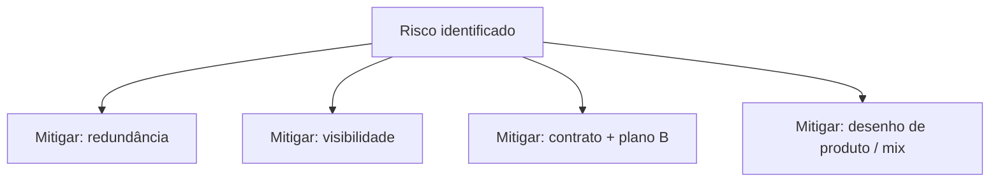

# Riscos, resiliência e sustentabilidade na SCM — a cadeia que não cabe no Excel enxuto

**Trilha:** Fundamentos e estratégia · **Módulo:** Supply Chain Management  
**Público / nível:** Intermediário — pressupõe mapa de cadeia e nocão de trade-offs.  
**Duração sugerida:** duas horas, se você escrever um mapa de riscos completo para um produto real.  
**Resultado de aprendizagem:** você será capaz de **tipificar** riscos da cadeia, **comparar** mitigações (buffer, *dual sourcing*, *postponement*, nearshoring, continuidade digital), **articular** o dilema **eficiência vs. resiliência** sem slogans, e **ligar** decisões logísticas a **ESG operacional** mensurável — distinto de marketing verde.

---

Resiliência virou palavra de moda após choques globais. Em logística, ela custa **dinheiro real**: segundo fornecedor qualificado, estoque de posição, contrato com SLA caro, **simulações** que ocupam horas de diretoria. **Eficiência enxuta** ainda é desejável — o erro é acreditar que “enxuto” significa “zero redundância” em **SKU crítico** ou **rota única** para sempre.

---

## Tipologia de riscos — uma colcha de retalhos que precisa de dono

Risco **físico** (porto, ponte, clima), **de concentração** (*single source*, geografia única), **cibernético** (TMS/WMS fora do ar), **regulatório** (sanções, mudança fiscal que altera modal), **reputacional** (condições na cadeia, emissões não contabilizadas). Christopher e Chopra & Meindl tratam risco e sustentabilidade com crescente peso nas edições recentes — aqui, pense como **inventário de vulnerabilidades** com **probabilidade** e **impacto**, mesmo que qualitativos no início.

---

## ESG como conta operacional, não como pôster

**Ton.km**, **empty miles**, devoluções, embalagem, desperdício de temperatura-controlado — tudo isso conversa com **custo** e com **licença social para operar**. Os ODS da ONU (https://www.un.org/sustainabledevelopment/) são **quadro de linguagem** útil para alinhar com investidores e comunidades; não substituem **política corporativa** nem **compliance** local.

**Analogia da frota de ônibus elétrico vs. diesel:** o elétrico pode subir **capex** e exigir **infra**; o diesel pode subir **custo de carbono regulado** e **imagem**. A “melhor” escolha depende do **horizonte** e do **preço da carbono** que a empresa acredita — ou seja, é decisão, não estética.

---

## Debate — motion

“Aceitar +5% de custo logístico médio por +20% de resiliência operacional.” Escreva **três** argumentos a favor e **três** contra; depois defina **uma** métrica de resiliência mensurável (ex.: tempo máximo de recuperação após falha tipo X).

---

## Exercícios

1. Defina **resiliência** em uma frase operacional.  
2. Dê dois exemplos de **greenwashing logístico** a evitar.

**Gabarito:** (1) exemplo: “restabelecer OTIF mínimo contratual após choque tipo porto fechado em ≤ Y semanas com custo incremental ≤ Z”. (2) “neutro carbono” sem fronteira de sistema; médias globais que escondem rotas sujas.

---

## Referências

1. CHRISTOPHER, M. *Logistics and Supply Chain Management*. Pearson, 2022. https://www.pearson.com/en-us/subject-catalog/p/logistics-and-supply-chain-management/P200000007134  
2. CHOPRA, S.; MEINDL, P. *Supply Chain Management*. Pearson. https://www.pearson.com/en-us/subject-catalog/p/supply-chain-management-strategy-planning-and-operation/P200000012829  
3. ONU — ODS: https://www.un.org/sustainabledevelopment/  
4. GARTNER — *Supply Chain Risk Management*: https://www.gartner.com/en/supply-chain/topics/supply-chain-risk-management  
5. CSCMP — Glossário: https://cscmp.org/CSCMP/cscmp/educate/scm_definitions_and_glossary_of_terms.aspx  

---

## Síntese

Risco é **lista viva**; resiliência é **desenho pago**; ESG é **métrica** ou não é.

**Pergunta:** qual é o seu **single point of failure** hoje?
