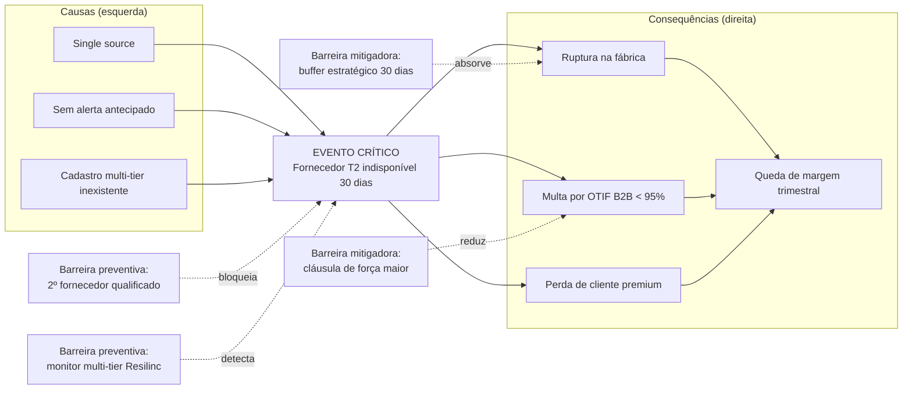
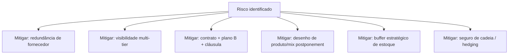

# Riscos, resiliência e sustentabilidade na SCM — a cadeia que não cabe no Excel enxuto

## Objetivos e resultado de aprendizagem

Ao final da aula, o aluno será capaz de:

- **Classificar** riscos de cadeia em uma tipologia útil (físico, concentração, ciber, regulatório, reputacional, climático).
- **Priorizar** mitigações por **impacto × probabilidade × velocidade de detecção** (matriz e bowtie).
- **Discutir** sustentabilidade como requisito operacional e reputacional, não só pôster.
- **Conhecer** o GHG Protocol (Scope 1/2/3) aplicado ao transporte e logística.
- **Identificar** regulações relevantes para a cadeia BR e global (CBAM EU, EUDR, Lei Climática BR, MapBiomas, ICMM mineração).

**Duração sugerida:** 70–85 min.
**Pré-requisitos:** Aulas 2.1 e 2.2.

## Mapa do conteúdo

- Tipologia de riscos na cadeia.
- Matriz de risco e diagrama bowtie (causa–evento–consequência).
- Resiliência: buffer, redundância, postponement e governança.
- Casos reais BR e globais (greve caminhoneiros 2018, COVID, canal de Suez, geadas no café).
- Sustentabilidade — GHG Protocol, Scope 1/2/3, CBAM, EUDR.
- Tomada de decisão sob incerteza (cenários + stress test).
- KPIs ESG operacionais.

## Ponte

Conecta com [Logística estratégica — SRM e risco](../../trilha-logistica-estrategica/README.md), com [Integração e colaboração](aula-02-integracao-colaboracao-cadeia.md) e com [Custos](../modulo-04-custos-logisticos-performance/aula-01-estrutura-custos-logisticos.md) para precificar resiliência.

Resiliência virou palavra de moda após choques globais. Em logística, ela custa **dinheiro real**: segundo fornecedor qualificado, estoque de posição, contrato com SLA caro, **simulações** que ocupam horas de diretoria. **Eficiência enxuta** ainda é desejável — o erro é acreditar que “enxuto” significa “zero redundância” em **SKU crítico** ou **rota única** para sempre.

**Analogia do bombeiro × seguro:** ninguém quer pagar **seguro** que “nunca foi usado”; mas quem dispensou pagou caro um dia. Resiliência é **prêmio de seguro** — explícito, com cláusulas, com pagamento previsível. A frustração comum é que executivos só **percebem** o valor da resiliência **depois** do choque. O trabalho do líder de SCM é **antecipar** com matemática, não com retórica.

---

## Tipologia de riscos — uma colcha de retalhos que precisa de dono

Risco **físico** (porto, ponte, clima), **de concentração** (*single source*, geografia única), **cibernético** (TMS/WMS fora do ar, ransomware), **regulatório** (sanções, mudança fiscal, CBAM, EUDR), **reputacional** (condições na cadeia, emissões não contabilizadas, trabalho análogo à escravidão), **climático crônico** (mudança de regime de chuva, secas que reduzem hidrovias, calor extremo afetando perecíveis). Christopher e Chopra & Meindl tratam risco e sustentabilidade com crescente peso nas edições recentes — aqui, pense como **inventário de vulnerabilidades** com **probabilidade** e **impacto**, mesmo que qualitativos no início.

| Categoria | Exemplo | Detecção típica | Mitigação base |
|-----------|---------|------------------|------------------|
| Físico/clima | Enchente em Santos, geada em Minas (café), seca no Rio Negro (logística amazônica) | Monitoramento meteorológico + alertas ANTAQ/Marinha | Rota alternativa, hub backup |
| Concentração | Único fornecedor de chip, único porto de saída | Mapeamento multi-tier | Multi-sourcing, China+1, Vietnam+1 |
| Cibernético | Ransomware no TMS (caso JBS 2021, Renner 2021) | SOC + SIEM + auditoria | Backup imutável, plano de continuidade, segregação de redes |
| Regulatório | CBAM (Carbon Border Adjustment EU), EUDR (Anti-deforestation), sanções OFAC | Inteligência regulatória | Compliance officer + automação documental |
| Reputacional/social | Trabalho escravo na cadeia (Lista Suja MTE), denúncia ONG | Auditoria social, Sedex/Smeta | Due diligence, código de conduta com auditoria |
| Climático crônico | Mudança de regime de chuva afetando hidrovias | Modelo IPCC + IBGE + INPE | Diversificação modal, climate adaptation plan |
| Geopolítico | Guerra Rússia–Ucrânia (gás, fertilizantes, grãos), Mar Vermelho 2024 (Houthis) | Inteligência política, S&OP estendido | Estoque estratégico, hedging |

### Diagrama bowtie — causa, evento, consequência

**Leitura:** o **bowtie** (gravata-borboleta) é ferramenta clássica de **gestão de risco operacional** (origem na indústria petroquímica, Shell, anos 90). À esquerda, **causas**; ao centro, **evento crítico**; à direita, **consequências**. As **barreiras preventivas** (esquerda) reduzem **probabilidade**; as **mitigadoras** (direita) reduzem **impacto**. Cada barreira é um **investimento explícito**.

---

## Casos reais — Brasil e mundo

| Evento | Setor | Lição |
|--------|-------|-------|
| **Greve dos caminhoneiros, BR, mai/2018** (~10 dias) | Transporte rodoviário (que move ~65% das cargas BR) | Dependência de modal único é vulnerabilidade sistêmica; **Lei do Caminhoneiro** e **Tabela ANTT de Frete Mínimo** nasceram daí |
| **COVID-19, 2020–2022** | Global (chips, contêineres, EPI) | Lead times explodiram; nasceu *China + 1* como prática |
| **Encalhe Ever Given no Canal de Suez, mar/2021** (6 dias) | Marítimo global | 12% do comércio mundial parou; valor segurado: ~US$ 1 bi |
| **Ataque ransomware JBS, mai/2021** | Frigorífico global | Frigoríficos pararam por dias; pagamento de ~US$ 11 milhões em Bitcoin |
| **Geadas no Brasil, jul/2021** | Café arábica | Preço subiu ~50%; safras 2022/23 comprometidas |
| **Seca no Rio Negro, set–nov/2023 e 2024** | Logística amazônica | Manaus quase isolada; carga rodada por aérea (custo 6–10x) |
| **Crise no Mar Vermelho (Houthis), 2024** | Marítimo Ásia-Europa | Rotas redirecionadas pelo Cabo da Boa Esperança (+10–14 dias, +20% custo) |
| **Tarifaço/sanções comerciais 2018–2025** | Eletrônica, aço, agronegócio | Tarifas reescrevem mapas de sourcing |

---

## Resiliência: as quatro alavancas com preço

| Alavanca | O que faz | Custo típico | Quando vale |
|----------|-----------|--------------|-------------|
| **Redundância** (multi-source, multi-CD) | Reduz prob. de evento | Mais cadastro, mais negociação, possivelmente mais custo unitário | Insumos críticos, cadeias globais expostas |
| **Buffer** (estoque, capacidade ociosa) | Absorve impacto | Capital + obsolescência + espaço | SKUs vital, lead time longo |
| **Visibilidade** (monitoring multi-tier) | Detecta cedo | Plataforma + dado + governança | Cadeias complexas, exposição reputacional |
| **Flexibilidade** (postponement, modal alternativo, contrato spot) | Reage rápido | Investimento em desenho de produto e contratos | Demanda volátil, mix amplo |

> **Heurística pedagógica:** uma cadeia "100% enxuta" é frágil; "100% redundante" é insolvente. A pergunta certa é: **quanto pagamos para reduzir o risco X em Y%?** — e essa pergunta deve aparecer no S&OP, não só na crise.

---

## ESG como conta operacional, não como pôster

**Ton.km**, **empty miles**, devoluções, embalagem, desperdício de temperatura-controlado — tudo isso conversa com **custo** e com **licença social para operar**. Os ODS da ONU (https://www.un.org/sustainabledevelopment/) são **quadro de linguagem** útil para alinhar com investidores e comunidades; não substituem **política corporativa** nem **compliance** local.

**Analogia da frota de ônibus elétrico vs. diesel:** o elétrico pode subir **capex** e exigir **infra**; o diesel pode subir **custo de carbono regulado** e **imagem**. A “melhor” escolha depende do **horizonte** e do **preço da carbono** que a empresa acredita — ou seja, é decisão, não estética.

### GHG Protocol — Scope 1, 2, 3 aplicado à logística

O **GHG Protocol** ([ghgprotocol.org](https://ghgprotocol.org/)) é o padrão global de inventário de emissões. Para logística:

| Scope | Origem das emissões | Exemplo logístico | Responsável típico |
|-------|---------------------|-------------------|---------------------|
| **Scope 1** | Emissões **diretas** (fontes próprias controladas) | Frota própria a diesel, geradores, GLP de empilhadeiras | Operações |
| **Scope 2** | Emissões **indiretas** de energia comprada | Eletricidade de CDs, climatização de câmaras frias | Facilities |
| **Scope 3** | Emissões **indiretas** na cadeia (upstream + downstream) | Frete contratado (3PL), viagens corporativas, embalagem, fim de vida do produto, devoluções | SCM + Sustentabilidade |

> **Detalhe crítico:** para a maioria das empresas, **Scope 3** representa **70–90%** do total de emissões — e **frete contratado** + **embalagem** são as maiores parcelas para empresas logísticas. Métodos de cálculo padronizados existem (EN 16258 europeia, GLEC Framework do **Smart Freight Centre**); usar para defender narrativa interna e externa é sinal de maturidade.

### Regulação climática que afeta a logística (2025+)

- **EU CBAM** (*Carbon Border Adjustment Mechanism*) — tarifa de carbono na fronteira da UE para aço, alumínio, fertilizantes, cimento, hidrogênio, eletricidade. Em vigor desde 2023 (transição) e cobrança financeira a partir de 2026. **Impacto BR:** exportadores de **aço (CSN, Gerdau, Usiminas)** e **alumínio (CBA, Albras)** já calculam emissões para certificação.
- **EU EUDR** (*EU Deforestation Regulation*) — proíbe importação na UE de soja, café, cacau, carne, óleo de palma, borracha, madeira que tenham vindo de áreas desmatadas após 31/dez/2020. Exige **geolocalização da fazenda** + **due diligence**. Aplicação plena a partir de 30/dez/2025 (postergada). **Impacto BR:** transformou processo de **rastreabilidade** em **critério comercial obrigatório** para o agronegócio exportador.
- **Brasil — Lei 12.187/2009 (Política Nacional sobre Mudança do Clima)** + **Plano ABC+** + **Mercado de Carbono regulado (Lei 15.042/2024)** — empresas com emissões > 25.000 tCO₂e/ano terão obrigações de reporte e potencialmente compra/venda de créditos.
- **Mineração — ICMM** (International Council on Mining and Metals) e **GRI Mining Sector Standard** — padrões de reporte para Vale, Anglo American, CSN Mineração.
- **Agro — MapBiomas + INPE PRODES/DETER** — bases públicas de monitoramento de uso do solo, usadas em due diligence de cadeia agro.

### Greenwashing a evitar — checklist crítico

- "Carbono neutro" sem **fronteira de sistema** declarada (qual scope?).
- **Off-set** em projetos sem certificação reconhecida (Verra, Gold Standard).
- Médias globais que escondem rotas/produtos sujos.
- Embalagem "sustentável" sem **análise de ciclo de vida**.
- Frota elétrica sem cálculo do scope 2 da matriz energética (no BR, ~85% da matriz é renovável; em outros países, eletricidade vem do carvão e a comparação muda).

---

## Debate — motion

“Aceitar +5% de custo logístico médio por +20% de resiliência operacional.” Escreva **três** argumentos a favor e **três** contra; depois defina **uma** métrica de resiliência mensurável (ex.: tempo máximo de recuperação após falha tipo X).

---

## KPIs e decisão (kit mínimo)

| KPI | Pergunta que responde | Dono | Fonte | Cadência | Playbook de ação |
|-----|------------------------|------|-------|----------|-------------------|
| **% receita com fornecedores únicos / 'single source'** | Qual exposição de concentração? | Procurement + SCM | ERP compras | Trimestral | Plano de qualificação de 2º fornecedor |
| **MTTR após incidente** (Mean Time To Restore) | Quão rápido voltamos? | SCM + TI | Pós-mortem | Por incidente | Reduzir < SLA crítico |
| **OTIF sob contingência** vs. baseline | Quanto a resiliência sustenta? | Logística | TMS+ERP | Por evento | Stress test trimestral |
| **% volume com plano B contratado** | Cobertura de fall-back | Logística | TMS contratos | Trimestral | Negociar capacidade de pico |
| **gCO₂eq / ton.km** | Intensidade de carbono no transporte | Sustentabilidade + Log | TMS + GLEC framework | Trimestral | Otimizar carga, modal cleaner |
| **% embalagem reciclável/retornável** | ESG operacional | Operações | ERP/WMS | Mensal | Programa de retorno + parcerias |
| **% volume com rastreabilidade EUDR/CBAM** (quando aplicável) | Compliance regulatório | Compliance + SCM | ERP+plataforma | Mensal | 100% obrigatório para certas cadeias |
| **# de fornecedores em Lista Suja MTE / com não-conformidade social** | Risco reputacional | Procurement + Compliance | TST/MTE + auditoria | Trimestral | Bloqueio imediato + plano de remediação |

---

## Ferramentas e tecnologias relevantes

| Necessidade | Pode começar em | Cresce para | Quando NÃO usar |
|-------------|-----------------|-------------|------------------|
| Mapeamento de risco | Excel + matriz P×I | Resilinc, Interos, EverstreamAI, Riskmethods | Cadeia simples sem exposição |
| Visibilidade multi-tier | Diretório de fornecedores | Sourcemap, Resilinc Multi-Tier | Sem volume crítico fora de T1 |
| Inventário de carbono | Planilha + GLEC | Sustainability cloud (SAP, Salesforce Net Zero, Watershed) | Sem dado de fonte limpo |
| Conformidade EUDR | Mapa de origem | Solidaridad, Trase, plataformas de geolocalização agro | Não exporta para EU |
| Plano de continuidade | Documento Word | BCMS ISO 22301 com Sistema (Fusion, MetricStream) | Sem simulação periódica |
| Cyber resilience logístico | EDR básico | SOC 24x7 + SIEM + segregação OT/IT | Operação muito pequena |

---

## Erros comuns

- "Resiliência" sem **número** (apenas adjetivo).
- ESG só no **relatório anual**, não no **scorecard de fornecedor**.
- Plano de continuidade que ninguém **testou** nos últimos 12 meses.
- Tratar **cyber** como problema de TI, não de cadeia.
- Calcular **só Scope 1+2** quando Scope 3 é 80% das emissões.
- Confundir **certificado de origem** com **rastreabilidade EUDR-compliant**.

---

## Exercícios

1. Defina **resiliência** em uma frase operacional **com números**.
2. Dê dois exemplos de **greenwashing logístico** a evitar.
3. **Caso BR:** sua empresa exporta café para Hamburgo. A EUDR entra em vigor pleno em dez/2025. Liste **quatro** ações concretas para garantir compliance e os respectivos **donos**.
4. **Diagrama bowtie:** elabore um bowtie para o evento "Ataque ransomware no TMS por 5 dias", com pelo menos 3 causas, 4 consequências, 2 barreiras preventivas e 2 mitigadoras.
5. **Trade-off explícito:** sua empresa pode reduzir 18% do custo logístico fechando 2 de 5 CDs. Liste 3 riscos novos que isso introduz e como mitigá-los.

**Gabarito:** (1) exemplo: "restabelecer OTIF mínimo contratual de 95% após choque tipo porto de Santos fechado por 7 dias em ≤ 14 dias úteis com custo incremental ≤ 8% do custo logístico mensal". (2) "neutro carbono" sem fronteira de sistema; médias globais que escondem rotas sujas; offsets em projetos sem certificação reconhecida. (3) (a) levantamento de **geolocalização** das fazendas fornecedoras — Procurement; (b) due diligence anti-desmatamento (cruza com PRODES/MapBiomas) — Compliance; (c) sistema de rastreabilidade lote-a-lote da fazenda ao porto — TI + Logística; (d) negociação contratual com cooperativas/exportadores incluindo cláusulas de compliance — Jurídico + Comercial.

---

## Glossário express

- **Bowtie:** ferramenta de gestão de risco que mapeia causas, evento crítico, consequências e barreiras.
- **MTTR / MTBF:** *Mean Time To Restore* / *Mean Time Between Failures*.
- **Single point of failure (SPOF):** ponto cuja falha derruba o sistema todo.
- **Multi-tier visibility:** mapeamento de fornecedores além de Tier 1.
- **GHG Protocol Scope 1/2/3:** classificação de emissões por origem.
- **CBAM:** Carbon Border Adjustment Mechanism (UE).
- **EUDR:** EU Deforestation Regulation.
- **GLEC:** *Global Logistics Emissions Council Framework* (Smart Freight Centre).
- **BCMS / ISO 22301:** sistema de gestão de continuidade de negócios.
- **ESG:** Environmental, Social, Governance.

---

## Referências

1. CHRISTOPHER, M. *Logistics and Supply Chain Management*. Pearson, 2022.
2. CHOPRA, S.; MEINDL, P. *Supply Chain Management*. Pearson.
3. ONU — ODS: https://www.un.org/sustainabledevelopment/
4. GARTNER — *Supply Chain Risk Management*: https://www.gartner.com/en/supply-chain/topics/supply-chain-risk-management
5. CSCMP — Glossário: https://cscmp.org/CSCMP/cscmp/educate/scm_definitions_and_glossary_of_terms.aspx
6. SHEFFI, Y. *The Resilient Enterprise* (MIT Press) e *The Power of Resilience* — clássicos modernos. https://sheffi.mit.edu/
7. GHG PROTOCOL — *Corporate Standard* + *Scope 3 Standard*: https://ghgprotocol.org/
8. SMART FREIGHT CENTRE — *GLEC Framework* (logística): https://smartfreightcentre.org/en/about-glec/
9. UNIÃO EUROPEIA — *CBAM*: https://taxation-customs.ec.europa.eu/carbon-border-adjustment-mechanism_en
10. UNIÃO EUROPEIA — *EUDR*: https://environment.ec.europa.eu/topics/forests/deforestation/regulation-deforestation-free-products_en
11. MapBiomas Brasil: https://mapbiomas.org/
12. INPE — Programa PRODES e DETER: https://terrabrasilis.dpi.inpe.br/
13. ICMM — *Mining Principles*: https://www.icmm.com/
14. MIT CTL — pesquisa em resiliência: https://ctl.mit.edu/research/resilient-supply-chain
15. Lei 15.042/2024 — *Mercado Brasileiro de Redução de Emissões* (SBCE): https://www.in.gov.br/

---

## Síntese

Risco é **lista viva** com matriz e bowtie; resiliência é **desenho pago** com 4 alavancas (redundância, buffer, visibilidade, flexibilidade); ESG é **métrica** ou não é. No Brasil, a logística sente clima (chuva, seca, geada), greve de transporte e cibernético; lá fora, geopolítica e regulação climática (CBAM, EUDR) reescrevem mapas comerciais.

**Pergunta:** qual é o seu **single point of failure** hoje — e quanto custou o último choque que ele causou?

---

## Pontes para outras trilhas

- [Trilha Logística Estratégica](../../trilha-logistica-estrategica/README.md) — SRM, *network design* resiliente.
- [Trilha Tecnologia e Sistemas](../../trilha-tecnologia-e-sistemas/README.md) — cybersecurity em OT/IT logístico.
- [Trilha Dados e Analytics](../../trilha-dados-analytics-logistica/README.md) — dashboards de risco, scenario planning.
- [Trilha Melhoria Contínua](../../trilha-melhoria-continua-e-processos/README.md) — pós-mortem e A3 sobre incidentes.
