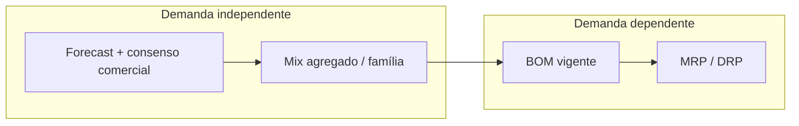
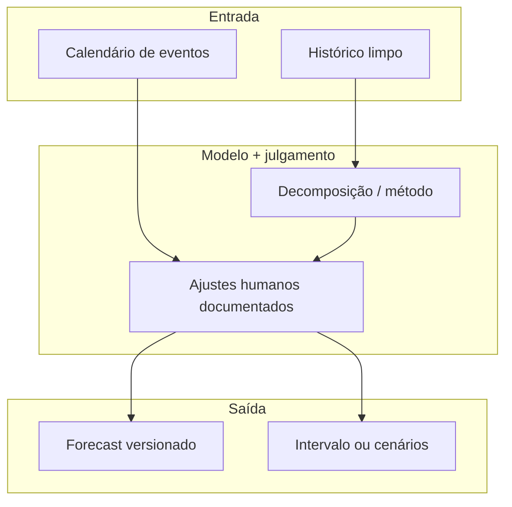
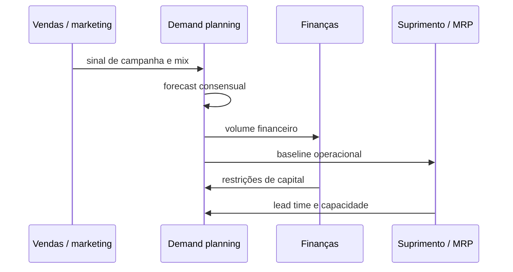

# Previsão de demanda e métodos básicos — o número que não é promessa, é hipótese com prazo de validade

## Objetivos e resultado de aprendizagem

Ao final da aula, o aluno será capaz de:

- **Explicar** previsão como **hipótese com erro mensurável**, não como verdade.
- **Diferenciar** demanda independente vs. dependente (fronteira com MRP).
- **Comparar** métodos básicos (naive, média móvel, suavização exponencial, Croston).
- **Interpretar** métricas de erro (MAD, MAPE, WMAPE, RMSE, viés) sem sucumbir ao MAPE bonito.
- **Reconhecer** padrões sazonais brasileiros (Black Friday, Dia das Mães, Páscoa, Natal, sazonalidade agro).
- **Definir** governança de revisão e granularidade adequada por horizonte de decisão.

**Duração sugerida:** 80–100 min (com lab numérico).
**Pré-requisitos:** Aulas do Módulo 1 e 2; familiaridade com tabela de Excel/Sheets.

## Mapa do conteúdo

- Forecast como hipótese (não como culpa).
- Demanda independente × dependente.
- Limpeza do histórico (ruptura, push, promoção).
- Métodos básicos e família ETS.
- Demanda intermitente — Croston.
- Métricas de erro — MAD, MAPE, WMAPE, RMSE, sMAPE, viés.
- Sazonalidade brasileira concreta.
- Granularidade × horizonte.
- Decomposição mental.
- Handoff para S&OP/MRP.
- Lab numérico TechLar.

## Ponte

Conecta com [S&OP](aula-03-sop-processo-alinhamento.md) para reconciliação mensal; com [MRP](aula-02-mrp-explosao-necessidades.md) para a parte dependente; com [Dados e Analytics](../../trilha-dados-analytics-logistica/README.md) para implementação técnica de modelos.

Há empresas em que o forecast virou **instrumento de culpa**: na segunda-feira, alguém aponta para uma célula e pergunta “por que errou?”, como se erro fosse **vício** e não **propriedade** do problema. A tradição acadêmica e profissional séria — a que você encontra em *Forecasting: Principles and Practice*, de Hyndman e Athanasopoulos (OTexts, https://otexts.com/fpp3/) — trata previsão com a mesma sobriedade com que trata **controle de qualidade**: define método, estima erro, documenta suposições, revisa. Esta aula não substitui o livro; dá **linguagem** para você conversar com operações, finanças e comercial sem confundir **precisão estética** com **decisão robusta**.

Usaremos de novo a **TechLar** (e-commerce fictício de utilidades, CD no interior, campanhas agressivas). Sempre que aparecer “TechLar”, pense na empresa que você conhece: o mecanismo é o mesmo.

---

## Independente versus dependente — a fronteira que impede o absurdo de “prever parafuso como se fosse perfume”

**Demanda independente** é aquela influenciada pelo mercado para um item acabado (ou quase acabado) que o cliente escolhe diretamente. **Demanda dependente** nasce da explosão de outra necessidade: o parafuso existe porque o guarda-roupa existe; a caixa interna existe porque o kit promocional existe. Confundir os dois leva a **forecast de componente** quando o correto é **MRP** — ruído, estoque torto, reuniões infinitas e um planejador amargurado.

**Analogia do cardápio e da cozinha:** o cliente escolhe **prato** (independente). A cozinha calcula **ovos e manteiga** a partir da receita (dependente). Se você “prevê ovos” olhando só o histórico de ovos sem amarrar ao prato, está misturando dois mundos — e o estoque de ovos vai dançar sem música.

---

## O que é “demanda” no histórico — e por que ela mente sem querer

Muitas séries que alimentam o forecast não são **demanda real**, são **vendas** ou **embarques**. Se houve **ruptura**, o número baixo não significa “falta de desejo do mercado”; significa “falta de produto”. Se houve **push** de inventário (empurrão para o canal), o pico pode ser logístico, não orgânico. **Promoções** não modeladas aparecem como “talento surpresa” do algoritmo. A correção é **processo de dados** e **registro de eventos**, não “mais IA”. Hyndman insiste na qualidade da série e na clareza do que está sendo previsto; isso é consenso de mercado entre bons times de *demand planning*.

Na TechLar, o marketplace esconde **mix** por região: a série agregada parece estável enquanto **SKU** específico colapsa ou explode. **Hipótese pedagógica:** agregar mascara problema até o momento em que a decisão (reposição, campanha) é **no SKU** — aí o agregado vira **conforto estatístico** e **desconforto operacional**.

---

## Métodos simples ainda ensinam ética profissional

**Naive** (amanhã será como hoje) parece tolo, mas é **baseline** humilde: qualquer modelo sério deve **vencer** o naive no conjunto de teste que você escolheu. **Média móvel** suaviza ruído de curto prazo, mas **atras** em tendência — como um carro pesado em curva. **Suavização exponencial simples** dá peso decrescente ao passado; intuitivamente, é “memória com esquecimento”.

**Analogia da fotografia:** naive é **último quadro** do vídeo; média móvel é **desfoque** das últimas janelas; exponencial é **exposição** em que quadros antigos escurecem gradualmente.

Se você quiser aprofundar teoria e extensões (tendência, sazonalidade, espaço de estados), o caminho é o próprio FPP3; aqui fica a âncora: **comece simples, meça, só então complique**.

### Tabela comparativa — quando usar qual método

| Método | Quando brilha | Quando falha | Esforço |
|--------|---------------|--------------|---------|
| **Naive** ($\hat{y}_{t+1} = y_t$) | Baseline obrigatório; séries curtas | Tendência, sazonalidade | Mínimo |
| **Naive sazonal** ($\hat{y}_{t+1} = y_{t+1-s}$) | Forte sazonalidade estável | Mudança de regime | Mínimo |
| **Média móvel (k)** | Ruído branco sem tendência | Tendência (atrasa); sazonalidade | Baixo |
| **Suavização exponencial simples (SES)** | Nível com pouco ruído | Tendência ou sazonalidade marcadas | Baixo |
| **Holt (com tendência)** | Tendência linear suave | Tendência não-linear, sazonalidade | Baixo-médio |
| **Holt-Winters (ETS sazonal)** | Sazonalidade clara + tendência | Mudanças bruscas, intermitente | Médio |
| **ARIMA / SARIMA** | Estatísticamente robusto | Caixa-preta, exige diagnóstico | Médio-alto |
| **Croston / SBA** | **Demanda intermitente** (peças de reposição, B2B raro) | Séries densas | Médio |
| **Modelos causais (regressão, ML)** | Drivers explícitos (preço, promoção, clima) | Sem dados de driver bons | Alto |
| **Hierárquico/reconciliação** | Nível agregado e desagregado consistentes | Sem hierarquia bem definida | Alto |
| **ML moderno (LightGBM, Prophet, N-BEATS, DeepAR)** | Volume grande, drivers ricos | Pouca explicabilidade, tuning | Alto |

> **Heurística:** mais de 80% das decisões em SCM B2B/varejo são bem servidas por **ETS bem feito + julgamento estruturado** (FVA — *Forecast Value Added*). ML é potente, mas frequentemente vence o ETS apenas em **pontos específicos** com dados de qualidade. O *M5 Competition* (Makridakis) mostrou que LightGBM com features bem desenhadas vence; mas modelos simples com bom *ensembling* não ficam tão atrás.

### Demanda intermitente — Croston e suas variantes

Boa parte da **manutenção industrial**, **peças de reposição**, **MRO** e B2B raro tem séries com **muitos zeros** intercalados com picos. Métodos clássicos de suavização **fracassam** porque "média mensal" passa a ideia falsa de demanda contínua. **Croston (1972)** decompõe a série em (a) tamanho do pico não-zero e (b) intervalo entre picos, prevê cada um separadamente e combina. Variantes mais modernas (**SBA**, **TSB**) corrigem viés. Empresas como Vale, Petrobras, ArcelorMittal ou setores aeroespaciais (aftermarket Embraer) operam com Croston ou similar para milhares de SKUs MRO.

> **Categorização ABC×XYZ:** muitos times maduros classificam SKUs em A/B/C (valor) × X/Y/Z (variabilidade) — Z (alta variabilidade ou intermitente) é onde Croston entra; X (baixa variabilidade) é onde ETS suficiente.

---

## Erro — MAD, MAPE, WAPE e a sedução do percentual bonito

**MAD** (erro absoluto médio) fala a língua das **unidades** — fácil de explicar ao chão: “em média erramos tantas peças por semana”. **MAPE** é sedutor em apresentação, mas **torce** quando há demandas baixas, zeros ou intermitência; o denominador pequeno explode o percentual e **ment** sobre gravidade. Alternativas como **sMAPE** e discussões de métricas aparecem na literatura; na prática corporativa, **WMAPE** ponderado por volume ou valor alinha discussão ao **P&L** — “erro percentual **do que importa economicamente**”.

**Analogia da balança:** MAD é peso absoluto; MAPE é “percentual do que estava na balança” — se a balança quase vazia treme, o percentual grita sem correspondência com o **custo** do erro.

---

### Métricas — fórmulas de bolso

\[
\text{MAD} = \frac{1}{n} \sum_{t=1}^{n} |y_t - \hat{y}_t|
\]

\[
\text{MAPE (\%)} = \frac{100}{n} \sum_{t=1}^{n} \left| \frac{y_t - \hat{y}_t}{y_t} \right|
\]

\[
\text{WMAPE (\%)} = 100 \times \frac{\sum_t |y_t - \hat{y}_t|}{\sum_t |y_t|}
\]

\[
\text{RMSE} = \sqrt{\frac{1}{n}\sum_{t=1}^{n}(y_t-\hat{y}_t)^2}
\]

\[
\text{Viés (Bias \%)} = 100 \times \frac{\sum_t (\hat{y}_t - y_t)}{\sum_t y_t}
\]

| Métrica | Fala a língua de | Cuidado |
|---------|------------------|---------|
| MAD | Operação ("erramos X peças") | Não compara escalas |
| MAPE | Apresentação | Explode com zeros e demanda baixa |
| **WMAPE** | **P&L (volume/valor)** | **Métrica recomendada para SCM corporativo** |
| RMSE | Estatística (penaliza grande erro) | Difícil interpretar fora da estatística |
| sMAPE | Comparação simétrica | Ainda assim instável com zeros |
| **Viés** | Tendência sistêmica (super/sub) | **Tão importante quanto erro absoluto** |

> **Atenção:** Viés positivo crônico = **estoque inflado**; viés negativo crônico = **ruptura crônica + custo de urgência**. Acompanhe **junto** com erro absoluto.

---

## Sazonalidade brasileira — não confundir com modelo geral

Calendário sazonal típico do varejo BR (calendário 2026 segue padrão similar):

| Evento | Mês típico | Setores que sentem | Lift médio aproximado |
|--------|------------|---------------------|------------------------|
| Verão / volta às aulas | Jan–Fev | Material escolar, vestuário, perfumaria | +30–80% no setor |
| Páscoa | Mar–Abr | Chocolates, confeitaria | +200–400% (efeito 4 semanas) |
| Dia das Mães | 2º dom. de Maio | Beleza, moda, joias, eletrônicos | +40–80% |
| Dia dos Namorados | 12 jun | Moda, perfumaria, eletrônicos | +30–60% |
| Festas Juninas | Jun–Jul | Alimentos típicos, vestuário | regional Nordeste forte |
| Dia dos Pais | 2º dom. Agosto | Moda masc., eletrônicos | +20–50% |
| Dia das Crianças | 12 out | Brinquedos, moda infantil | +60–120% |
| **Black Friday** | última 6ª feira nov | E-commerce em geral | **+200–500% no dia, +80–150% no mês** |
| Cyber Monday | seg pós-Black Friday | E-commerce | replica BF em escala menor |
| Natal | Dez | Quase tudo | +50–150% |
| Sazonalidade agro | Safras (mar–ago grãos; abr–jun café; mai–dez cana) | Logística agro, agroquímicos | picos massivos |
| Inverno | Mai–Ago | Vestuário, aquecimento, gripes | regional Sul forte |

**Implicação para forecast:** ignorar **calendário** brasileiro e usar `seasonal_periods=12` cego do ETS faz o modelo "aprender" sazonalidade média e errar feio em **eventos focais**. Boa prática: usar **variáveis explicativas (eventos)** ou **decomposição manual** com ajuste humano documentado (FVA).

> **Atenção Black Friday (BR):** em 2024, vendas no e-commerce no período BF segundo a **Confi.Neotrust/Nielsen IQ** e a **NielsenIQ Ebit** somaram cerca de **R$ 9–10 bi**, com tickets médios e taxas de conversão muito acima da média anual. Sem modelar como **evento extraordinário com calendário próprio**, o forecast fica entre o cômico e o trágico.

---

## Granularidade e horizonte — a mesma pergunta com três respostas diferentes

O forecast para **orçamento anual** não precisa (nem deve) ter a mesma granularidade do forecast para **reposição diária** de SKU A em Fortaleza. **Consenso de mercado:** desalinhamento entre horizonte de decisão e horizonte de modelo gera **oscilação** de pedidos — o famoso *bullwhip* alimentado também por política. Chopra e Meindl organizam *drivers* e leituras de planejamento que conectam decisão e informação; você não precisa decorar, precisa **sincronizar** reunião com matemática.

Na TechLar, o time financeiro quer **família** agregada por trimestre; o CD quer **SKU-semana**; o comercial quer **SKU-campanha**. Um bom processo **explicita** qual número manda em qual decisão — e versiona suposições.

---

## Decomposição mental — tendência, sazonalidade e “resto”

Mesmo sem estimar modelo estatístico completo, separar **tendência** (direção de longo prazo), **sazonalidade** (padrão que repete) e **resíduo** (o que sobrou) melhora a conversa. Campanhas de Dia das Mães na TechLar não são “ruído aleatório”; são **evento** que deve entrar como variável explicativa ou ajuste manual — senão o modelo “aprende” que maio é mágico **sem** saber por quê.

**Legenda:** retângulos são artefatos; o losango implícito é **decisão** de quanto julgamento humano entra — isso deve ser transparente.

---

## Handoff — do forecast ao plano

A sequência é idealizada; na vida, setas voltam e e-mails se perdem. O valor pedagógico é lembrar que **forecast** é **interface social**, não só série temporal.

---

## Laboratório guiado — série semanal TechLar

Considere demanda em unidades: 118, 124, 121, 137, 130, 151, 146, 139 (semanas 1–8). **Tarefa A:** com *holdout* nas últimas três semanas, compare **naive** e **média móvel k=3** para prever semana a semana dentro do holdout; calcule MAD de cada método. **Tarefa B:** escreva **duas frases** interpretando o resultado como decisão de **cadência de revisão** (semanal versus quinzenal). **Tarefa C:** identifique **um** evento não observável na série que poderia invalidar a conclusão.

**Gabarito pedagógico (não único):** em séries com leve tendência de alta, naive costuma **subestimar** suavemente no holdout; média móvel atrasa a subida — MAD pode favorecer um ou outro por acaso do recorte; se a decisão é operacional de curto prazo, revisão mais frequente reduz dependência de qualquer método ingênuo; evento omitido pode ser **ruptura** nas semanas 3–4 ou **cupom** na semana 6.

---

## Erros comuns que parecem “óbvios”

- Tratar **MAPE** como verdade universal.  
- **Agregar demais** para KPI bonito e **desagregar** com proporção ingênua que não reflete mix real.  
- Condenar o planejador por erro **causado** por política de estoque ou lead time fantasioso.  
- Confundir **precisão pontual** com **valor de decisão** — às vezes intervalos e cenários superam ponto.

---

## KPIs e decisão — kit mínimo

| KPI | Pergunta que responde | Dono | Fonte | Cadência | Playbook de ação |
|-----|------------------------|------|-------|----------|-------------------|
| **WMAPE por família/canal** | Qual a precisão ponderada por valor? | Demand Planning | APS / data lake | Mensal | < 80% acurácia → revisar baseline + ajustes |
| **Viés (% bias por família)** | Estamos super/subestimando? | Demand Planning | APS | Mensal | \|viés\| > 5% → revisar premissas (canal, evento) |
| **Forecast Value Added (FVA)** | Intervenção humana melhora o baseline? | Demand Planning | Comparação versionada | Trimestral | FVA negativo → reduzir intervenções, treinar |
| **% de SKUs em Croston (intermitentes)** | Estamos usando método certo por SKU? | Demand Planning | APS / classifier | Trimestral | Reclassificação ABC×XYZ |
| **Cobertura de eventos no calendário** | Eventos críticos modelados? | Marketing + Plan | Calendário promocional + APS | Mensal | Evento perdido = revisão pós-mortem |
| **Tempo médio entre publicação do forecast e ação** | Forecast vira decisão? | S&OP | PMO | Mensal | Latência alta = quebra do ciclo |
| **% receita coberta por previsão consensual** | Vendemos sem prever? | Comercial + Plan | ERP+APS | Mensal | < 90% = SKUs novos sem tratamento |

> **Forecast Value Added (FVA)** — *consenso de mercado* (e Lapide, Gilliland, Schubert) é que ajustes humanos sem disciplina **pioram** mais do que melhoram em ~50% dos SKUs ajustados. Política: ajustar **só** com **justificativa documentada** (ex.: "campanha aprovada", "ruptura prevista pelo fornecedor").

---

## Ferramentas e tecnologias relevantes

| Necessidade | Pode começar em | Cresce para | Quando NÃO usar |
|-------------|-----------------|-------------|------------------|
| Forecast tático (dúzias de famílias) | Excel/Sheets com `FORECAST.ETS` ou `FORECAST.LINEAR` | Macros/VBA bem governados | > centenas de SKUs |
| Forecast operacional (milhares de SKUs) | Python: **`statsmodels`**, **`statsforecast` (Nixtla)**, **`Prophet`**, **`darts`** | APS dedicado | Sem dado limpo |
| APS comercial nativo de forecast | Demand Solutions, ToolsGroup, Slimstock | SAP IBP, Oracle Demantra/IPL, Anaplan, o9, Kinaxis, Blue Yonder | Volume baixo |
| ML moderno | LightGBM/XGBoost com features de calendário, preço | DeepAR, N-BEATS, TFT em produção | Sem dado de driver bom |
| FVA / governança | Planilha versionada por ciclo | Módulo de FVA do APS (pelo menos baseline + final + ajuste com motivo) | Sem cultura de revisão |
| Croston/MRO | `statsforecast.Croston()` em Python | Módulo MRO do APS, Servigistics, Syncron | Volume contínuo (use ETS) |

---

## Glossário express

- **Naive:** repete último valor (ou último mesmo período).
- **ETS:** Error-Trend-Seasonality (família que inclui SES, Holt, Holt-Winters).
- **Croston/SBA:** métodos para demanda intermitente.
- **MAD/MAPE/WMAPE/RMSE:** métricas de erro.
- **Viés (Bias):** tendência sistemática a super/subestimar.
- **FVA:** *Forecast Value Added* — comparação de baseline vs. ajustes humanos.
- **Holdout:** subconjunto reservado para teste fora-da-amostra.
- **ABC × XYZ:** classificação cruzada por valor (A/B/C) e variabilidade (X/Y/Z).
- **Hierarchical reconciliation:** consistência entre nível agregado e desagregado.
- **APS:** Advanced Planning System (SAP IBP, o9, Anaplan, Kinaxis).

---

## Fechamento

**Cinco takeaways:** (1) forecast é **hipótese** com erro mensurável; (2) dados **sujos** produzem modelo confiante e errado; (3) granularidade deve **servir** à decisão, não ao slide; (4) **WMAPE + viés** ganham do MAPE em ambiente corporativo; (5) **calendário BR** (Black Friday, Mães, Natal, sazonalidade agro) precisa entrar como **evento explícito**, não como ruído.

**Pergunta de reflexão:** qual distorção do seu histórico hoje mais corrompe o número — ruptura, promoção ou mix?

---

## Pontes para outras trilhas

- [Trilha Dados e Analytics](../../trilha-dados-analytics-logistica/README.md) — implementação técnica em Python, ML, dashboards.
- [Trilha Tecnologia e Sistemas](../../trilha-tecnologia-e-sistemas/README.md) — APS, integração ERP-APS.
- [Trilha Logística Estratégica](../../trilha-logistica-estrategica/README.md) — DDMRP, Demand-Driven SCM.

---

## Referências

1. HYNDMAN, R. J.; ATHANASOPOULOS, G. *Forecasting: Principles and Practice* (3ª ed.). https://otexts.com/fpp3/  
2. CHOPRA, S.; MEINDL, P. *Supply Chain Management: Strategy, Planning, and Operation*. Pearson. https://www.pearson.com/en-us/subject-catalog/p/supply-chain-management-strategy-planning-and-operation/P200000012829  
3. SILVER, E. A.; PYKE, D. F.; PETERSON, R. *Inventory Management and Production Planning and Scheduling*. Wiley, 1998.  
4. ASCM — CPIM (planejamento e execução): https://www.ascm.org/learning-development/certifications-credentials/cpim/  
5. CSCMP — Glossário SCM: https://cscmp.org/CSCMP/cscmp/educate/scm_definitions_and_glossary_of_terms.aspx  
6. GARTNER — *Supply Chain Planning* (visão de mercado; alguns conteúdos exigem assinatura): https://www.gartner.com/en/supply-chain/topics/supply-chain-planning
7. MAKRIDAKIS, S. et al. — *M5 Forecasting Competition* (2020): https://www.kaggle.com/competitions/m5-forecasting-accuracy
8. CROSTON, J. D. (1972). *Forecasting and Stock Control for Intermittent Demands*. Operational Research Quarterly. https://doi.org/10.1057/jors.1972.50
9. NIXTLA / `statsforecast` (Python, open-source): https://nixtlaverse.nixtla.io/statsforecast/
10. GILLILAND, M. *The Business Forecasting Deal* (Wiley) — clássico sobre FVA.
11. NielsenIQ Ebit / Confi.Neotrust — relatórios de Black Friday no Brasil: https://www.nielseniq.com/global/pt/landing-page/black-friday/
12. LAPIDE, L. — *Sales & Operations Planning* (artigos no IBF — Institute of Business Forecasting): https://ibf.org/  
