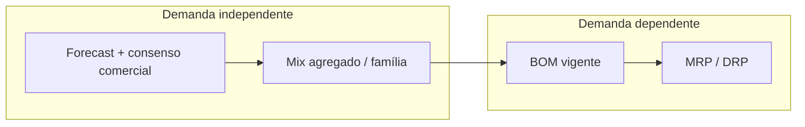
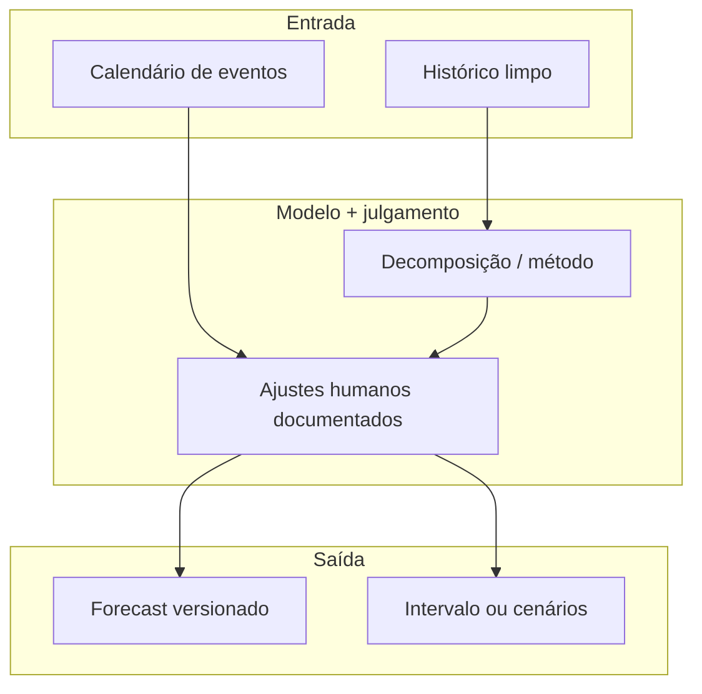
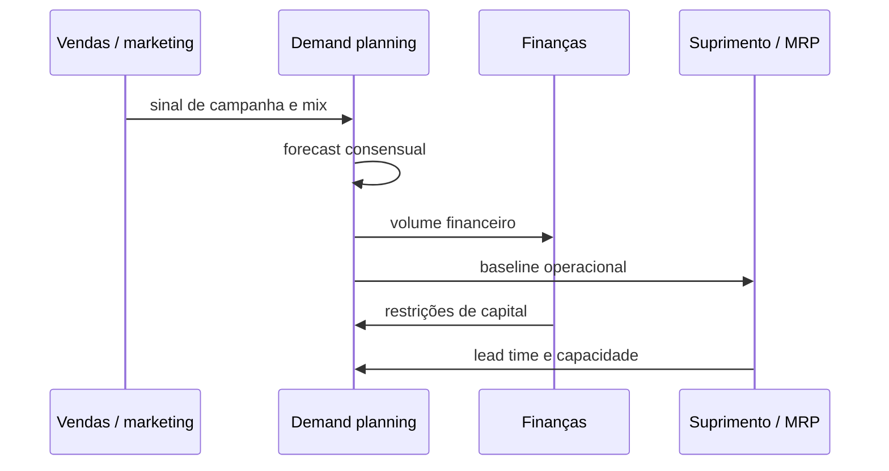

# Previsão de demanda e métodos básicos — o número que não é promessa, é hipótese com prazo de validade

**Trilha:** Fundamentos e estratégia · **Módulo:** Planejamento de demanda e S&OP  
**Público / nível:** Intermediário — convém estar à vontade com médias, percentuais e leitura de séries temporais simples; não é necessário dominar inferência estatística, mas é útil não ter medo de uma planilha.  
**Duração sugerida:** entre **duas horas e meia** e **três horas** se você refizer os cálculos à mão, plotar a série e escrever o relatório de uma página que sugeri no final; uma primeira leitura pode levar **noventa minutos**, mas aí você estará só na superfície.  
**Resultado de aprendizagem:** ao terminar, você deve conseguir **separar** com clareza demanda **independente** e **dependente**; **explicar** por que *forecast* é melhor pensado como **distribuição de erro + política de revisão** do que como “número certo”; **aplicar** métodos simples (ingênuo, média móvel, intuição de suavização exponencial) e **interpretar** MAD, MAPE e WMAPE sem cair nas armadilhas do denominador; **escolher** granularidade (SKU, família, região) e horizonte alinhados ao uso — operacional, tático ou financeiro; e **nomear** distorções típicas de dados (promoção, ruptura, mix) que corrompem o aprendizado do modelo.

---

Há empresas em que o forecast virou **instrumento de culpa**: na segunda-feira, alguém aponta para uma célula e pergunta “por que errou?”, como se erro fosse **vício** e não **propriedade** do problema. A tradição acadêmica e profissional séria — a que você encontra em *Forecasting: Principles and Practice*, de Hyndman e Athanasopoulos (OTexts, https://otexts.com/fpp3/) — trata previsão com a mesma sobriedade com que trata **controle de qualidade**: define método, estima erro, documenta suposições, revisa. Esta aula não substitui o livro; dá **linguagem** para você conversar com operações, finanças e comercial sem confundir **precisão estética** com **decisão robusta**.

Usaremos de novo a **TechLar** (e-commerce fictício de utilidades, CD no interior, campanhas agressivas). Sempre que aparecer “TechLar”, pense na empresa que você conhece: o mecanismo é o mesmo.

---

## Independente versus dependente — a fronteira que impede o absurdo de “prever parafuso como se fosse perfume”

**Demanda independente** é aquela influenciada pelo mercado para um item acabado (ou quase acabado) que o cliente escolhe diretamente. **Demanda dependente** nasce da explosão de outra necessidade: o parafuso existe porque o guarda-roupa existe; a caixa interna existe porque o kit promocional existe. Confundir os dois leva a **forecast de componente** quando o correto é **MRP** — ruído, estoque torto, reuniões infinitas e um planejador amargurado.

**Analogia do cardápio e da cozinha:** o cliente escolhe **prato** (independente). A cozinha calcula **ovos e manteiga** a partir da receita (dependente). Se você “prevê ovos” olhando só o histórico de ovos sem amarrar ao prato, está misturando dois mundos — e o estoque de ovos vai dançar sem música.

---

## O que é “demanda” no histórico — e por que ela mente sem querer

Muitas séries que alimentam o forecast não são **demanda real**, são **vendas** ou **embarques**. Se houve **ruptura**, o número baixo não significa “falta de desejo do mercado”; significa “falta de produto”. Se houve **push** de inventário (empurrão para o canal), o pico pode ser logístico, não orgânico. **Promoções** não modeladas aparecem como “talento surpresa” do algoritmo. A correção é **processo de dados** e **registro de eventos**, não “mais IA”. Hyndman insiste na qualidade da série e na clareza do que está sendo previsto; isso é consenso de mercado entre bons times de *demand planning*.

Na TechLar, o marketplace esconde **mix** por região: a série agregada parece estável enquanto **SKU** específico colapsa ou explode. **Hipótese pedagógica:** agregar mascara problema até o momento em que a decisão (reposição, campanha) é **no SKU** — aí o agregado vira **conforto estatístico** e **desconforto operacional**.

---

## Métodos simples ainda ensinam ética profissional

**Naive** (amanhã será como hoje) parece tolo, mas é **baseline** humilde: qualquer modelo sério deve **vencer** o naive no conjunto de teste que você escolheu. **Média móvel** suaviza ruído de curto prazo, mas **atras** em tendência — como um carro pesado em curva. **Suavização exponencial simples** dá peso decrescente ao passado; intuitivamente, é “memória com esquecimento”.

**Analogia da fotografia:** naive é **último quadro** do vídeo; média móvel é **desfoque** das últimas janelas; exponencial é **exposição** em que quadros antigos escurecem gradualmente.

Se você quiser aprofundar teoria e extensões (tendência, sazonalidade, espaço de estados), o caminho é o próprio FPP3; aqui fica a âncora: **comece simples, meça, só então complique**.

---

## Erro — MAD, MAPE, WAPE e a sedução do percentual bonito

**MAD** (erro absoluto médio) fala a língua das **unidades** — fácil de explicar ao chão: “em média erramos tantas peças por semana”. **MAPE** é sedutor em apresentação, mas **torce** quando há demandas baixas, zeros ou intermitência; o denominador pequeno explode o percentual e **ment** sobre gravidade. Alternativas como **sMAPE** e discussões de métricas aparecem na literatura; na prática corporativa, **WMAPE** ponderado por volume ou valor alinha discussão ao **P&L** — “erro percentual **do que importa economicamente**”.

**Analogia da balança:** MAD é peso absoluto; MAPE é “percentual do que estava na balança” — se a balança quase vazia treme, o percentual grita sem correspondência com o **custo** do erro.

---

## Granularidade e horizonte — a mesma pergunta com três respostas diferentes

O forecast para **orçamento anual** não precisa (nem deve) ter a mesma granularidade do forecast para **reposição diária** de SKU A em Fortaleza. **Consenso de mercado:** desalinhamento entre horizonte de decisão e horizonte de modelo gera **oscilação** de pedidos — o famoso *bullwhip* alimentado também por política. Chopra e Meindl organizam *drivers* e leituras de planejamento que conectam decisão e informação; você não precisa decorar, precisa **sincronizar** reunião com matemática.

Na TechLar, o time financeiro quer **família** agregada por trimestre; o CD quer **SKU-semana**; o comercial quer **SKU-campanha**. Um bom processo **explicita** qual número manda em qual decisão — e versiona suposições.

---

## Decomposição mental — tendência, sazonalidade e “resto”

Mesmo sem estimar modelo estatístico completo, separar **tendência** (direção de longo prazo), **sazonalidade** (padrão que repete) e **resíduo** (o que sobrou) melhora a conversa. Campanhas de Dia das Mães na TechLar não são “ruído aleatório”; são **evento** que deve entrar como variável explicativa ou ajuste manual — senão o modelo “aprende” que maio é mágico **sem** saber por quê.

**Legenda:** retângulos são artefatos; o losango implícito é **decisão** de quanto julgamento humano entra — isso deve ser transparente.

---

## Handoff — do forecast ao plano

A sequência é idealizada; na vida, setas voltam e e-mails se perdem. O valor pedagógico é lembrar que **forecast** é **interface social**, não só série temporal.

---

## Laboratório guiado — série semanal TechLar

Considere demanda em unidades: 118, 124, 121, 137, 130, 151, 146, 139 (semanas 1–8). **Tarefa A:** com *holdout* nas últimas três semanas, compare **naive** e **média móvel k=3** para prever semana a semana dentro do holdout; calcule MAD de cada método. **Tarefa B:** escreva **duas frases** interpretando o resultado como decisão de **cadência de revisão** (semanal versus quinzenal). **Tarefa C:** identifique **um** evento não observável na série que poderia invalidar a conclusão.

**Gabarito pedagógico (não único):** em séries com leve tendência de alta, naive costuma **subestimar** suavemente no holdout; média móvel atrasa a subida — MAD pode favorecer um ou outro por acaso do recorte; se a decisão é operacional de curto prazo, revisão mais frequente reduz dependência de qualquer método ingênuo; evento omitido pode ser **ruptura** nas semanas 3–4 ou **cupom** na semana 6.

---

## Erros comuns que parecem “óbvios”

- Tratar **MAPE** como verdade universal.  
- **Agregar demais** para KPI bonito e **desagregar** com proporção ingênua que não reflete mix real.  
- Condenar o planejador por erro **causado** por política de estoque ou lead time fantasioso.  
- Confundir **precisão pontual** com **valor de decisão** — às vezes intervalos e cenários superam ponto.

---

## KPIs e decisão — o que acompanhar sem virar refém

Além de MAD/WMAPE por **corte** (família, região), acompanhe **viés** (tendência de superestimar ou subestimar) — viés mata **capacidade** e **capital** de forma sistemática. Ferramentas como *forecast value added* (comparar intervenção humana versus benchmark estatístico) aparecem em práticas maduras; **consenso de mercado** é que intervenção sem disciplina **piora** mais do que melhora.

---

## Fechamento

**Três takeaways:** (1) forecast é **hipótese** com erro mensurável; (2) dados **sujos** produzem modelo confiante e errado; (3) granularidade deve **servir** à decisão, não ao slide.

**Pergunta de reflexão:** qual distorção do seu histórico hoje mais corrompe o número — ruptura, promoção ou mix?

---

## Referências

1. HYNDMAN, R. J.; ATHANASOPOULOS, G. *Forecasting: Principles and Practice* (3ª ed.). https://otexts.com/fpp3/  
2. CHOPRA, S.; MEINDL, P. *Supply Chain Management: Strategy, Planning, and Operation*. Pearson. https://www.pearson.com/en-us/subject-catalog/p/supply-chain-management-strategy-planning-and-operation/P200000012829  
3. SILVER, E. A.; PYKE, D. F.; PETERSON, R. *Inventory Management and Production Planning and Scheduling*. Wiley, 1998.  
4. ASCM — CPIM (planejamento e execução): https://www.ascm.org/learning-development/certifications-credentials/cpim/  
5. CSCMP — Glossário SCM: https://cscmp.org/CSCMP/cscmp/educate/scm_definitions_and_glossary_of_terms.aspx  
6. GARTNER — *Supply Chain Planning* (visão de mercado; alguns conteúdos exigem assinatura): https://www.gartner.com/en/supply-chain/topics/supply-chain-planning  
