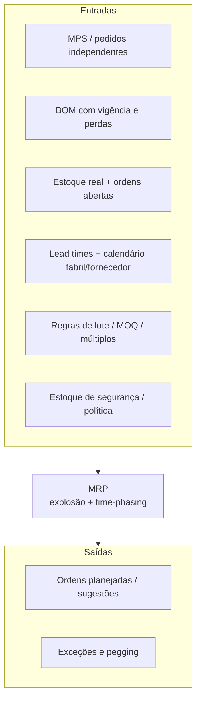
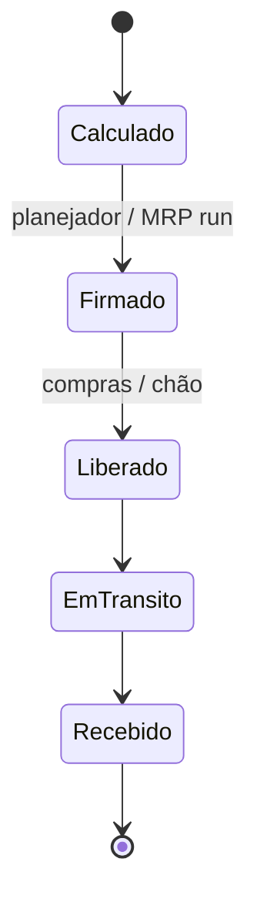

# MRP e explosão de necessidades — a máquina do tempo que só funciona se o calendário e a lista forem verdade

## Objetivos e resultado de aprendizagem

Ao final da aula, o aluno será capaz de explicar a lógica do MRP, relacionar BOM/LT/MPS ao plano de materiais e identificar as principais causas de distorção no resultado.

## Gancho (3–5 min)

“O sistema pediu demais” geralmente significa parâmetro errado, não erro do conceito de MRP.

## Mapa do conteúdo

- Conceito de demanda dependente.
- Entradas críticas do MRP.
- Explosão de necessidades e calendário.
- Erros comuns de parametrização.

## KPIs e decisão

- Aderência do plano de materiais.
- Frequência de replanejamento emergencial.
- Ruptura de componente crítico.

## Ponte

Conecta com [Tecnologia e sistemas](../../trilha-tecnologia-e-sistemas/README.md) para governança de cadastro.

Joseph Orlicky (*Material Requirements Planning*, McGraw-Hill, 1975) popularizou a ideia de que necessidades dependentes podem ser **calculadas** a partir de estrutura e tempos — revolucionário na época, banal hoje porque está **dentro** de todo ERP decente. O perigo moderno é outro: **desrespeitar** a lógica por achismo operacional — “o sistema pediu dez mil, mas eu sei que é demais”. Talvez você saiba; então **LT**, **BOM**, **lote** ou **MPS** estão mentindo. O MRP não “insiste” por teimosia; **reflete** o que foi digitado.

Usaremos **MetalRio** (fictícia, montadora de kits de fixação para móveis) para texturizar explosão e calendário — substitua pela sua realidade.

---

## Entradas, motor e saídas — ética de dados no tempo

**Time-phasing** é a disciplina de perguntar **quando** cada necessidade **atinge** o plano, não só **quanto**. Erro de calendário é erro de **física** disfarçado de informática — o caminhão não chega antes porque o algoritmo **quis**.

---

## Gross, net, scheduled receipt — vocabulário que evita briga na sala

- **Gross requirement:** necessidade bruta gerada pela explosão no período.  
- **Scheduled receipt:** ordem já existente que **cairá** naquele período.  
- **Projected on hand:** saldo projetado após consumir chegadas e demanda.  
- **Planned order release:** **quando soltar** a ordem para que a **chegada** coincida com a necessidade, respeitando LT.

**Analogia do jantar com convidados:** *gross* é “bocas vezes prato”; *scheduled receipt* é “já encomendei duas pizzas que chegam às 20h”; *projected on hand* é “quantas fatias ainda sobrarão às 20h15 se ninguém roubar”; *planned order release* é “preciso ligar para a pizzaria às 19h se o delivery leva uma hora”.

---

## Explosão — a árvore que é grafo e contrato interno

A BOM é um **grafo** de dependências (às vezes com **fantasmas** e alternativas — tópicos avançados); a explosão percorre o grafo aplicando **quantidade por pai** e deslocamentos temporais. **MOQ** e **múltiplos** distorcem quantidades — às vezes **de propósito** (transporte, forno, tambor), às vezes **por parâmetro velho** que ninguém audita.

**Analogia da receita industrial:** se cada **kit P** leva **2×A** e **1×B**, fabricar cem kits puxa **duzentas** unidades de A — a menos que a BOM diga **yield** menor; aí a engenharia entra no jogo. Logística aprende rápido que **BOM errada** é **previsão de desastre** com máscara de precisão.

---

## Exemplo MetalRio — números mínimos, narrativa máxima

**Produto acabado P:** lead time de **1** semana. **Componente A:** duas unidades por P, LT **2** semanas, **MOQ 300**. **Componente B:** uma unidade por P, LT **1** semana, sem MOQ relevante. Estoques atuais: P=8, A=120, B=40. **MPS** precisa de **90** unidades de P disponíveis na **semana 5** (considerando consumo do horizonte, simplifique: falta posicionar **82** P para chegar em 5).  

Desenhe semanas **1–6** no papel: a ordem planejada de **P** deve **soltar** na semana **4** para chegar na 5 (LT=1). A explosão gera necessidade de **A** e **B** alinhada ao uso em P — com **A** precisando estar disponível **duas semanas antes** do uso de P por causa do LT de A. Quando o cálculo líquido de A pedir **210** unidades, o MOQ pode **forçar 300** — sobra vira estoque, **capital** e **espaço**. Essa **sobra** não é “falha do MRP”; é **efeito colateral de política** que alguém precisa assinar.

**Legenda:** estados simplificados de ordem; transições reais dependem do ERP.

---

## Exceções — leia como pergunta, não como ordem

“Adiantar”, “atrasar”, “cancelar”, “quantidade estranha” são **sintomas**. Perguntas úteis: a **BOM** está vigente? O **LT** reflete fornecedor real ou “padrão sistema”? O **lote** ainda reflete contrato? Há **ordem duplicada** fora do MRP? **Pegging** (rastrear **de onde** veio a necessidade) é a ferramenta narrativa para contar a história em auditoria.

---

## Capacidade — o MRP assume infinito até provar o contrário

MRP clássico não “sabe” se há **máquina** disponível — isso é terreno de **CRP** (*capacity requirements planning*) e de **S&OP** mais maduro. **Consenso de mercado:** explosão correta com **capacidade falsa** gera **plano impossível** bonito na tela.

---

## DRP em uma respiração

**DRP** posiciona estoque em **rede** (CDs, filiais) a partir de necessidades **downstream**; MRP explode **BOM**. Misturar os dois sem governança é receita para **transferência** oscilar como metrônomo doido.

---

## Laboratório

Refaça o exemplo MetalRio com **MOQ de A = 500** e descreva o impacto em **capital médio em A** em linguagem para **CFO** (duas frases).

---

## Exercícios

1. Explique por que **lead time incerto** infla estoque mesmo com MRP “certo” no ponto.  
2. Por que **segurança** no componente e no acabado ao mesmo tempo pode ser **redundante**?

**Gabarito:** (1) o ponto vira expectativa; variabilidade vira **colchão** em política. (2) pode haver **cobertura dupla** do mesmo risco — política deve ser explícita.

---

## Fechamento

**Takeaways:** MRP é **calendário + lista**; explosão é **arvore**; exceção é **pergunta** sobre dados e política.

**Pergunta:** qual parâmetro você mais evita revisar — LT, yield ou lote?

---

## Referências

1. ORLICKY, J. *Material Requirements Planning*. McGraw-Hill, 1975.  
2. ASCM — CPIM: https://www.ascm.org/learning-development/certifications-credentials/cpim/  
3. CHOPRA, S.; MEINDL, P. *Supply Chain Management*. Pearson. https://www.pearson.com/en-us/subject-catalog/p/supply-chain-management-strategy-planning-and-operation/P200000012829  
4. SILVER, E. A.; PYKE, D. F.; PETERSON, R. *Inventory Management and Production Planning and Scheduling*. Wiley, 1998.  
5. HYNDMAN, R. J.; ATHANASOPOULOS, G. *Forecasting: Principles and Practice*. https://otexts.com/fpp3/  
