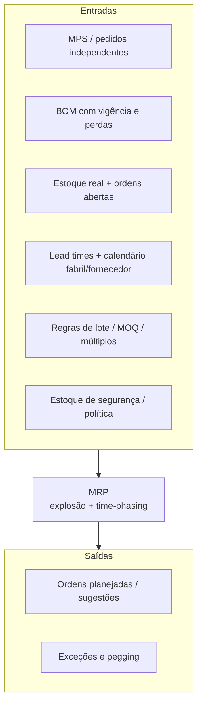
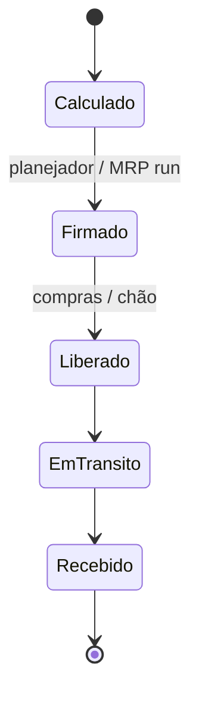
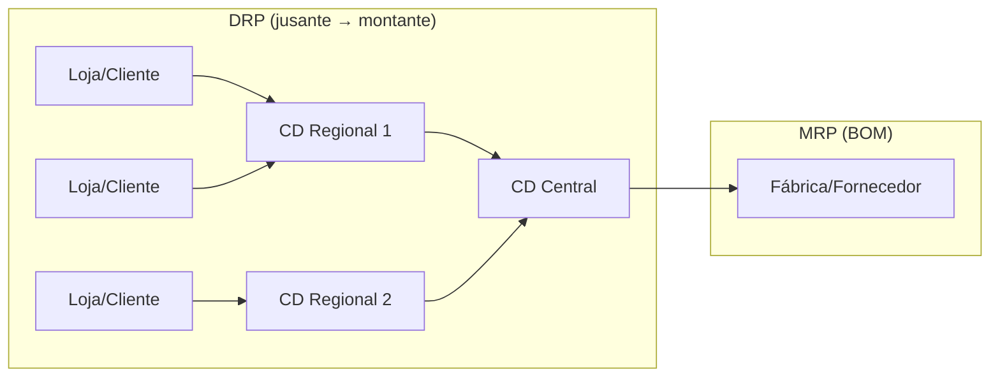

# MRP e explosão de necessidades — a máquina do tempo que só funciona se o calendário e a lista forem verdade

## Objetivos e resultado de aprendizagem

Ao final da aula, o aluno será capaz de:

- **Explicar** a lógica do MRP (entradas, motor, saídas) sem mistério.
- **Relacionar** BOM, LT, MPS, lote e estoque de segurança ao plano de materiais.
- **Identificar** principais causas de distorção (cadastro, política, capacidade).
- **Aplicar** vocabulário gross/net/scheduled/PoH/planned release com fluência.
- **Diferenciar** MRP, MRP II, DRP, DDMRP e os limites de cada um.
- **Conhecer** ERPs típicos no Brasil (SAP, Totvs Protheus, Senior, Oracle) e como o cadastro vira plano.

**Duração sugerida:** 70–90 min.
**Pré-requisitos:** [Aula 3.1 — Previsão](aula-01-previsao-demanda-metodos.md); noções de BOM e estoque.

## Mapa do conteúdo

- MRP — origem (Orlicky 1975) e o que herdamos.
- Entradas, motor e saídas (incluindo time-phasing).
- Vocabulário: gross, net, scheduled receipt, PoH, planned release.
- Explosão da BOM como grafo.
- Exemplo MetalRio passo a passo.
- MRP II, DRP e DDMRP — quando cada um.
- Capacidade — CRP e RCCP.
- Erros típicos de parametrização (BOM, LT, lote, política).

## Ponte

Conecta com [Tecnologia e sistemas](../../trilha-tecnologia-e-sistemas/README.md) para governança de cadastro; com [Previsão](aula-01-previsao-demanda-metodos.md) para o MPS; com [S&OP](aula-03-sop-processo-alinhamento.md) para a interface tática.

Joseph Orlicky (*Material Requirements Planning*, McGraw-Hill, 1975) popularizou a ideia de que necessidades dependentes podem ser **calculadas** a partir de estrutura e tempos — revolucionário na época, banal hoje porque está **dentro** de todo ERP decente. O perigo moderno é outro: **desrespeitar** a lógica por achismo operacional — “o sistema pediu dez mil, mas eu sei que é demais”. Talvez você saiba; então **LT**, **BOM**, **lote** ou **MPS** estão mentindo. O MRP não “insiste” por teimosia; **reflete** o que foi digitado.

Usaremos **MetalRio** (fictícia, montadora de kits de fixação para móveis) para texturizar explosão e calendário — substitua pela sua realidade.

---

## Entradas, motor e saídas — ética de dados no tempo

**Time-phasing** é a disciplina de perguntar **quando** cada necessidade **atinge** o plano, não só **quanto**. Erro de calendário é erro de **física** disfarçado de informática — o caminhão não chega antes porque o algoritmo **quis**.

---

## Gross, net, scheduled receipt — vocabulário que evita briga na sala

- **Gross requirement:** necessidade bruta gerada pela explosão no período.  
- **Scheduled receipt:** ordem já existente que **cairá** naquele período.  
- **Projected on hand:** saldo projetado após consumir chegadas e demanda.  
- **Planned order release:** **quando soltar** a ordem para que a **chegada** coincida com a necessidade, respeitando LT.

**Analogia do jantar com convidados:** *gross* é “bocas vezes prato”; *scheduled receipt* é “já encomendei duas pizzas que chegam às 20h”; *projected on hand* é “quantas fatias ainda sobrarão às 20h15 se ninguém roubar”; *planned order release* é “preciso ligar para a pizzaria às 19h se o delivery leva uma hora”.

---

## Explosão — a árvore que é grafo e contrato interno

A BOM é um **grafo** de dependências (às vezes com **fantasmas** e alternativas — tópicos avançados); a explosão percorre o grafo aplicando **quantidade por pai** e deslocamentos temporais. **MOQ** e **múltiplos** distorcem quantidades — às vezes **de propósito** (transporte, forno, tambor), às vezes **por parâmetro velho** que ninguém audita.

**Analogia da receita industrial:** se cada **kit P** leva **2×A** e **1×B**, fabricar cem kits puxa **duzentas** unidades de A — a menos que a BOM diga **yield** menor; aí a engenharia entra no jogo. Logística aprende rápido que **BOM errada** é **previsão de desastre** com máscara de precisão.

---

## Exemplo MetalRio — números mínimos, narrativa máxima

**Produto acabado P:** lead time de **1** semana. **Componente A:** duas unidades por P, LT **2** semanas, **MOQ 300**. **Componente B:** uma unidade por P, LT **1** semana, sem MOQ relevante. Estoques atuais: P=8, A=120, B=40. **MPS** precisa de **90** unidades de P disponíveis na **semana 5** (considerando consumo do horizonte, simplifique: falta posicionar **82** P para chegar em 5).

Desenhe semanas **1–6** no papel: a ordem planejada de **P** deve **soltar** na semana **4** para chegar na 5 (LT=1). A explosão gera necessidade de **A** e **B** alinhada ao uso em P — com **A** precisando estar disponível **duas semanas antes** do uso de P por causa do LT de A. Quando o cálculo líquido de A pedir **210** unidades, o MOQ pode **forçar 300** — sobra vira estoque, **capital** e **espaço**. Essa **sobra** não é "falha do MRP"; é **efeito colateral de política** que alguém precisa assinar.

### Tabela MRP — produto acabado P (semanas 1–6)

| Linha | Sem 1 | Sem 2 | Sem 3 | Sem 4 | Sem 5 | Sem 6 |
|-------|------:|------:|------:|------:|------:|------:|
| Necessidade bruta | 0 | 0 | 0 | 0 | 90 | 0 |
| Recebimentos programados | 0 | 0 | 0 | 0 | 0 | 0 |
| Estoque projetado (PoH) | 8 | 8 | 8 | 8 | 0 | 0 |
| Necessidade líquida | — | — | — | — | **82** | — |
| Recebimento planejado | — | — | — | — | **82** | — |
| **Liberação planejada** (LT=1) | — | — | — | **82** | — | — |

### Tabela MRP — componente A (BOM: 2A por 1P; LT=2; MOQ=300)

| Linha | Sem 1 | Sem 2 | Sem 3 | Sem 4 | Sem 5 | Sem 6 |
|-------|------:|------:|------:|------:|------:|------:|
| Necessidade bruta (=2× liberação P) | 0 | 0 | 0 | **164** | 0 | 0 |
| Recebimentos programados | 0 | 0 | 0 | 0 | 0 | 0 |
| Estoque projetado (PoH) | 120 | 120 | 120 | 256 | 256 | 256 |
| Necessidade líquida | — | — | — | **44** | — | — |
| Recebimento planejado (MOQ 300) | — | — | — | **300** | — | — |
| **Liberação planejada** (LT=2) | — | **300** | — | — | — | — |

**Leitura:** o MRP precisava só de **44 unidades** líquidas de A; o **MOQ 300** força 300, deixando **256 - 44 = 212** unidades de **excesso** circulando no estoque após a sem 4. Isso é **efeito de política**, não bug. A pergunta para o CFO: este MOQ ainda reflete o **contrato vigente** ou é parâmetro **histórico** sem revisão?

> **Lição prática:** se o time auditar **3 parâmetros** trimestralmente — **LT real do fornecedor**, **MOQ contratual vigente** e **yield/perda da BOM** — eliminam-se ~70% das "surpresas" do MRP. É trabalho chato; é o que separa indústria madura de indústria queixosa.

**Legenda:** estados simplificados de ordem; transições reais dependem do ERP.

---

## Exceções — leia como pergunta, não como ordem

“Adiantar”, “atrasar”, “cancelar”, “quantidade estranha” são **sintomas**. Perguntas úteis: a **BOM** está vigente? O **LT** reflete fornecedor real ou “padrão sistema”? O **lote** ainda reflete contrato? Há **ordem duplicada** fora do MRP? **Pegging** (rastrear **de onde** veio a necessidade) é a ferramenta narrativa para contar a história em auditoria.

---

## Capacidade — o MRP assume infinito até provar o contrário

MRP clássico não “sabe” se há **máquina** disponível — isso é terreno de **CRP** (*capacity requirements planning*) e de **S&OP** mais maduro. **Consenso de mercado:** explosão correta com **capacidade falsa** gera **plano impossível** bonito na tela.

---

## DRP em uma respiração

**DRP** (*Distribution Requirements Planning*) posiciona estoque em **rede** (CDs, filiais) a partir de necessidades **downstream**; MRP explode **BOM**. Misturar os dois sem governança é receita para **transferência** oscilar como metrônomo doido.

**Leitura:** o DRP "puxa" estoque das pontas para o centro; o MRP fabrica/compra para abastecer o centro. Em rede multi-nível, o **DRP roda primeiro** e gera as necessidades agregadas que viram MPS para o MRP.

---

## DDMRP — uma palavra sobre a evolução demanda-puxada

**DDMRP** (*Demand Driven MRP*, Ptak & Smith, 2011+, certificado pelo **Demand Driven Institute**) propõe substituir partes do MRP clássico por **buffers estratégicos** posicionados em pontos de desacoplamento, dimensionados por **ADU** (*Average Daily Usage*) e **variabilidade**. A lógica é "puxar" pela **disponibilidade** do buffer, não por previsão pura. Empresas como Bahia Specialty Cellulose, Indústrias Romi, Andritz e várias indústrias farmacêuticas brasileiras (NovaQuímica/Cristália) adotaram parcialmente DDMRP. Ferramentas: **Replenish+**, **Intuiflow** (DD), módulos DD em **SAP IBP** e **Anaplan**, **Smart IP&O** (Smart Software).

> **Quando DDMRP brilha:** alta variabilidade de demanda + lead time longo + cadeia complexa. **Quando NÃO usar:** demanda super estável (MRP clássico já basta) ou catálogo enxuto.

---

## Lote — políticas comuns

| Política | Como funciona | Quando usar |
|----------|----------------|--------------|
| **L4L** (*Lot for Lot*) | Pedido = necessidade líquida | Custo de pedido baixo, item barato/sob medida |
| **FOQ** (*Fixed Order Quantity*) | Sempre múltiplo de Q | Frete cheio, paletização |
| **POQ** (*Period Order Quantity*) | Cobrir N períodos | Cadência regular, baixo custo de pedido |
| **EOQ** (Wilson) | Minimiza custo total (pedido vs. carregamento) | Demanda estável, custos conhecidos |
| **MOQ** (mínimo) | Restrição contratual | Imposto pelo fornecedor |
| **Múltiplo** | Quantidade só em múltiplos de N | Embalagem padronizada (caixa, palete, container) |

A escolha **influencia o estoque médio** mais do que parece. Wilson (EOQ): \[ Q^* = \sqrt{\dfrac{2DS}{H}} \] onde D=demanda anual, S=custo de pedido, H=custo de carregamento por unidade/ano.

---

## Laboratório

Refaça o exemplo MetalRio com **MOQ de A = 500** e descreva o impacto em **capital médio em A** em linguagem para **CFO** (duas frases).

---

## O que vira dado no sistema

| Conceito | Onde fica no ERP (canônico BR) | Quem mantém |
|----------|--------------------------------|-------------|
| BOM (estrutura) | SAP: CS01-03; Totvs Protheus: SG1; Senior: módulo MFG | Engenharia + PCP |
| MPS / MPP | SAP: MD61/MD41; Totvs: SDA | PCP/Plan |
| LT por componente | Cadastro de material (LT planejado vs. real) | Compras (com Plan) |
| MOQ / múltiplos / lote | Cadastro material/fornecedor | Compras |
| Estoque de segurança / política | Cadastro material por centro | Plan |
| Calendário fabril/fornecedor | SAP: KP04/calendário; outros: tabela calendário | PCP / TI |
| Recebimento programado | Pedido de compra em aberto | Compras |
| Estoque em trânsito (importação) | Documento de importação + DI/registro | Comex |
| Parametrização do MRP run | Job/agenda de execução | TI + Plan |

> **Atenção BR — importação:** itens importados têm "lead time composto" — produção do fornecedor + transit time porto-a-porto + processo aduaneiro (Receita Federal — Portal Único Siscomex, canal verde/amarelo/vermelho) + transit interno até a fábrica. Cada etapa tem **variância**. Empresas maduras tratam **importação aberta** como recebimento programado **com confiabilidade ponderada** (ex.: probabilidade de chegar na data planejada).

---

## KPIs e decisão (kit mínimo)

| KPI | Pergunta que responde | Dono | Fonte | Cadência | Playbook de ação |
|-----|------------------------|------|-------|----------|-------------------|
| **Aderência ao plano de materiais** | Plano vira realidade? | Plan | ERP | Mensal | Análise de variância por componente |
| **Frequência de replanejamento emergencial** | Curto prazo está em chamas? | Plan + Compras | PMO/ERP | Semanal | > 20% indica gap S&OP/qualidade de cadastro |
| **% rupturas de componente crítico** | Quem para a linha? | Plan + Compras | ERP | Diário | Buffer estratégico, multi-source |
| **Acurácia de BOM** (% BOMs sem desvio) | Receita está atualizada? | Engenharia | Auditoria interna | Trimestral | Ciclo de revisão de engenharia |
| **Acurácia de LT** (LT planejado vs. real, % erro) | Cadastro reflete fornecedor? | Compras | ERP histórico | Mensal | Atualizar LT cadastrado por SKU |
| **Capital em estoque por categoria** (R$, dias) | Quanto de capital amarrado? | CFO + Plan | ERP | Mensal | Política ABC, redução de MOQ negociada |
| **Excesso e obsolescência (E&O)** | Perda escondida? | Plan + CFO | WMS/ERP | Mensal | Revisar política de lote, promo controlada |

---

## Ferramentas e tecnologias relevantes

| Necessidade | Pode começar em | Cresce para | Quando NÃO usar |
|-------------|-----------------|-------------|------------------|
| MRP básico | Excel para 1 família | ERP nativo (SAP MM, Totvs Protheus, Senior, Sankhya, Microsiga) | Operação real complexa em planilha |
| MRP II + CRP | ERP base | SAP S/4HANA, Oracle, Infor, Totvs RM | Sem cultura de cadastro |
| APS sobre MRP | ERP só | SAP IBP, Oracle SCM Cloud, Anaplan, o9, Kinaxis, OMP | Sem dado limpo |
| DDMRP | Baseline MRP | Replenish+, Intuiflow, Smart IP&O | Demanda muito estável |
| Audit de cadastro | Excel + checklist | Ferramentas de **MDG** (Master Data Governance — SAP MDG, Informatica) | Sem volume de cadastro |
| Comex (importação) | Planilha + e-mail | TMS comex (Brudam, Teknisa, Smartsoft, Stellantis), Siscomex Portal Único | Sem volume importação |

---

## Erros comuns

- BOM **desatualizada** após mudança de engenharia (ECO sem propagação).
- LT cadastrado **otimista** ("padrão sistema") versus LT real do fornecedor.
- MOQ **histórico** que ninguém audita em anos.
- Estoque de segurança cumulativo (componente + acabado) **redundante**.
- Rodar MRP sobre dados **não fechados** (lançamento de saída pendente).
- Confundir **programação infinita** (MRP) com **realidade finita** (capacidade).
- Importação aberta tratada como "vai chegar na data" sem variância.

---

## Exercícios

1. Explique por que **lead time incerto** infla estoque mesmo com MRP "certo" no ponto.
2. Por que **segurança** no componente e no acabado ao mesmo tempo pode ser **redundante**?
3. **Refaça** o exemplo MetalRio com MOQ de A = 500 e descreva o impacto em capital médio em A em linguagem para CFO (duas frases).
4. **Caso BR — importação:** o componente A é importado da China com LT composto de 70 dias úteis (produção 30 + marítimo 35 + alfândega+nacional 15, aproximadamente). A empresa quer reduzir cobertura. Liste **três** alavancas além de "comprar mais cedo" e os riscos de cada uma.
5. **DDMRP vs. MRP:** sua linha tem 200 SKUs com demanda estável e 50 com variabilidade alta + LT longo. Em qual subgrupo DDMRP entrega mais valor? Justifique.

**Gabarito:** (1) o ponto vira expectativa; variabilidade vira **colchão** em política — quanto maior o desvio do LT, maior o estoque de segurança calculado para um nível de serviço alvo. (2) pode haver **cobertura dupla** do mesmo risco — política deve ser explícita; melhor concentrar o buffer no ponto de **maior incerteza** (geralmente o componente importado). (3) MOQ 500 → recebimento de 500 unidades; PoH sobe para 456; capital adicional ~ (500-300) × valor unitário. Para CFO: "Aumentamos o lote mínimo do componente A em 200 un, o que adiciona ~R$ X mil em capital médio amarrado, reduzindo Y% a frequência de pedidos." (4) (a) **multi-sourcing** com fornecedor BR/regional alternativo (risco: validação técnica e custo); (b) **acordo de estoque consignado** no porto de destino (risco: contrato e custos de armazenagem); (c) **forecast colaborativo** com fornecedor permitindo SO/firme antes (risco: comprometer pedido sem demanda confirmada). (5) DDMRP entrega mais nos **50 com variabilidade alta + LT longo** — exatamente onde MRP clássico vira buffer cumulativo e geração de exceções.

---

## Fechamento

**Takeaways:** MRP é **calendário + lista**; explosão é **arvore**; exceção é **pergunta** sobre dados e política.

**Pergunta:** qual parâmetro você mais evita revisar — LT, yield ou lote?

---

## Glossário express

- **MRP / MRP II:** *Material Requirements Planning* / *Manufacturing Resource Planning* (inclui finanças e capacidade).
- **DRP:** *Distribution Requirements Planning*.
- **DDMRP:** *Demand Driven MRP* (Ptak & Smith).
- **MPS:** *Master Production Schedule*.
- **BOM:** *Bill of Materials*.
- **PoH:** *Projected on Hand* (estoque projetado).
- **MOQ / MTO / MTS / ATO / ETO:** *Minimum Order Quantity*; Make-to-Order; Make-to-Stock; Assemble-to-Order; Engineer-to-Order.
- **CRP / RCCP:** *Capacity Requirements Planning* / *Rough-Cut CRP*.
- **L4L / FOQ / POQ / EOQ:** políticas de lote.
- **Pegging:** rastrear de onde vem uma necessidade.
- **MDG:** *Master Data Governance*.

---

## Referências

1. ORLICKY, J. *Material Requirements Planning*. McGraw-Hill, 1975 (e edições posteriores revisadas por Plossl, Wight).
2. ASCM — CPIM: https://www.ascm.org/learning-development/certifications-credentials/cpim/
3. CHOPRA, S.; MEINDL, P. *Supply Chain Management*. Pearson.
4. SILVER, E. A.; PYKE, D. F.; PETERSON, R. *Inventory Management and Production Planning and Scheduling*. Wiley, 1998.
5. HYNDMAN, R. J.; ATHANASOPOULOS, G. *Forecasting: Principles and Practice*. https://otexts.com/fpp3/
6. PTAK, C.; SMITH, C. *Demand Driven Material Requirements Planning (DDMRP)*. Industrial Press, 2016+ — também o **Demand Driven Institute**: https://www.demanddriveninstitute.com/
7. SAP — Documentação MRP S/4HANA: https://help.sap.com/
8. RECEITA FEDERAL — Portal Único Siscomex: https://www.gov.br/siscomex
9. APICS Dictionary (ASCM): https://www.ascm.org/learning-development/dictionary/

---

## Pontes para outras trilhas

- [Trilha Tecnologia e Sistemas](../../trilha-tecnologia-e-sistemas/README.md) — implementação MRP em SAP/Totvs/Senior.
- [Trilha Logística Estratégica](../../trilha-logistica-estrategica/README.md) — DDMRP avançado, postponement.
- [Trilha Dados e Analytics](../../trilha-dados-analytics-logistica/README.md) — modelos de safety stock estatístico.
