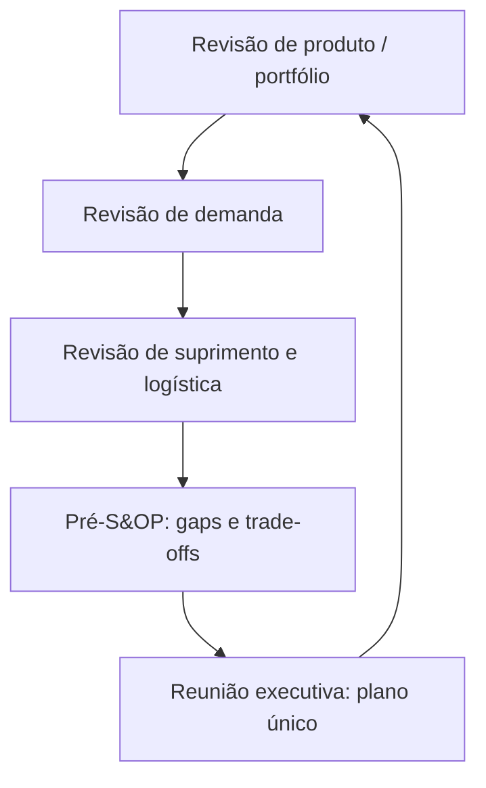
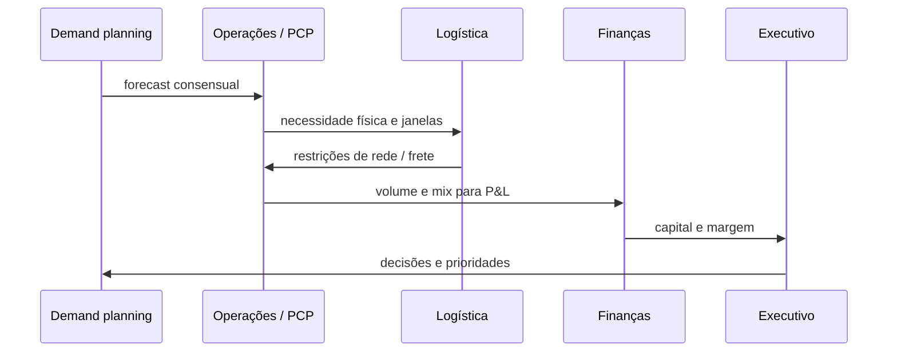

# S&OP e alinhamento — do calendário de reuniões ao plano único que finanças reconhece

## Objetivos e resultado de aprendizagem

Ao final da aula, o aluno será capaz de descrever o ciclo S&OP, mediar conflito entre áreas e propor plano único com hipóteses e riscos explícitos.

## Gancho (3–5 min)

Vendas, operações e finanças com três versões de verdade criam decisões contraditórias e custo extra.

## Mapa do conteúdo

- Propósito e etapas do S&OP.
- Papéis e artefatos de reconciliação.
- Gestão de conflito e decisão.
- Disciplina de revisão contínua.

## KPIs e decisão

- Aderência ao plano S&OP.
- Precisão de volume/mix por ciclo.
- Impacto do plano em serviço e capital.

## Ponte

Conecta com [Custos e performance](../modulo-04-custos-logisticos-performance/README.md) para avaliação econômico-operacional.

S&OP não nasceu como “mais uma reunião”. Nasceu como **antídoto à planilha dupla**: vendas com uma verdade, operações com outra, finanças com uma terceira — e o fornecedor ouvindo **todas** ao mesmo tempo por e-mail encaminhado. O processo tenta impor **cadência**, **artefato** e **dono** — três coisas pouco glamourosas que substituem **heroísmo** e **improviso**.

**MetalRio** e **TechLar** aparecem como **espelhos**: indústria com **capacidade dura** versus varejo com **volatilidade de campanha**. O mecanismo de alinhamento é o mesmo: **narrativa única** sobre o futuro próximo.

---

## Ciclo e papéis — orquestra com partitura, não jam session eterno

**Leitura:** o ciclo fecha; se não fecha, vira **puxadinho** de powerpoint. Cada etapa produz **artefato** (número, lista de riscos, decisão) — não só “conversa”.

---

## Pré-S&OP — onde a política aparece com roupa de planilha

No Pré-S&OP, **mix** encontra **capacidade** encontra **logística**. É o lugar civilizado para dizer: “com esse forecast, **não fecha** — escolhemos **menos mix de baixa margem**, **overtime**, **subcontratação** ou **atraso comercial**”. Sem esse momento, a decisão estoura no **WhatsApp** do sábado.

**Analogia do conselho de prédio:** assembleia executiva vota **orçamento**; o Pré-S&OP é a **comissão** que apresenta **três cenários** com prós e contras — sem achismo de corredor.

---

## Plano único — contrato interno com versão e suposições

Elementos mínimos honestos: **horizonte**, **granularidade**, **versão**, **data de corte**, **suposições** (preço, promoção, capacidade, importação), **cenários** arquivados, impacto esperado em **estoque**, **serviço** e **margem** quando dados permitem. **Hipótese pedagógica:** plano sem suposições é **romance**, não instrumento de gestão.

---

## IBP — quando o mesmo ritmo fala **dinheiro** e **estratégia**

Em **IBP**, integra-se **margem**, **capital** e **cenários estratégicos** ao ciclo que nasceu como equilíbrio demanda–oferta. Fornecedores de software e consultorias descrevem a evolução como “S&OP cresceu para o P&L”; Gartner discute *Supply Chain Planning* em um mercado em mudança (parte do conteúdo é paga). **Consenso de mercado:** nomes mudam; o que importa é **governança** e **coerência temporal** entre áreas.

---

## Modos de falha — lista anti-encanto

- **Frozen horizon** que congela só para compras, nunca para vendas.  
- **KPI** de forecast sem corte por **família** ou **canal**.  
- **Plano duplo**: o oficial e o “do bolso” do comercial.  
- **Logística** convidada só para **cabeçar** quando já está tudo decidido.

---

## Simulação escrita — MetalRio, semana típica

**Dados:** forecast de família **11.200** peças no mês; capacidade interna estável em **9.800**; subcontratação caríssima acrescenta **1.500** no máximo, com **lead time** de três semanas; estoque de segurança político cai se atrasar **SKU** crítico de canal B2B. **Pedido:** escreva **ata de Pré-S&OP** com: (1) plano único; (2) três riscos; (3) três ações com **dono**; (4) uma frase para o **CEO** sobre trade-off de **margem versus serviço**.

**Gabarito pedagógico (direção, não cópia):** plano único deve **escolher** entre subcontratar parcialmente, nivelar vendas de canal, ou atrasar entrega com **comunicação**; riscos incluem **fill rate** B2B, **custo premium**, **oscilação de MP**; ações incluem **campanha de mix**, **ajuste de MPS**, **contrato spot** documentado.

---

## Exercícios

1. Diferencie **S&OP** de **war room** semanal de OTIF **em uma frase**.  
2. Nomeie **dois** artefatos que tornam o executivo **rápido** sem ser **leviano**.

**Gabarito:** (1) S&OP equilibra **volume/mix/capacidade** no horizonte médio; war room reage a **exceções** de curto prazo. (2) pacote de **cenários** + página de **suposições** com assinatura.

---

## Fechamento

**Takeaways:** S&OP é **governança de tempo**; Pré-S&OP é **arena civilizada** de trade-offs; IBP **amarra** caixa e estratégia ao ritmo.

**Pergunta:** qual suposição hoje é **tácita** e deveria estar no cabeçalho do plano?

---

## Referências

1. GARTNER — *Supply Chain Planning*: https://www.gartner.com/en/supply-chain/topics/supply-chain-planning  
2. SAP — contexto de mercado sobre S&OP / planejamento integrado: https://www.sap.com/products/scm/integrated-business-planning/what-is-supply-chain-planning/sop-sales-operations.html  
3. CHOPRA, S.; MEINDL, P. *Supply Chain Management*. Pearson. https://www.pearson.com/en-us/subject-catalog/p/supply-chain-management-strategy-planning-and-operation/P200000012829  
4. ASCM — CPIM: https://www.ascm.org/learning-development/certifications-credentials/cpim/  
5. CSCMP — Glossário: https://cscmp.org/CSCMP/cscmp/educate/scm_definitions_and_glossary_of_terms.aspx  
6. WALLACE, T. F.; STEFAN, R. M. *Sales and Operations Planning: The How-to Handbook*. T. F. Wallace & Company (clássico de processo; edições variam).  
