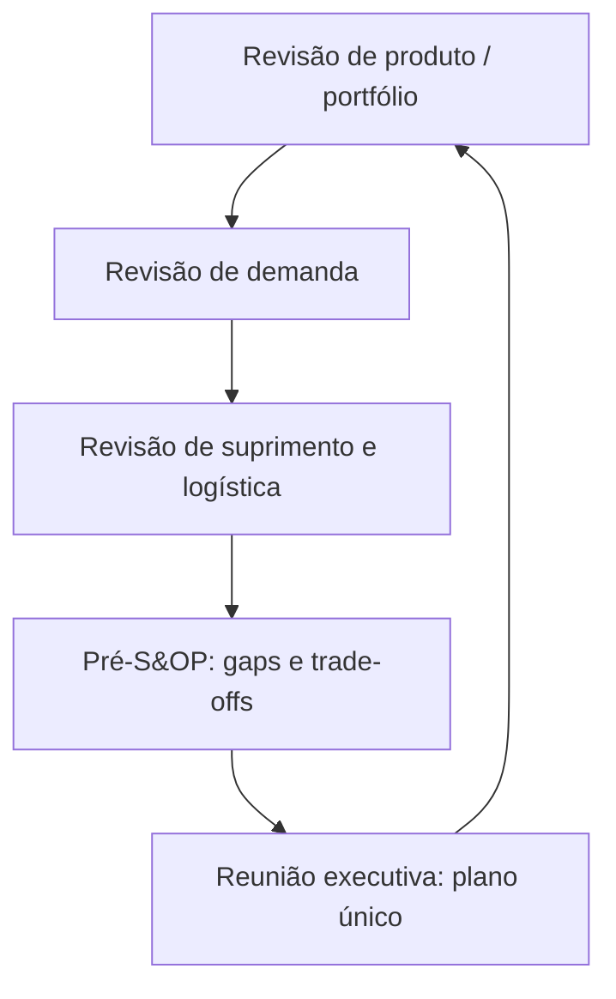
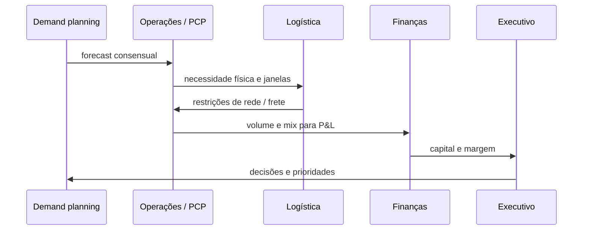

# S&OP e alinhamento — do calendário de reuniões ao plano único que finanças reconhece

## Objetivos e resultado de aprendizagem

Ao final da aula, o aluno será capaz de:

- **Descrever** o ciclo S&OP em 5 etapas (PR/DR/SR/Pré-S&OP/Executiva).
- **Mediar** conflito entre vendas, operações e finanças em torno de um plano único.
- **Propor** plano com hipóteses, cenários e riscos explícitos.
- **Diferenciar** S&OP, IBP e *war room* operacional.
- **Posicionar** maturidade S&OP da empresa em modelo de níveis (Lapide / Gartner).
- **Reconhecer** ferramentas APS aplicáveis ao S&OP no Brasil e no mundo.

**Duração sugerida:** 70–90 min.
**Pré-requisitos:** Aulas 3.1 (Previsão) e 3.2 (MRP); recomendado 1.3 (Níveis de decisão).

## Mapa do conteúdo

- Origem e propósito do S&OP (Wallace).
- Ciclo de 5 etapas com artefatos.
- Pré-S&OP — civilizar trade-offs.
- Plano único — contrato interno.
- IBP — maturidade financeira do ritmo.
- Modelo de maturidade (Lapide).
- RACI por etapa.
- Modos de falha e correções.

## Ponte

Conecta com [Custos e performance](../modulo-04-custos-logisticos-performance/README.md), [Previsão](aula-01-previsao-demanda-metodos.md), [MRP](aula-02-mrp-explosao-necessidades.md), [Tecnologia e sistemas](../../trilha-tecnologia-e-sistemas/README.md) (APS) e [Logística estratégica](../../trilha-logistica-estrategica/README.md).

S&OP não nasceu como “mais uma reunião”. Nasceu como **antídoto à planilha dupla**: vendas com uma verdade, operações com outra, finanças com uma terceira — e o fornecedor ouvindo **todas** ao mesmo tempo por e-mail encaminhado. O processo tenta impor **cadência**, **artefato** e **dono** — três coisas pouco glamourosas que substituem **heroísmo** e **improviso**.

**MetalRio** e **TechLar** aparecem como **espelhos**: indústria com **capacidade dura** versus varejo com **volatilidade de campanha**. O mecanismo de alinhamento é o mesmo: **narrativa única** sobre o futuro próximo.

---

## Ciclo e papéis — orquestra com partitura, não jam session eterno

**Leitura:** o ciclo fecha; se não fecha, vira **puxadinho** de powerpoint. Cada etapa produz **artefato** (número, lista de riscos, decisão) — não só “conversa”.

---

## Pré-S&OP — onde a política aparece com roupa de planilha

No Pré-S&OP, **mix** encontra **capacidade** encontra **logística**. É o lugar civilizado para dizer: “com esse forecast, **não fecha** — escolhemos **menos mix de baixa margem**, **overtime**, **subcontratação** ou **atraso comercial**”. Sem esse momento, a decisão estoura no **WhatsApp** do sábado.

**Analogia do conselho de prédio:** assembleia executiva vota **orçamento**; o Pré-S&OP é a **comissão** que apresenta **três cenários** com prós e contras — sem achismo de corredor.

---

## Plano único — contrato interno com versão e suposições

Elementos mínimos honestos: **horizonte**, **granularidade**, **versão**, **data de corte**, **suposições** (preço, promoção, capacidade, importação), **cenários** arquivados, impacto esperado em **estoque**, **serviço** e **margem** quando dados permitem. **Hipótese pedagógica:** plano sem suposições é **romance**, não instrumento de gestão.

---

## IBP — quando o mesmo ritmo fala **dinheiro** e **estratégia**

Em **IBP** (*Integrated Business Planning*), integra-se **margem**, **capital** e **cenários estratégicos** ao ciclo que nasceu como equilíbrio demanda–oferta. Fornecedores de software (Oliver Wight, SAP, o9, Anaplan, Kinaxis) e consultorias descrevem a evolução como "S&OP cresceu para o P&L"; Gartner discute *Supply Chain Planning* em um mercado em mudança (parte do conteúdo é paga). **Consenso de mercado:** nomes mudam; o que importa é **governança** e **coerência temporal** entre áreas.

### S&OP × IBP × War room — o que é o quê

| Característica | War room operacional | S&OP clássico | IBP |
|----------------|----------------------|---------------|-----|
| Horizonte | dias a 4 sem | 3–18 meses | 18–36+ meses (rolling) |
| Foco | Exceções (OTIF, ruptura) | Equilíbrio demanda × oferta × capacidade | Margem, capital, estratégia + D×O |
| Cadência | Diária/semanal | Mensal | Mensal (com ciclo financeiro) |
| Quem decide | Supervisor/coord. | Diretores funcionais | C-level + Conselho |
| Saída | Ação imediata | Plano único de produção/material/distribuição | Plano financeiro, capex, M&A, portfólio |
| Ferramenta típica | TMS/WMS dashboards | APS + Excel | APS + EPM (Anaplan, Oracle EPM, OneStream) |

> **Atenção semântica:** muita empresa diz "S&OP" para o que é **war room mensal de operações**. Isso é S&OP **imaturo**. Se a reunião não toca em **forecast revisado, capacidade declarada, cenário financeiro e decisão executiva**, é outra coisa.

---

## Modelo de maturidade S&OP (Lapide / Oliver Wight)

| Estágio | Sintomas |
|---------|----------|
| **1 — Marginal** | Sem processo formal, planilhas isoladas, finanças ignora o operacional, aderência baixíssima |
| **2 — Rudimentar** | Reunião mensal existe; mas vendas chega com número diferente toda vez, sem cenários, sem aprovação |
| **3 — Clássico** | Ciclo formal de 5 etapas, com artefatos; volume e mix; aderência mensurada; ainda fraco em cenários financeiros |
| **4 — Avançado / IBP** | Cenários financeiros integrados, decisões executivas tomadas com base no plano; FVA aplicado; suposições versionadas |
| **5 — Líder de classe** | Reuniões executivas curtas e poderosas; cenários *what-if* em tempo real; ligação direta a estratégia, capex, M&A; cultura de plano único enraizada |

> **Heurística da realidade BR:** a maioria das empresas brasileiras (incluindo grandes) está entre **2 e 3** — segundo benchmarks do **ILOS**, da **FIA**, do **CSCMP Brazil Roundtable** e da **Fundação Vanzolini**. Empresas em **4–5** geralmente têm S&OP global maduro (multinacionais de bens de consumo: Unilever, P&G, Nestlé, Ambev/InBev, BRF, JBS).

---

## Modos de falha — lista anti-encanto

- **Frozen horizon** que congela só para compras, nunca para vendas.  
- **KPI** de forecast sem corte por **família** ou **canal**.  
- **Plano duplo**: o oficial e o “do bolso” do comercial.  
- **Logística** convidada só para **cabeçar** quando já está tudo decidido.

---

## Simulação escrita — MetalRio, semana típica

**Dados:** forecast de família **11.200** peças no mês; capacidade interna estável em **9.800**; subcontratação caríssima acrescenta **1.500** no máximo, com **lead time** de três semanas; estoque de segurança político cai se atrasar **SKU** crítico de canal B2B. **Pedido:** escreva **ata de Pré-S&OP** com: (1) plano único; (2) três riscos; (3) três ações com **dono**; (4) uma frase para o **CEO** sobre trade-off de **margem versus serviço**.

**Gabarito pedagógico (direção, não cópia):** plano único deve **escolher** entre subcontratar parcialmente, nivelar vendas de canal, ou atrasar entrega com **comunicação**; riscos incluem **fill rate** B2B, **custo premium**, **oscilação de MP**; ações incluem **campanha de mix**, **ajuste de MPS**, **contrato spot** documentado.

---

## RACI por etapa do ciclo S&OP

| Etapa | Demand Plan | Vendas/Marketing | Operações/PCP | Logística | Finanças | Sponsor (CFO/COO) |
|-------|:-----------:|:----------------:|:-------------:|:---------:|:--------:|:----------------:|
| Revisão de portfólio (PR) | C | **R/A** | C | I | I | I |
| Revisão de demanda (DR) | **R/A** | C | I | I | C | I |
| Revisão de suprimento (SR) | C | I | **R/A** | C | I | I |
| Pré-S&OP | C | C | C | C | C | **A** |
| Reunião executiva | I | I | I | I | I | **R/A** |

R = Responsável; A = Aprovador; C = Consultado; I = Informado.

---

## Plano único — checklist de elementos honestos

Um plano S&OP "que não cabe em uma página" raramente é cumprido. Elementos mínimos:

- **Horizonte e granularidade** (ex.: 18 meses; mensal por família).
- **Versão e data de corte**.
- **Volume e mix por família/região**.
- **Suposições explícitas:** preço, promoção, capacidade, importação aberta, eventos macro.
- **Cenários alternativos** (otimista/base/pessimista) arquivados.
- **Impacto esperado** em estoque, OTIF, margem, capex.
- **Decisões pendentes** (com dono e prazo).
- **Riscos e mitigações** (top 3).
- **Assinaturas** (sponsor + áreas).

---

## O que vira dado no sistema

| Conceito | Onde fica | Quem mantém |
|----------|-----------|-------------|
| Forecast consensual | APS (SAP IBP, o9, Anaplan) ou planilha versionada | Demand Planning |
| MPS | ERP (SAP MD61, Totvs SDA) | PCP |
| Capacidade declarada | APS / módulo CRP / ERP | Operações |
| Cenários | APS *what-if* / EPM | Plan + Finanças |
| Decisões executivas | Ata + sistema de governança (Confluence/Sharepoint) | Sponsor |
| KPIs S&OP | BI integrado | PMO/S&OP owner |

---

## KPIs e decisão (kit mínimo)

| KPI | Pergunta | Dono | Fonte | Cadência | Playbook |
|-----|----------|------|-------|----------|----------|
| **Aderência ao plano S&OP** (volume e mix) | Plano vira realidade? | S&OP owner | APS+ERP | Mensal | < 90% volume → revisar processo |
| **Forecast accuracy / WMAPE consensual** | Sabemos prever? | Demand Plan | APS | Mensal | Decompor por família |
| **Bias por família** | Super/subestimamos? | Demand Plan | APS | Mensal | \|bias\| > 5% → revisão |
| **# de decisões aprovadas no ciclo** | Reunião decide? | S&OP owner | Ata | Mensal | Reunião sem decisão = revisar agenda |
| **Tempo médio entre identificação e decisão** | Velocidade do ciclo | S&OP owner | PMO | Mensal | Latência alta = perda de janela |
| **Cobertura de suposições documentadas** (% top-10 explicitadas) | Plano é honesto? | S&OP owner | Documento | Mensal | Suposições tácitas = risco |
| **Capital em estoque vs. plano** | Capital sob controle? | CFO | ERP | Mensal | Variância > 10% = alerta |
| **Impacto financeiro projetado vs. real** (margem) | IBP funciona? | CFO | EPM | Trimestral | Variância sistemática = revisar premissas |

---

## Ferramentas e tecnologias relevantes

| Necessidade | Pode começar em | Cresce para | Quando NÃO usar |
|-------------|-----------------|-------------|------------------|
| Ciclo S&OP básico | Excel + reunião + ata | APS dedicado (SAP IBP, o9, Anaplan, Kinaxis, Demand Solutions, Oracle) | Sem dono e sem cadência |
| Cenários *what-if* | Modelo Excel paralelo | APS com motor de cenários + EPM (OneStream, Anaplan, Oracle EPM) | Sem dado limpo de baseline |
| Visualização de plano | PowerPoint mensal | Dashboard ao vivo (Power BI, Tableau ligado ao APS) | Sem governança de número |
| Documento de suposições | Word/Confluence | Wiki versionado por ciclo | — sempre vale ter |
| Maturidade IBP | S&OP clássico estabilizado | Consultoria especializada (Oliver Wight, IBF, Genpact) + APS premium | S&OP ainda imaturo (estágio 1–2) |

---

## Exercícios

1. Diferencie **S&OP** de **war room** semanal de OTIF **em uma frase**.
2. Nomeie **dois** artefatos que tornam o executivo **rápido** sem ser **leviano**.
3. **Caso BR — agronegócio:** uma cooperativa de soja faz S&OP em janelas anuais (safra+entressafra). Liste **três adaptações** ao ciclo padrão de S&OP mensal para agro (sazonalidade extrema, dependência climática).
4. **Auto-avaliação:** classifique sua empresa no modelo de maturidade (1–5) e justifique com **três sintomas observáveis**.
5. **Pré-S&OP simulado (MetalRio):** com forecast 11.200 / capacidade 9.800 / subcontratação +1.500 (LT 3 sem) / SKU crítico B2B sob multa contratual — escreva o plano único em **uma página** com 3 cenários e a recomendação justificada para a executiva.

**Gabarito:** (1) S&OP equilibra **volume/mix/capacidade/financeiro** no horizonte médio (3–18m); war room reage a **exceções** de curto prazo (dias). (2) pacote de **cenários** + página de **suposições** assinada (poderia também: dashboard de aderência + lista de decisões pendentes). (3) (a) ciclo principal **anual com revisões trimestrais**, alinhado ao plano de plantio/safra; (b) **cenários climáticos** explícitos (El Niño/La Niña, precipitação INMET); (c) integração com **mercado futuro de commodities** (B3, CBOT) para hedging — sem isso, o S&OP fica desconectado do P&L real do agro.

---

## Fechamento

**Takeaways:** S&OP é **governança de tempo**; Pré-S&OP é **arena civilizada** de trade-offs; IBP **amarra** caixa e estratégia ao ritmo.

**Pergunta:** qual suposição hoje é **tácita** e deveria estar no cabeçalho do plano?

---

## Referências

1. GARTNER — *Supply Chain Planning*: https://www.gartner.com/en/supply-chain/topics/supply-chain-planning  
2. SAP — contexto de mercado sobre S&OP / planejamento integrado: https://www.sap.com/products/scm/integrated-business-planning/what-is-supply-chain-planning/sop-sales-operations.html  
3. CHOPRA, S.; MEINDL, P. *Supply Chain Management*. Pearson. https://www.pearson.com/en-us/subject-catalog/p/supply-chain-management-strategy-planning-and-operation/P200000012829  
4. ASCM — CPIM: https://www.ascm.org/learning-development/certifications-credentials/cpim/  
5. CSCMP — Glossário: https://cscmp.org/CSCMP/cscmp/educate/scm_definitions_and_glossary_of_terms.aspx  
6. WALLACE, T. F.; STEFAN, R. M. *Sales and Operations Planning: The How-to Handbook*. T. F. Wallace & Company (clássico de processo; edições variam).
7. OLIVER WIGHT — *Integrated Business Planning*: https://www.oliverwight.com/
8. LAPIDE, L. — *Sales & Operations Planning: An Overview* (IBF / MIT CTL): https://ibf.org/
9. IBF — *Institute of Business Forecasting and Planning*: https://ibf.org/
10. ILOS — *Pesquisa S&OP no Brasil* (séries de maturidade): https://www.ilos.com.br/web/
11. FUNDAÇÃO VANZOLINI / FIA — cursos e estudos sobre S&OP no Brasil: https://vanzolini.org.br/ ; https://fia.com.br/
12. GENPACT / KEARNEY — *S&OP / IBP benchmark*: https://www.genpact.com/ ; https://www.kearney.com/

---

## Glossário express

- **S&OP:** Sales & Operations Planning.
- **IBP:** Integrated Business Planning.
- **MPS:** Master Production Schedule.
- **APS:** Advanced Planning System.
- **EPM:** Enterprise Performance Management (financeiro).
- **FVA:** Forecast Value Added.
- **Pré-S&OP:** etapa de equilíbrio executivo antes da reunião final.
- **Frozen horizon:** janela em que o plano está congelado (sem re-planejamento).

---

## Pontes para outras trilhas

- [Trilha Tecnologia e Sistemas](../../trilha-tecnologia-e-sistemas/README.md) — APS na prática.
- [Trilha Logística Estratégica](../../trilha-logistica-estrategica/README.md) — IBP avançado, cenários estratégicos.
- [Trilha Dados e Analytics](../../trilha-dados-analytics-logistica/README.md) — dashboards de S&OP.
