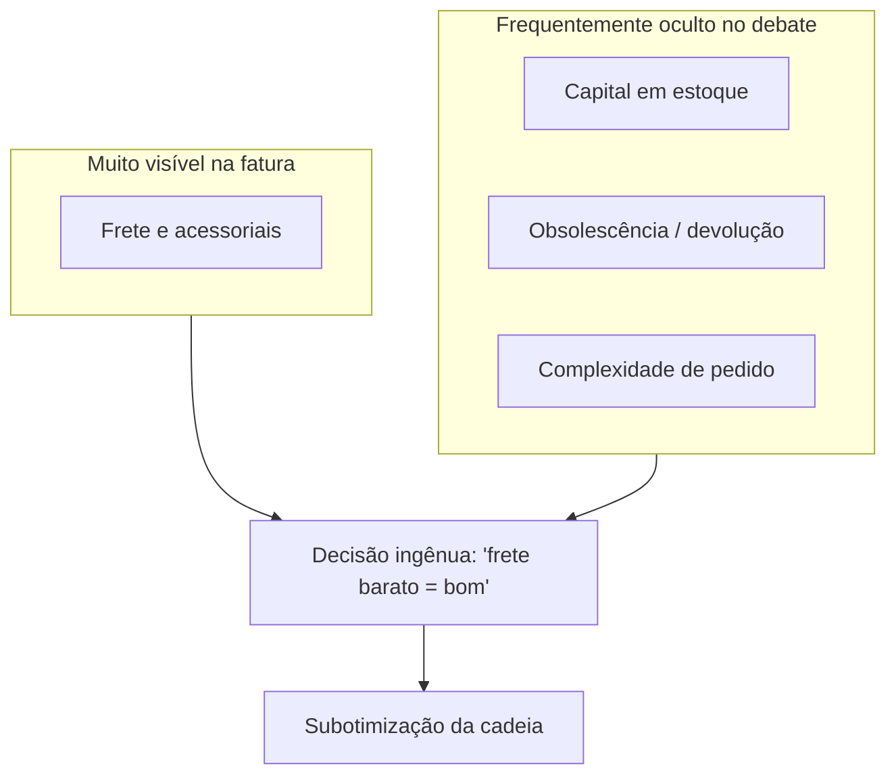

# Estrutura de custos logísticos — o iceberg que finanças sente antes do frete aparecer na fatura

**Trilha:** Fundamentos e estratégia · **Módulo:** Custos logísticos e performance  
**Público / nível:** Intermediário — útil para quem vem de operações e precisa falar **P&L**, ou de finanças e precisa entender **doca** sem reduzir tudo a “despesa de frete”.  
**Duração sugerida:** entre **duas horas** e **duas horas e meia** se você refizer o caso numérico com suas próprias premissas de capital; **noventa minutos** em leitura continua superficial para o tema.  
**Resultado de aprendizagem:** ao terminar, você deve conseguir **decompor** custos logísticos em **buckets** coerentes; **explicar** por que *total landed cost* e *total cost to serve* são lentes diferentes sobre o mesmo objeto; **usar** a intuição de **ABC** (*activity-based costing*) para evitar rateios que escondem **cliente caro**; **ligar** decisões de estoque e de rede a **capital de giro**; e **narrar** o trade-off triplo **serviço–custo–capital** sem magia nem culpa unilateral na transportadora.

---

Há um tipo de “vitória” que aparece no e-mail da diretoria na sexta-feira: **“negociamos 7% de redução no frete”**. Segunda-feira, o armazém relata **mais devoluções**, o atendimento reclama de **pedidos incompletos** e o estoque médio **subiu** porque alguém trocou **frequência** por **lote** para acomodar o novo padrão de transporte. Isto não é paradoxo místico; é **subotimização** — otimizar um elo **às custas** do sistema. Bowersox, Closs, Cooper e Bowersox (*Supply Chain Logistics Management*, McGraw-Hill) insistem na logística como **processo medido** em custo **e** serviço; Christopher (*Logistics and Supply Chain Management*, Pearson) lembra que a competição é frequentemente **cadeia contra cadeia**; Ballou (*Business Logistics / Supply Chain Management*, Pearson) dá ferramentas clássicas de engenharia econômica aplicada à logística. Você não precisa decorar; precisa de **vocabulário** para não confundir **fatura** com **economia**.

A **TechLar** volta como ancoragem: e-commerce com **dois canais** (site próprio e marketplace). O mesmo SKU pode ter **margem líquida** radicalmente diferente quando se abre o *black box* logístico.

---

## Buckets — um mapa honesto do iceberg

Um modelo pedagógico útil separa:

| Bucket | O que entra (exemplos) |
|--------|-------------------------|
| Transporte | Frete, combustível, pedágio, seguro de carga, descarga, devolução, multas contratuais |
| Armazém | m² ou palete-dia, pessoa-hora, equipamento, energia, sistema (parcela) |
| Capital em estoque | Custo de oportunidade / WACC × valor médio em estoque |
| Perdas | Shrinkage, avaria, obsolescência, vencimento |
| Overhead proporcional | Planejamento, CS logístico, TI e dados |

**Analogia do restaurante:** o cliente vê **conta** e **tempo de espera**; o dono vê **comida estragada**, **hora extra**, **geladeira cheia demais** (capital), **delivery** e **reembolso**. O “frete” do delivery é só a **linha visível**; o resto é **estrutura de custo** que decide se o cardápio prometido **fecha** ou não.

---

## Landed cost versus cost to serve — duas perguntações diferentes

**Landed cost** pergunta: “quanto custa **trazer** este item até o ponto de uso, incluindo compra, frete, seguros, impostos incidentais na importação (quando aplicável), manuseio inicial?” — a pergunta é **objeto-centric**. **Total cost to serve** pergunta: “quanto este **cliente/canal** consome de recurso marginal da cadeia, incluindo devoluções, visitas, picking caro, atendimento?” — a pergunta é **relacional**. **Consenso de mercado:** misturar as duas lentes no mesmo slide sem rótulo gera **briga de orçamento** eterna.

Na TechLar, o marketplace exige **etiqueta** específica, **SLA** curto e aceita **devolução** alta; o site próprio tem **pedido médio** maior e **mix** mais estável. O mesmo produto pode ser **lucrativo** em um canal e **destruidor de margem** no outro — **sem** “culpar o produto”.

---

## ABC — rateio bonito é maquiagem perigosa

**ABC** (*activity-based costing*) atribui custo pelo **driver** que consome recurso: linhas de pedido, paletes, horas de máquina, horas de atendimento. A ideia é simples; a implementação exige dados. **Hipótese pedagógica:** empresas medianas falham menos por “falta de modelo matemático” e mais por **cadastro** e **alocação política** de overhead.

**Analogia do condomínio:** dividir a conta do elevador **igual** por unidade esconde quem usa **dez vezes por dia** versus quem mora no térreo. Logisticamente, “cliente que pede dez linhas diárias de SKU diferente” versus “cliente que puxa palete cheio” é a mesma história.

---

## Caso numérico — dois cenários, uma decisão

**Base:** 10.000 un./mês; valor unitário **R$ 50**; custo de capital simplificado **1% ao mês** sobre valor médio em estoque.

| Cenário | R$/un (frete+manuseio) | Estoque médio (un) | Fixo mensal de armazém (índice) |
|---------|-------------------------|---------------------|----------------------------------|
| X | 2,20 | 8.000 | 100 |
| Y | 1,80 | 12.000 | 148 |

**Tarefas:** (1) custo de capital mensal ≈ 0,01 × 50 × estoque médio; (2) custo de transporte/manuseio = 10.000 × R$/un; (3) some com fixo; (4) escreva **duas frases** sobre quando Y ainda pode ser melhor apesar de **maior capital**.

**Gabarito pedagógico:** capital em X ≈ 0,01×50×8.000 = 4.000; em Y ≈ 6.000; transporte X = 22.000, Y = 18.000; totais dependem do fixo — a lição é que **Y** pode ser superior em **serviço** (cobertura regional), **risco** ou **mix** que X não sustenta; sem essas variáveis, o número não “decide” sozinho.

---

## KPIs — poucos, com dono e definição

- **Custo logístico por pedido** e por **unidade entregue** (com corte por canal).  
- **Margem líquida por cliente** quando dados permitem — senão, **família** de clientes.  
- **Cobertura (dias)** como proxy honesto de **capital** e **risco**.

---

## Erros comuns

- Isolar **KPI de frete** sem OTIF e sem capital.  
- Ignorar **custo de oportunidade** do estoque porque “não aparece no SPED”.  
- **Médias globais** que escondem cauda de clientes caros.

---

## Fechamento

**Takeaways:** veja **iceberg**; use **drivers**; ligue serviço a **capital** e a **canal**.

**Pergunta:** qual custo oculto mais distorce decisões na sua empresa hoje?

---

## Referências

1. BOWERSOX, D. J.; CLOSS, D. J.; COOPER, M. B.; BOWERSOX, J. C. *Supply Chain Logistics Management*. McGraw-Hill. https://www.mheducation.com/highered/product/supply-chain-logistics-management-bowersox.html  
2. CHOPRA, S.; MEINDL, P. *Supply Chain Management: Strategy, Planning, and Operation*. Pearson. https://www.pearson.com/en-us/subject-catalog/p/supply-chain-management-strategy-planning-and-operation/P200000012829  
3. BALLOU, R. H. *Business Logistics / Supply Chain Management*. Pearson.  
4. CHRISTOPHER, M. *Logistics and Supply Chain Management*. Pearson, 2022. https://www.pearson.com/en-us/subject-catalog/p/logistics-and-supply-chain-management/P200000007134  
5. CSCMP — Glossário: https://cscmp.org/CSCMP/cscmp/educate/scm_definitions_and_glossary_of_terms.aspx  
