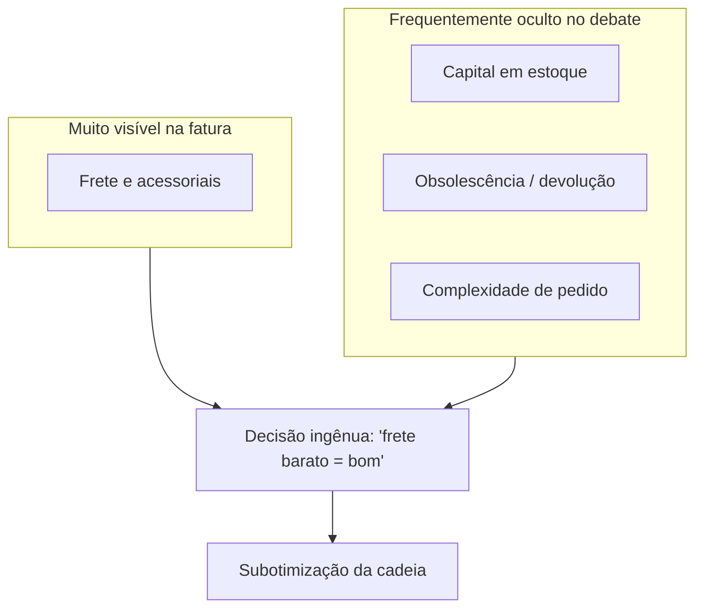

# Estrutura de custos logísticos — o iceberg que finanças sente antes do frete aparecer na fatura

## Objetivos e resultado de aprendizagem

Ao final da aula, o aluno será capaz de:

- **Decompor** custo logístico total em buckets (transporte, armazém, capital, perdas, overhead).
- **Diferenciar** custo visível (fatura) de custo oculto (capital, devolução, retrabalho, multa).
- **Comparar** *landed cost* (perspectiva do item) vs. *cost to serve* (perspectiva do canal/cliente).
- **Justificar** decisões sem subotimizar a cadeia.
- **Aplicar** ABC para alocação por driver de consumo.
- **Conhecer** efeitos da tributação BR (ICMS, ICMS-ST, PIS/COFINS, DIFAL, futura CBS/IBS) sobre custo logístico.

**Duração sugerida:** 70–90 min.
**Pré-requisitos:** Aulas 1.1 a 1.3 e Módulo 2.

## Mapa do conteúdo

- Iceberg do custo logístico — buckets honestos.
- Custo logístico no PIB BR e comparativo global.
- Landed cost × cost to serve.
- ABC sem maquiagem — driver-based costing.
- Tributação BR aplicada (ICMS, ST, DIFAL, PIS/COFINS, futura reforma).
- TCO completo de SKU/canal.
- Caso TechLar — site próprio vs. marketplace.

## Ponte

Conecta com [Fretes e negociação](aula-02-fretes-contratos-negociacao.md) para aplicação contratual; com [KPIs](aula-03-nivel-servico-kpis-logisticos.md) para medição; com [Estratégia](../modulo-01-fundamentos-logistica-empresarial/aula-03-planejamento-niveis-decisao.md) para decisão de rede.

Há um tipo de “vitória” que aparece no e-mail da diretoria na sexta-feira: **“negociamos 7% de redução no frete”**. Segunda-feira, o armazém relata **mais devoluções**, o atendimento reclama de **pedidos incompletos** e o estoque médio **subiu** porque alguém trocou **frequência** por **lote** para acomodar o novo padrão de transporte. Isto não é paradoxo místico; é **subotimização** — otimizar um elo **às custas** do sistema. Bowersox, Closs, Cooper e Bowersox (*Supply Chain Logistics Management*, McGraw-Hill) insistem na logística como **processo medido** em custo **e** serviço; Christopher (*Logistics and Supply Chain Management*, Pearson) lembra que a competição é frequentemente **cadeia contra cadeia**; Ballou (*Business Logistics / Supply Chain Management*, Pearson) dá ferramentas clássicas de engenharia econômica aplicada à logística. Você não precisa decorar; precisa de **vocabulário** para não confundir **fatura** com **economia**.

A **TechLar** volta como ancoragem: e-commerce com **dois canais** (site próprio e marketplace). O mesmo SKU pode ter **margem líquida** radicalmente diferente quando se abre o *black box* logístico.

---

## Buckets — um mapa honesto do iceberg

Um modelo pedagógico útil separa:

| Bucket | O que entra (exemplos) |
|--------|-------------------------|
| Transporte | Frete, combustível, pedágio, seguro de carga, descarga, devolução, multas contratuais |
| Armazém | m² ou palete-dia, pessoa-hora, equipamento, energia, sistema (parcela) |
| Capital em estoque | Custo de oportunidade / WACC × valor médio em estoque |
| Perdas | Shrinkage, avaria, obsolescência, vencimento |
| Overhead proporcional | Planejamento, CS logístico, TI e dados |

**Analogia do restaurante:** o cliente vê **conta** e **tempo de espera**; o dono vê **comida estragada**, **hora extra**, **geladeira cheia demais** (capital), **delivery** e **reembolso**. O “frete” do delivery é só a **linha visível**; o resto é **estrutura de custo** que decide se o cardápio prometido **fecha** ou não.

---

### Custo logístico no Brasil — números de referência

Pesquisas anuais do **ILOS** estimam que o custo logístico das **empresas brasileiras** representa entre **8% e 14% da receita líquida** dependendo do setor (varejo, indústria, agro). Em termos macro, **~12–13% do PIB**, contra:

- **EUA**: ~7,5–8,5% (CSCMP State of Logistics Report).
- **União Europeia (média)**: ~9–10%.
- **China**: ~14–15% (mas em queda forte).
- **Alemanha**: ~8%.

**Decomposição típica BR** (% do custo logístico total — ILOS, ordens de grandeza):

| Bucket | % típica | Comentário |
|--------|---------:|------------|
| Transporte | 55–65% | Predomínio rodoviário (matriz BR) |
| Armazém | 12–18% | Inclui pessoal, energia, sistema |
| Capital em estoque | 12–20% | Função do giro e custo do dinheiro (Selic) |
| Administrativo logístico | 5–10% | Plan, CS log, TI |
| Perdas (avaria, obsolescência) | 1–4% | Maior em perecíveis e moda |

> **Atenção:** percentuais variam por setor (ex.: agro tem armazém pesado; e-commerce tem CS log alto; perecível tem perdas elevadas). O ponto pedagógico: **transporte domina mas não é tudo**, e **capital é frequentemente subestimado** porque "não aparece no SPED".

### Tributação brasileira sobre custo logístico — atenção ao detalhe

Diferentemente da maior parte do mundo, no Brasil a logística carrega **tributação cumulativa** que entra no custo total:

- **ICMS** sobre o transporte interestadual (CT-e): 7%, 12% ou 17–19% dependendo da origem/destino.
- **ICMS-ST** sobre mercadoria — antecipa imposto na origem; afeta capital de giro.
- **DIFAL** (Diferencial de Alíquota) — em B2C interestadual; obrigação calcular e recolher na operação.
- **PIS/COFINS** sobre frete contratado — pode haver crédito (regime não-cumulativo) ou não (cumulativo).
- **GRIS** (Gerenciamento de Riscos) e **Ad valorem** — taxas adicionais cobradas por transportadoras (~0,3–1% sobre valor da NF, dependendo do tipo de carga e segurador).
- **Pedágio** — sistemas multilane em SP, PR, MG, RS adicionam ~3–8% no custo de rota longa.
- **TARE / Tabela mínima ANTT** (Lei 13.103/2015 + reedições) — frete piso obrigatório por tipo de carga, peso e distância. Não respeitar é multa.

A **Reforma Tributária do Consumo (LC 214/2025)** unifica boa parte disso em **CBS + IBS** com cobrança no **destino** — e tende a reduzir o "custo Brasil" tributário sobre logística no longo prazo (transição 2026–2033). Mas durante a transição há **dupla apuração** que **aumenta** custo administrativo. Empresas como Deloitte, EY, KPMG, FGV CCiF publicam guias específicos sobre o tema.

> **Ponte com a aula 1.3:** decisões de **rede e CD** no Brasil são inseparáveis de **tributação estadual** — esse acoplamento é o que faz o ES e SC concentrarem CDs de e-commerce hoje, e é o que tende a se desfazer com a reforma.

---

## Landed cost versus cost to serve — duas perguntações diferentes

**Landed cost** pergunta: “quanto custa **trazer** este item até o ponto de uso, incluindo compra, frete, seguros, impostos incidentais na importação (quando aplicável), manuseio inicial?” — a pergunta é **objeto-centric**. **Total cost to serve** pergunta: “quanto este **cliente/canal** consome de recurso marginal da cadeia, incluindo devoluções, visitas, picking caro, atendimento?” — a pergunta é **relacional**. **Consenso de mercado:** misturar as duas lentes no mesmo slide sem rótulo gera **briga de orçamento** eterna.

Na TechLar, o marketplace exige **etiqueta** específica, **SLA** curto e aceita **devolução** alta; o site próprio tem **pedido médio** maior e **mix** mais estável. O mesmo produto pode ser **lucrativo** em um canal e **destruidor de margem** no outro — **sem** “culpar o produto”.

---

## ABC — rateio bonito é maquiagem perigosa

**ABC** (*activity-based costing*) atribui custo pelo **driver** que consome recurso: linhas de pedido, paletes, horas de máquina, horas de atendimento. A ideia é simples; a implementação exige dados. **Hipótese pedagógica:** empresas medianas falham menos por “falta de modelo matemático” e mais por **cadastro** e **alocação política** de overhead.

**Analogia do condomínio:** dividir a conta do elevador **igual** por unidade esconde quem usa **dez vezes por dia** versus quem mora no térreo. Logisticamente, “cliente que pede dez linhas diárias de SKU diferente” versus “cliente que puxa palete cheio” é a mesma história.

---

## Caso numérico — dois cenários, uma decisão

**Base:** 10.000 un./mês; valor unitário **R$ 50**; custo de capital simplificado **1% ao mês** sobre valor médio em estoque.

| Cenário | R$/un (frete+manuseio) | Estoque médio (un) | Fixo mensal de armazém (índice) |
|---------|-------------------------|---------------------|----------------------------------|
| X | 2,20 | 8.000 | 100 |
| Y | 1,80 | 12.000 | 148 |

**Tarefas:** (1) custo de capital mensal ≈ 0,01 × 50 × estoque médio; (2) custo de transporte/manuseio = 10.000 × R$/un; (3) some com fixo; (4) escreva **duas frases** sobre quando Y ainda pode ser melhor apesar de **maior capital**.

**Gabarito pedagógico:** capital em X ≈ 0,01×50×8.000 = 4.000; em Y ≈ 6.000; transporte X = 22.000, Y = 18.000; totais dependem do fixo — a lição é que **Y** pode ser superior em **serviço** (cobertura regional), **risco** ou **mix** que X não sustenta; sem essas variáveis, o número não “decide” sozinho.

---

## O que vira dado no sistema

| Conceito | Onde vive | Cuidado |
|----------|-----------|---------|
| Frete contratado | TMS / fatura transportadora / NF de serviço | Conferir tabela contratada × cobrada (audit) |
| Frete em CT-e | XML do CT-e | Fonte fiscal para conciliação |
| Custo de armazém | ERP (centro de custo) / WMS (atividades) | Diferenciar fixo (m²) e variável (linhas) |
| Capital em estoque | ERP (estoque médio × custo) | Usar WACC ou Selic + spread como custo de oportunidade |
| Devolução / avaria | WMS, ERP (notas devolução) | Relacionar a SKU, cliente, transportadora |
| Custo por pedido | BI sobre integração de tudo | Choose driver: linha, peso, palete, valor |
| Custo por canal | OMS + ERP + TMS + retornos | Cuidado com rateio "igual" — destrói análise |

> **Sintoma típico:** finanças tem "custo logístico" como **uma linha** no DRE — sem decomposição por canal/SKU. Isso impede qualquer decisão.

---

## KPIs — poucos, com dono e definição

| KPI | Pergunta que responde | Dono | Fonte | Cadência | Playbook |
|-----|------------------------|------|-------|----------|----------|
| Custo logístico % receita líquida | Estamos competitivos? | CFO + Diretor Log | DRE + ERP | Mensal | Comparar com benchmark setor (ILOS) |
| Custo por pedido | Quanto custa cada despacho? | Operação | TMS+ERP | Mensal | Decompor por canal e região |
| Custo por unidade entregue | Quanto custa por SKU/cliente? | Comercial + Log | BI | Trimestral | Identificar SKU/cliente destruidor de margem |
| Cobertura de estoque (dias) | Quanto capital está parado? | Plan | ERP | Semanal | Ação para SKUs com >X dias |
| % frete sobre receita | Transporte está pesado? | Log | TMS | Mensal | Decompor por modal e rota |
| Margem líquida por canal | Qual canal vale a pena? | Comercial + Fin | BI | Mensal | Reavaliar incentivos por canal |
| Custo de devolução / receita | Logística reversa pesa? | Log + CS | WMS+ERP | Mensal | Atacar causa raiz por SKU/transportadora |

---

## Ferramentas e tecnologias relevantes

| Para... | Começar | Crescer | Cuidado |
|---------|---------|---------|---------|
| Decompor custo logístico | Excel + DRE rateado | BI (Power BI/Tableau) sobre data warehouse logístico | Não rateio "igual" — usa drivers reais |
| ABC | Planilha por driver | Software de costing (SAP CO-PA, Oracle Profitability Manager) | Baseado em dados, não em consenso político |
| Cost-to-serve | Análise pontual | Modelo recorrente integrado a S&OP | Atualizar drivers anualmente |
| Auditoria de frete | Excel com tabela contratual | Plataformas: Maersk SpotShop, Shipsy, Trinity Logistics, NeoGrid Frete Audit | Comparar CT-e × tabela × pedido |
| Conciliação fiscal logística | SPED Fiscal | Soluções fiscais (Sovos, Synchro, Mastersaf) | Crédito de PIS/COFINS sobre frete bem aproveitado |
| Análise de margem por cliente | Excel | CRM + ERP integrado | Contra-incentivo do comercial é real |

---

## Erros comuns e armadilhas

- Isolar **KPI de frete** sem OTIF e sem capital.
- Ignorar **custo de oportunidade** do estoque porque "não aparece no SPED".
- **Médias globais** que escondem cauda de clientes caros (regra **80/20**: 20% dos clientes/SKUs frequentemente respondem por 100%+ do lucro líquido).
- **Rateio igualitário** de overhead — finge equidade, distorce decisão.
- Não atribuir **custo de devolução** ao canal/cliente que devolve.
- **Discount na compra** que aumenta MOQ e estoque morto — vitória do comprador é derrota do CFO.
- Negociar **frete spot** olhando só preço — sem garantir capacidade nos picos (Black Friday).
- Ignorar **GRIS, ad valorem, pedágio, ICMS sobre frete** — entram na fatura mas saem do esquecimento só na fatura.
- Tratar canal como **caixa preta**: marketplace tem custo (comissão, fulfillment, devolução) que site próprio não tem — ou tem em outra forma.
- Não atualizar **WACC** anualmente — em ambiente de Selic alta, capital pesa muito mais.

---

## Aplicação — exercícios

1. **Caso TechLar — site vs. marketplace.** Para o mesmo SKU (R$ 150 ticket), site próprio tem custo logístico R$ 14/pedido e devolução 5%; marketplace tem custo R$ 18/pedido (inclui taxa de frete subsidiado), devolução 12% e comissão 16%. Calcule a **margem líquida por pedido** em cada canal e diga em qual reduzir investimento. Discuta limites do exercício.

2. **Sensibilidade Selic.** Empresa tem estoque médio de R$ 50M. Calcule custo de capital com WACC = 15% a.a. e depois com 22% a.a. Qual o **delta** anual? Qual a redução de cobertura (em dias) necessária para "absorver" o aumento sem subir custo total?

3. **Auditoria de frete.** Em uma planilha de 100 CT-e, 14 cobraram acima da tabela contratual. Diferença média: R$ 38 por CT-e. **Qual o impacto anual?** Qual processo você implanta para evitar?

4. **Reforma tributária.** Sua empresa tem CD em ES com benefício fiscal ICMS de 75%. A reforma tributária prevê redução desse benefício a partir de 2029. **Como reorientar a estratégia de rede ao longo de 4 anos?** Liste 3 alavancas concretas.

---

## Glossário express

- **Landed cost:** custo total para colocar item no ponto de uso.
- **Cost to serve:** custo de servir um cliente/canal específico.
- **ABC:** Activity-Based Costing.
- **WACC:** Weighted Average Cost of Capital.
- **DRE:** Demonstração do Resultado do Exercício.
- **GRIS:** Gerenciamento de Riscos (taxa).
- **Ad valorem:** taxa proporcional ao valor da carga.
- **DIFAL:** Diferencial de Alíquota.
- **CBS/IBS:** novos tributos da Reforma Tributária (transição 2026–2033).

---

## Fechamento

**Takeaways:**

1. Veja o **iceberg** — fatura é só uma das colunas.
2. Use **drivers** — rateio "igual" é maquiagem.
3. Ligue serviço a **capital**, **canal** e **tributação BR**.
4. Auditoria de frete e cost-to-serve **pagam-se** rapidamente.
5. **Reforma tributária** vai mudar mapa de CDs — comece a planejar a transição.

**Pergunta:** qual custo oculto mais distorce decisões na sua empresa hoje?

---

## Referências

1. BOWERSOX, D. J.; CLOSS, D. J.; COOPER, M. B.; BOWERSOX, J. C. *Supply Chain Logistics Management*. McGraw-Hill. https://www.mheducation.com/highered/product/supply-chain-logistics-management-bowersox.html
2. CHOPRA, S.; MEINDL, P. *Supply Chain Management: Strategy, Planning, and Operation*. Pearson. https://www.pearson.com/en-us/subject-catalog/p/supply-chain-management-strategy-planning-and-operation/P200000012829
3. BALLOU, R. H. *Business Logistics / Supply Chain Management*. Pearson.
4. CHRISTOPHER, M. *Logistics and Supply Chain Management*. Pearson, 2022. https://www.pearson.com/en-us/subject-catalog/p/logistics-and-supply-chain-management/P200000007134
5. CSCMP — Glossário e State of Logistics Report: https://cscmp.org/
6. ILOS — *Pesquisa de Custos Logísticos no Brasil* (anual): https://www.ilos.com.br/web/
7. CNT — Pesquisa CNT de Rodovias e custos: https://www.cnt.org.br/
8. KAPLAN, R.; ANDERSON, S. *Time-Driven Activity-Based Costing*. Harvard Business Review Press.
9. FGV CCiF — Reforma Tributária do Consumo: https://ccif.com.br/
10. Receita Federal — Reforma Tributária: https://www.gov.br/receitafederal/pt-br/assuntos/reforma-tributaria
11. ANTT — Tabela mínima de frete: https://www.gov.br/antt/pt-br

---

## Pontes para outras trilhas

- [Trilha Logística Estratégica](../../trilha-logistica-estrategica/README.md) — *Cost-to-serve* avançado e segmentação.
- [Trilha Tecnologia e Sistemas](../../trilha-tecnologia-e-sistemas/README.md) — TMS, BI logístico e auditoria de frete.
- [Trilha Dados e Analytics](../../trilha-dados-analytics-logistica/README.md) — modelagem de custo em data warehouse.
- [Trilha Lean Six Sigma](../../trilha-lean-seis-sigma-logistica-poc/README.md) — combate ao desperdício como redução de custo.
