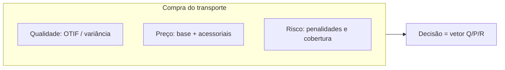

# Fretes, contratos e negociação — quando o preço bonito esconde a cauda do atraso e o POD que nunca chegou

## Objetivos e resultado de aprendizagem

Ao final da aula, o aluno será capaz de:

- **Comparar** propostas de frete em visão de custo total (Q/P/R).
- **Ler** cláusulas críticas de contrato — SLA, POD, multa, gatilhos.
- **Negociar** com foco em serviço, risco e capacidade nos picos.
- **Aplicar** corretamente Incoterms® 2020 — sem confundir com promessa comercial.
- **Conhecer** o ambiente regulatório BR — ANTT, tabela mínima, GRIS, RNTRC, Lei do Motorista.
- **Calcular** TCO de frota própria × terceiro (incluindo backhaul).

**Duração sugerida:** 80–100 min.
**Pré-requisitos:** Aulas 1.1, 1.2 e 4.1 (estrutura de custo).

## Mapa do conteúdo

- Decomposição de tarifa — base + acessoriais + impostos.
- Modais BR — rodoviário dominante, cabotagem em ascensão, ferrovia em nichos.
- Frota própria × terceiro × dedicada — capex, controle, flexibilidade, backhaul.
- RFP estruturado — dados mínimos para evitar proposta-mentira.
- Incoterms® 2020 — fronteira de risco e custo (importação/exportação).
- Contrato — SLA, POD, multas, reajuste, GRIS, seguro.
- Regulação BR: ANTT, tabela mínima de frete, RNTRC, Lei do Motorista.
- Cabotagem — BR Do Mar e crescimento marítimo doméstico.
- Caso TechLar — RFP e auditoria de frete.

## Ponte

Conecta com [Estrutura de custos](aula-01-estrutura-custos-logisticos.md) para visão financeira; com [Nível de serviço e KPIs](aula-03-nivel-servico-kpis-logisticos.md) para governança de performance; com [Riscos](../modulo-02-supply-chain-management/aula-03-riscos-resiliencia-sustentabilidade-scm.md) para resiliência de transporte.

A frase “ganhamos desconto no frete” é, muitas vezes, o primeiro capítulo de um drama em três atos: no segundo, **OTIF** cai; no terceiro, **CS** e **reenvio** comem a economia. Christopher descreve redes que competem por **confiabilidade** tanto quanto por preço; Bowersox et al. reforçam a leitura integrada de desempenho logístico; Chopra e Meindl dão o arcabouço de *drivers* — instalações, estoque, transporte, informação — para lembrar que **transporte** não flutua só.

Na **TechLar**, o time comercial adora comparar **tarifa por pacote** entre transportadoras; o time de operações adora comparar **P95 de coleta** e **taxa de POD válido**. Esta aula ensina a **sentar os dois na mesma mesa** com um **vetor** de decisão.

---

## A fatura é um iceberg dentro do iceberg

Base por **zona/peso**, **cubagem** (peso taxado), **fuel surcharge**, agendamento, espera, **redelivery**, seguro, manuseio extraordinário. Em oceanos aparecem **detention/demurrage** como **risco** de processo e contrato. **Consenso de mercado:** quem negocia só a **linha base** sem anexar **SLA** e **definição de POD** está comprando **caixa preta** com etiqueta de desconto.

**Analogia do plano de saúde:** a mensalidade é só a **capa**; coparticipação, rede, fila e **exclusões** definem o **custo total vivido**. Transporte é parecido: a **tarifa** é a capa.

---

## Modais — âncoras mentais sem dogma

| Modal | Onde tende a brilhar | Cuidado clássico |
|-------|----------------------|------------------|
| FTL | Grandes volumes ponto a ponto | **Fill** do veículo e **idle** na doca |
| LTL | Médios volumes | Transbordo, variância, **damages** |
| Pacote / courier | Peças pequenas, urgência | Custo unitário e **limite dimensional** |
| Multimodal | Longa distância | Coordenação e **lead time** composto |

**MetalRio** importa insumos; **TechLar** distribui pacotes. Os modais mudam; a lógica **Q/P/R** não.

### Modais no Brasil — matriz e contexto regulatório

A matriz brasileira é **fortemente rodoviária** (~65% do TKU) — herança histórica, com investimento em ferrovia restrito a corredores específicos (minério, grãos VLI/Rumo). Comparações:

| País | Rodovia | Ferrovia | Hidrovia | Cabotagem |
|------|--------:|---------:|---------:|----------:|
| Brasil | ~65% | ~15% | ~5% | ~12% |
| EUA | ~32% | ~43% | ~10% | ~12% |
| China | ~50% | ~25% | ~14% | ~8% |
| Alemanha | ~73% | ~17% | ~10% | — |

**Cabotagem BR — em alta com BR Do Mar (Lei 14.301/2022).** Empresas como **Aliança/Hapag**, **Log-In** e **Posidonia** ofereceram capacidade adicional, principalmente nas rotas Sudeste–Norte e Sul–Norte. Lead time maior (5–8 dias SP–MA), mas **30–45% mais barato** por TKU e **menor pegada de CO₂** (~1/4 do rodoviário).

**Ferrovia — corredores fortes:** VLI (norte), Rumo (Mato Grosso–Santos para grãos), MRS (minério).

**Aerocharter:** TAM Cargo, LATAM Cargo, FedEx, DHL, ASL Aviation — caro mas crítico para perecíveis e farma.

**Regulação BR para rodoviário:**

- **RNTRC** — registro nacional do transportador rodoviário, obrigatório.
- **Tabela mínima ANTT** — frete piso por categoria de carga, peso, distância. Atualizações periódicas.
- **Lei do Motorista (13.103/2015)** — jornada, descanso obrigatório, controle de horas; impacta lead time real e custo.
- **GRIS** (Gerenciamento de Riscos) — 0,3–1% sobre valor NF, obrigatória em cargas de alto valor agregado.
- **Ad valorem** — seguro proporcional ao valor.
- **Pedágio multilane** — SP, PR, MG, RS principalmente; pode adicionar 3–8% em rotas longas.
- **CT-e Multimodal (CT-e MO)** — quando há mais de um modal envolvido.

> **Armadilha BR:** transportadora que oferece tarifa "muito abaixo da tabela ANTT" pode estar operando irregularmente — risco de **autuação solidária** ao embarcador (responsabilidade compartilhada).

---

## Frota própria versus terceiro — capex, flexibilidade e "volta vazia"

Frota própria compra **controle de janela** e **narrativa** de marca — e vende **capex**, manutenção, gestão de **motorista**, risco trabalhista e o fantasma do **empty backhaul**. Terceiro compra **elasticidade** — e vende **dependência**, **qualidade variável** e necessidade de **governança** contratual. Não existe resposta universal; existe **estratégia** e **maturidade de dados**.

| Modelo | Quando faz sentido | Cuidado | Exemplo BR |
|--------|--------------------|---------|------------|
| Frota própria | Volume estável, rota dedicada, marca essencial | Capex alto, gestão de pessoas, backhaul vazio | Ambev (frota própria significativa em distribuição capilar) |
| 3PL terceirizado | Volume variável, expansão geográfica | Dependência, qualidade variável | E-commerce médio com Total Express, Jadlog, Loggi |
| Frota dedicada (carrier) | Híbrido — volume regular sem capex | Contrato anual, takenotpay | DHL Supply Chain, JSL Dedicated |
| 4PL / LLP | Operação complexa, multimodal | Margem 4PL × visibilidade | DHL Lead Logistics Provider, Maersk para contas globais |
| Spot | Pico, exceção, rota nova | Sem garantia de capacidade no pico real | Truckpad, FreteBras para rodoviário spot |

**Calcular backhaul:** custo de rota A→B sem retorno é **2× o custo aparente**. Se conseguir retorno (mesmo que com tarifa menor), reduz para **~1,3–1,5×**. Plataformas como **TruckPad**, **CargoX**, **FreteBras** ajudam, mas exigem maturidade operacional.

---

## RFP — dados mínimos que evitam proposta bonita mentirosa

Sem **matriz OD**, **padrão de peso/cubagem**, **janelas**, **volumes por dia da semana**, **SLA** e **histórico de ocorrências**, o fornecedor **chuta** — e você compara **alucinações diferentes**. **Hipótese pedagógica:** RFP ruim é quase sempre **custo oculto** de tempo interno.

---

## Incoterms® 2020 — fronteira de responsabilidade, não “truque de importação”

As regras **Incoterms®** da *International Chamber of Commerce* alocam **riscos e custos** entre partes. Fonte oficial: https://iccwbo.org/business-solutions/incoterms-rules/incoterms-2020/

> **Aviso legal:** a escolha do Incoterm e a redação contratual exigem **assessoria jurídica** e contexto fiscal aduaneiro; aqui tratamos **implicações logísticas** — onde o risco transita, impacto em seguro, documentação, coordenação de entrega.

**Analogia da mudança internacional:** quem paga o **container** até o porto, quem assume o **seguro**, quem busca na **alfândega** — se não estiver escrito, a briga vem **antes** do sofá chegar.

---

## Caso comparativo — duas propostas, um custo escondido

| Proposta | R$/entrega | P95 LT (dias) | Política de penalidade |
|----------|------------|---------------|-------------------------|
| Alfa | 42 | 3,0 | baixa |
| Beta | 36 | 4,5 | baixa |

**Extensão:** cada entrega fora da janela custa **R$ 120** internos (CS + reprocesso). Assuma **2%** de violações na Alfa e **5%** na Beta (fictício para exercício). Calcule **custo esperado simples** por entrega incluindo essa cauda e discuta quando Beta ainda pode ser melhor (ex.: cobertura de **rotas remotas** onde Alfa nem passa).

**Gabarito pedagógico:** custo esperado ≈ tarifa + probabilidade×custo de falha; Beta pode vencer em **cobertura** ou **capacidade de pico** mesmo com cauda pior — **vetor Q/P/R**.

---

## Exercícios

1. Liste **cinco** acessoriais que já viu ou imagina em contrato.  
2. Em uma frase, por que **“cedo demais”** pode violar OTIF B2B?

**Gabarito:** (1) agendamento, espera, combustível, redelivery, manuseio extra, reentrega, taxa de resíduo, palé não padronizado, etc. (2) janela de recebimento do cliente pode **recusar** chegada fora do slot.

---

## Cláusulas críticas — checklist para revisão contratual

| Cláusula | O que verificar | Armadilha clássica |
|----------|------------------|---------------------|
| **SLA de coleta** | Janela com tolerância numérica (ex.: ±30 min) | "esforço razoável" sem prazo |
| **SLA de entrega** | LT por região; P95 e não só média | só média esconde cauda |
| **POD** | Formato (foto+assinatura+geo); prazo upload (≤ 24h) | "POD físico em até 30 dias" inviabiliza cobrança |
| **Penalidade por OTIF baixo** | Gatilho objetivo, com fórmula | "será objeto de tratativa" = nada |
| **Multas por dano/extravio** | Valor reposição × valor declarado | só "valor de NF" deixa LP estourar |
| **Reajuste** | Índice (IPCA, INPC), periodicidade, gatilhos (combustível, salário) | reajuste anual sem reabertura por choque |
| **Combustível** | Cláusula de gatilho automático (Petrobras, ANP) | bloqueio em greve sem cláusula de força maior |
| **Capacidade nos picos** | Compromisso (Black Friday, Natal) com TON ou volumes mínimos | sem cláusula = reflete em frete spot caro no pico |
| **Subcontratação** | Direito do embarcador aprovar subcontratado | risco de qualidade e regulatório |
| **Confidencialidade** | NDA específico para dados de roteirização e clientes | dados estratégicos vazam |
| **Resilição** | Notice period; sem custo extra se SLA violado | "fidelidade 24 meses" sem cláusula de saída por SLA |

---

## O que vira dado no sistema

| Conceito | Onde vive | Cuidado |
|----------|-----------|---------|
| Tabela contratual | TMS / planilha master | Versão única, controle de quem altera |
| CT-e emitido | XML SEFAZ | Conferir frete cobrado × tabela |
| POD | TMS / app motorista | Anexo (foto+geo+assinatura digital) |
| Ocorrência (atraso, dano) | TMS / portal transportadora | Codificar causa para análise raiz |
| OTIF por transportadora | BI sobre TMS | Stratificar por região/SKU/janela |
| Audit de frete | Conciliação TMS × CT-e × tabela | Plataformas: Shipsy, NeoGrid, Mastersaf |
| GRIS / ad valorem | Inclusos no CT-e | Conferir apropriação correta |

---

## KPIs e decisão (kit mínimo)

| KPI | Pergunta que responde | Dono | Fonte | Cadência | Playbook |
|-----|------------------------|------|-------|----------|----------|
| OTIF por transportadora | Quem performa? | Log + CS | TMS | Semanal | Reunião QBR mensal com cada |
| Custo por entrega efetiva | Tarifa real (ex-acessoriais) | Log + Fin | TMS+CT-e | Mensal | Audit de frete |
| Taxa de POD válido | Estamos tendo evidência? | Log | TMS | Semanal | Bloquear pagamento sem POD válido |
| Variância de LT (P95) | Quão consistente? | Log | TMS | Mensal | Tratar transportadoras com cauda longa |
| % entrega com ocorrência | Quão incidente? | Log + CS | TMS | Mensal | RCA mensal por código de ocorrência |
| Custo de empty miles (frota própria) | Estamos otimizando rota? | Log | TMS / telemetria | Mensal | Roteirização + backhaul |
| Aderência à tabela contratual | Estamos sendo cobrados certo? | Fin + Log | Audit de frete | Mensal | Glosa em fatura |

---

## Ferramentas e tecnologias relevantes

| Para... | Começar | Crescer | Cuidado |
|---------|---------|---------|---------|
| RFP de transporte | Excel padronizado | TMS com módulo licitação | Padronize matriz OD obrigatoriamente |
| TMS | Planilha + emissor CT-e standalone | TMS BR (Brudam, Datasul, JBA, Senior, NeoGrid TMS, Sequoia, IntelliPost); global (SAP TM, Oracle OTM, Manhattan TMS) | Custo de implantação real, não é plug-and-play |
| Auditoria de frete | Excel comparando tabela × fatura | Shipsy, NeoGrid Frete Audit, Sovos | ROI muito alto; pagamento em meses |
| Roteirização | Manual + Google Maps | Roadnet, Routyn, OptimoRoute, ESRI | Considerar restrições reais (peso, janela, tipo de veículo) |
| Telemetria | Padrão da transportadora | Sascar, OnixSat, Cobli, Webfleet | Dado bruto vira valor só com gestão ativa |
| Visibilidade end-to-end | Status no TMS | Project44, FourKites, Shipwell | Necessário para B2B exigente |
| Mercado spot rodoviário | Buscar transportadora | TruckPad, CargoX, FreteBras | Sem garantia de capacidade nos picos críticos |

---

## Aplicação — exercícios

1. **Análise vetor Q/P/R.** Receba 3 propostas (tarifas, P95 de LT, política de POD/penalidade) e classifique-as no vetor Q/P/R. Justifique a escolha indicando trade-offs.

2. **Empty miles.** Frota própria com 30 caminhões; cada um faz rota A→B (300 km) por dia, sem retorno produtivo. Custo combustível R$ 4,50/km. **Calcule o custo anual** do retorno vazio. Quanto economizaria com 30% de backhaul?

3. **Cláusula POD.** Reescreva a cláusula "POD físico em até 30 dias" para uma redação que proteja o embarcador. Inclua formato, prazo de upload, penalidade pelo não cumprimento.

4. **Reforma tributária.** Como a transição CBS/IBS pode mudar o cálculo de "tarifa equivalente" entre transportadoras de estados diferentes? Liste 2 efeitos práticos.

5. **Cabotagem.** Empresa importa de SP para distribuir em MA. Compare rodoviário (R$ 280/ton, 4 dias) com cabotagem (R$ 175/ton, 7 dias). Qual escolher para SKU de baixo giro × alto giro? Por quê?

---

## Erros comuns e armadilhas

- Negociar **preço** sem **POD** digital e sem definição de **OTIF**.
- Ignorar **empty miles** em frota própria.
- Misturar **Incoterm** com **promessa de entrega** do marketplace.
- **Tarifa abaixo da tabela ANTT** — risco de autuação solidária.
- Não cláusula de **capacidade nos picos** (Black Friday, fim de mês fiscal).
- Cláusula de **multa OTIF** sem dado para apurar (sem TMS, vira "tratativa").
- Aceitar **subcontratação livre** — perdeu controle de qualidade e compliance.
- Não considerar **GRIS/ad valorem** na comparação — distorce decisão por ~5–15%.
- **Reajuste anual** sem cláusula de gatilho (combustível disparou em 2022 e contratos sem cláusula sangraram).
- Ignorar **Lei do Motorista** — descanso obrigatório distorce LT real prometido.
- Não ter **plano B** se transportadora principal falir/sair (concentração).

---

## Glossário express

- **FTL/LTL:** Full/Less than Truckload.
- **POD:** Proof of Delivery.
- **GRIS:** Gerenciamento de Risco (taxa).
- **Ad valorem:** taxa proporcional ao valor da carga.
- **CT-e:** Conhecimento de Transporte Eletrônico.
- **Backhaul:** retorno produtivo.
- **Spot:** mercado pontual sem contrato.
- **3PL/4PL:** terceiro de logística / "torre" coordenadora.
- **Detention/Demurrage:** sobretaxas no oceano por demora em devolver container.
- **RNTRC:** Registro Nacional do Transportador Rodoviário de Carga.

---

## Fechamento

**Takeaways:**

1. Frete é **serviço + risco + dados** — vetor Q/P/R, não só preço.
2. Leia **acessoriais e cláusulas** antes de assinar.
3. Incoterms® são **fronteira** de responsabilidade — não promessa comercial.
4. **Auditoria de frete** se paga em meses — implante.
5. Brasil tem **regulação específica** (ANTT, Lei do Motorista, GRIS) — ignorar é risco solidário.

**Pergunta:** qual cláusula do seu contrato hoje é **ambígua** demais para operar sem briga?

---

## Referências

1. ICC — *Incoterms® 2020*: https://iccwbo.org/business-solutions/incoterms-rules/incoterms-2020/
2. BOWERSOX, D. J.; et al. *Supply Chain Logistics Management*. McGraw-Hill. https://www.mheducation.com/highered/product/supply-chain-logistics-management-bowersox.html
3. CHOPRA, S.; MEINDL, P. *Supply Chain Management*. Pearson. https://www.pearson.com/en-us/subject-catalog/p/supply-chain-management-strategy-planning-and-operation/P200000012829
4. CHRISTOPHER, M. *Logistics and Supply Chain Management*. Pearson, 2022. https://www.pearson.com/en-us/subject-catalog/p/logistics-and-supply-chain-management/P200000007134
5. CSCMP — Glossário: https://cscmp.org/CSCMP/cscmp/educate/scm_definitions_and_glossary_of_terms.aspx
6. ANTT — Tabela mínima de frete e RNTRC: https://www.gov.br/antt/pt-br
7. Lei 13.103/2015 — Lei do Motorista: http://www.planalto.gov.br/ccivil_03/_ato2015-2018/2015/lei/l13103.htm
8. Lei 14.301/2022 — BR Do Mar (cabotagem): http://www.planalto.gov.br/ccivil_03/_ato2019-2022/2022/lei/l14301.htm
9. CNT — Pesquisa CNT de Rodovias e custos: https://www.cnt.org.br/
10. Confederação Nacional do Transporte — Boletim Estatístico: https://cnt.org.br/boletins
11. ABOL — Associação Brasileira de Operadores Logísticos: https://www.abolbrasil.org.br/

---

## Pontes para outras trilhas

- [Trilha Tecnologia e Sistemas](../../trilha-tecnologia-e-sistemas/README.md) — TMS, telemetria, plataformas de visibilidade.
- [Trilha Logística Estratégica](../../trilha-logistica-estrategica/README.md) — design de rede e make-or-buy de transporte.
- [Trilha Dados e Analytics](../../trilha-dados-analytics-logistica/README.md) — análise de OTIF e dashboards de frete.
