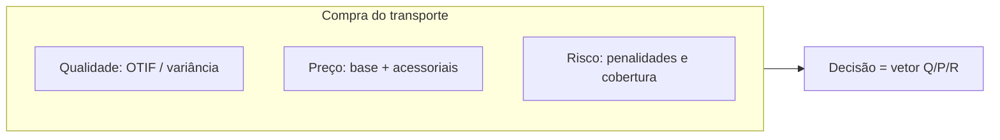

# Fretes, contratos e negociação — quando o preço bonito esconde a cauda do atraso e o POD que nunca chegou

A frase “ganhamos desconto no frete” é, muitas vezes, o primeiro capítulo de um drama em três atos: no segundo, **OTIF** cai; no terceiro, **CS** e **reenvio** comem a economia. Christopher descreve redes que competem por **confiabilidade** tanto quanto por preço; Bowersox et al. reforçam a leitura integrada de desempenho logístico; Chopra e Meindl dão o arcabouço de *drivers* — instalações, estoque, transporte, informação — para lembrar que **transporte** não flutua só.

Na **TechLar**, o time comercial adora comparar **tarifa por pacote** entre transportadoras; o time de operações adora comparar **P95 de coleta** e **taxa de POD válido**. Esta aula ensina a **sentar os dois na mesma mesa** com um **vetor** de decisão.

---

## A fatura é um iceberg dentro do iceberg

Base por **zona/peso**, **cubagem** (peso taxado), **fuel surcharge**, agendamento, espera, **redelivery**, seguro, manuseio extraordinário. Em oceanos aparecem **detention/demurrage** como **risco** de processo e contrato. **Consenso de mercado:** quem negocia só a **linha base** sem anexar **SLA** e **definição de POD** está comprando **caixa preta** com etiqueta de desconto.

**Analogia do plano de saúde:** a mensalidade é só a **capa**; coparticipação, rede, fila e **exclusões** definem o **custo total vivido**. Transporte é parecido: a **tarifa** é a capa.

---

## Modais — âncoras mentais sem dogma

| Modal | Onde tende a brilhar | Cuidado clássico |
|-------|----------------------|------------------|
| FTL | Grandes volumes ponto a ponto | **Fill** do veículo e **idle** na doca |
| LTL | Médios volumes | Transbordo, variância, **damages** |
| Pacote / courier | Peças pequenas, urgência | Custo unitário e **limite dimensional** |
| Multimodal | Longa distância | Coordenação e **lead time** composto |

**MetalRio** importa insumos; **TechLar** distribui pacotes. Os modais mudam; a lógica **Q/P/R** não.

---

## Frota própria versus terceiro — capex, flexibilidade e “volta vazia”

Frota própria compra **controle de janela** e **narrativa** de marca — e vende **capex**, manutenção, gestão de **motorista**, risco trabalhista e o fantasma do **empty backhaul**. Terceiro compra **elasticidade** — e vende **dependência**, **qualidade variável** e necessidade de **governança** contratual. Não existe resposta universal; existe **estratégia** e **maturidade de dados**.

---

## RFP — dados mínimos que evitam proposta bonita mentirosa

Sem **matriz OD**, **padrão de peso/cubagem**, **janelas**, **volumes por dia da semana**, **SLA** e **histórico de ocorrências**, o fornecedor **chuta** — e você compara **alucinações diferentes**. **Hipótese pedagógica:** RFP ruim é quase sempre **custo oculto** de tempo interno.

---

## Incoterms® 2020 — fronteira de responsabilidade, não “truque de importação”

As regras **Incoterms®** da *International Chamber of Commerce* alocam **riscos e custos** entre partes. Fonte oficial: https://iccwbo.org/business-solutions/incoterms-rules/incoterms-2020/

> **Aviso legal:** a escolha do Incoterm e a redação contratual exigem **assessoria jurídica** e contexto fiscal aduaneiro; aqui tratamos **implicações logísticas** — onde o risco transita, impacto em seguro, documentação, coordenação de entrega.

**Analogia da mudança internacional:** quem paga o **container** até o porto, quem assume o **seguro**, quem busca na **alfândega** — se não estiver escrito, a briga vem **antes** do sofá chegar.

---

## Caso comparativo — duas propostas, um custo escondido

| Proposta | R$/entrega | P95 LT (dias) | Política de penalidade |
|----------|------------|---------------|-------------------------|
| Alfa | 42 | 3,0 | baixa |
| Beta | 36 | 4,5 | baixa |

**Extensão:** cada entrega fora da janela custa **R$ 120** internos (CS + reprocesso). Assuma **2%** de violações na Alfa e **5%** na Beta (fictício para exercício). Calcule **custo esperado simples** por entrega incluindo essa cauda e discuta quando Beta ainda pode ser melhor (ex.: cobertura de **rotas remotas** onde Alfa nem passa).

**Gabarito pedagógico:** custo esperado ≈ tarifa + probabilidade×custo de falha; Beta pode vencer em **cobertura** ou **capacidade de pico** mesmo com cauda pior — **vetor Q/P/R**.

---

## Exercícios

1. Liste **cinco** acessoriais que já viu ou imagina em contrato.  
2. Em uma frase, por que **“cedo demais”** pode violar OTIF B2B?

**Gabarito:** (1) agendamento, espera, combustível, redelivery, manuseio extra, reentrega, taxa de resíduo, palé não padronizado, etc. (2) janela de recebimento do cliente pode **recusar** chegada fora do slot.

---

## Erros comuns

- Negociar **preço** sem **POD** digital e sem definição de **OTIF**.  
- Ignorar **empty miles** em frota própria.  
- Misturar **Incoterm** com **promessa de entrega** do marketplace.

---

## Fechamento

**Takeaways:** frete é **serviço + risco + dados**; leia **acessoriais** antes de assinar; Incoterms® são **fronteira** de responsabilidade.

**Pergunta:** qual cláusula do seu contrato hoje é **ambígua** demais para operar sem briga?

---

## Referências

1. ICC — *Incoterms® 2020*: https://iccwbo.org/business-solutions/incoterms-rules/incoterms-2020/  
2. BOWERSOX, D. J.; et al. *Supply Chain Logistics Management*. McGraw-Hill. https://www.mheducation.com/highered/product/supply-chain-logistics-management-bowersox.html  
3. CHOPRA, S.; MEINDL, P. *Supply Chain Management*. Pearson. https://www.pearson.com/en-us/subject-catalog/p/supply-chain-management-strategy-planning-and-operation/P200000012829  
4. CHRISTOPHER, M. *Logistics and Supply Chain Management*. Pearson, 2022. https://www.pearson.com/en-us/subject-catalog/p/logistics-and-supply-chain-management/P200000007134  
5. CSCMP — Glossário: https://cscmp.org/CSCMP/cscmp/educate/scm_definitions_and_glossary_of_terms.aspx  
