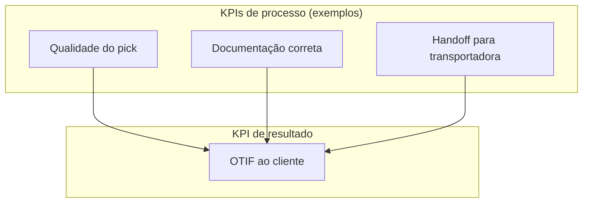
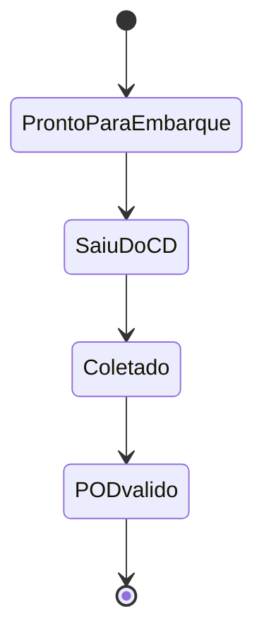

# Nível de serviço e KPIs logísticos — a métrica bonita que, sem dicionário, vira decoração de parede

## Objetivos e resultado de aprendizagem

Ao final da aula, o aluno será capaz de definir KPIs logísticos com dicionário operacional, evitar incentivos perversos e usar métricas para decisão e melhoria contínua.

## Gancho (3–5 min)

Painel com dezenas de indicadores sem ação quase sempre indica definição ruim, dono ausente ou métrica mal desenhada.

## Mapa do conteúdo

- Definição operacional de KPI.
- OTIF, fill rate, lead time e contexto de uso.
- Métrica de processo vs. resultado.
- Governança de decisão baseada em indicador.

## KPIs e decisão

- OTIF com definição contratual.
- Fill rate por cliente/canal.
- Lead time ponta a ponta e variabilidade.

## Ponte

Conecta com [Dados e analytics](../../trilha-dados-analytics-logistica/README.md) para visualização e governança de medição.

Trinta KPIs no painel e **ninguém age** quase sempre significa uma de três coisas: **falta definição operacional** (cada área mede “no prazo” de um jeito), falta **dono** com poder de mudar processo, ou os KPIs **premiam** comportamento errado — por exemplo, “despachar no dia” sem “entregar completo” ou sem **POD** válido. Bowersox et al. tratam desempenho logístico como sistema; Chopra e Meindl conectam serviço a **drivers** de projeto de cadeia. A literatura de *retail compliance* popularizou OTIF como **linguagem de multa** entre grandes e fornecedores — o que é útil pedagogicamente: **OTIF é contrato**, não aura.

---

## OTIF — duas letras que carregam quatro decisões escondidas

**On time in full** parece inglês simples; na prática, **on time** exige definir **janela** (e lembrar que **cedo demais** pode ser problema em B2B com doca lotada). **In full** exige definir se a conta é por **pedido**, **linha** ou **unidade**, e como tratar **substituição** não autorizada.

\[
\text{OTIF (\%)} \approx \frac{\#\text{pedidos a tempo e completos}}{\#\text{pedidos}} \times 100
\]

Fórmula bonita; **metade do trabalho** é o **dicionário de dados** anexado. Para rigor contratual, cite a definição **assinada** — artigos introdutórios (por exemplo, MRPeasy sobre OTIF: https://www.mrpeasy.com/blog/on-time-in-full-otif/) não substituem **cláusula**.

**Analogia do hospital:** medir só “alta no dia” sem “tratamento completo” cria **incentivo perverso** — o sistema joga para a métrica.

---

## Fill rate — pedido, linha, unidade: escolha e não misture

Fill rate pode ser ao nível de **pedido**, **linha** ou **unidade** — cada uma conta uma **história** diferente. Misturar denominadores sem rótulo é como misturar **litros** com **quilos** na receita.

---

## Acurácia de inventário — onde MRP e promessa morrem juntos

\[
\text{Acurácia} = \frac{\text{itens contados sem divergência}}{\text{total contado}} \times 100
\]

Erros corrompem **ATP**, **MRP** e a promessa do site ao mesmo tempo — é **custo sistêmico** antes de virar linha de **ajuste contábil**.

---

## Laboratório numérico

| Pedido | Linhas pedidas | Linhas completas | No prazo? |
|--------|----------------|------------------|-----------|
| 101 | 3 | 3 | Sim |
| 102 | 5 | 4 | Sim |
| 103 | 2 | 2 | Não |

**Calcule:** OTIF ao nível de **pedido**; fill rate ao nível de **linha**.

**Solução:** OTIF = 1/3 ≈ **33,3%**; fill = (3+4+2)/(3+5+2) = **90%**. **Lição:** você pode estar “quase cheio” em linhas e **terrível** em pedidos — o negócio precisa escolher qual dor é **a dele**.

---

## Caso “meta verde” falsa — quando o embarque antecipado mente para o cliente

O armazém **antecipa embarque** para bater KPI de “despacho no mesmo dia”, mas a transportadora só coleta no dia seguinte → o cliente não melhora. **Correção:** medir **delta** entre “pronto para embarque”, “saiu do CD” e **POD** válido — três **estados** com tempos entre eles.

---

## Kit mínimo de painel — pergunta antes de gráfico

| KPI | Pergunta que responde |
|-----|------------------------|
| OTIF | Cumpriu promessa ao cliente? |
| Fill rate | Entregou como pedido? |
| Acurácia de inventário | O sistema reflete o físico? |
| Lead time P90 | Onde está a cauda? |
| Custo por pedido | Qual o preço da complexidade? |

Cada linha precisa de **dono**, **fonte**, **cadência** e **playbook** de ação — senão vira **arte**.

---

## Exercícios

1. Escreva **sua** definição operacional de “no prazo” em **três bullets**.  
2. Dê um exemplo de incentivo perverso **não** listado explicitamente no texto.

**Gabarito:** (1) variará; deve incluir janela, fuso, POD. (2) exemplo: bonificar **toneladas movimentadas** sem qualidade → danos subnotificados.

---

## Fechamento

**Takeaways:** definição operacional é **metade** do KPI; pareie **processo** e **resultado**; PDCA fecha o loop.

**Pergunta:** qual KPI da sua empresa hoje **incentiva** o comportamento errado?

---

## Referências

1. CHOPRA, S.; MEINDL, P. *Supply Chain Management*. Pearson. https://www.pearson.com/en-us/subject-catalog/p/supply-chain-management-strategy-planning-and-operation/P200000012829  
2. BOWERSOX, D. J.; et al. *Supply Chain Logistics Management*. McGraw-Hill. https://www.mheducation.com/highered/product/supply-chain-logistics-management-bowersox.html  
3. CHRISTOPHER, M. *Logistics and Supply Chain Management*. Pearson, 2022. https://www.pearson.com/en-us/subject-catalog/p/logistics-and-supply-chain-management/P200000007134  
4. CSCMP — Glossário: https://cscmp.org/CSCMP/cscmp/educate/scm_definitions_and_glossary_of_terms.aspx  
5. MRPeasy — artigo introdutório sobre OTIF: https://www.mrpeasy.com/blog/on-time-in-full-otif/  
