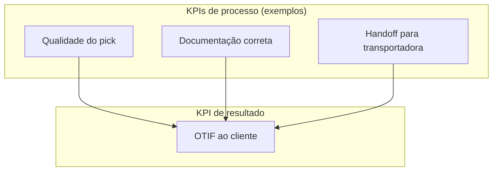
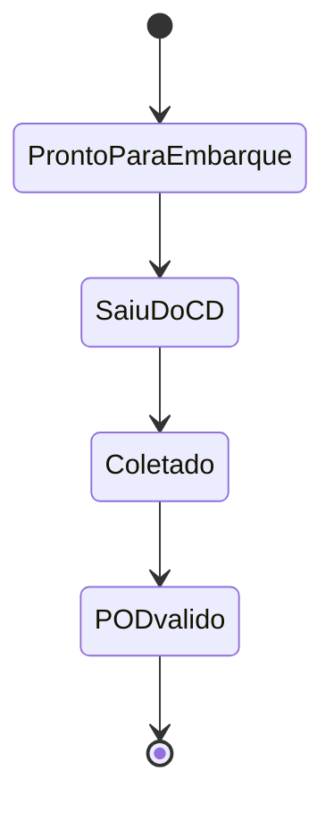

# Nível de serviço e KPIs logísticos — a métrica bonita que, sem dicionário, vira decoração de parede

## Objetivos e resultado de aprendizagem

Ao final da aula, o aluno será capaz de:

- **Definir** KPIs logísticos com dicionário operacional rigoroso.
- **Evitar** incentivos perversos e métricas-vaidade.
- **Usar** métricas para decisão e melhoria contínua (PDCA, A3).
- **Calcular** OTIF, fill rate, perfect order, lead time, acurácia.
- **Diferenciar** métricas de processo, output e outcome.
- **Conhecer** o framework SCOR (DS) e modelos de maturidade (APQC).
- **Evitar** o circo do "OTIF colorido" do varejo BR (multas e contramedidas).

**Duração sugerida:** 70–90 min.
**Pré-requisitos:** todas as aulas anteriores da trilha (especialmente 4.1 e 4.2).

## Mapa do conteúdo

- Definição operacional de KPI — o "dicionário" que separa indicador de arte.
- OTIF, fill rate, perfect order — desambiguação.
- Lead time, P90/P95 e variabilidade.
- Acurácia de inventário e cash-to-cash.
- Métrica de processo × output × outcome (Kaplan/Norton).
- Governança — dono, cadência, playbook.
- Anti-padrões — métricas-vaidade, incentivos perversos.
- Frameworks: SCOR (ASCM), APQC PCF, balanced scorecard.
- Compliance OTIF varejo BR — GPA, Carrefour, Walmart BR.
- Caso TechLar — desenho de painel mínimo.

## Ponte

Conecta com [Dados e analytics](../../trilha-dados-analytics-logistica/README.md) para visualização e governança de medição; com [Estrutura de custos](aula-01-estrutura-custos-logisticos.md) e [Fretes](aula-02-fretes-contratos-negociacao.md) para fechamento do módulo.

Trinta KPIs no painel e **ninguém age** quase sempre significa uma de três coisas: **falta definição operacional** (cada área mede “no prazo” de um jeito), falta **dono** com poder de mudar processo, ou os KPIs **premiam** comportamento errado — por exemplo, “despachar no dia” sem “entregar completo” ou sem **POD** válido. Bowersox et al. tratam desempenho logístico como sistema; Chopra e Meindl conectam serviço a **drivers** de projeto de cadeia. A literatura de *retail compliance* popularizou OTIF como **linguagem de multa** entre grandes e fornecedores — o que é útil pedagogicamente: **OTIF é contrato**, não aura.

---

## OTIF — duas letras que carregam quatro decisões escondidas

**On time in full** parece inglês simples; na prática, **on time** exige definir **janela** (e lembrar que **cedo demais** pode ser problema em B2B com doca lotada). **In full** exige definir se a conta é por **pedido**, **linha** ou **unidade**, e como tratar **substituição** não autorizada.

\[
\text{OTIF (\%)} \approx \frac{\#\text{pedidos a tempo e completos}}{\#\text{pedidos}} \times 100
\]

Fórmula bonita; **metade do trabalho** é o **dicionário de dados** anexado. Para rigor contratual, cite a definição **assinada** — artigos introdutórios (por exemplo, MRPeasy sobre OTIF: https://www.mrpeasy.com/blog/on-time-in-full-otif/) não substituem **cláusula**.

**Analogia do hospital:** medir só “alta no dia” sem “tratamento completo” cria **incentivo perverso** — o sistema joga para a métrica.

---

## Fill rate — pedido, linha, unidade: escolha e não misture

Fill rate pode ser ao nível de **pedido**, **linha** ou **unidade** — cada uma conta uma **história** diferente. Misturar denominadores sem rótulo é como misturar **litros** com **quilos** na receita.

---

## Acurácia de inventário — onde MRP e promessa morrem juntos

\[
\text{Acurácia} = \frac{\text{itens contados sem divergência}}{\text{total contado}} \times 100
\]

Erros corrompem **ATP**, **MRP** e a promessa do site ao mesmo tempo — é **custo sistêmico** antes de virar linha de **ajuste contábil**.

---

## Laboratório numérico

| Pedido | Linhas pedidas | Linhas completas | No prazo? |
|--------|----------------|------------------|-----------|
| 101 | 3 | 3 | Sim |
| 102 | 5 | 4 | Sim |
| 103 | 2 | 2 | Não |

**Calcule:** OTIF ao nível de **pedido**; fill rate ao nível de **linha**.

**Solução:** OTIF = 1/3 ≈ **33,3%**; fill = (3+4+2)/(3+5+2) = **90%**. **Lição:** você pode estar “quase cheio” em linhas e **terrível** em pedidos — o negócio precisa escolher qual dor é **a dele**.

---

## Caso “meta verde” falsa — quando o embarque antecipado mente para o cliente

O armazém **antecipa embarque** para bater KPI de “despacho no mesmo dia”, mas a transportadora só coleta no dia seguinte → o cliente não melhora. **Correção:** medir **delta** entre “pronto para embarque”, “saiu do CD” e **POD** válido — três **estados** com tempos entre eles.

---

## Kit mínimo de painel — pergunta antes de gráfico

| KPI | Pergunta que responde |
|-----|------------------------|
| OTIF | Cumpriu promessa ao cliente? |
| Fill rate | Entregou como pedido? |
| Acurácia de inventário | O sistema reflete o físico? |
| Lead time P90 | Onde está a cauda? |
| Custo por pedido | Qual o preço da complexidade? |

Cada linha precisa de **dono**, **fonte**, **cadência** e **playbook** de ação — senão vira **arte**.

---

## Perfect Order Fulfillment — o KPI "irmã mais velha" do OTIF

A indústria evoluiu para um indicador mais exigente — **Perfect Order Fulfillment (POF)** — definido pelo SCOR como pedidos que cumprem **simultaneamente** quatro condições: **on-time**, **in-full**, **damage-free** e **com documentação correta** (NF, etiquetas, etc.).

\[
\text{POF (\%)} = \frac{\#\text{pedidos perfeitos}}{\#\text{pedidos}} \times 100
\]

Como cada condição é multiplicativa em termos de probabilidade independente, **POF típico em empresa madura é 75–88%**, contra OTIF de 90–96%. Top performers globais (CSCMP, Gartner Top 25): **>95% POF**.

> **Lição prática BR:** não tente "saltar" para POF se OTIF ainda não tem definição compartilhada e dicionário. Comece pelo OTIF rigoroso, depois adicione "documentação OK" e "sem dano".

---

## Cash-to-cash cycle — o KPI que o CFO aprova de cabeça

\[
\text{C2C} = \text{DSO} + \text{DIO} - \text{DPO}
\]

Onde DSO = days sales outstanding (recebimento), DIO = days inventory outstanding (cobertura), DPO = days payable outstanding (pagamento a fornecedores). **Empresas excelentes operam C2C negativo** (recebem antes de pagar — Amazon, Apple, Dell historicamente). Para indústria/varejo BR: 30–90 dias é normal; abaixo de 30 é desempenho top.

---

## Métricas de processo, output e outcome — não confunda

| Tipo | Exemplo | Para quem |
|------|---------|-----------|
| **Processo** (input) | % picking confer., % rota planejada otimizada | Supervisor, gerente operacional |
| **Output** | OTIF, lead time, custo por pedido | Gerência logística |
| **Outcome** (negócio) | NPS, fidelidade, market share, lifetime value | C-level, board |

**Armadilha:** medir só processo gera sensação de "tudo verde" sem que o negócio se mova. Medir só outcome impede ação corretiva (a causa-raiz fica oculta).

---

## OTIF varejo BR — multa, retail compliance e contramedidas

Os grandes varejistas BR (GPA/Pão de Açúcar, Carrefour, Atacadão, Assaí, Big/Walmart, Cencosud) operam com **OTIF contratual** rigoroso e **multa por violação**. Tabela ilustrativa típica (varia por contrato):

| Violação | Multa típica | Comentário |
|----------|---------------|------------|
| Pedido não entregue na janela | 2–5% sobre valor NF | Por evento |
| Pedido incompleto (>5% missing) | 1–3% sobre valor NF | Acumulativa |
| Etiquetagem fora do padrão GS1 | R$ 100–500 por palete | Padrão SSCC, EAN-128 |
| ASN não enviado | R$ 50–200 por entrega | Bloqueio de doca |
| Dano em recebimento | 100% reposição + 10% multa | RA (relatório de avaria) |
| Reagendamento sem aviso | R$ 200–500 por evento | Penalidade fixa |
| Score OTIF mensal <90% | 0,5–1% volume mensal | "Multa de score" |

> **Estratégia BR:** retail compliance score é hoje pré-condição para **vender no varejo grande**. Investir em **EDI**, **ASN correto**, **palete padronizado**, **rotulagem GS1** e **TMS com janela** se paga em poucos meses pela redução de multas.

---

## SCOR e APQC — frameworks de referência

- **SCOR DS (Digital Standard)** — ASCM. Métricas em 5 áreas: **Reliability** (POF, OTIF), **Responsiveness** (LT), **Agility** (flex), **Cost** (custo gerenciar SC), **Asset** (capital). https://www.ascm.org/learning-development/scor/
- **APQC PCF (Process Classification Framework)** — biblioteca de processos e KPIs com benchmark global. https://www.apqc.org/
- **Balanced Scorecard (Kaplan & Norton)** — equilibra financeiro, cliente, processo, aprendizagem.
- **Gartner Supply Chain Top 25** — referência anual de excelência. https://www.gartner.com/en/supply-chain/research/supply-chain-top-25

---

## Governança — quem faz o quê

| KPI | Dono primário | Comitê de revisão | Cadência | Playbook |
|-----|----------------|---------------------|----------|----------|
| OTIF | Operações Log | Comitê semanal de operação | Diária / semanal | RCA por violação >X dias |
| Fill rate | Plan + Operações | Pré-S&OP | Semanal | Ajuste de safety stock |
| POF | Diretor Log | S&OP executivo | Mensal | Decomposição multi-causa |
| Lead time P90 | Plan | Comitê tático | Mensal | Renegociação com fornecedor/3PL |
| Acurácia inventário | Operações armazém | Comitê WMS | Diária / semanal | Ciclo de contagem A/B/C |
| Custo por pedido | Log + Fin | Mensal | Mensal | Audit de frete + rateio |
| C2C | CFO + Plan | Mensal | Mensal | Política de cobertura, política de prazo |
| Score retail compliance | Comercial + Log | Semanal por cliente-chave | Semanal | Plano de ação por cliente |
| NPS / Reclamações | Diretor cliente | Mensal | Mensal | Loop de feedback ao processo |

---

## Ferramentas e tecnologias relevantes

| Para... | Começar | Crescer | Cuidado |
|---------|---------|---------|---------|
| Definir KPIs | Glossário Excel | Dicionário em Confluence/SharePoint, com versionamento | Versão única, dono claro |
| Painel | Excel + tabela dinâmica | Power BI, Tableau, Qlik, Looker, Metabase | Pergunte "para qual decisão?" antes de criar |
| Coleta dados | Manual + planilha | TMS, WMS, ERP integrados a BI | Garanta single source of truth |
| Benchmark externo | Pesquisas pontuais | ILOS BR, APQC, Gartner, CSCMP | Defina escopo antes de comparar |
| Acompanhamento de retail compliance | Planilha por cliente | Plataformas: Neogrid, Score Brasil, Bling | Inclua todos os clientes-chave |
| Análise root cause | 5 porquês manual | A3 + RCA tools | Disciplina é mais importante que ferramenta |

---

## Aplicação — exercícios

1. **Definição operacional.** Escreva **sua** definição operacional de "no prazo" em **três bullets**, considerando cliente B2B com janela 8h–17h, fuso horário diferente, e POD digital obrigatório.

2. **Caso GPA.** Uma indústria de alimentos vende para GPA com OTIF 87% e multa cumulada R$ 180k/mês. Liste 5 alavancas concretas para chegar a OTIF 95% em 6 meses, com sequência (quick win → estrutural).

3. **Cálculo POF.** Em 1.000 pedidos: 920 chegaram no prazo, 880 chegaram completos, 950 sem dano, 970 com documentação OK. Calcule POF (assumindo independência aproximada). Dica: probabilidade conjunta.

4. **Cash-to-cash.** Empresa com DSO=42, DIO=68, DPO=35. Qual o C2C? Se reduzir cobertura para 50 dias, qual o impacto em capital de giro (assumindo COGS=R$120M/ano)?

5. **Anti-padrão.** Identifique 3 KPIs do seu local de trabalho (real ou imaginado) que **incentivam comportamento errado**. Reescreva-os.

---

## Erros comuns e armadilhas

- KPI sem **dicionário** — cada área mede diferente.
- Métrica de **processo** sem amarrar a **output/outcome**.
- Painel com **>15 KPIs** "estratégicos" — ninguém age.
- Bonificar **volume movimentado** sem qualidade → danos subnotificados.
- Bonificar **OTIF do CD** ignorando a transportadora → guerra fria interna.
- Não medir **cauda** (P90, P95) — só média esconde 20% piores.
- **Calibrar meta** olhando para média histórica — perpetua mediocridade.
- Inventar KPI para **justificar projeto** já decidido (motivated reasoning).
- Não correlacionar OTIF com **NPS / churn** — KPI vira fim em si.
- **Score retail compliance** ignorado até a multa chegar.
- "Painel pronto" sem reunião de revisão e sem playbook — vira **decoração**.

---

## Glossário express

- **OTIF:** On Time In Full.
- **POF:** Perfect Order Fulfillment (SCOR).
- **Fill rate:** taxa de atendimento (linha/unidade/pedido).
- **Lead time P90/P95:** percentil 90/95 do tempo de ciclo.
- **C2C:** Cash-to-Cash Cycle Time.
- **DSO/DIO/DPO:** Days Sales/Inventory/Payable Outstanding.
- **SCOR:** Supply Chain Operations Reference.
- **APQC PCF:** Process Classification Framework.
- **Retail compliance:** conformidade com regras de varejo (multa).
- **A3:** documento Toyota de relato de problema/causa/ação.

---

## Fechamento

**Takeaways:**

1. **Definição operacional** é metade do KPI — sem dicionário, é arte.
2. Pareie **processo** + **output** + **outcome**.
3. Cuidado com **incentivos perversos** — todo KPI tem "verso e reverso".
4. **POF** é o passo seguinte ao OTIF maduro.
5. **Retail compliance BR** é hoje pré-condição comercial — gestão ativa.
6. PDCA fecha o loop — KPI sem ação é decoração.

**Pergunta:** qual KPI da sua empresa hoje **incentiva** o comportamento errado?

---

## Referências

1. CHOPRA, S.; MEINDL, P. *Supply Chain Management*. Pearson. https://www.pearson.com/en-us/subject-catalog/p/supply-chain-management-strategy-planning-and-operation/P200000012829
2. BOWERSOX, D. J.; et al. *Supply Chain Logistics Management*. McGraw-Hill. https://www.mheducation.com/highered/product/supply-chain-logistics-management-bowersox.html
3. CHRISTOPHER, M. *Logistics and Supply Chain Management*. Pearson, 2022. https://www.pearson.com/en-us/subject-catalog/p/logistics-and-supply-chain-management/P200000007134
4. CSCMP — Glossário: https://cscmp.org/CSCMP/cscmp/educate/scm_definitions_and_glossary_of_terms.aspx
5. MRPeasy — artigo introdutório sobre OTIF: https://www.mrpeasy.com/blog/on-time-in-full-otif/
6. ASCM — SCOR DS (Digital Standard): https://www.ascm.org/learning-development/scor/
7. APQC — Process Classification Framework e KPIs: https://www.apqc.org/
8. Gartner — *Supply Chain Top 25*: https://www.gartner.com/en/supply-chain/research/supply-chain-top-25
9. KAPLAN, R.; NORTON, D. *The Balanced Scorecard*. Harvard Business Review Press.
10. ILOS — *Pesquisa de Custos Logísticos no Brasil* e benchmarks de OTIF: https://www.ilos.com.br/web/
11. ABRAS — Associação Brasileira de Supermercados, manuais de retail compliance: https://abras.com.br/
12. GS1 Brasil — padrões de etiquetagem: https://www.gs1br.org/
13. Neogrid — score de retail compliance: https://www.neogrid.com/

---

## Pontes para outras trilhas

- [Trilha Dados e Analytics](../../trilha-dados-analytics-logistica/README.md) — visualização e governança de medição.
- [Trilha Lean Six Sigma](../../trilha-lean-seis-sigma-logistica-poc/README.md) — A3, RCA, PDCA aplicados a KPIs.
- [Trilha Tecnologia e Sistemas](../../trilha-tecnologia-e-sistemas/README.md) — single source of truth, integração ERP/WMS/TMS.
- [Trilha Logística Estratégica](../../trilha-logistica-estrategica/README.md) — KPI como instrumento estratégico (BSC, OKRs).
