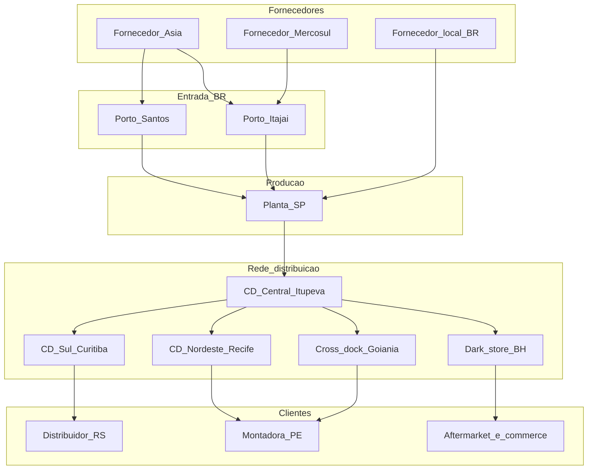
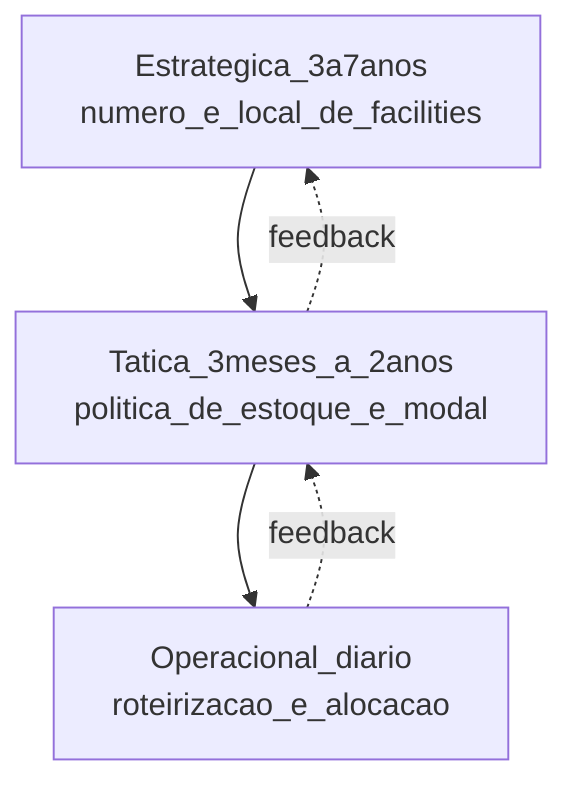
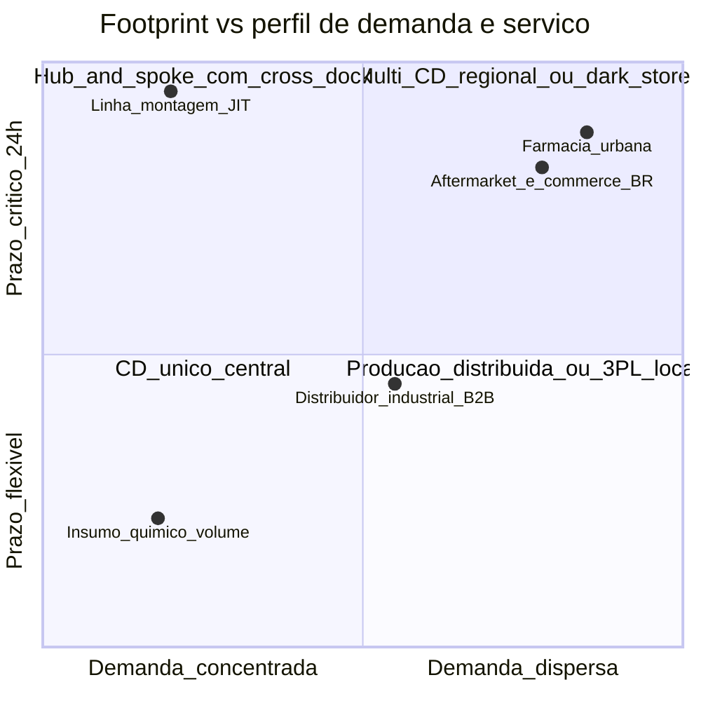

# Nós, elos e o trilema serviço–custo–risco — rede logística como decisão de arquitetura

***Network design*** responde, em horizonte de **3 a 7 anos**, a três perguntas que **prefiguram** todo o restante: **quantos** pontos a cadeia precisa (fábricas, CDs, *cross-docks*, *hubs*, *dark stores*), **onde** ficam (geografia, malha modal, mercado), e **como** fluem material, informação e capital. Não se confunde com **roteirização** diária: é a **estrutura** que **condiciona** custos de frete, estoque, *time-to-shelf*, exposição cambial e resiliência por **anos** — e cuja revisão custa **milhões** em capex e *switching cost*. Em termos analíticos sérios, é um problema **MILP** (*Mixed Integer Linear Programming*) de **localização-alocação** com restrições de capacidade, serviço, fiscal e ESG, hoje resolvido com plataformas como **Coupa Supply Chain Modeler** (ex-Llamasoft Supply Chain Guru), **AIMMS Network Optimization**, **Optilogic Cosmic Frog** ou **anyLogistix**.

Esta aula entrega **literacia executiva** para liderar a discussão de rede com finanças, vendas e operações **antes** de chamar o consultor.

---

## Objetivos e resultado de aprendizagem

Ao final desta aula, você será capaz de:

- Definir **nó** e **elo** em linguagem de negócio e mapear sua cadeia atual.
- Explicar o **trilema** (na verdade *quadrilema*) **serviço × custo × capital × risco** ao centralizar ou regionalizar.
- Reconhecer quando o problema é **MILP de localização** e quais dados ele exige.
- Identificar **single points of failure** (SPOF) geográficos e fiscais (DIFAL, ZFM, *substituição tributária*).
- Conduzir uma reunião de *steering* com **mapa de nós/elos** e **três cenários** numéricos.

**Duração sugerida:** 75–90 minutos. **Pré-requisitos:** noções de S&OP, custos logísticos e indicadores OTIF/lead time (trilha Fundamentos).

---

## Mapa do conteúdo

1. Anatomia: nós, elos e a **camada de informação** que os une.
2. Trilema → quadrilema: **serviço, custo, capital e risco** como sistema acoplado.
3. Centralização × regionalização × *hub-and-spoke* × **fulfillment distribuído**.
4. Especificidade BR: **DIFAL**, **substituição tributária**, **Zona Franca de Manaus**, **Reforma Tributária 2026–2033** e seus efeitos no desenho de rede.
5. Comparação **BR × UE × EUA × China** em densidade de nós.
6. SPOFs típicos e como **mitigar** sem inflar capex.
7. Dados mínimos para uma reunião de *steering* defensável.

---

## Gancho — a TechLar e o «CD único maravilhoso»

A **TechLar** (B2B de autopeças, R$ 380 mi de receita, 11 mil SKUs) consolidou três CDs num **mega-CD** em Itupeva (SP) para cortar **R$ 14 mi/ano** de custo fixo. No primeiro ano:

- **Frete médio** caiu de **R$ 2,80/kg** para **R$ 2,55/kg** (−9%).
- **OTIF Nordeste** caiu de **94% → 78%** nas chuvas de fevereiro/março (BR-101 alagada, 6 dias).
- **Capital em trânsito** subiu **R$ 8,2 mi** (≈ 4 dias extra de estoque a 14% a.a.).
- **Custo total de servir**: aumentou **R$ 3 mi/ano** — **maior** que a economia fixa.

Vendas culpou logística; finanças mostrou **menos imobilizado em armazém** mas **mais capital parado na estrada e na multa contratual** com a montadora pernambucana. Ninguém tinha modelado a rede como **sistema acoplado**: tratou-se de um **corte de OPEX** disfarçado de **decisão de arquitetura**.

**Analogia da diplomacia internacional:** uma rede logística é um **mapa de embaixadas**. Concentrar tudo numa só capital (CD único) economiza salários, mas **desconecta** você da política regional e te deixa **mudo** quando explode uma crise local. **Embaixada em cada capital** (CD em cada região) custa caro, mas **escuta**, **age rápido** e **negocia** localmente.

**Analogia do tabuleiro de xadrez:** *network design* é decidir onde ficam **torres e cavalos** **antes** da partida começar — não onde mover o peão na jogada 23. Quem entra com peças mal posicionadas **perde** o jogo independente da habilidade tática.

---

## Conceito-núcleo — nós, elos e o sistema acoplado

**Nó:** ponto onde existe **decisão de estoque** (segurar saldo, alocar reserva), **transformação** (produção, *kitting*, *labeling*, postergação fiscal) ou **consolidação/desconsolidação** relevante para custo total ou serviço ao cliente.

**Elo:** ligação entre nós em **três camadas** simultâneas:

- **Física:** modal (rodo, ferro, cabotagem, aéreo, dutoviário), frequência, lote.
- **Informacional:** pedido, ASN, *forecast*, confirmação de embarque, evento IoT.
- **Financeira:** condição de pagamento, *Incoterm*, exposição cambial, capital em trânsito.

**Legenda:** retângulos = **nós** com papel distinto (porto = nó fiscal-aduaneiro; *cross-dock* = nó sem estoque; *dark store* = nó de fulfillment urbano); setas = **elos físicos** (omiti elos informacionais e financeiros para legibilidade). A **decisão estratégica** é **quantos nós**, **onde**, **com que capacidade** e **quem alimenta quem** — formalizável como problema de **localização-alocação capacitada (CFLP)**.

### O quadrilema acoplado

Quem ainda chama de «trade-off serviço × custo» está **dois graus de liberdade atrasado**. A discussão atual é o **quadrilema**:

| Dimensão | O que mede | Vetor que move | Quem cobra |
|---|---|---|---|
| **Serviço** | OTIF, *lead time* P95, *fill rate*, ETA confiável | proximidade, capacidade, redundância | Comercial, cliente B2B |
| **Custo** | OPEX rede (frete + armazenagem + *handling*) | escala, modal, *footprint* | CFO |
| **Capital** | Estoque (em CD + em trânsito) × giro × WACC | número de nós, política de estoque, lead time | Tesouraria, CFO |
| **Risco** | Resiliência a choque (clima, greve, geopolítica), SPOF | redundância, diversificação geográfica | CRO, Conselho |

**Por que é acoplado:** mover um vetor **mexe** os outros três simultaneamente. Centralizar **reduz custo fixo** e **capital em armazém**, mas **eleva capital em trânsito**, **degrada serviço periférico** e **concentra risco**. Ignorar acoplamento é o **erro #1** de comitês que tratam rede como linha de planilha.

---

## Frameworks-chave

### 1. Modelo CFLP (Capacitated Facility Location Problem) — a forma matemática da decisão

\[
\min \sum_{i \in I} f_i y_i + \sum_{i \in I} \sum_{j \in J} c_{ij} x_{ij}
\]

sujeito a: \(\sum_i x_{ij} = d_j\) (demanda atendida), \(\sum_j x_{ij} \leq Q_i y_i\) (capacidade), \(y_i \in \{0,1\}\) (abrir CD ou não), \(x_{ij} \geq 0\).

Onde \(f_i\) = custo fixo do CD \(i\), \(c_{ij}\) = custo unitário de servir cliente \(j\) a partir de \(i\), \(d_j\) = demanda. Plataformas comerciais (Coupa SC Modeler, anyLogistix) **acrescentam** lead time, emissões CO₂, restrições fiscais e políticas de estoque multi-echelon — mas o **núcleo** é este.

### 2. Hierarquia de decisões de Chopra-Meindl

**Legenda:** *network design* fica em **E** (estratégica). Decisões em E **comprimem** o espaço de soluções em T e O — por isso erro de E custa **anos**.

### 3. Tipologia de redes (com analogias)

| Arquetipo | Característica | Analogia | Exemplo BR |
|---|---|---|---|
| **CD único** | 1 nó central, frete longo | Capital romana | Apple Brasil (até ~2018), JBS pré-expansão |
| ***Hub-and-spoke*** | 1 hub + spokes regionais | Aeroporto Frankfurt | Mercado Livre fulfillment, Magazine Luiza |
| **Multi-CD regional** | n CDs equivalentes | Federação suíça | Ambev, Natura |
| ***Cross-dock* + planta** | sem estoque intermediário | Mesa de bilhar | Toyota (sequenciamento JIT) |
| ***Fulfillment* distribuído** | dezenas de mini-CDs urbanos | Rede de farmácias | iFood Mart, Amazon DSP |
| **Híbrida polimorfa** | mistura por canal/SKU | Cidade com bairros distintos | Renner (loja + CD + dark store) |

---

## Aprofundamentos — variações setoriais e geográficas

### Brasil

- **DIFAL (Diferencial de alíquota)** muda economia de servir SP→RS via CD central versus CD regional; LC 190/2022 e a **Reforma Tributária (EC 132/2023, transição 2026–2033)** com IBS/CBS **eliminam** boa parte do incentivo histórico de **galpão fiscal em GO/ES** — redes desenhadas em 2018 podem virar ineficientes em 2027.
- **Zona Franca de Manaus**: continua relevante para eletrônica e duas rodas; rede precisa **nó AM** com IPI/II reduzido.
- **Substituição tributária ICMS-ST**: pode tornar **transferência interestadual** mais cara que **venda direta** — rede deve simular cenário fiscal.
- **Densidade rodoviária**: 12,4% pavimentado (CNT 2024) → mais nós que UE para mesma cobertura.
- **Cabotagem (BR do Mar, Lei 14.301/2022)**: viabiliza Santos↔Suape↔Manaus por ~30–40% do custo rodo, mas com lead time +5 a +9 dias.

### União Europeia

- Densidade modal alta, **ferrovia + barcaça** (Reno) viabiliza CD central em **Roterdã/Antuérpia/Duisburg** servindo Benelux/DE/FR.
- **CBAM** (Carbon Border Adjustment Mechanism) penaliza desenho com forte importação carbônica.
- **CSDDD** (Corporate Sustainability Due Diligence Directive, 2024) exige **rastreabilidade** até *tier-2/3* — afeta escolha de localização de fornecimento.

### EUA

- Modelo **DC + spoke + zona FTZ** (*Foreign Trade Zone*) clássico; Amazon redesenhou para **8 regiões fulfillment** (2023) reduzindo cross-region shipping em ~30%.
- **Tarifa Trump 2026** (eletrônicos CN +25 a +60% em rounds anunciados) força *nearshoring* México (USMCA) — exige novo *footprint*.

### China

- Hubs **Shanghai/Shenzhen/Ningbo** + rede ferroviária *Belt & Road* até Duisburg em 16–18 dias (alternativa ao marítimo de 35–45 dias).
- *Dual circulation policy* (interna + externa) leva a **redes paralelas** para mercado doméstico vs. exportação.

---

## Diagrama / Modelo principal — matriz de decisão de footprint

**Legenda:** posicionamento **conceitual** de arquétipos de canal no plano *demanda × criticidade de prazo*. Não substitui CFLP — **prioriza** qual problema modelar primeiro.

---

## Trade-offs estratégicos

| Decisão | A favor | Contra | Resolução típica |
|---|---|---|---|
| Centralizar × distribuir | escala, custo fixo, governança | serviço periférico, risco SPOF | **híbrido por canal** + cabotagem |
| Verticalizar × terceirizar (3PL/4PL) | controle, dado, capability | capex, rigidez, capacidade | 3PL para **base**, próprio para **pico/SKU crítico** |
| Eficiência × resiliência | TCO menor em paz | colapso em crise (COVID, Suez 2021) | **redundância calibrada** (2–3 fontes, 2 modais) |
| Curto × longo prazo | payback rápido | dívida estratégica | *roadmap* em **ondas** com *gates* |
| *Owned* × *as-a-service* (warehouse-as-a-service) | flexibilidade financeira | custo unitário maior em volume | **base owned + pico WaaS** (ex.: Stord, Flexport) |

---

## Caso prático — TechLar reavalia o «CD único»

**Cenário base (CD único Itupeva, status atual):**

| Linha | Valor anual (R$ mi) |
|---|---|
| Frete *outbound* | 24,5 |
| Armazenagem (1 CD, 38k m²) | 9,8 |
| Capital estoque CD (R$ 62 mi × 14% WACC) | 8,7 |
| Capital em trânsito (R$ 14 mi × 14%) | 2,0 |
| Multas SLA Nordeste | 1,8 |
| **Total** | **46,8** |

**Cenário alternativo (Itupeva + CD regional Recife 8k m²):**

| Linha | Valor (R$ mi) |
|---|---|
| Frete *outbound* (queda 18% NE, neutro SE/S) | 21,1 |
| Armazenagem (2 CDs) | 12,4 |
| Capital estoque (R$ 71 mi, +15% por desagregação) | 9,9 |
| Capital em trânsito (queda para R$ 9 mi) | 1,3 |
| Multas SLA NE (queda 80%) | 0,4 |
| Custo de transição (capex + ramp-up, amortizado 5 anos) | 1,6 |
| **Total** | **46,7** |

**Resultado:** TCO praticamente **empata em R$**, mas o cenário 2 ganha em **OTIF NE (esperado 92%)**, **resiliência** (perde 1 CD = 60% do volume continua) e **opcionalidade futura** para *e-commerce*. A decisão deixa de ser «qual é mais barato» e passa a ser **«qual abre mais futuro»** — discussão de *steering*, não de planilha.

**Sensibilidade chave:** se WACC subir para 18% (cenário Selic alta), o capital pesa mais, e a regionalização **piora** R$ 0,9 mi/ano. A discussão fica refém da política monetária — **documentar premissa** é mandatório.

---

## Erros comuns e armadilhas

1. **Otimização local:** logística minimiza frete, finanças minimiza estoque, vendas maximiza prazo — soma vira **subótimo global**.
2. **«Copiar a Amazon»:** a densidade de demanda BR não justifica o *footprint* deles fora dos grandes centros.
3. **Esquecer fiscal:** rede sem simulação de DIFAL/ST/Reforma Tributária envelhece em 24 meses.
4. **Tratar 3PL como custo variável puro:** capacidade tem **degrau** (m² contratado, FTE mínimo) — não escala linear.
5. **Ignorar elo informacional:** rede física ótima com **EDI/ASN ruins** entrega mais atraso que a anterior.
6. ***Single point of failure* aceito por hábito:** «sempre deu certo» é *survivorship bias*.

---

## Risco e governança

- **Geopolítico:** concentração CN para insumo crítico → **China+1** (Vietnã, Índia, México) é hoje *baseline*, não opcional.
- **Climático:** modelos atuariais (Munich Re, Swiss Re) integram **mapa de risco físico** ao *footprint* — esperar 5–8 anos para revisar é **dívida moral**.
- **Regulatório BR:** Reforma Tributária re-precifica nós; ZFM, PADIS, Repetro têm *sunset* em monitoramento.
- **Cyber:** CD único = honeypot atraente; redundância digital é parte do desenho.
- **ESG:** Pegada CO₂ por kg-km entra em *scorecard* (CBAM EU, GHG Protocol *scope 3*); rede com modal aéreo abusivo perde *tier* ESG.

---

## KPIs estratégicos

| KPI | Pergunta de negócio | Dono | Fonte | Cadência | Playbook se desvia |
|---|---|---|---|---|---|
| **TCO de rede (R$/un.)** | Quanto custa entregar 1 unidade total? | Logística + CFO | TMS+ERP+contábil | Trimestral | Revisar *footprint* anual; trigger >+5% YoY |
| **Lead time P95 por região** | Pior caso aceitável? | Logística | TMS | Mensal | Re-roteirizar; abrir nó se >+30% acordo |
| **OTIF por canal** | Cliente recebe quando promete? | Comercial + Log. | OMS | Semanal | NC com 3PL; revisão SLA |
| **Cost-to-serve por segmento** | Quem subsidia quem? | Controladoria | ABC costing | Trimestral | Repreçar canal ou redesenhar |
| **Capital em estoque + trânsito** | Capital de giro aprisionado? | Tesouraria | ERP | Mensal | Revisar política multi-echelon |
| **Resilience Index (% receita coberta por plano B)** | Sobrevive a choque? | CRO | Risco | Semestral | Diversificar fonte/modal/nó |
| **Single-source %** | Concentração perigosa? | Compras | ERP+SRM | Trimestral | Qualificar segunda fonte |
| **Pegada CO₂ (kgCO₂e/un.)** | Conformidade ESG/CBAM? | Sustentabilidade | TMS+fatores emissão | Trimestral | Modal-shift, rota verde |

---

## Tecnologias e ferramentas habilitadoras

- ***Network design***: **Coupa Supply Chain Modeler** (ex-Llamasoft Guru), **AIMMS**, **Optilogic Cosmic Frog**, **anyLogistix**, **AnyLogic** (DES + ABM).
- **Planejamento integrado (IBP/S&OP)**: **SAP IBP**, **Kinaxis Maestro (RapidResponse)**, **o9 Solutions**, **Anaplan**, **Blue Yonder Luminate Planning**, **OMP Unison**.
- ***Control tower* + visibilidade**: **project44**, **FourKites**, **Shippeo**, **E2open**, **Blue Yonder Luminate Control Tower**.
- ***ERP* tronco**: **SAP S/4HANA**, **Oracle Fusion Cloud SCM**, **Microsoft Dynamics 365**, **Totvs Protheus** (BR mid-market).
- **Dado e analytics**: **Snowflake**, **Databricks**, **Power BI**, **Tableau**.
- **Geo-analytics**: **HERE**, **TomTom**, **Esri ArcGIS Network Analyst** (modelagem rodoviária BR).

---

## Glossário rápido

- **CFLP**: *Capacitated Facility Location Problem* (formulação MILP).
- **DIFAL**: Diferencial de alíquota ICMS interestadual.
- **MCC**: Multi-Compartment Container; aqui também *Multi-Channel CD*.
- **SPOF**: *Single Point of Failure*.
- **WaaS**: Warehouse-as-a-Service.
- **3PL/4PL**: terceirização de execução / orquestração.
- **Cabotagem**: navegação de cargas costeira nacional.
- **TCO de rede**: soma de custos diretos, indiretos, capital e penalidade.
- **WACC**: custo médio ponderado de capital.

---

## Aplicação — exercícios

**Exercício 1 (15 min) — Mapa atual.** Desenhe a rede da sua empresa (ou TechLar) com **até 10 nós**. Para cada nó, escreva: (a) **serviço** que protege (tempo, mix, custo, fiscal); (b) **um risco** se cair; (c) **alternativa** em < 30 dias.

**Gabarito pedagógico:** ≥ 1 elo cascateia (SPOF) → demonstra leitura de risco; se «todos têm plano B sem custo», o aluno não pensou em **switching cost**.

**Exercício 2 (20 min) — Mini-CFLP qualitativo.** Dadas 3 regiões (SE, NE, S) com demanda relativa 60/25/15 e *lead time* contratual D+2/D+3/D+2, decida entre: (i) 1 CD SP; (ii) 2 CDs SP+PE; (iii) 3 CDs SP+PE+RS. Liste **3 critérios** decisivos e **2 dados** que você exigiria antes de fechar.

**Gabarito:** critério deve incluir **TCO + serviço + risco**; dado mínimo: **demanda real por CEP**, **estrutura tributária ST**, **WACC corporativo**, **OTIF contratual**.

**Exercício 3 (10 min) — Stress test.** Para sua rede mapeada, simule mentalmente: (a) Porto Santos paralisado 14 dias; (b) tarifa USA +25% no seu insumo; (c) Selic 18% por 12 meses. Qual decisão de rede muda?

---

## Pergunta de reflexão

Qual nó da sua rede hoje é um **SPOF aceito por hábito** — e quanto custaria **realmente** mitigar versus o custo esperado de uma falha de 30 dias?

---

## Fechamento — takeaways

1. Rede é **arquitetura plurianual**, não soma de OPEX trimestrais.
2. O quadrilema **serviço × custo × capital × risco** é **acoplado** — mover um mexe os quatro.
3. **CFLP + cenários fiscais BR** é o mínimo metodológico hoje; planilha solta esconde decisão.
4. SPOF aceito por hábito é **dívida estratégica** com juros de mercado.
5. Mapa de nós/elos é o **contrato visual** entre comercial, finanças, ops e risco.

---

## Referências

1. CHOPRA, S.; MEINDL, P. *Supply Chain Management: Strategy, Planning, and Operation*. 7ª ed., Pearson, 2019 — capítulos 5–6 (network design, facility location).
2. SIMCHI-LEVI, D.; KAMINSKY, P.; SIMCHI-LEVI, E. *Designing and Managing the Supply Chain*. 4ª ed., McGraw-Hill — modelagem de rede e MILP.
3. SHEFFI, Y. *The Resilient Enterprise: Overcoming Vulnerability for Competitive Advantage*. MIT Press, 2005 — risco e SPOF.
4. BALLOU, R. H. *Business Logistics/Supply Chain Management*. Pearson — fundamentos de localização BR.
5. CNT — *Pesquisa CNT de Rodovias 2024* — densidade modal BR.
6. ILOS — *Panorama de Custos Logísticos no Brasil 2024* — benchmark CTS.
7. FUNDAÇÃO DOM CABRAL — *Cenários da Cadeia Brasileira de Suprimentos*.
8. McKINSEY — *Supply Chain of the Future* (2023–2024) — arquétipos pós-pandemia.
9. WORLD ECONOMIC FORUM — *Global Risks Report 2025* — risco geopolítico/climático.
10. ASCM — [ascm.org](https://www.ascm.org/); CSCMP — [cscmp.org](https://cscmp.org/).

---

**Ponte:** [Custos logísticos](../../trilha-fundamentos-e-estrategia/modulo-04-custos-logisticos-performance/aula-01-estrutura-custos-logisticos.md); [Transporte e distribuição](../../trilha-operacoes-logisticas/modulo-03-transporte-e-distribuicao/README.md) (execução); próxima aula deste módulo aprofunda **cost-to-serve** e construção de **cenários** quantitativos.
