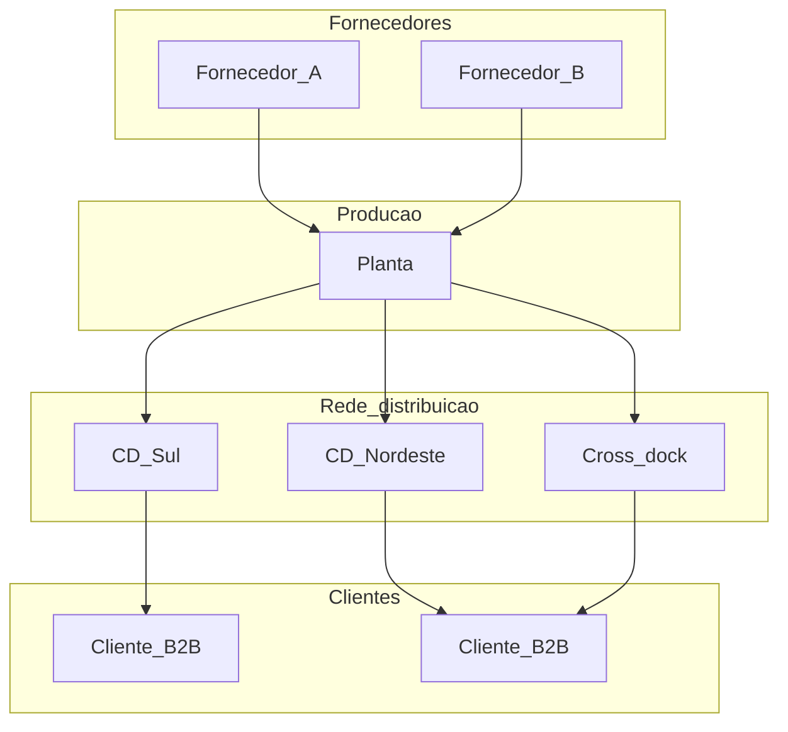

# Nós, elos e o trilema serviço–custo–risco — rede logística como decisão de arquitetura

**Network design** responde: **quantos pontos** na cadeia (fábrica, CD, *cross-dock*, *hub*), **onde** ficam e **como** fluem produto e informação. Não é roteirização diária: é a **estrutura** que condiciona frete, estoque, tempo de resposta e risco por anos.

---

## Objetivos e resultado de aprendizagem

**Ao final desta aula**, você será capaz de:

- Definir **nó** e **elo** em linguagem de negócio e mapear a sua cadeia atual.  
- Explicar o **trade-off** serviço × custo × capital × risco ao centralizar ou regionalizar estoque.  
- Usar uma analogia acessível para alinhar finanças, vendas e operações numa discussão de rede.

**Duração sugerida:** 60–75 minutos.

---

## Gancho — a TechLar e o «CD único maravilhoso»

A **TechLar** (B2B de autopeças) centralizou tudo num **CD único** para cortar custo fixo. O **frete médio** caiu; o **OTIF** no Nordeste despencou nas chuvas; o **capital em trânsito** subiu. Vendas culpou logística; finanças mostrou **menos imobilizado** em armazém — mas **mais** capital parado na estrada. Ninguém tinha desenhado a rede como **sistema**: só como **corte de despesa**.

**Analogia das filiais de banco *versus* ATM:** agências cheias de gente resolvem tudo com conforto (serviço alto, custo de rede alto); ATMs e app reduzem custo e tempo para transações simples, mas **não** substituem assessoria complexa. A rede logística faz o mesmo tipo de **escolha** entre proximidade, escala e risco.

---

## Mapa do conteúdo

- Nós típicos: fornecedor, planta, CD regional, *cross-dock*, cliente.  
- Elos: transporte, informação, estoque em trânsito.  
- Centralização *versus* regionalização: o que muda em **serviço**, **custo**, **capital** e **risco**.  
- O que levar para uma reunião de **steering** (dados mínimos).

---

## Conceito núcleo — nós, elos e decisão

**Nó:** ponto onde há **decisão de estoque**, **transformação** (produção/kit) ou **consolidação** relevante para o cliente ou para o custo total.

**Elo:** ligação entre nós — principalmente **fluxo físico** (caminho, modal, frequência) e **fluxo de informação** (pedido, previsão, confirmação de embarque).

**Legenda:** retângulos = **nós** com papel distinto; setas = **elos** físicos (simplificado). A **decisão estratégica** é quantos CDs, onde, e quais clientes/canais cada nó atende.

**Mini-caso:** duas regiões com **mesmo volume** anual mas **variabilidade** de prazo de transporte diferente: regionalizar estoque pode **subir** custo fixo e **baixar** ruptura e custo de emergência — o **total** pode melhorar.

---

## Trade-offs

- **Mais nós regionais:** melhor tempo de resposta e menor risco de «tudo depende de um CD»; mais **capital** disperso e **custo fixo**.  
- **Rede mais enxuta:** menos custo fixo e menos complexidade; mais **distância média**, mais estoque em trânsito ou **menor** serviço em extremidades.  
- **Capital:** estoque **no** CD é visível no balanço; estoque **em trânsito** também é capital — às vezes **menos** monitorado nos painéis.

---

## Aplicação — exercício

Desenhe a **rede atual** da sua empresa (ou fictícia) com **até 8 nós**. Para **cada nó**, escreva **uma linha**: qual **serviço** ele protege (tempo, mix, custo) e **um risco** se ele falhar.

**Gabarito pedagógico:** deve aparecer **pelo menos um** elo onde a falha **cascateia** (ex.: só um CD alimenta todo o país); se todos os nós forem «ótimos» sem risco, o aluno provavelmente ignorou **single point of failure**.

---

## Erros comuns e armadilhas

- Confiar só em **simulação de frete** sem **fill rate** ou lead time por região.  
- Tratar **cross-dock** como «grátis» — exige **sincronismo** de informação e penaliza erro de previsão.  
- Copiar rede de concorrente sem **mesma densidade** de demanda ou **mesmo** mix de SKU.

---

## KPIs e decisão

- **Custo total de rede** (fixo + variável + capital em estoque e em trânsito) — *consenso de mercado*: definições variam; alinhar com finanças.  
- **Tempo de entrega** (percentil, não só média) por região ou canal.  
- **Disponibilidade** / fill rate no SKU crítico.  
- **Resiliência qualitativa:** redundância de fornecimento *versus* concentração geográfica (ligação à aula de risco em *sourcing*).

---

## Fechamento — três takeaways

1. Rede é **arquitetura**, não só «mais um CD».  
2. **Serviço, custo, capital e risco** mudam juntos; otimizar um isolado engana o steering.  
3. Mapa de nós e elos é o **contrato visual** entre áreas.

**Pergunta de reflexão:** qual nó da sua rede hoje é um **single point of failure** aceito por hábito?

---

## Referências

1. CHOPRA, S.; MEINDL, P. *Supply Chain Management: Strategy, Planning, and Operation*. Pearson — capítulos de design de rede e localização (referência acadêmica de base).  
2. ASCM (Association for Supply Chain Management). Body of Knowledge e recursos sobre **strategy** e *network* — [ascm.org](https://www.ascm.org/).  
3. CSCMP. *Supply Chain Quarterly* e definições de escopo da profissão — [cscmp.org](https://cscmp.org/).  
4. BALLOU, R. H. *Business Logistics/Supply Chain Management*. Pearson — fundamentos de localização e trade-offs logísticos.

**Ponte:** [Custos logísticos](../../trilha-fundamentos-e-estrategia/modulo-04-custos-logisticos-performance/aula-01-estrutura-custos-logisticos.md); [Transporte e distribuição](../../trilha-operacoes-logisticas/modulo-03-transporte-e-distribuicao/README.md) (execução).
