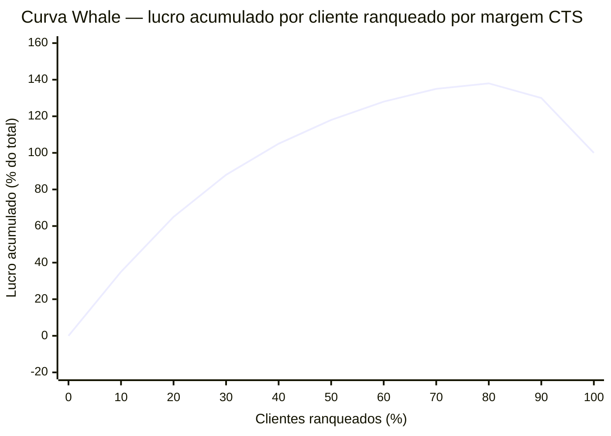
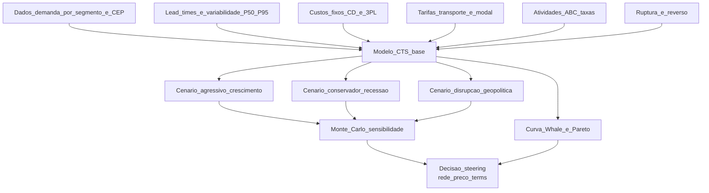
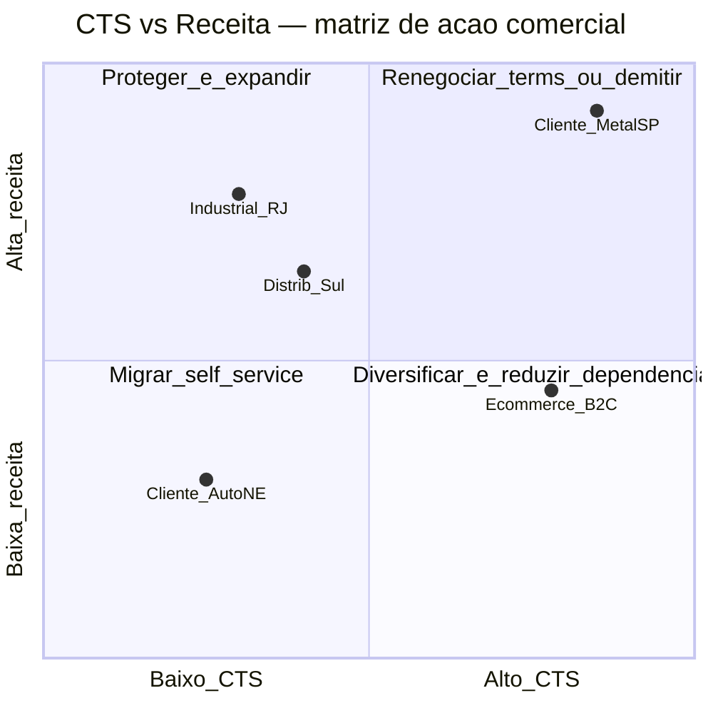

# *Cost-to-serve* e cenários de rede — do cliente «lucrativo» ao cenário defendível

***Cost-to-serve* (CTS)** é a tradução financeira de uma verdade incômoda: **nem todo cliente, canal, SKU ou região consome os mesmos recursos** da cadeia. Dois clientes com **margem bruta de 18%** podem ter, **após CTS**, margens líquidas de **+11%** e **−4%** — e a empresa, sem saber, **subsidia** o segundo com o primeiro. *Network design* sem CTS vira **média aritmética com cara de estratégia**, premiando volume errado e cortando custo no lugar errado.

Esta aula entrega o **artesanato** do CTS no padrão **ABC (Activity-Based Costing)** adaptado a logística e a disciplina de **cenarização** (base / agressivo / conservador) como **história quantificada**, não tarô executivo.

---

## Objetivos e resultado de aprendizagem

Ao final desta aula, você será capaz de:

- Construir um **CTS por segmento** (cliente, canal, SKU, região) com **drivers** explícitos e auditáveis.
- Calcular **margem após CTS** e identificar **subsídio cruzado** quantitativamente.
- Estruturar **três cenários** de rede com **premissas escritas** e **sensibilidades** declaradas.
- Produzir um **dossiê de steering** que sobrevive a perguntas de CFO e diretor comercial.
- Reconhecer **falsa precisão** e *garbage in / garbage out* em modelos de planilha.

**Duração sugerida:** 75–90 minutos. **Pré-requisitos:** noções de ABC costing, P&L por segmento, aula 1.1.

---

## Mapa do conteúdo

1. CTS — definição operacional, drivers e fronteira com ABC.
2. Cinco blocos de custo (transporte, armazenagem, capital, atendimento, ruptura).
3. Análise **Pareto-Whale** (curva de lucratividade por cliente).
4. Construção de **cenários** com Monte Carlo simplificado.
5. Caso TechLar numérico passo-a-passo.
6. Conexão CTS ↔ política comercial (preço, *terms*, *minimum order*).
7. Armadilhas: subsídio cruzado, falsa precisão, *change resistance*.

---

## Gancho — o cliente «grande» que drena a TechLar

A **TechLar** comemorava o *key account* «**MetalSP**»: **R$ 18 mi/ano**, margem bruta declarada **22%**, *top 3* em volume. Quando o controller alocou ABC:

| Linha | Valor anual (R$) |
|---|---|
| Receita líquida | 18.000.000 |
| CMV | (14.040.000) |
| **Margem bruta (22%)** | **3.960.000** |
| Frete dedicado urgente (84% pedidos D+1) | (1.420.000) |
| Devoluções por erro de pedido (EDI defeituoso) | (380.000) |
| Estoque dedicado (R$ 2,1 mi × 14% WACC) | (294.000) |
| *Picking* prioritário (12% recursos sobre 6% volume) | (260.000) |
| SAC dedicado (1,3 FTE alocado) | (195.000) |
| Multas SLA reversas (TechLar paga ao cliente) | (180.000) |
| Custo de ruptura (3 paradas de linha cobradas) | (520.000) |
| **Margem após CTS** | **711.000 (3,9%)** |

E o cliente «pequeno» **AutoNE** (R$ 3,2 mi, margem bruta declarada 19%) tinha margem após CTS de **9,4%** — pois pedia D+5, aceitava *batching*, sem dedicação.

A rede tinha sido desenhada para **«servir todos igual»**, e o time comercial era **bonificado por receita**. Os dois sistemas **não conversavam**. O CFO chamou de «contabilidade de poltrona»; quando viu o número, **cortou bônus de quem fechou MetalSP nos termos atuais**.

**Analogia do plano de saúde:** «cliente sênior com 7 comorbidades» não é tratado igual a «jovem corredor de maratona» **na precificação atuarial**. Por que sua logística trataria? CTS é **atuária aplicada à cadeia**.

**Analogia do restaurante:** o cliente que come no balcão, paga em dinheiro e sai em 12 minutos custa **40%** menos que o cliente que ocupa mesa por 90 minutos com 3 trocas de pedido — mesmo que ambos peçam o **mesmo prato**. Sem CTS, você **subsidia o segundo** com a margem do primeiro.

---

## Conceito-núcleo — CTS como ABC adaptado

**Definição operacional:** CTS de um segmento *s* é a soma dos custos logísticos e de atendimento atribuíveis a *s* via **drivers de atividade** observáveis (não rateio plano por receita).

\[
CTS_s = \sum_{a \in A} \text{taxa}_a \cdot \text{volume}_{a,s} + \text{capital}_s \cdot WACC + \text{ruptura}_s
\]

Onde *A* é o conjunto de **atividades logísticas** (pegar, embalar, embarcar, faturar, atender, devolver), `taxa_a` é o custo unitário da atividade, e `volume_{a,s}` é o consumo daquela atividade pelo segmento *s*.

### Cinco blocos de custo (template auditável)

| Bloco | Driver típico | Exemplo TechLar |
|---|---|---|
| **Transporte** | kg-km, frete dedicado, modal | R$ 0,082/kg-km rodo + R$ 1.200/expedição urgente |
| **Armazenagem + handling** | posições-pallet, picks, ASN | R$ 18/pallet-mês + R$ 1,40/pick |
| **Capital** | dias estoque × valor × WACC | DI corporativo 14% × R$ X estoque |
| **Atendimento** | tickets, FTE alocado, SLA | R$ 65/ticket P1, R$ 28/ticket P3 |
| **Ruptura + reverso** | parada de linha, multa, devolução | R$ 145/pedido devolvido + multa contratual |

### Curva Pareto-Whale (lucratividade cumulativa)

**Legenda:** padrão típico — **20–30% melhores clientes** geram **120–140%** do lucro; **20–30% piores destroem 30–40%** do lucro acumulado. CTS torna a curva **visível**; sem ele, a empresa enxerga apenas a média.

### Diagrama de fluxo CTS → cenário → decisão

**Legenda:** CTS é o **núcleo**; cenários são **lentes** que variam premissas; Monte Carlo (mesmo simplificado) força declarar **incerteza**, evitando ilusão de ponto único.

---

## Frameworks-chave

### 1. ABC (Kaplan & Cooper) aplicado a logística

Dois passos: (a) **alocar** custos de recursos a **atividades** via drivers de recurso (FTE, m², horas-máquina); (b) **alocar** atividades a **objetos de custo** (cliente/canal/SKU) via drivers de atividade.

### 2. Cenários estruturados (Shell Scenarios + Schoemaker)

Não confundir com **previsão**: cenário é uma **história internamente consistente** sobre o futuro, com **2–4 alternativas plausíveis e divergentes**. Boa prática: **2 eixos de incerteza crítica** → matriz 2×2 → 4 cenários.

### 3. Monte Carlo simplificado para steering

Em vez de prometer R$ 46,8 mi de TCO, declare: **«TCO esperado R$ 47 mi ± R$ 4 mi (P10–P90)»**, com distribuições por driver:

| Driver | Distribuição | Faixa |
|---|---|---|
| Frete diesel | Triangular | R$ 5,80–6,50–7,80/L |
| Câmbio USD | Lognormal | R$ 4,80–5,40–6,20 |
| Volume YoY | Normal | +5% σ=8% |
| WACC | Triangular | 12%–14%–18% |

### 4. *Customer service segmentation* (Christopher)

Cada segmento tem **proposta de serviço explícita**: prazo, mix, mínimo de pedido, *self-service* digital. CTS amarra **proposta** ↔ **custo** ↔ **preço**.

---

## Diagrama / Modelo principal — matriz CTS × estratégia comercial

**Legenda:** posicionamento por CTS unitário (eixo x) × receita absoluta (eixo y). **Quadrante 1** (alto CTS + alta receita) é zona de **risco político** — cortar dói, manter sangra. **Quadrante 3** (alto CTS + baixa receita) é candidato natural a **digitalização forçada** ou **encerramento**.

---

## Aprofundamentos — variações setoriais e geográficas

### Brasil

- **Substituição tributária ICMS** distorce CTS: cliente em SP paga ST, cliente em ES talvez não — mesma operação, custo logístico igual, **margem efetiva** diferente.
- ***Reforma Tributária (IBS/CBS, transição 2026–2033)***: CTS de cliente em GO/ES (operações fiscalmente vantajosas) **muda** ano a ano até 2033 — modelo precisa ser **dinâmico**.
- ***Cost-to-serve* canal C2C/B2C**: pedido médio R$ 180 com frete grátis viraliza CTS negativo em 2024–2025 (caso clássico da Magalu).

### EUA / UE

- ***Cost-to-serve* incluindo *carbon pricing*** (CBAM, EU ETS): CTS de cliente que exige aéreo *premium* sobe ~6–12% ao adicionar CO₂ a US$ 80–120/tCO₂e.
- **Amazon FBA** mostra CTS por SKU em tempo real ao seller — disciplina de **transparência** que B2B brasileiro raramente atinge.

### Casos célebres

- **Kraft (anos 1990)**: descobriu que **18% dos SKUs geravam 95% do lucro** — *SKU rationalization* baseada em CTS cortou 40% do portfólio mantendo 92% da receita.
- **Owens & Minor** (distribuidor médico US): vendeu **CTS como serviço** ao cliente hospitalar (modelo *Activity-Based Pricing*) — virou diferencial competitivo.

---

## Caso prático — TechLar reprecifica MetalSP

**Diagnóstico (visto acima):** MetalSP gera margem 3,9% após CTS, abaixo do hurdle de 8%.

**Três opções de mesa:**

| Opção | Mecanismo | Impacto esperado | Risco |
|---|---|---|---|
| **A — Ajuste de preço** | +4% no preço médio | margem → 7,5% | perda de 30% do volume? |
| **B — *Re-engineering* de serviço** | passar 50% pedidos D+1 → D+3; lote mínimo 200 un. | CTS −R$ 680k → margem 7,7% | resistência cliente; renegociar contrato |
| **C — Surcharge urgente** | manter D+1 mas cobrar R$ 180/expedição extra | margem 8,2% se mantida 70% volume urgente | cliente migra parte para concorrente |
| **D — Combinação B+C suave** | D+3 default + surcharge D+1 opcional | margem 9,1% projetada | melhor risco/retorno |

**Recomendação ao steering:** opção D, com **piloto de 90 dias** e *exit clause* em 180 dias.

**Sensibilidade:** se WACC sobe 4 p.p., margem D cai para 7,3% (ainda > hurdle). Se câmbio cai 8% (CMV cai), folga aumenta. Documentado em **memo de premissas** anexado.

---

## Trade-offs estratégicos

| Decisão | A favor | Contra |
|---|---|---|
| CTS granular SKU+cliente | precisão, justiça analítica | custo de TI, governança, política |
| Transparência total com vendas | alinhamento, *coachable* | arma na mão errada → quebra confiança |
| CTS contábil × CTS gerencial | alinhamento balanço | pode esconder *insight* |
| Cenário ponto único × Monte Carlo | clareza executiva | falsa certeza |

---

## Erros comuns e armadilhas

1. **CTS como projeto de TI sem owner de negócio** — vira relatório morto que ninguém abre.
2. **Custo padrão contábil antigo** alimentando decisão de serviço hoje (driver mudou).
3. **Esquecer estoque em trânsito** no CTS de canal urgente (canal pior é o que parece melhor).
4. **Cenários sem documento de premissas** — em 6 meses ninguém lembra por que «cenário 2» existia.
5. **Confundir alocação com causalidade** — alocar tempo de CFO por receita não significa que o CFO **gasta** tempo proporcional.
6. **Não usar resultado** — CTS calculado e arquivado sem repreçar / re-segmentar é **dívida cínica**.
7. **Falsa precisão** — entregar R$ 47.382.156,42 quando a faixa real é R$ 43–51 mi.

---

## Risco e governança

- **Político-comercial:** CTS pode virar **arma** entre comercial e ops; precisa **patrocinador C-level** e regra escrita.
- **Confidencialidade:** CTS por cliente vaza preço-real → pode ser usado pelo competidor → política de acesso restrita.
- **Auditoria:** drivers ABC precisam ser **reproduzíveis** (não fórmula opaca em planilha de uma pessoa que saiu).
- **ESG:** CTS deve incluir **CO₂ por cliente** (CBAM, *scope 3*).

---

## KPIs estratégicos

| KPI | Pergunta | Dono | Fonte | Cadência | Playbook |
|---|---|---|---|---|---|
| **Margem após CTS por cliente top-50** | Quem realmente lucra? | Controladoria + Comercial | ABC + ERP | Trimestral | Plano de ação por cliente Q1 negativo |
| **% Receita Q1 (zona vermelha)** | Concentração de risco? | CFO | CTS | Trimestral | Plano de saída/repricing 12 meses |
| **CTS unitário (R$/un.) por canal** | Diferenciação real? | Logística | CTS | Mensal | Comparar com preço médio canal |
| **Curva Whale acumulada** | Distribuição da rentabilidade | CEO + CFO | CTS | Trimestral | Revisão anual de portfólio |
| ***Cost-to-acquire* / CTS** | Marketing × ops alinhados? | CMO + COO | CRM + CTS | Trimestral | Realocar verba |
| **% CO₂ alocado por cliente** | Sustentabilidade auditável | ESG | CTS + fatores | Semestral | Repreçar canal carbono-intensivo |

---

## Tecnologias e ferramentas habilitadoras

- **ABC + CTS dedicados**: **SAP Profitability and Performance Management (PaPM)**, **Oracle Profitability and Cost Management Cloud (PCMCS)**, **Coupa SC Modeler** (*cost-to-serve module*), **Aptitude Software**.
- **Profitability analytics**: **Anaplan** (modelos integrados), **OneStream**, **Workday Adaptive Planning**.
- **BI**: **Power BI**, **Tableau**, **Qlik Sense** com camada semântica sobre datalake.
- **Datalake**: **Snowflake**, **Databricks**, **BigQuery**.
- **Simulação Monte Carlo**: **@RISK** (Palisade), **Crystal Ball** (Oracle), **Python (NumPy/SciPy)**.

---

## Glossário rápido

- **CTS**: *Cost-to-Serve* — custo total de servir um segmento.
- **ABC**: *Activity-Based Costing*.
- **Whale curve**: curva de lucro acumulado por cliente ranqueado.
- **Hurdle rate**: margem mínima aceita para manter cliente/projeto.
- **Subsídio cruzado**: cliente A paga (via preço) o custo extra que cliente B gera.
- **P50/P95**: percentis 50 e 95 de uma distribuição (mediana e *worst case* prático).
- **Drift de driver**: quando o consumo real de atividade descola do driver alocador.

---

## Aplicação — exercícios

**Exercício 1 (20 min) — CTS rápido.** Para **dois segmentos** (reais ou fictícios), liste **6–8 linhas de custo** com **driver** e **fonte do dado**. Calcule margem após CTS comparada à margem bruta declarada. **Quem foi o «MetalSP» do exercício?**

**Gabarito pedagógico:** ≥ 1 custo **direto** (frete) + ≥ 1 **alocado** (picking) + ≥ 1 **capital** (estoque); se só houver frete, faltou **handling/atendimento**. Diferença margem bruta vs após-CTS deve ser ≥ 3 p.p. para qualquer segmento «interessante».

**Exercício 2 (20 min) — Cenário escrito.** Construa **três cenários** (base, agressivo, conservador) com **3 premissas escritas cada** (volume, lead time, custo unitário, câmbio). Calcule o impacto no CTS de **um** cliente Q1.

**Gabarito:** premissas em **frase completa** («se câmbio sobe 12%, frete *inbound* sobe 7% via repasse PIS/COFINS»); cenário sem **alavanca de decisão clara** é cenário inútil.

**Exercício 3 (15 min) — Plano de ação.** Para um cliente Q1 vermelho identificado, escolha entre A/B/C/D do caso TechLar e **defenda** em 5 frases: o que muda, em quanto tempo, quem patrocina, qual KPI mede sucesso, qual o *exit*.

---

## Pergunta de reflexão

Qual cliente seu **provavelmente** subsidia outro hoje — e o que faria você descobrir em **30 dias** se fosse verdade?

---

## Fechamento — takeaways

1. Média mata: CTS revela **quem paga a festa** das políticas de serviço.
2. Cenário bom tem **premissa escrita**, não só célula colorida.
3. CTS sem **ação** (preço, terms, encerramento, redesenho) é **dívida cínica**.
4. Falsa precisão é pior que faixa honesta — Monte Carlo mesmo simples já educa o steering.
5. CTS é **artesanato**: drivers, governança e patrocinador C-level — sem o trio, vira PowerPoint.

---

## Referências

1. KAPLAN, R. S.; COOPER, R. *Cost & Effect: Using Integrated Cost Systems to Drive Profitability and Performance*. Harvard Business School Press, 1998 — bíblia ABC.
2. CHRISTOPHER, M. *Logistics & Supply Chain Management*. 5ª ed., Pearson — *customer service segmentation*.
3. BRAITHWAITE, A.; SAMAKH, E. *The cost-to-serve method*. *International Journal of Logistics Management*, 1998 — referência seminal.
4. SCHOEMAKER, P. J. H. *Scenario Planning: A Tool for Strategic Thinking*. *Sloan Management Review*, 1995.
5. SHELL — *Scenarios* (publicações públicas).
6. ILOS — *Custo Logístico das Empresas Brasileiras 2024*.
7. McKINSEY — *The hidden costs of your customer mix* (2022–2024).
8. ASCM, CSCMP — *cost-to-serve frameworks*.

---

**Ponte:** [Nível de serviço e KPIs](../../trilha-fundamentos-e-estrategia/modulo-04-custos-logisticos-performance/aula-03-nivel-servico-kpis-logisticos.md); [Indicadores logísticos](../../trilha-dados-analytics-logistica/modulo-04-indicadores-logisticos-kpis/README.md); próxima aula trata **postponement, pooling e intuição multi-echelon** — onde o CTS encontra a **política de estoque**.
