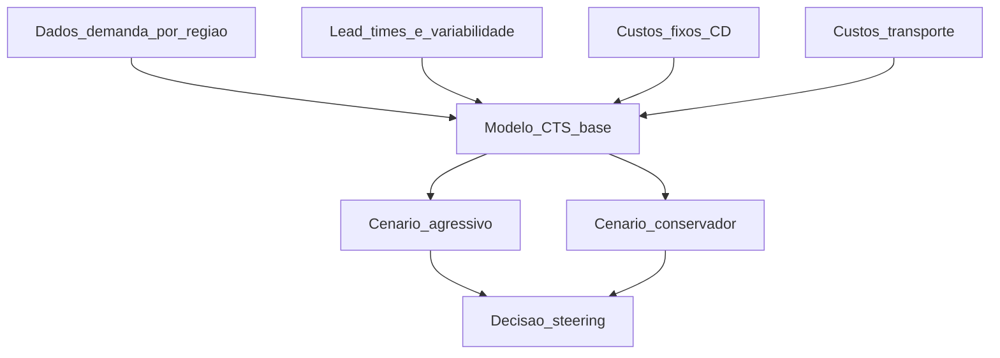

# *Cost-to-serve* e cenários de rede — do cliente «lucrativo» ao cenário defendível

**Cost-to-serve (CTS)** é a ideia de que **nem todo cliente ou canal consome os mesmos recursos** da cadeia: mesmo com **mesma margem bruta aparente**, o **lucro líquido** após logística, estoque, atendimento e ruptura pode inverter o ranking. *Network design* sem CTS vira **média** que esconde **subsídio cruzado** involuntário.

---

## Objetivos e resultado de aprendizagem

**Ao final desta aula**, você será capaz de:

- Definir **cost-to-serve** em nível operacional para discussão com vendas e finanças.  
- Montar **três cenários** (base, agressivo, conservador) para decisão de rede sem prometer falsa precisão.  
- Identificar **dados mínimos** para sensibilidade de lead time e estoque em trânsito.

**Duração sugerida:** 60–75 minutos.

---

## Gancho — o cliente «grande» que drena a TechLar

A **TechLar** celebrava um **key account** com volume alto. Quando o controller alocou **custo de entrega urgente**, **devoluções por erro de pedido** (EDI ruim) e **estoque dedicado**, o CTS mostrou **margem negativa** no cliente — mascarada por outros canais. A rede tinha sido desenhada para **servir todos igual**; a estratégia comercial tinha sido desenhada para **premiar volume**. Os dois **não conversavam**.

**Analogia do buffet *versus* menu à la carte:** quem «come muito e volta onze vezes» pode ser ótimo no marketing ou péssimo na conta do restaurante — depende do **preço** e do **custo real** de servir aquele perfil.

---

## Mapa do conteúdo

- O que entra no CTS (diretos e alocações).  
- Cenários de rede: o que muda em cada premissa.  
- Árvore de decisão simplificada: quando vale **novo nó** ou **política** em vez de capex.  
- Armadilha da **falsa precisão** em modelo de planilha.

---

## Conceito núcleo — CTS e cenários

**Cost-to-serve (definição pedagógica):** soma dos **custos logísticos e de atendimento** atribuíveis a um **segmento** (cliente, canal, região, família de produto), incluindo **estoque**, **transporte**, **manuseio**, **retrabalho** e, quando aplicável, parte de **tecnologia e pessoas** alocada por regra clara.

**Cenários** não são «previsões»: são **histórias quantificadas** com premissas explícitas:

| Cenário | Premissa típica | Efeito na rede |
|---------|-----------------|----------------|
| Base | demanda estável, lead time atual | referência |
| Agressivo | crescimento + prazo menor exigido por contrato | mais regionalização ou estoque |
| Conservador | queda de volume ou crédito apertado | consolidação de nós, menos capital |

**Legenda:** losangos implícitos na **decisão** final `R` — comparar **CTS + investimento + risco**, não só uma planilha.

**Mini-caso numérico simples (hipótese pedagógica):** dois canais, mesmo preço: canal A pede **entrega D+1** (90% dos pedidos urgentes); canal B aceita **D+5**. Sem CTS, a empresa trata **igual**; com CTS, canal A deve carregar **mais custo** ou **preço diferenciado** — ou a rede deve **mudar** (ex.: mini-CD próximo a A).

---

## Trade-offs

- **Granularidade do CTS:** mais detalhe melhora justiça; aumenta **custo de governança** de dados e briga política.  
- **Transparência com vendas:** CTS pode ser **ferramenta** de preço ou **arma** — precisa **regra** e patrocínio executivo.  
- **Lead time:** pequena melhoria em **variabilidade** pode valer mais que média menor (ligação a serviço e estoque de segurança).

---

## Aplicação — exercício

Escolha **dois** segmentos (reais ou fictícios). Para cada um, liste **cinco** linhas de custo que deveriam entrar no CTS e diga **de onde viria o dado** (ERP, TMS, planilha, estimativa). Depois, escreva **uma** premissa que faria o cenário **agressivo** mudar o número de CDs.

**Gabarito pedagógico:** deve aparecer **pelo menos um** custo **alocado** (ex.: picking proporcional) e **um** custo **direto** (ex.: frete); se só houver frete, faltou **manuseio/estoque** para canais distintos.

---

## Erros comuns e armadilhas

- CTS como projeto de TI **sem** owner de negócio — vira relatório morto.  
- Usar **custo padrão** contábil antigo para decisão de **serviço** hoje.  
- Ignorar **estoque em trânsito** no CTS de canal urgente.  
- Cenários sem **documento de premissas** — ninguém lembra por que «cenário 2» existia.

---

## KPIs e decisão

- **Margem após CTS** por segmento (quando a contabilidade permitir).  
- **Custo logístico por pedido** e por **caixa/peso** por canal.  
- **Percentil 95** de lead time (não só média).  
- **Capital em trânsito** estimado (valor × tempo × taxa).

---

## Fechamento — três takeaways

1. Média mata: CTS revela **quem paga a festa** de cada política de serviço.  
2. Cenário bom tem **premissa escrita**, não só célula colorida.  
3. Rede e comercial precisam **mesma linguagem** de segmento.

**Pergunta de reflexão:** qual segmento hoje provavelmente **subsidia** outro sem que o comercial saiba?

---

## Referências

1. DRURY, C. *Management and Cost Accounting*. Cengage — bases de custeio e alocação (adaptar ao contexto logístico).  
2. ASCM. Recursos sobre **strategy**, *cost-to-serve* e alinhamento S&OP — [ascm.org](https://www.ascm.org/).  
3. CHRISTOPHER, M. *Logistics & Supply Chain Management*. Pearson — *customer service* e segmentação da cadeia.

**Ponte:** [Nível de serviço e KPIs](../../trilha-fundamentos-e-estrategia/modulo-04-custos-logisticos-performance/aula-03-nivel-servico-kpis-logisticos.md); [Indicadores](../../trilha-dados-analytics-logistica/modulo-04-indicadores-logisticos-kpis/README.md).
