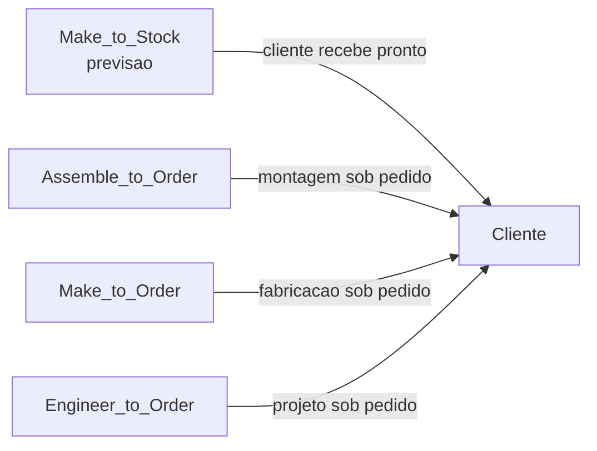
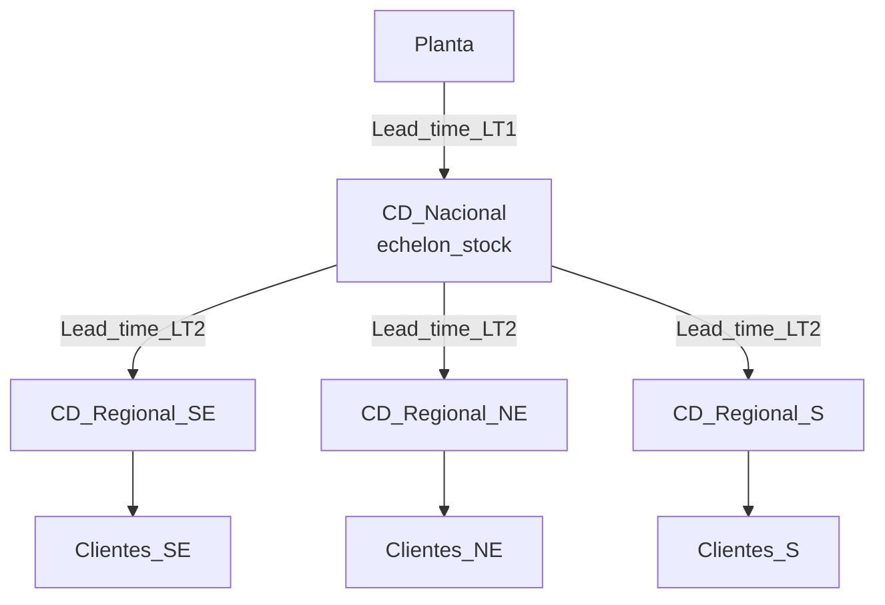
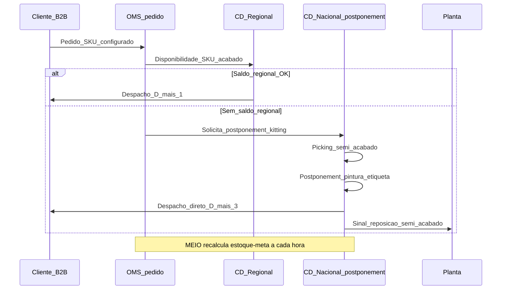

# *Postponement*, *pooling* e intuição multi-echelon — flexibilidade sem virar doutorado em otimização

***Postponement*** (postergação) é **atrasar a forma final do produto** — ou a **alocação ao cliente** — até existir **informação melhor**, reduzindo *stockout* de SKU errado e, em muitos casos, liberando ***pooling*** de risco. **Multi-echelon** descreve **vários níveis de estoque** (fábrica → CD nacional → CD regional → loja/cliente), com **lead times** próprios e **decisões acopladas**: mexer numa camada propaga onda nas outras (efeito chicote, *bullwhip*).

Esta aula entrega **literacia executiva** para conversar com planejamento, TI e finanças: por que **dois CDs não são metade do estoque de quatro CDs** (matemática do *pooling*), onde **MEIO (Multi-Echelon Inventory Optimization)** entrega ROI real, e quando o postponement vira **vantagem competitiva** (caso HP DeskJet, Zara, Benetton).

---

## Objetivos e resultado de aprendizagem

Ao final desta aula, você será capaz de:

- Explicar **postponement de forma, tempo e localização** com exemplos logísticos reais.
- Descrever ***pooling* de risco** quantitativamente (regra da raiz quadrada).
- Calcular intuitivamente **safety stock multi-echelon** (estoque de segurança em cascata).
- Posicionar **MEIO** (Multi-Echelon Inventory Optimization) na agenda de planejamento.
- Comparar arquitetura *push × pull × decoupling point* com analogias.

**Duração sugerida:** 75–90 minutos. **Pré-requisitos:** noções de safety stock single-echelon, lead time, *fill rate* (trilha Operações, módulo 1).

---

## Mapa do conteúdo

1. *Postponement* em **três variantes** (forma, tempo, localização) com casos.
2. *Pooling* — a regra **√n** que muda toda discussão de centralização.
3. ***Decoupling point*** (*push-pull boundary*): onde a cadeia muda de previsão para pedido.
4. **Safety stock multi-echelon** — intuição de cascata e sistema integrado.
5. **MEIO** como categoria de software (Logility, ToolsGroup, o9, SAP IBP).
6. Casos clássicos (HP DeskJet, Zara, Benetton, Dell BTO).
7. Quando *postponement* **não** vale.

---

## Gancho — a TechLar e o inferno das cores

A **TechLar** vendia 7 variantes de cor de uma capota de moto a **3 CDs** com estoque acabado:

| Cenário atual (acabado em 3 CDs) | Anual |
|---|---|
| SKUs distintos | 21 (7 cores × 3 CDs) |
| Estoque médio total | 18.900 unidades |
| Capital imobilizado (R$ 240/un.) | R$ 4,5 mi |
| Obsolescência *markdown* (cor sai de moda) | R$ 720k/ano (16% das vendas) |
| Ruptura de cor errada | 4,2% pedidos perdidos |

A engenharia propôs **postponement de forma**: estocar **capota branca semi-acabada** (uma SKU) num CD central, com linha de **pintura on-demand** ativada pelo pedido (lead time +18h, custo +R$ 12/un.).

| Cenário postponement | Anual |
|---|---|
| SKUs estocados | 1 (capota branca) + 7 latas tinta |
| Estoque médio total | 9.200 unidades brancas |
| Capital imobilizado (R$ 195/un. semi) | R$ 1,8 mi |
| Obsolescência | R$ 95k (cor errada não acumula) |
| Ruptura | 0,8% |
| Custo de pintura adicional | R$ 510k |
| **Economia líquida** | **R$ 2,4 mi/ano** |

A decisão **valeu**, mas exigiu: linha de pintura redundante (capex R$ 1,2 mi), MES integrado ao OMS, retreinamento do CD em **kitting**.

**Analogia da pizzaria:** **massa** e **molho** são preparados em batelada (*pooling* + *postponement*); o **sabor final** só é decidido no pedido. Imagine se cada sabor fosse pizza inteira pronta às 10h — a **margherita** sumiria, a **portuguesa** mofaria, e o cliente do **calabresa** receberia a portuguesa requentada.

**Analogia da vinícola:** o **mosto base** envelhece em barril genérico (*pooling*); o **engarrafamento, rótulo e safra** são decididos próximo à venda — permite a mesma cantina servir **mercado interno** e **exportação** com SKUs distintos sem dobrar capital.

**Analogia da indústria de tintas (caso real Sherwin-Williams / Suvinil):** loja vende **base branca** + **pigmentos** em estoque genérico; **mistura** acontece **na loja**, no momento da venda, em ~3 minutos. Resultado: **5 SKUs** físicos servem **8.000+** cores de catálogo. *Postponement de forma* na sua forma mais pura.

---

## Conceito-núcleo

### Três variantes de postponement (Lee, 1996)

| Variante | O que se posterga | Exemplo |
|---|---|---|
| **Forma** | configuração final do produto | HP DeskJet (fonte de alimentação adicionada por região); IKEA (montagem); Sherwin-Williams (pigmentação) |
| **Tempo** | momento de produção/montagem | Zara (38% coleção definida em-temporada); Dell BTO (build-to-order) |
| **Localização** | de qual nó atender | *Allocation deferral*: decidir só após pedido qual CD despacha |

### *Pooling* de risco — a regra da raiz quadrada

Para demandas **independentes e identicamente distribuídas**, ao consolidar *n* estoques regionais em **um único** estoque central:

\[
\sigma_{central} = \sigma_{individual} \cdot \sqrt{n}
\]

Como o **safety stock** é proporcional ao desvio:

\[
SS_{central} = z \cdot \sigma_{individual} \cdot \sqrt{n} \cdot \sqrt{LT}
\]

Versus *n* CDs separados, cada um com \(SS = z \cdot \sigma_{individual} \cdot \sqrt{LT}\), totalizando \(n \cdot SS\).

**Razão de redução:** \( \frac{\sqrt{n}}{n} = \frac{1}{\sqrt{n}} \).

| n CDs | Redução de safety stock ao centralizar | Exemplo |
|---|---|---|
| 2 → 1 | 29% | dois CDs viram um |
| 4 → 1 | 50% | rede regional vira hub |
| 9 → 1 | 67% | rede capilar vira central |
| 16 → 1 | 75% | farmácia → e-commerce nacional |

**Atenção (caveats reais):**

1. Demandas **não** são independentes (correlação positiva entre regiões reduz benefício; correlação negativa amplifica).
2. Centralizar **aumenta lead time** ao cliente final → *fill rate* pode cair se serviço exige proximidade.
3. *Pooling* funciona em SKU **slow-moving** (alto coeficiente de variação) — em SKU rápido, ganho marginal cai.

### *Decoupling point* (Christopher / Hoekstra-Romme)

**Legenda:** o **decoupling point** é o ponto da cadeia onde se **muda de previsão para pedido**. *Postponement* desloca esse ponto **a jusante** (mais perto do cliente) → mais flexibilidade, menos obsolescência, mais custo unitário.

### Safety stock multi-echelon — intuição

Em rede 2-echelon (CD nacional → CDs regionais), **dois caminhos** para proteger serviço:

**Política 1 — *Independent* (single-echelon repetido):**

Cada CD regional carrega seu safety stock; CD nacional carrega safety stock para repor regionais. **Total alto**, mas simples.

**Política 2 — *Echelon stock* (Clark-Scarf, 1960):**

Decisão **integrada**: estoque protetor pode ser **acumulado no upstream** (CD nacional) e **alocado dinamicamente** quando demanda se materializa. **Reduz total** em 15–35% para serviço equivalente, mas exige **MEIO** e disciplina.

**Legenda:** decisão MEIO calcula safety stock **acoplado** entre níveis, considerando que falha em CDN compromete CDRn (cascade). ToolsGroup, Logility, SAP IBP MEIO, o9 implementam.

---

## Frameworks-chave

### 1. Lee, H. L. — *Postponement and Mass Customization*

Quatro padrões de cadeia: *push*, *pull*, *push-pull*, *postponement-driven*.

### 2. Hoekstra & Romme — *decoupling point* (1992)

Mapa de **5 níveis** (MTS, ATO, MTO, ETO, *purchase to order*).

### 3. Clark-Scarf (1960) — base matemática multi-echelon

Mostra otimalidade de política *base-stock* sob certas condições; fundamento de MEIO.

### 4. Graves & Willems — *guaranteed service model* (2000)

Aborda multi-echelon assumindo **service time guarantee** entre nós; usado por Logility/ToolsGroup.

### 5. **HP DeskJet (Lee, 1995)** — caso seminal

HP tinha estoque acabado por país (US, EU, JP) com **fontes de alimentação distintas**. Postponement: estocar **impressora genérica** + **fontes regionais** instaladas no CD de destino → −18% estoque, −80% obsolescência.

### 6. **Zara** — *postponement de tempo* radical

38% da coleção definida **dentro da temporada**, com produção próxima (Galiza, Marrocos, Turquia). Lead time 3 semanas vs 6 meses dos competidores → **menos markdown, mais full-price**.

### 7. **Dell BTO (anos 1990–2000)** — *postponement de configuração*

Componentes em estoque, montagem só após pedido. Capital de giro **negativo** (cliente pagava antes do fornecedor) — vantagem que se erodiu com commodity de PCs.

---

## Diagrama / Modelo principal — sequência multi-echelon com postponement

**Legenda:** atores = nós e sistemas; mensagens = fluxos de pedido, reposição e decisão de postponement. **Caminho alternativo** via CDN substitui ruptura por **lead time +2 dias** com produto **certo** — cliente prefere isso a esperar SKU-correto repor.

---

## Aprofundamentos — variações setoriais

### Indústria

- **Automotiva**: postponement de cor, opcional, mercado de destino (CKD/SKD/CBU).
- **Eletrônicos**: módulo genérico + firmware regional; tarifa Trump 2026 reforça produção México (USMCA) com módulo asiático.
- **Bebidas (AmBev, Coca)**: *postponement de embalagem* (lata vs garrafa vs PET) por região; *form pooling* via SKU multi-canal.
- **Têxtil/moda**: Zara é exemplo; Inditex/Decathlon aplicam **fast supply** com *postponement*.

### Varejo

- **Dark stores e mini-fulfillment**: extrema *postponement de localização* — alocação de pedido decidida em segundos.
- **D2C (direct to consumer)**: MTO para configurador + *drop ship* (Nike By You, custom).

### Brasil

- **Substituição tributária ICMS-ST** atrapalha postponement de localização: SKU já tributado em SP não pode «virar» SKU para MG sem ajuste fiscal.
- **Reforma Tributária 2026–2033**: simplifica e **viabiliza** mais postponement geográfico (IBS/CBS no destino).
- **Cabotagem (BR do Mar)**: viabiliza postponement com semi-acabado em Santos despachando para CDs do Norte por marítimo.

---

## Trade-offs estratégicos

| Decisão | A favor | Contra |
|---|---|---|
| Postponement de forma | menos obsolescência, mais SKUs comerciais com menos físicos | capex linha kitting, lead time interno +, complexidade ops |
| *Pooling* central | redução √n no safety stock, capital de giro | distância cliente, lead time, multa SLA |
| MEIO software | 15–35% menos estoque para mesmo serviço | implementação 9–18 meses, MDM exigente, change resistance |
| Push × pull | *push* eficiente em commodity; *pull* responsivo em moda | *push* sofre obsolescência; *pull* sofre capacidade |
| Decoupling tardio | flexibilidade máxima | custo unitário maior, lead time cliente +1 a +3 dias |

---

## Caso prático — TechLar 2 vs 3 CDs com postponement

Cenário SKU «capota com 7 cores», demanda anual 84.000 unidades, distribuição: SE 50%, NE 30%, S 20%; \(\sigma_{semanal}\) por região = 130 unidades; lead time reposição CD nacional = 5 dias.

**Política A — 3 CDs com acabado por cor:**

\(SS_{regional} = 1{,}65 \cdot 130 \cdot \sqrt{5/7} \cdot 7\) cores ≈ **1.288 un./CD**, total **3.864 un.** ao serviço 95%.

**Política B — 1 CD nacional com semi-acabado + postponement:**

Pooling 3 regiões → \(\sigma_{nacional} = 130 \cdot \sqrt{3} = 225\); pooling 7 cores → \(\sigma_{efetivo} \approx 225 \cdot 0{,}5 = 113\) (correlação parcial); \(SS = 1{,}65 \cdot 113 \cdot \sqrt{5/7} \approx \mathbf{157}\) **un. semi-acabado**.

**Diferença:** ~96% menos safety stock (em unidade); custo: lead time cliente sobe de D+1 para D+3, mais R$ 12/un. de pintura.

**Decisão:** SE de alta receita pode merecer pequeno *forward stock* de cores top 2, com restante via postponement → **arquitetura híbrida**, melhor dos dois mundos.

---

## Erros comuns e armadilhas

1. **Postponement sem capacidade estável de kitting** → vira gargalo no momento crítico.
2. **Centralizar acabado** em SKU com **prazo contratual** D+1 → multa devora economia.
3. ***Pooling* sem rever política de S&OP** → continua tratando SKU como antes; ganho não materializa.
4. **MEIO comprado, não adotado** → engenheiro de planejamento ainda usa Excel paralelo.
5. **Achar que multi-echelon resolve chicote sozinho** — **governança de previsão** e disciplina de lote continuam essenciais.
6. **Postergar em demanda determinística** (commodity B2B com pedido programado) → custo extra sem ganho.
7. **Ignorar correlação** entre regiões — pooling de demandas correlacionadas (toda a BR cresce/cai junta em recessão) entrega **menos** que √n promete.

---

## Risco e governança

- **Operacional:** capacidade de postponement vira **SPOF** (uma linha pintura para tudo); redundância obrigatória.
- **Fiscal BR:** transferência semi-acabado entre filiais carrega ICMS — modelar antes.
- **Qualidade:** postponement em CD não-fabril exige certificação ISO 9001 e treinamento de operadores.
- **Sustentabilidade:** menos *markdown* = menos resíduo (alinhamento ESG explícito).

---

## KPIs estratégicos

| KPI | Pergunta | Dono | Fonte | Cadência | Playbook |
|---|---|---|---|---|---|
| ***Markdown* / obsolescência por família** | Postponement reduziu? | Marketing + Log. | ERP + WMS | Mensal | Estender a + famílias |
| ***Fill rate* SKU variante × família agregada** | Postponement entregando? | Customer service | OMS | Semanal | Recalibrar lead time interno |
| **Safety stock multi-echelon (R$)** | MEIO funcionando? | Planejamento | IBP | Mensal | Re-treinar modelo |
| **Capital imobilizado por SKU (DPI — Days Payable Inventory)** | Giro está acelerando? | Tesouraria | ERP | Mensal | Encurtar pipeline |
| **Lead time pedido → expedição** | Postponement não degradou serviço? | Logística | OMS+WMS | Semanal | Capacidade kitting |
| **Custo unitário kitting (R$/un.)** | Linha está estável? | Operações | MES | Mensal | OEE da linha |
| ***Bullwhip* (variância demanda upstream / downstream)** | Cadeia está calma? | S&OP | IBP | Trimestral | Revisar política lote/forecast |

---

## Tecnologias e ferramentas habilitadoras

- **MEIO especialistas**: **ToolsGroup SO99+**, **Logility Demand & Inventory**, **John Galt Atlas Planning Platform**.
- **Suítes IBP com MEIO**: **SAP IBP for Inventory**, **Kinaxis Maestro (multi-echelon)**, **o9**, **Blue Yonder Fulfillment**, **OMP Unison**.
- **Configuradores de produto** (postponement de forma): **Tacton CPQ**, **Configit**, **Salesforce CPQ**.
- **MES + integração WMS**: **Siemens Opcenter**, **GE Proficy**, **Rockwell FactoryTalk**.
- **Simulação**: **AnyLogic**, **Simio** (testar política antes de implementar).

---

## Glossário rápido

- **Postponement**: postergação da forma, tempo ou localização.
- **Pooling**: consolidação de demandas em estoque comum.
- **Decoupling point**: fronteira entre *forecast-driven* e *order-driven*.
- **MTS/ATO/MTO/ETO**: modos de produção por ponto de desacoplamento.
- **MEIO**: *Multi-Echelon Inventory Optimization*.
- **Bullwhip**: amplificação de variância na cadeia ascendente.
- **Echelon stock**: visão integrada de estoque acumulado a partir de um nó.
- **Service time guarantee**: prazo garantido entre nós (Graves-Willems).
- **CKD/SKD/CBU**: *Completely / Semi / Built-up* (modos de exportação automotiva).

---

## Aplicação — exercícios

**Exercício 1 (15 min) — Política A vs B.** Para um produto fictício com 3 variantes (cor) e 3 CDs regionais, monte: (A) acabado em cada CD; (B) semi-acabado central + acabado regional. Liste **3 benefícios** e **3 custos** de cada. Calcule a redução qualitativa de safety stock em B usando a regra √n.

**Gabarito:** B deve citar **redução de obsolescência** + **pooling de capital**; A deve citar **velocidade** + **simplicidade ops**. Sem custo em B = aluno ignorou kitting/MES/treinamento.

**Exercício 2 (20 min) — Decoupling point.** Para sua cadeia (real ou TechLar), identifique o **decoupling point atual** (MTS/ATO/MTO/ETO) por família. Onde **moveria** o ponto e por quê? Quais **3 dados** precisaria ter antes da decisão?

**Gabarito:** dado mínimo: **demanda P95 por SKU**, **CV (coeficiente variação)**, **lead time componente vs cliente**. Mover decoupling sem ler CV é decisão cega.

**Exercício 3 (15 min) — MEIO ou não MEIO?** Liste **3 critérios** que justificariam comprar MEIO software em sua empresa, e **3 sinais** de que ainda não vale (faltaria MDM, S&OP imaturo, etc).

---

## Pergunta de reflexão

Qual SKU do seu portfólio hoje seria **primeiro candidato a postponement de forma** — e qual seria o *bottleneck* (ops, fiscal, comercial) que precisa ser endereçado **antes** do redesign?

---

## Fechamento — takeaways

1. *Postponement* é **decisão de rede + processo + sistema**, não slide de marketing.
2. *Pooling* é **estatística a favor do capital** — com preço pago em tempo e distância.
3. **Multi-echelon** exige **intuição de cascata** + MEIO software para entregar potencial.
4. *Decoupling point* é **botão estratégico** — mover a jusante = flexibilidade, custo unitário; a montante = eficiência, risco obsolescência.
5. Casos clássicos (HP, Zara, Dell, Sherwin-Williams) mostram que **postponement bem feito** vira **vantagem competitiva**, não otimização operacional.

---

## Referências

1. LEE, H. L. *Effective Inventory and Service Management Through Product and Process Redesign*. *Operations Research*, 1996 — postponement seminal.
2. LEE, H. L. *The Triple-A Supply Chain*. *HBR*, 2004 — agility, adaptability, alignment.
3. CHRISTOPHER, M. *Logistics & Supply Chain Management*. 5ª ed. — *postponement* e *decoupling point*.
4. SIMCHI-LEVI, D.; KAMINSKY, P.; SIMCHI-LEVI, E. *Designing and Managing the Supply Chain* — multi-echelon e pooling.
5. CLARK, A. J.; SCARF, H. *Optimal Policies for a Multi-Echelon Inventory Problem*. *Management Science*, 1960 — base matemática.
6. GRAVES, S. C.; WILLEMS, S. P. *Optimizing strategic safety stock placement in supply chains*. *Manufacturing & Service Operations Management*, 2000.
7. HOEKSTRA, S.; ROMME, J. *Integral Logistic Structures: Developing Customer-Oriented Goods Flow*. McGraw-Hill, 1992.
8. FERDOWS, K.; LEWIS, M.; MACHUCA, J. *Rapid-Fire Fulfillment* (Zara case). *HBR*, 2004.
9. GARTNER — *Magic Quadrant for Supply Chain Planning Solutions* (atualizar).
10. ASCM — *inventory optimization* e *postponement strategies*.

---

**Ponte:** [MRP / S&OP](../../trilha-fundamentos-e-estrategia/modulo-03-planejamento-demanda-sop/README.md); [Gestão de estoques](../../trilha-operacoes-logisticas/modulo-01-gestao-de-estoques/README.md); próximo módulo (**Procurement / Strategic Sourcing**) ataca **o que comprar e como negociar** — a outra face da decisão de rede.
