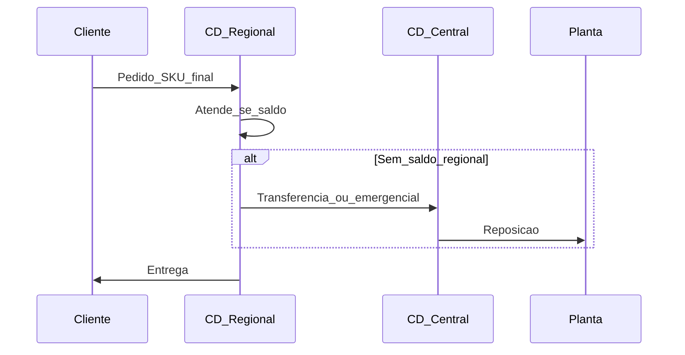

# *Postponement*, *pooling* e intuição multi-echelon — flexibilidade sem virar doutorado em otimização

***Postponement*** (postergação) é atrasar a **forma final** do produto ou a **alocação** ao cliente até ter **informação melhor** — reduzindo *stockout* de SKU errado e, em muitos casos, liberando ***pooling*** de risco. **Multi-echelon** descreve **vários níveis** de estoque (fábrica → CD → loja): a intuição estratégica é **onde** segurar estoque **comum** *versus* **específico**.

Esta aula **não** é otimização matemática multi-echelon (solver); é **literacia** para conversar com planejamento e TI sobre **desenho** e dados.

---

## Objetivos e resultado de aprendizagem

**Ao final desta aula**, você será capaz de:

- Explicar **postponement** de forma e de localização com exemplos logísticos.  
- Descrever **pooling** de risco em palavras e ligar a **menos** variabilidade agregada.  
- Comparar **qualitativamente** 2 *versus* 3 CDs para SKUs de alto mix (mini-caso).

**Duração sugerida:** 60–75 minutos.

---

## Gancho — a TechLar e o inferno das cores

A **TechLar** segurava estoque **acabado** de cada **cor** em três CDs. *Sell-through* mudava com moda regional; sobrava **azul** no Sul e faltava **cinza** no Nordeste. Ao mover **semi-acabado** (mesma base) para um **kitting** regional tardio, reduziu **obsolescência** — com custo de **operação** maior no CD. O trade-off **valeu** porque o capital e o *markdown* eram **maiores** que o manuseio extra.

**Analogia da pizzaria:** massa e molho são **comuns** (*pooling*); o sabor final só no último minuto — **postponement**. Se cada sabor fosse pizza inteira pronta às 10h, o desperdício sobe.

---

## Mapa do conteúdo

- *Postponement* por **forma** (SKU genérico → específico) e por **tempo/local**.  
- *Pooling*: estoque **compartilhado** *versus* dedicado.  
- Intuição **multi-echelon**: estoque «sobe ou desce» na rede?  
- Sequência pedido → alocação com **dois** CDs.

---

## Conceito núcleo

**Postergação de forma:** manter **módulo comum** até o último passo (kitting, etiqueta, embalagem regional, idioma).

**Postergação de localização:** decidir **de qual CD** atende só após o pedido (ou com previsão curta), em vez de «empurrar» tudo cedo para o destino final.

**Pooling de risco:** demandas **independentes** agregadas em um estoque comum tendem a ter **menor** variabilidade relativa do que estoques isolados (*consenso de mercado* baseado em estatística agregada — não é promessa numérica sem dados).

**Multi-echelon (intuição):** cada nível **observa** outro com **lead time** e **regras de reposição**; decisões em um nível **empurram** variabilidade para outro (efeito chicote ainda aparece, mas o *design* pode **amortecer**).

**Legenda:** atores = **nós**; mensagens = **fluxo** de pedido e reposição. *Postponement* forte reduziria SKUs **finais** no `CD1` e aumentaria **semi-acabado** em `CD2` ou na `P` — o diagrama mudaria de forma.

**Mini-caso 2 *versus* 3 CDs:** com **alto mix** e correlação **baixa** entre regiões, **mais** pooling central (menos CDs com acabado) pode **cair** ruptura de SKU raro — ao preço de **tempo** e **frete**. Com **prazo contratual curto**, o oposto pode mandar.

---

## Trade-offs

- *Postponement* **reduz** risco de mix errado; **aumenta** lead time interno ou custo de kitting.  
- *Pooling* **reduz** capital agregado em muitos cenários; pode **aumentar** distância média e tempo.  
- Mais elos de decisão exigem **dados** e **disciplina** de previsão (senão vira só transferência caótica).

---

## Aplicação — exercício

Para **um** produto com **três** variantes (cor ou voltagem), desenhe **duas** políticas: (A) acabado em cada CD regional; (B) semi-acabado central + acabado regional. Liste **dois** benefícios e **dois** custos de cada.

**Gabarito pedagógico:** (B) deve citar **menos obsolescência** ou **pooling**; (A) deve citar **velocidade** ou **simplicidade operacional**. Se (B) só tiver benefícios sem custo, faltou **manuseio/tempo/capex** de linha de kitting.

---

## Erros comuns e armadilhas

- *Postponement* sem **capacidade** de kitting estável — vira gargalo.  
- Centralizar **acabado** ignorando **prazo** B2B com multa.  
- Achar que multi-echelon «resolve chicote» sozinho — **governança** de previsão e lote continua necessária.

---

## KPIs e decisão

- **Obsolescência** / *markdown* por família.  
- **Fill rate** no SKU variante *versus* família agregada.  
- **Custo de kitting** por unidade.  
- **Lead time** pedido→expedição em cada política.

---

## Fechamento — três takeaways

1. *Postponement* é **decisão de rede e de processo**, não só de marketing.  
2. *Pooling* é **estatística a favor do capital** — com preço em tempo/distância.  
3. Multi-echelon exige **intuição** de onde o estoque «absorve» o choque.

**Pergunta de reflexão:** qual variante do seu portfólio hoje seria **primeiro candidato** a postergação de forma?

---

## Referências

1. LEE, H. L.; TANG, C. S. Modelos de *postponement* — artigos clássicos em *Harvard Business Review* e literatura de operações (visão conceitual).  
2. SIMCHI-LEVI, D.; KAMINSKY, P.; SIMCHI-LEVI, E. *Designing and Managing the Supply Chain*. McGraw-Hill — introdução a decisões de rede e incerteza.  
3. ASCM — *supply chain strategy* e integração planejamento–execução — [ascm.org](https://www.ascm.org/).

**Ponte:** [MRP / S&OP](../../trilha-fundamentos-e-estrategia/modulo-03-planejamento-demanda-sop/README.md); [Gestão de estoques](../../trilha-operacoes-logisticas/modulo-01-gestao-de-estoques/README.md).
