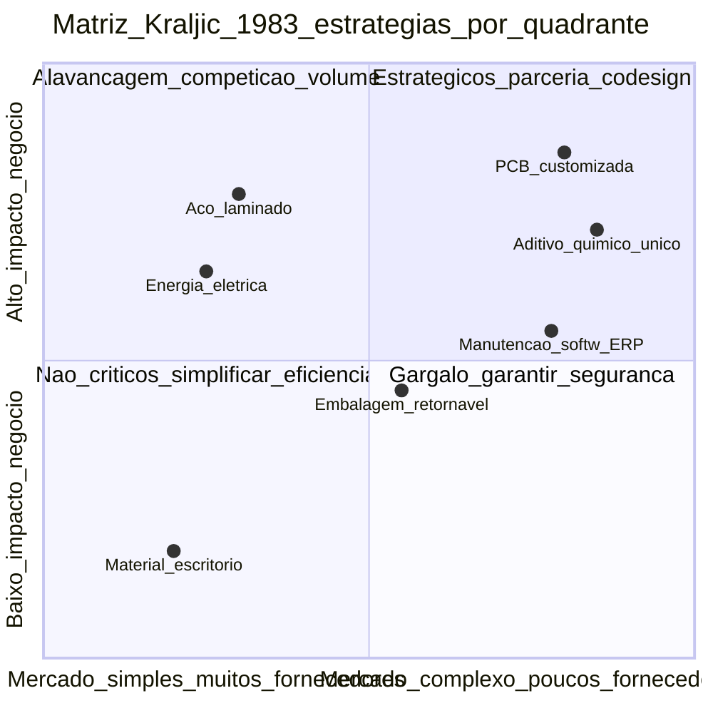
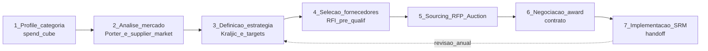

# Compras transacionais *versus* estratégia por categoria — quando o pedido é só o final do filme

**Compras transacionais** executam o ciclo **PR → PO → GR → IR** com eficiência, controles e *compliance*. ***Strategic sourcing*** pergunta **antes** do pedido: qual é a **categoria** desta compra, qual é o **mercado** e o **poder de barganha** das partes (modelo das 5 Forças de Porter aplicado), o que deveria ser **feito internamente** ou **comprado**, e qual o **modelo de relacionamento** com o fornecedor (transacional / colaborativo / parceria estratégica). Sem essa **camada estratégica**, a empresa **negocia preço de tudo igual** — e perde **valor** justamente onde deveria capturar diferencial.

Esta aula é a **fundação** do módulo: a partir dela, TCO, RFP, *Reverse Auction* e SRM ganham contexto. Tratamos *Procurement* como **disciplina de criação de valor** (não centro de custo), com **Kraljic 1983** como alfabeto, **Carter 10Cs** como manual de avaliação de fornecedor, e **CAPS Research** como benchmark de funções maduras.

---

## Objetivos e resultado de aprendizagem

Ao final desta aula, você será capaz de:

- Distinguir **transacional**, **tático** e **estratégico** em compras com critérios operacionais (não slogan).
- Aplicar a **matriz de Kraljic** (4 quadrantes) com **dados reais**, não decoração de slide.
- Conduzir uma análise **make-or-buy** com TCO, *core competency* e **opções reais**.
- Esboçar um **mapa de categorias** (taxonomia) ligado a *spend cube* (fornecedor × categoria × BU).
- Reconhecer **maturidade da função** (CAPS, IBM Procurement Maturity).

**Duração sugerida:** 75–90 minutos. **Pré-requisitos:** ciclo P2P operacional; noções de centro de custo vs centro de valor.

---

## Mapa do conteúdo

1. Anatomia P2P (Procure-to-Pay) e onde mora o **estratégico**.
2. **Kraljic 1983** — os 4 quadrantes com **estratégias específicas** (não só nomes).
3. **Carter 10Cs** para avaliação de fornecedor pré-RFP.
4. ***Spend cube* + *spend analytics*** — o pré-requisito ignorado.
5. **Make-or-buy** com *core competency* (Prahalad-Hamel) e **opções reais**.
6. **Modelos de relacionamento** (Cousins, Lambert) e implicações.
7. **Maturidade da função** (CAPS, IBM, Hackett).
8. *Center-led* × descentralizado × *CCC (Center of Competency)*.

---

## Gancho — a TechLar e os dois mundos

Na **TechLar** (R$ 380 mi receita), o time de compras de **6 FTEs** brilhava em métricas transacionais:

| KPI transacional | TechLar | Benchmark Hackett |
|---|---|---|
| Tempo médio PR → PO | 1,8 dia | 2,1 dia |
| % POs eletrônicas | 92% | 87% |
| Saving anual reportado | 3,1% | 4,2% |
| **Custo de função / spend gerenciado** | 1,4% | 0,9% |

Olhando os transacionais, a função era **boa**. Mas:

- **Spend total**: R$ 184 mi.
- **Spend «sob estratégia de categoria»**: **R$ 31 mi (16,8%)**.
- **Spend não mapeado** («tail spend» + emergencial): **R$ 64 mi (35%)**.
- **Categorias com fornecedor único**: 14 categorias, 7 sem **plano B** documentado.
- **Categorias críticas tratadas como commodity**: «PCB customizada» comprada via 3 cotações por preço.

No mesmo trimestre, o **fornecedor único** de **subconjunto eletrônico crítico** (faturamento dele com TechLar: R$ 4,2 mi/ano, mas insumo que destrava R$ 78 mi de receita) atrasou por **greve portuária em Yantian**. Sem **plano B**, sem **desenho alternativo**, sem **cláusula útil** no contrato (ele era um *blanket order* genérico).

A linha de produção ficou **11 dias** parada. Custo: **R$ 5,4 mi** (ociosidade + multa cliente + frete aéreo emergencial). O *saving* anual de 3,1% (R$ 5,7 mi) **virou pó em uma semana**.

O transacional estava **excelente**; o estratégico **inexistente**.

**Analogia do hospital:** comprar **luvas descartáveis** é **commodity** com SLA simples e múltiplos fornecedores. Escolher **fornecedor de equipamento de tomografia** (RX) é decidir **capacidade clínica + manutenção 24/7 + treinamento de radiologistas + ciclo de software + descontinuação 8 anos depois**. Tratar os dois como «item de estoque» é como contratar **anestesista** e **faxineiro** com a mesma planilha de *job description*.

**Analogia do casamento:** *strategic sourcing* é o **namoro qualificado** (seleção, RFP, NDA); **SRM** é o **casamento** (vida em comum); compras transacionais é o **dia a dia do casal** (mercado, contas, almoço). Quem só vive o transacional sem o estratégico **acumula divórcios contratuais** e **pensão alimentícia técnica** (*lock-in*, retrabalho).

---

## Conceito-núcleo

### Anatomia da disciplina

| Camada | Pergunta | Horizonte | Quem decide | Métrica |
|---|---|---|---|---|
| **Transacional** | Como executar PR/PO/GR rápido e correto? | Diário | Comprador júnior + sistema | *Cycle time*, % PO eletrônica, *match rate* |
| **Tático** | Como agregar volume, fechar *blanket*, sazonalidade? | Trimestral / anual | Comprador sênior, *category buyer* | *Saving*, prazo, OTIF fornecedor |
| **Estratégico** | Que fornecedores precisamos no mercado em 3–7 anos? Make-or-buy? Risco? | Plurianual | *Category Manager*, CPO, C-level | TCO, *resilience index*, inovação entregue |

### Categoria — o que é e o que não é

**Categoria** é um agrupamento de compras com **mercado**, **tecnologia** e **risco** semelhantes — **não** o código contábil ou ERP.

**Bom exemplo de taxonomia (3 níveis):**

```
Direto > Embalagem > Embalagem retornável de pé pesado
Direto > Embalagem > Embalagem descartável paletizada
Direto > Eletrônica > PCB customizada de baixa complexidade
Direto > Eletrônica > Módulo IoT com firmware proprietário
Indireto > Logística > Transporte rodoviário FTL nacional
Indireto > Logística > 3PL armazenagem pesado
Indireto > Tecnologia > SaaS infra
Indireto > Serviços > Consultoria estratégica
```

### **Matriz de Kraljic (1983) — leitura completa, não decoração**

Kraljic propôs cruzar **impacto no negócio** (eixo Y: peso na receita, contribuição ao lucro, parada de linha) com **complexidade de mercado** (eixo X: número de fornecedores, dificuldade técnica, tempo de qualificação alternativa). Quatro quadrantes com **estratégias específicas**:



**Estratégias por quadrante:**

| Quadrante | Característica | Estratégia clássica | Indicadores chave | Exemplo TechLar |
|---|---|---|---|---|
| **Estratégicos** | alto impacto + alto risco/poucos fornecedores | **Parceria de longo prazo, *co-design*, contratos plurianuais, investimento mútuo, *open book*** | TCO, inovação, *time-to-market*, *exclusivity* | PCB customizada, software ERP customizado |
| **Alavancagem** | alto impacto + mercado simples | **Competição agressiva, RFP/leilão reverso, *consolidation* de volume, contratos curtos, *benchmarking* contínuo** | Saving, % volume consolidado, *market price index* | Aço laminado, embalagem corrugada, frete FTL |
| **Não críticos (rotineiros)** | baixo impacto + mercado simples | **Simplificar: catálogo eletrônico, P-Card, marketplace, automação de PR, *self-service*** | % automação, custo de processamento por PO | Material escritório, EPI básico |
| **Gargalo (bottleneck)** | baixo impacto + alto risco | **Garantir suprimento: estoque estratégico, *dual sourcing* mesmo caro, *life-time buy*, redesenho/substituição** | % cobertura plano B, lead time alternativa | Aditivo químico de fornecedor único pequeno |

**Pivô estratégico:** quando possível, **mover a categoria** entre quadrantes:

- **De estratégico → alavancagem** = qualificar 2ª fonte, padronizar especificação (reduz risco de mercado).
- **De gargalo → não crítico** = redesenhar produto para usar componente *commodity* (substituição).
- **De alavancagem → estratégico** = identificar fornecedor disposto a **co-investir** em inovação que muda o jogo.

**Críticas e evolução pós-Kraljic** (Cousins, Lamming, Gelderman & Van Weele):

- Matriz é **estática** se não atualizada anualmente; mercado muda (eg. semicondutores 2020–2023).
- Ignora **dimensão poder relativo**: você é cliente grande ou pequeno daquele fornecedor? *Supplier preference matrix* (Cousins) complementa.
- Kraljic + **maturidade da relação** → modelo **híbrido**.

### **Carter 10Cs — checklist pré-RFP de fornecedor**

Ray Carter (CIPS, 1995) ampliou os clássicos «5Cs» para 10 dimensões de avaliação:

| C | O que avalia | Pergunta-âncora |
|---|---|---|
| **Competência** | capacidade técnica de entregar | tem skills, certificações, casos? |
| **Capacidade** | volume / capacidade produtiva | aguenta meu volume + crescimento? |
| **Compromisso** | qualidade e melhoria contínua | ISO, *six sigma*, *roadmap*? |
| **Controle** | governança financeira e operacional | auditável, ERP, *traceability*? |
| **Caixa (cash)** | saúde financeira | balanço, *Z-score*, dependência de cliente único? |
| **Custo** | TCO competitivo | preço + *should-cost* alinhado? |
| **Consistência** | estabilidade de qualidade ao longo do tempo | ppm, *FPY*, *capability index Cpk*? |
| **Cultura** | fit cultural e ético | valores, ESG, anticorrupção? |
| **Limpo (Clean)** | ESG, *compliance* trabalhista, ambiental | CSDDD, ISO 14001, *due diligence*? |
| **Comunicação** | transparência e *responsiveness* | EDI, portal, SLA de comunicação? |

Boa prática: scorecard 10C com **pesos** acordados pré-RFP (Custo nem sempre é o maior peso).

### *Spend cube* e *spend analytics*

Cubo OLAP com **três eixos mínimos**: fornecedor × categoria × unidade de negócio (BU); idealmente também **período**, **localização** e **modo de aquisição** (PO, P-Card, contrato).

Métricas-chave:

- ***Spend coverage*** (% do spend mapeado em categoria definida).
- ***Spend under management*** (% sob estratégia de categoria, com category manager nomeado).
- ***Tail spend*** (cauda longa não-estratégica — alvo de *marketplace* ou *Procurement-as-a-Service*).
- ***Maverick spend*** (compra fora de processo) — em empresas BR maduras: <8%; iniciantes: 25–40%.

---

## Frameworks-chave

### 1. **Kraljic, P. (1983)** — *Purchasing must become supply management*. **HBR**.

Matriz seminal; obrigatório ler o original e não derivados.

### 2. **Carter 10Cs (CIPS)** — checklist de avaliação.

### 3. **Porter — 5 Forças aplicadas a sourcing**

Avaliar poder de cada categoria: rivalidade entre fornecedores, ameaça novos entrantes, ameaça substitutos, poder fornecedores, poder cliente (você).

### 4. **Prahalad & Hamel (1990) — *Core Competence***

Define o que **não** se terceiriza: capability central que cria valor para o cliente final.

### 5. **Real Options (Trigeorgis)** em make-or-buy

*Buy* dá **opção de saída** (flexibilidade); *make* dá **opção de inovação interna** (capacidade). Decisão deve precificar opções, não só TCO ponto.

### 6. **CAPS Research — Procurement maturity (5 níveis)**

L1 reativo → L2 transacional → L3 categoria → L4 integrado/orquestrado → L5 *value engineering*.

### 7. **Hackett, Gartner, Deloitte** — modelos de **CPO Operating Model**

*Center-led* (estratégia central, execução BU) é o consenso de empresas globais maduras.

---

## Diagrama / Modelo principal — pipeline *strategic sourcing 7-step*

Modelo da **A.T. Kearney (Booz)** popularizado por *category management* moderno:



**Legenda:** ciclo de **9 a 18 meses** para categoria estratégica complexa; revisão anual obrigatória mesmo em categoria estável (mercado não pediu permissão para mudar).

---

## Aprofundamentos — variações setoriais e geográficas

### Brasil

- **Lei 14.133/2021** (nova lei de licitações pública) introduz *diálogo competitivo* e *credenciamento* — pertinente quando empresa privada vende a setor público (categoria de receita) ou quando se opera *joint venture* público-privada.
- **Reforma Tributária (CBS/IBS, 2026–2033)** muda economia de make-or-buy em vários estados; *insumo de fora do estado* (que pagava DIFAL) pode virar mais competitivo.
- **«Sindrome do brasileiro»**: *spend coverage* < 30% em PMEs; mercado fragmentado em **mid-market** com baixa adoção de *e-procurement* (Coupa, SAP Ariba ainda baixa penetração — Jaggaer e Mercado Eletrônico têm ~25% de share).
- **Frete rodoviário**: 65% do volume BR; categoria de **alavancagem** clássica mas com **risco** de tabelamento (Lei 13.703/2018, *piso mínimo*).

### EUA / UE

- **CSDDD (Corporate Sustainability Due Diligence Directive, EU 2024)** força *Procurement* a mapear **tier-2 e tier-3** — vira parte do *make-or-buy* (terceirizar **risco** para fornecedor não exime).
- ***Inflation Reduction Act* (US 2022)** + *CHIPS Act* — incentivos para *re-shoring* mudam economia de várias categorias.
- **China+1**: 78% das multinacionais (McKinsey 2024) com plano ativo de diversificação de tier-1 China para Vietnã, Índia, México.

### Casos célebres

- **Apple Procurement**: *category management* extremo, *open book* com fornecedores estratégicos (Foxconn, TSMC), *exclusivity windows* + investimento em capacidade do fornecedor.
- **Toyota Keiretsu**: parceria de décadas com *tier-1*, *target costing* + *kaizen* compartilhado (modelo de SRM antes do termo existir).
- **GE (anos 1990–2000)**: *Six Sigma* aplicado a fornecedores; cobrança rigorosa, mas com ferramentas e treinamento bancados.

---

## Trade-offs estratégicos

| Decisão | A favor | Contra | Resolução típica |
|---|---|---|---|
| **Center-led × descentralizado** | escala, governança, talento | distância do *gemba*, lentidão | *center-led* com *category leads* embarcados em BU |
| **Muitas categorias micro × poucas macro** | precisão | custo de gestão | **80/20**: 20–30 categorias-mãe, sub-categorias para top spend |
| **Make × Buy** | core, flexibilidade | capex, perda de capacidade | *real options*, revisão a cada 3 anos |
| **Single × dual × multi sourcing** | preço (single), risco (dual) | complexidade, custo qualificação | **80-20** ou **60-30-10** em estratégicos |
| **Saving anual × valor de longo prazo** | métrica fácil | mata inovação | **balanced scorecard** de procurement |

---

## Caso prático — TechLar reorganiza Procurement em 18 meses

**Diagnóstico (mês 0):**

- Spend coverage 65%; SUM (spend under management) 17%.
- 14 categorias single source críticas; 0 com plano B testado.
- 6 FTEs todos transacionais; 0 *category manager* nomeado.

**Plano:**

| Onda | Prazo | Ações | Investimento | ROI esperado |
|---|---|---|---|---|
| **Onda 1** | 0–3m | *Spend cube* unificado; nomear 3 category managers (PCB, Logística, Embalagem); Kraljic em 30 categorias top | R$ 180k consultoria + ferramenta | *quick wins* R$ 1,8 mi (consolidação) |
| **Onda 2** | 3–9m | RFPs em alavancagem (aço, embalagem, frete); plano B em 14 single source; contratos plurianuais com *exit clauses* | R$ 320k | Saving R$ 4,2 mi/ano |
| **Onda 3** | 9–18m | SRM formal em 8 estratégicos; *co-design* iniciado; ESG scorecard piloto | R$ 480k | Inovação + redução risco *latente* |

**Métricas finais (mês 18):** SUM 64%, plano B em 100% dos críticos, saving recorrente R$ 6,8 mi/ano, redução de incidentes de fornecimento de 11/ano para 2/ano. Custo de função 1,2% (queda de 1,4%) com 7 FTEs (reorganizados).

---

## Erros comuns e armadilhas

1. **Kraljic decorado** sem dados: «todos importantes» = nenhum priorizado.
2. **Estratégia sem dono nem revisão anual**: vira *deck* de PowerPoint do CPO anterior.
3. **Make-or-buy só por custo-hora interna** ignorando capex e *real option*.
4. ***Spend coverage* baixo** mascara *tail spend* descontrolado (40%+ do spend «invisível»).
5. **Saving teatral**: comparação com baseline inflada para o número fechar.
6. **Categoria estratégica em leilão reverso**: destrói relacionamento e qualidade.
7. **Center-led sem capability local**: políticas chegam, ninguém implementa.
8. **Procurement sem voz no S&OE**: estratégia de categoria sem alinhamento com plano de produção.

---

## Risco e governança

- **Geopolítico**: tarifa Trump 2026 (eletrônicos +25 a +60%), guerra comercial CN-US, sanções Rússia, conflito Mar Vermelho — categoria deve ter **mapa de exposição país**.
- **ESG / regulatório**: CSDDD (EU), SEC Climate Rule (US), Lei 14.946/2024 (BR — trabalho análogo escravo), ISO 20400 (sustainable procurement).
- ***Compliance* anticorrupção**: Lei 12.846/2013 (Anticorrupção BR), FCPA (US), UK Bribery Act — *due diligence* de fornecedor obrigatória.
- ***Cyber risk* na cadeia**: ataque a fornecedor SaaS (SolarWinds 2020) compromete cliente; *third-party risk management* (TPRM) obrigatório em fornecedores tier-1.

---

## KPIs estratégicos

| KPI | Pergunta | Dono | Fonte | Cadência | Playbook |
|---|---|---|---|---|---|
| ***Spend Coverage*** | quanto do spend está mapeado? | CPO | Spend cube | Trimestral | Categorizar tail spend |
| ***Spend Under Management*** (SUM) | sob estratégia? | CPO | SRM tool | Trimestral | Nomear category manager |
| ***Single-source %*** críticos | risco de continuidade? | Category Mgr | SRM | Semestral | Qualificar 2ª fonte |
| ***Saving validado pela controladoria*** | é real? | CFO + CPO | ERP | Trimestral | Auditoria conjunta |
| ***Category Maturity Score*** | onde estamos no CAPS? | CPO | Self-assessment + auditoria | Anual | Roadmap por categoria |
| ***Tail spend %*** | cauda controlada? | Procurement Ops | ERP | Trimestral | Marketplace / P-Card |
| ***Maverick spend %*** | compra fora processo? | CPO | ERP + AP | Mensal | Treinamento + bloqueio sistêmico |
| ***Innovation pipeline***  (R$ ou n) | inovação via fornecedor? | Category Mgr Estratégico | SRM | Trimestral | QBR formal |
| ***Resilience Index*** (% spend com plano B testado) | sobrevive a choque? | CRO + CPO | SRM + risco | Semestral | Mesa de simulação |

---

## Tecnologias e ferramentas habilitadoras

- **Suíte completa S2P (Source-to-Pay)**: **SAP Ariba**, **Coupa Procurement**, **Oracle Procurement Cloud**, **GEP SMART**, **Jaggaer ONE**, **Ivalua**, **Zycus**, **Mercado Eletrônico** (BR).
- ***Spend analytics***: **Coupa Spend Insights**, **SAP Spend Control Tower**, **Sievo**, **GEP Smart Spend**.
- **Contratos (CLM)**: **Icertis**, **DocuSign CLM**, **Conga CLM**.
- ***Third-party risk***: **OneTrust TPRM**, **Prevalent**, **EcoVadis** (ESG), **Resilinc** (supply chain risk), **Everstream Analytics**.
- ***Should-cost / cleansheet***: **aPriori**, **Costimator**, **Coupa Sourcing Optimization**.
- ***Procurement-as-a-Service*** (tail): **GEP**, **Beeline**, **Globality**.

---

## Glossário rápido

- **P2P / S2P / S2C**: Procure-to-Pay / Source-to-Pay / Source-to-Contract.
- **Spend cube**: cubo OLAP de gasto.
- **SUM**: Spend Under Management.
- **Maverick spend**: compra fora do processo formal.
- **Tail spend**: cauda longa de baixo valor unitário, alto custo de transação.
- **Category Manager**: dono executivo da estratégia da categoria.
- **CCC**: *Center of Competency* (modelo híbrido CoE).
- **TCO**: Total Cost of Ownership (próxima aula).
- **RFI / RFP / RFQ**: *Request for Information / Proposal / Quotation*.
- **TPRM**: *Third-Party Risk Management*.

---

## Aplicação — exercícios

**Exercício 1 (20 min) — Kraljic da sua empresa.** Liste **8 categorias** (reais ou TechLar) e posicione na matriz com **dado** (spend e número de fornecedores qualificados). Para **uma categoria de cada quadrante**, escreva a **estratégia em uma frase** + **um KPI principal**.

**Gabarito:** estratégico → parceria + TCO/inovação; alavancagem → competição + saving; rotineiro → automação + custo processamento; gargalo → segurança suprimento + cobertura plano B. Se **tudo cair em estratégico**, faltou rigor.

**Exercício 2 (20 min) — Make-or-buy com opção real.** Escolha uma capability atual interna (ex: armazenagem própria, frota própria, manutenção). Avalie em três cenários (+20% volume, −30% volume, ruptura tecnológica). Em qual cenário **make** vence? Em qual **buy** ganha? Como **híbrido com fornecedor estratégico** se comporta?

**Gabarito:** sem cenário, decisão é cega; *real option* significa precificar **flexibilidade** de mudar.

**Exercício 3 (15 min) — Mapa de maturidade.** Pelos 5 níveis CAPS (reativo / transacional / categoria / integrado / value engineering), em que nível sua função está? Quais **3 sinais** confirmam? Qual **um movimento** subiria você 1 nível em 12 meses?

---

## Pergunta de reflexão

Qual categoria da sua empresa hoje está **crítica e tratada como parafuso** — e qual seria o custo (em R$ e em risco) de **um trimestre** sem ela? Você defenderia esse risco no Conselho?

---

## Fechamento — takeaways

1. **PO é saída**; **estratégia de categoria** é entrada — quem inverte ordem trata risco com cotação.
2. **Kraljic** é alfabeto; usar com **dados** vivos, não decoração de slide.
3. **Make-or-buy** é decisão de **negócio com opção real**, não conta de padaria.
4. **Spend coverage** abaixo de 70% é **dívida estratégica** — *tail spend* não controlado mata saving estrutural.
5. **Maturidade da função** se mede em **CAPS / Hackett**, não em saving anual isolado.

---

## Referências

1. KRALJIC, P. *Purchasing must become supply management*. *Harvard Business Review*, set–out 1983 — leitura obrigatória do original.
2. VAN WEELE, A. J. *Purchasing and Supply Chain Management: Analysis, Strategy, Planning and Practice*. 8ª ed., Cengage, 2024.
3. CARTER, R. *The 7Cs / 10Cs of Supplier Evaluation*. CIPS, 1995–2018.
4. CARTER, J. R.; ELLRAM, L. M.; KAUFMANN, L. — *World-Class Procurement Practices*. CAPS Research.
5. PORTER, M. *Competitive Strategy*. Free Press, 1980.
6. PRAHALAD, C. K.; HAMEL, G. *The Core Competence of the Corporation*. *HBR*, 1990.
7. COUSINS, P.; LAMMING, R.; LAWSON, B.; SQUIRE, B. *Strategic Supply Management: Principles, Theories and Practice*. Pearson, 2008.
8. GELDERMAN, C. J.; VAN WEELE, A. *Strategic direction through purchasing portfolio management*. *Journal of Purchasing and Supply Management*, 2003.
9. HACKETT GROUP — *Procurement Key Issues* (anual).
10. McKINSEY — *Procurement reimagined: A consensus on key levers* (2023–2024).
11. ASCM, CIPS, CSCMP — vocabulário, *body of knowledge*.

---

**Ponte:** [Integração na cadeia](../../trilha-fundamentos-e-estrategia/modulo-02-supply-chain-management/aula-02-integracao-colaboracao-cadeia.md); módulo [SRM](../modulo-03-gestao-de-fornecedores-srm/README.md); próxima aula deste módulo entra em **TCO, RFP e Reverse Auction** com cálculo passo a passo.
