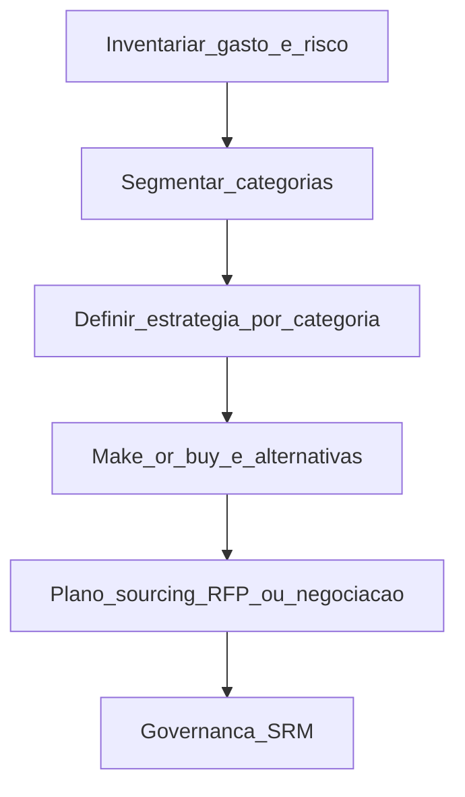

# Compras transacionais *versus* estratégia por categoria — quando o pedido é só o final do filme

**Compras transacionais** executam **requisição → ordem → recebimento** com eficiência. ***Strategic sourcing*** pergunta **antes**: qual **categoria** é esta, qual **risco** e **poder de mercado**, o que deve ser **feito internamente** *versus* **comprado**, e qual **modelo de relacionamento** com fornecedores. Sem essa camada, a empresa **negocia preço** de tudo igual — e perde **valor** onde importa.

---

## Objetivos e resultado de aprendizagem

**Ao final desta aula**, você será capaz de:

- Distinguir **transacional**, **tático** e **estratégico** em compras (definições operacionais).  
- Esboçar **estratégia por categoria** ligada a **make-or-buy** e *core competency*.  
- Desenhar um fluxo simples de **category strategy** até o plano de negociação.

**Duração sugerida:** 60–75 minutos.

---

## Gancho — a TechLar e os dois mundos

Na **TechLar**, o time de compras brilhava em **cotar parafuso**: três fornecedores, SLA de entrega, economia de 3%. No mesmo trimestre, um **fornecedor único** de **subconjunto crítico** atrasou por greve — sem **plano B**, sem **desenho alternativo**, sem **contrato** com cláusulas úteis. O transacional estava **perfeito**; o estratégico **inexistente**.

**Analogia do hospital:** comprar **luvas** é commodity com processo; escolher **fornecedor de equipamento de diagnóstico** é **capacidade clínica + manutenção + treinamento** — não dá para tratar como «item de estoque».

---

## Mapa do conteúdo

- Papéis: transacional *versus* estratégico.  
- **Categoria** de compra: o que agrupa além do código ERP.  
- **Make-or-buy** e *core competency*.  
- Fluxo: análise → estratégia → *sourcing* → SRM (ponte ao módulo 3).

---

## Conceito núcleo

**Transacional:** conformidade, ciclo PO, conferência de preço e prazo, **baixa** incerteza estratégica.

**Tático:** acordos de volume, *blanket order*, ajustes sazonais — **média** complexidade.

**Estratégico:** categorias que afetam **inovação**, **risco de continuidade**, **vantagem competitiva** ou **custo estrutural** — exige **arquitetura** de fornecimento, não só cotação.

**Categoria:** conjunto de compras com **mercado**, **tecnologia** e **risco** semelhantes (ex.: «aço laminado», «serviço de transporte dedicado», «eletrônica customizada»).

**Legenda:** retângulos = **atividades** em sequência lógica; `F` entrega ao **SRM** (performance contínua). *Hipótese pedagógica:* nomes podem variar por empresa (category management, center-led).

**Make-or-buy:** *buy* quando o mercado é **maduro** e o diferencial não está ali; *make* quando **know-how**, **velocidade de mudança** ou **secreto industrial** são *core* (*consenso de mercado* — sempre validar com engenharia e financeiro).

**Mini-caso:** categoria «**embalagem retornável**»: estratégia pode ser **parceria** com *pooling* regional; transacional só cotar «caixa plástica» ignora **logística reversa** e **perdas**.

---

## Trade-offs

- **Centralizar** *category strategy* ganha escala; pode **afastar** do *gemba* — precisa **input** de operações.  
- **Muitas** categorias micro: precisão alta, **custo** de gestão alto.  
- **Poucas** categorias macro: simples, mas **esconde** risco crítico dentro de commodity aparente.

---

## Aplicação — exercício

Escolha **duas** categorias: (1) algo **claramente commodity**; (2) algo **crítico** ou customizado. Para cada uma, preencha: **objetivo** (custo, inovação, continuidade), **postura** (competitiva, colaborativa, desenvolvimento) e **um** risco principal.

**Gabarito pedagógico:** commodity tende a **competição** e métrica de **TCO**; crítica tende a **dual sourcing** ou **parceria** + risco de **single source**; se ambas forem «só preço», faltou distinção estratégica.

---

## Erros comuns e armadilhas

- Confundir **Kraljic** decorado com **estratégia** sem dados de mercado.  
- Estratégia de categoria **sem** dono nem revisão anual.  
- Make-or-buy decidido só por **custo hora** interna, ignorando **capex** e **flexibilidade**.

---

## KPIs e decisão

- **Economia** *versus* baseline (com definição honesta de baseline).  
- **Risco** (concentração, país único, dependência técnica).  
- **Inovação** (tempo de *time-to-market* com fornecedor chave).  
- **Compliance** e ESG como **gate** (detalhado na aula 3 do módulo).

---

## Fechamento — três takeaways

1. PO é **saída**; estratégia de categoria é **entrada**.  
2. Make-or-buy é decisão de **negócio**, não só de compras.  
3. Fluxo claro evita «estrategista de PowerPoint» sem execução.

**Pergunta de reflexão:** qual categoria hoje está **crítica** mas ainda tratada como **parafuso**?

---

## Referências

1. VAN WEELE, A. *Purchasing and Supply Chain Management*. Cengage — *category strategy* e processos de compra.  
2. KRALJIC, P. *Purchasing must become supply management*. *Harvard Business Review*, 1983 — matriz clássica (ler com espírito crítico; o mercado evoluiu).  
3. ASCM — *procurement* e alinhamento à estratégia — [ascm.org](https://www.ascm.org/).  
4. CSCMP — boas práticas e vocabulário da profissão — [cscmp.org](https://cscmp.org/).

**Ponte:** [Integração na cadeia](../../trilha-fundamentos-e-estrategia/modulo-02-supply-chain-management/aula-02-integracao-colaboracao-cadeia.md); módulo [SRM](../modulo-03-gestao-de-fornecedores-srm/README.md).
