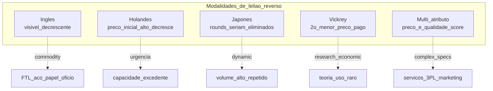

# TCO, RFP e leilão como ferramenta — o preço na nota fiscal quase nunca conta a história inteira

**TCO (*Total Cost of Ownership*)** é a soma do **preço unitário** com **logística**, **qualidade**, **risco**, **capital de giro**, **custo de uso/operação** e **fim de vida (descontinuação, descarte)** — distribuída ao longo do **ciclo de vida** do bem ou serviço. **RFP (*Request for Proposal*)** estrutura concorrência **justa** e **comparável** com critérios ponderados explícitos. ***Reverse Auction*** (leilão reverso eletrônico) acelera disputa em categorias **maduras** com **especificação fechada** — e **destrói valor** em categorias estratégicas onde **co-design** importa mais que centavo. ***Should Cost*** decompõe o **preço-justo** do fornecedor (matéria-prima + processo + overhead + lucro) — virou o **idioma comum** de negociação madura.

Esta aula é o **artesanato técnico** do módulo: TCO em planilha real, RFP com matriz de avaliação, *Reverse Auction* (Inglês × Holandês × Japonês), *Should Cost* / *cleansheet*, e BATNA negociação (Fisher-Ury).

---

## Objetivos e resultado de aprendizagem

Ao final desta aula, você será capaz de:

- Construir uma **planilha TCO** com 8–14 linhas para uma compra B2B realista BR e global.
- Estruturar um **RFP em 5 seções** com critérios ponderados defensáveis.
- Diferenciar **modos de leilão** (Inglês, Holandês, Japonês, Vickrey, multi-atributo) e seu uso adequado.
- Conduzir um *Should Cost* / *cleansheet* básico com decomposição em **bloco de custo**.
- Aplicar **BATNA, ZOPA e ancoragem** numa negociação contratual (Fisher-Ury, Voss).

**Duração sugerida:** 90 minutos. **Pré-requisitos:** aula 2.1 (Kraljic, categorias).

---

## Mapa do conteúdo

1. **TCO** — anatomia em **6 blocos** + cálculo TechLar passo a passo.
2. **RFP** — estrutura em **5 seções** padrão CIPS/IACCM.
3. **Reverse Auction** — modalidades, vantagens e *race-to-the-bottom*.
4. ***Should Cost* / *cleansheet*** — montar preço-justo independente do fornecedor.
5. **Negociação** — Fisher-Ury (Harvard Negotiation Project), Voss (FBI), BATNA/ZOPA.
6. ***E-sourcing*** moderno (SAP Ariba, Coupa Sourcing, Jaggaer, Keelvar).
7. Cláusulas contratuais essenciais (SLA, *step-in*, *exit*, *benchmark*, *MFN*).

---

## Gancho — o fornecedor «barato» da TechLar

A **TechLar** premiou no RFP de **motores elétricos para mesa móvel hospitalar** (volume 12.000 un./ano, R$ 380/un. inicial) o **menor preço unitário** (R$ 320/un.). Comitê: 80% peso preço, 20% subjetivo «qualidade», sem ponderação clara. Vencedor: **MotorBarato Ltda** (China, novo no portfólio).

**12 meses depois:**

| Linha | Cenário com MotorBarato | Cenário com 2º colocado (R$ 348/un.) |
|---|---|---|
| Preço FOB | R$ 320 × 12.000 = **R$ 3,84 mi** | R$ 348 × 12.000 = **R$ 4,18 mi** |
| Frete + seguro CN→Santos | R$ 28/un. | R$ 28/un. |
| II + IPI + ICMS | R$ 64/un. | R$ 70/un. |
| Custo aquisição total (CIF + tributos) | **R$ 412/un.** | **R$ 446/un.** |
| **Lead time** | 52 dias (vs 35 prometido) | 38 dias |
| **Defeitos PPM (1º ano)** | 18.500 ppm (3% rejeição) | 1.200 ppm |
| Custo retrabalho/devolução (R$ 280/un. defeito) | R$ 100k | R$ 7k |
| Capital em trânsito extra (17 dias × R$/dia) | R$ 96k | R$ 0 |
| Multa cliente (entregas atrasadas, 4 ocorrências) | R$ 240k | R$ 0 |
| Falha em campo (vida útil 6 meses vs 24 meses) | R$ 720k em substituições | R$ 0 |
| **TCO 12 meses** | **R$ 6,12 mi** | **R$ 5,36 mi** |
| **Surpresa** | TCO **+14%** vs «vencedor» | — |

A planilha não considerou **PPM**, **lead time variabilidade**, **vida útil** nem **custo de troca**. Em **36 meses**, o gap chegou a **R$ 2,8 mi**. Quando expostos, o CFO mandou refazer **todos** os RFPs grandes do ano — política de compras virou *case study* interno do que **não fazer**.

**Analogia do voo *low cost*:** tarifa baixa do banner com **bagagem despachada**, **escolha de assento**, **remarcação**, **ônibus para terminal remoto** e **pernoite em layover** — TCO da viagem perde fácil para uma «mais cara» na busca. Procurement maduro não compra **tarifa**; compra **viagem** completa.

**Analogia do carro popular vs SUV diesel:** preço de tabela popular R$ 75k vs SUV R$ 140k — diferença óbvia. Mas TCO 5 anos: combustível, IPVA, seguro, depreciação, manutenção, valor revenda → diferença pode **inverter** a aparente vantagem.

**Analogia do *Reverse Auction* mal usado:** dar leilão para escolher **cirurgião cardíaco** pelo menor lance é exatamente como muitos fazem com **fornecedor de PCB customizada**. O resultado é o mesmo.

---

## Conceito-núcleo

### TCO em 6 blocos (template auditável)

\[
TCO = P_{aquisicao} + C_{logistica} + C_{qualidade} + C_{capital} + C_{operacao} + C_{fim\_vida}
\]

| Bloco | Componentes | Driver / cálculo | Linha exemplo |
|---|---|---|---|
| **Aquisição** | preço lista, desconto, II, IPI, ICMS-ST, PIS/COFINS (não-recuperáveis) | preço × quantidade × tributo | R$ 320 + R$ 92 trib = R$ 412 |
| **Logística** | frete *inbound*, seguro, *handling*, *demurrage*, armazenagem inbound | tarifa × volume + taxas portuárias | R$ 28/un. CIF |
| **Qualidade** | inspeção entrada, rejeição, retrabalho, garantia, multa cliente | PPM × custo defeito + multa SLA | (PPM/1M) × R$ 280/defeito |
| **Capital** | dias estoque × valor × WACC; condição de pagamento (FCC, *Net 30* vs *Net 90*) | (DOH × valor) × WACC | 30d × R$ 412 × 14%/365 |
| **Operação / uso** | manutenção, treinamento, consumo energético, *consumibles*, software | TCO horário × horas operação | manutenção R$ 12k/ano |
| **Fim de vida** | descomissionamento, descarte, obsolescência, custo migração próximo fornecedor | depreciação remanescente + *switching cost* | R$ 8k/un. *switching* |

### RFP — 5 seções padrão

```
1. Apresentação e contexto         (1-2 págs)
   - Sobre a empresa, escala, valores
   - Volume e horizonte da compra
   - Cronograma do RFP

2. Especificação técnica e SLA     (5-15 págs)
   - Requisitos funcionais (must vs nice-to-have)
   - Normas (ISO, ABNT, CE, FDA, INMETRO)
   - SLA: OTIF, lead time, capacidade, qualidade (PPM)
   - Cibersegurança e LGPD se aplicável

3. Comercial                       (3-5 págs)
   - Modelo de preço (unitário, escalonado, indexado)
   - Condições de pagamento e índice de reajuste
   - Garantias e multas
   - Vigência, renovação, exclusividade

4. Critérios de avaliação e award  (1-2 págs)
   - Matriz ponderada com pesos %
   - Cronograma award e Q&A
   - Confidencialidade (NDA assinado)

5. Anexos                          (variável)
   - Modelo de planilha de preço (form único)
   - Template de scorecard 10C autoavaliação
   - Modelo de contrato (esqueleto)
   - Política ESG / Código de Conduta fornecedor
```

### Matriz de avaliação ponderada — exemplo motores TechLar refeito

| Critério | Peso | Vencedor anterior | 2º colocado | Novo vencedor (após repesar) |
|---|---|---|---|---|
| TCO 36 meses (não preço FOB) | 35% | 6,4 | 8,9 | 8,9 |
| Qualidade (PPM, certificações ISO 9001/14001) | 20% | 4,2 | 9,1 | 9,1 |
| Lead time + variabilidade (P50, P95) | 15% | 5,8 | 8,5 | 8,5 |
| Resiliência (capacidade, redundância de planta) | 10% | 5,5 | 7,2 | 7,2 |
| ESG (EcoVadis ≥ 50, *due diligence* CSDDD) | 10% | 4,0 | 8,0 | 8,0 |
| Inovação / *roadmap* tecnológico | 5% | 6,0 | 7,5 | 7,5 |
| Capability comercial (transparência, *open book*) | 5% | 7,0 | 7,0 | 7,0 |
| **Score ponderado** | 100% | **5,49** | **8,33** | **8,33** |

### *Reverse Auction* — modalidades



**Quando usar (e quando NÃO):**

| Situação | Reverse Auction? | Por quê |
|---|---|---|
| Commodity com 5+ qualificados, especificação fechada | **Sim** (Inglês ou multi-atributo) | competição saudável |
| Categoria estratégica com co-design ativo | **NÃO** | destrói relação, anti-inovação |
| Item *bottleneck* com 2 fornecedores | **NÃO** | colusão fácil |
| Frete dedicado anual com 8 transportadoras qualificadas | **Sim** (Holandês ou Japonês) | clássico |
| PCB customizada com *tooling* dedicado | **NÃO** | *switching cost* anula saving |
| MRO de baixo valor com 12 fornecedores | **Sim** (multi-atributo via *marketplace*) | tail spend organizado |

### *Should Cost* / *cleansheet* — desmontando o preço

Decomposição independente do preço-justo de um item:

| Bloco | % típico em peça metálica | Fonte de dado |
|---|---|---|
| Matéria-prima | 35–55% | índices LME, S&P Global, Argus |
| Processo (mão obra + máquina) | 15–25% | *time-study* ou benchmark setorial |
| Tooling amortizado | 3–8% | preço *tooling* / volume vida |
| Logística inbound do fornecedor | 2–5% | freight tariff |
| Overhead fabril | 8–15% | benchmark setor |
| SG&A do fornecedor | 4–7% | demonstrações / setor |
| **Lucro «justo»** | 6–12% | spread setorial |

**Uso:** se proposta vier 30% acima do *should cost*, abrir conversa com **dado**. Procurement maduro **não pede desconto**; pede **explicação técnica do delta**.

### Negociação — Fisher-Ury + Voss

**Fisher-Ury (Harvard, *Getting to Yes*):**

- Separar **pessoa** do **problema**.
- Focar em **interesses** (por trás das posições).
- Gerar **opções de ganho mútuo**.
- Usar **critérios objetivos** (índice, *should cost*, market price).

**Acrônimos-chave:**

- **BATNA** (*Best Alternative To Negotiated Agreement*): seu plano B se a negociação fracassar — quanto melhor, mais poder.
- **ZOPA** (*Zone Of Possible Agreement*): faixa entre seu *walk-away* e o do fornecedor.
- **Ancoragem**: primeira oferta enviesa (efeito psicológico Tversky-Kahneman).
- **MFN** (*Most Favored Nation*): cláusula contratual: «se vender mais barato a outro cliente em condições similares, repassa».

**Voss (*Never Split the Difference*, FBI):** *tactical empathy*, *mirroring*, *labeling*, *calibrated questions* — técnicas para destravar impasse e descobrir interesses ocultos.

---

## Diagrama / Modelo principal — pipeline RFP completo (12 semanas)

```mermaid
flowchart LR
  W0[S0_Kickoff_e_RFI]
  W2[S2_Pre_qualif_RFI]
  W3[S3_Publicar_RFP]
  W5[S5_QA_e_visita_planta]
  W7[S7_Submissao_propostas]
  W8[S8_Avaliacao_tecnica]
  W9[S9_Modelagem_TCO]
  W10[S10_Negociacao_top_3]
  W11[S11_Reverse_Auction_se_alavancagem]
  W12[S12_Award_e_contrato]
  W14[S14_Transicao_e_handoff_SRM]
  W0 --> W2 --> W3 --> W5 --> W7 --> W8 --> W9 --> W10 --> W11 --> W12 --> W14
```



**Legenda:** ciclo típico de **12–14 semanas** para categoria de alavancagem; estratégica complexa pode levar **24+ semanas** e incluir **PoC/qualificação amostra**.

---

## Aprofundamentos — variações setoriais e geográficas

### Brasil — particularidades fiscais no TCO

- **ICMS-ST**: pode ser **não-recuperável** dependendo do regime → entra integralmente no TCO.
- **PIS/COFINS** no regime cumulativo: não-recuperável → +9,25% no preço efetivo.
- **DIFAL**: incide em compra interestadual destinada a consumidor final → ajusta TCO por origem.
- **Incoterms 2020**: **DDP** (importador absorve tudo) vs **FOB** (importador absorve frete + tributos) → TCO diferente!
- **Importação CN→BR (caso TechLar)**: somar II (taxa varia 0–35%), IPI (0–25%), ICMS (importação 17–18%, alguns estados 4% para insumo industrial), PIS/COFINS-importação (~11,75%), AFRMM (25% sobre frete marítimo), SISCOMEX (R$ 214/DI), capatazia, *demurrage*, *despachante*, *armazenagem alfandegada*. Spread típico FOB→DDP: **30–45% acima do FOB** para insumo industrial.
- **Lead time CN-Santos**: marítimo 35–45 dias (Yangshan/Shenzhen → Santos via Cabo da Boa Esperança ou Panamá), com *transit time* mais ~10 dias de desembaraço aduaneiro BR → planejar **D+50 a D+65** real.

### Caso TCO completo — importação motor da TechLar

Volume 12.000 un./ano, FOB R$ 320:

| Linha | R$/un. | Cálculo |
|---|---|---|
| FOB China | 320,00 | preço da fatura |
| Frete marítimo + seguro | 18,40 | R$ 220k frete container 1.200 un. |
| AFRMM (25% s/ frete) | 4,60 | apenas marítimo |
| Capatazia + armazenagem alf. | 2,80 | tabelas porto Santos |
| II (16%) | 55,80 | s/ valor aduaneiro |
| IPI (5%) | 20,30 | s/ (CIF + II) |
| ICMS importação (18% SP) | 73,40 | s/ base ampliada |
| PIS/COFINS importação (11,75%) | 53,40 | crédito parcial dependendo regime |
| SISCOMEX + despachante | 1,20 | rateio fixo |
| Capital em trânsito (50d × WACC 14%) | 6,40 | (FOB+frete)×14%×50/365 |
| Frete Santos→CD Itupeva | 4,80 | rodo BR |
| **CTU (Custo Total Unitário aquisição)** | **561,10** | 75% acima do FOB |
| Custo qualidade (PPM atual 8.500) | 14,30 | retrabalho + devolução |
| Risco câmbio (cobertura ou não) | 8,90 | volatilidade USD |
| **TCO ano 1** | **584,30/un.** | 83% acima do FOB |

**Insight:** trazer fornecedor BR a R$ 480/un. (50% a mais que FOB CN) ainda pode ser **vantajoso** considerando lead time menor (**D+10 vs D+60**), redução de capital em trânsito e isenção de risco cambial. *China+1* / *nearshoring* não é ideologia — é matemática.

### EUA / UE

- **CBAM (EU 2026 plenamente operacional)**: importações de aço, cimento, alumínio, fertilizante, hidrogênio, eletricidade pagam **carbono ao entrar UE** → entra no TCO de qualquer fornecedor exportando para UE.
- **Tarifa Trump 2026** (eletrônicos CN +25 a +60% conforme rounds): CFOs reagem com *nearshoring* México (USMCA), Vietnã (CPTPP), Índia (PLI scheme).
- ***Section 301 / 232 (US)***: tarifas adicionais sobre aço, alumínio, semicondutor de origens específicas.

---

## Trade-offs estratégicos

| Decisão | A favor | Contra |
|---|---|---|
| TCO completo × tempo | precisão | atraso decisão; começar **80/20** |
| Transparência total RFP × *clean room* | comparabilidade | proteção de segredo do fornecedor |
| Reverse Auction × negociação direta | velocidade, saving | relação, qualidade, inovação |
| Should Cost × confiar fornecedor | *evidence-based* | demanda capacidade analítica |
| Critério «inovação» com peso alto | atrai capability | exclui commodity; risco *lock-in* |
| Contrato curto × longo | flexibilidade | sem alavanca de investimento conjunto |

---

## Caso prático — TechLar reabre RFP de motores

Após o *case* doloroso, TechLar:

1. Reescreve RFP com **TCO 36 meses** explícito como critério (peso 35%) + **PPM máximo aceitável** (gate eliminatório <2.000).
2. Inclui **anexo *should cost*** preenchido por engenharia interna como benchmark; fornecedor que vier 25% acima precisa **explicar com dado**.
3. Adiciona **EcoVadis ≥ 50** como gate ESG (CSDDD-ready).
4. Define **2 fornecedores award** (60-40), com cláusula **MFN** e revisão anual.
5. Negociação top-3 conduzida com **BATNA explícito**: «cotamos com fornecedor BR a R$ 480 + lead time 10d como plano B credível».
6. Resultado: **2 fornecedores qualificados**, TCO 36m **−9% vs cenário inicial**, redundância de fonte, ESG conformado, e **0 ocorrência** de paralisia em 12 meses pós-implementação.

---

## Erros comuns e armadilhas

1. **RFP de 100 páginas com requisito impossível** — só incumbente responde (concorrência teatro).
2. **«Menor preço» legal sem definição de TCO** — saving aparente, prejuízo real.
3. **Reverse Auction em estratégico com co-design** — destrói relação e qualidade.
4. **Esquecer *switching cost*** no award (qualificação, *tooling*, retreinamento).
5. **Ancoragem fraca** — entrar negociação sem *should cost* e BATNA = fornecedor define a régua.
6. **Critérios subjetivos sem âncora** («qualidade boa = 7») — calibrar com escala objetiva.
7. **NDA assinado na hora errada** — *clean room* sem governança vaza inteligência competitiva.
8. **Comitê de award refém da preferência do solicitante** — separar quem usa de quem decide.

---

## Risco e governança

- ***Compliance* anticorrupção** (Lei 12.846/13, FCPA): **fornecedor único favorecido sem RFP** é red flag para auditoria interna e CGU.
- ***Conflict of interest***: comprador com vínculo familiar ou financeiro com fornecedor → política de declaração obrigatória anual.
- **LGPD em RFP**: dados de fornecedor (compra) e dados pessoais de contato precisam de base legal.
- **ESG**: gate EcoVadis / Sedex / SMETA / *due diligence* CSDDD; documentação retida 7 anos.
- ***Cyber*** em e-sourcing: portal vulnerável vaza **estratégia de compra** e **proposta dos competidores** — auditoria SOC 2 do fornecedor SaaS.

---

## KPIs estratégicos

| KPI | Pergunta | Dono | Fonte | Cadência | Playbook |
|---|---|---|---|---|---|
| ***TCO projetado vs realizado*** | premissa colou? | Category Mgr + Controller | ERP + planilha TCO | Trimestral | Ajustar modelo, governança PPM |
| ***Saving validado controladoria*** | é real? | CFO + CPO | ERP comparado baseline | Trimestral | Auditoria semestral |
| ***Cycle time RFP (semanas)*** | rapidez | PMO Procurement | e-sourcing | Por RFP | Padronizar template |
| ***% award com 2+ fornecedores*** | diversificação | CPO | SRM | Trimestral | Revisar política dual sourcing |
| **Aderência *should cost*** (% award dentro ±15% baseline) | precisão analítica | Category Mgr | Cleansheet | Trimestral | Treinar engenharia |
| ***Realized auction savings* vs esperado** | leilão entregando? | Procurement Ops | e-sourcing | Por evento | Revisar setup leilão |
| **% Contratos com cláusula *exit, MFN, benchmark*** | maturidade jurídica | Legal + Procurement | CLM | Semestral | Atualizar template |
| **Disputas pós-award (n)** | qualidade RFP | Legal | CLM + jurídico | Trimestral | Pós-mortem RFP |

---

## Tecnologias e ferramentas habilitadoras

- ***E-sourcing / RFP***: **SAP Ariba Sourcing**, **Coupa Sourcing**, **Jaggaer Sourcing**, **Ivalua**, **Keelvar** (otimização multi-atributo + *autonomous sourcing*), **Scout RFP** (Workday).
- ***Reverse Auction***: módulos das suítes acima + **Promena**, **Mercell** (UE), **Mercado Eletrônico** (BR).
- ***Should-cost / cleansheet***: **aPriori** (líder em *manufacturing should-cost*), **Costimator**, **Coupa Sourcing Optimization**, **GEP COSTDRIVERS**.
- ***Contract lifecycle management***: **Icertis**, **DocuSign CLM**, **SirionLabs**, **Conga**, **SAP Ariba Contracts**.
- ***Spend benchmarking***: **Sievo**, **GEP Smart Spend**, **Coupa Spend Insights**, **Pricepoint** (Procurement League).
- ***Negotiation training / AI***: **Pactum AI** (autonomous negotiation com fornecedores tail), **EdgeNegotiator**.

---

## Glossário rápido

- **TCO**: Total Cost of Ownership (12–60 meses tipicamente).
- **CIF / FOB / DDP / EXW**: Incoterms 2020.
- **PPM**: partes por milhão (defeitos).
- **OTIF**: On-Time In-Full.
- **MFN**: Most Favored Nation.
- **BATNA / ZOPA**: alternativa ao acordo / zona de acordo possível.
- **Should-cost / cleansheet**: preço-justo decomposto.
- **Reverse Auction (RA)**: leilão eletrônico decrescente.
- **NDA**: Non-Disclosure Agreement.
- **AFRMM**: Adicional de Frete para Renovação da Marinha Mercante (BR, 25% sobre frete marítimo).
- ***Step-in clause***: cliente pode «assumir» operação se fornecedor falhar.
- ***Exit clause***: condições e prazos para sair do contrato.

---

## Aplicação — exercícios

**Exercício 1 (25 min) — TCO 12 linhas.** Para um insumo importado (ou TechLar motor), construa planilha TCO com **mín. 12 linhas** explícitas, fontes de dado e **P50/P90** de variabilidade. Compare 2 fornecedores e tire conclusão.

**Gabarito:** ≥1 linha logística + ≥1 qualidade + ≥1 capital + ≥1 fim-de-vida; sem variabilidade = falsa precisão.

**Exercício 2 (20 min) — Matriz de avaliação.** Defina **5 critérios** com **pesos somando 100%** para um RFP de **3PL armazenagem** (categoria de alavancagem com componente serviço). Justifique cada peso em 1 frase. Defina 1 critério eliminatório (gate).

**Gabarito:** preço/TCO entre 30–45%; serviço/SLA 25–35%; capability/ESG 15–25%; sem gate ESG = pendência conformidade.

**Exercício 3 (15 min) — Reverse Auction sim ou não?** Para **5 categorias** (PCB customizada, frete FTL, energia elétrica, software ERP customizado, papelão para embalagem), decida se faria *Reverse Auction*. Justifique cada com **um critério** (Kraljic, *switching cost*, número de qualificados).

**Gabarito:** PCB e ERP **NÃO**; frete, energia, papelão **SIM** (commodity, especificação fechada).

**Exercício 4 (10 min) — Should cost.** Decomponha o preço-alvo de um item simples (*ex.*: parafuso aço inox M10×40, ou caixa papelão 40×30×30). Use percentuais típicos. Onde negociaria primeiro?

---

## Pergunta de reflexão

Qual compra recente sua teve **surpresa de TCO** após 6 meses — e qual linha **faltou** no RFP? Você refaria o award com a planilha completa em mãos hoje?

---

## Fechamento — takeaways

1. **TCO** é a **história financeira completa**, não a linha do pedido.
2. **RFP** bom é **contrato de clareza** antes do contrato real — formato e critérios são metade do resultado.
3. **Reverse Auction** é **alicate**, não martelo universal — usar onde **especificação é fechada e mercado é maduro**.
4. ***Should cost*** muda o jogo: você passa de **pedir desconto** para **explicar delta com dado**.
5. **Negociação** sem **BATNA, ZOPA e ancoragem** é **leitura de termo lá negociado pelo fornecedor**.

---

## Referências

1. ELLRAM, L. M. *A framework for total cost of ownership*. *International Journal of Logistics Management*, 1995.
2. VAN WEELE, A. J. *Purchasing and Supply Chain Management*. 8ª ed., Cengage, 2024.
3. FISHER, R.; URY, W.; PATTON, B. *Getting to Yes: Negotiating Agreement Without Giving In*. 3ª ed., Penguin, 2011.
4. VOSS, C. *Never Split the Difference*. HarperBusiness, 2016.
5. JAP, S. D. *Online reverse auctions: issues, themes, and prospects*. *Journal of the Academy of Marketing Science*, 2002.
6. CIPS — *Should Cost Modelling Toolkit*; *Reverse Auctions Best Practice Guide*.
7. IACCM (World Commerce & Contracting) — *Top Negotiated Terms* (anual).
8. WORLD BANK — *Procurement Regulations* (RFP best practice).
9. McKINSEY — *Procurement: A new lever to drive value* (2023–2024).
10. RECEITA FEDERAL DO BRASIL — *Manual de Importação*; *Tabela TIPI*; *AFRMM Lei 10.893/2004*.
11. CSCMP, ASCM — *Procurement & Supply* body of knowledge.

---

**Ponte:** [Fretes e negociação](../../trilha-fundamentos-e-estrategia/modulo-04-custos-logisticos-performance/aula-02-fretes-contratos-negociacao.md); próxima aula deste módulo entra em **Risco, ESG e Geopolítica** — porque TCO ótimo num corredor que fecha por 14 dias é TCO inválido.
