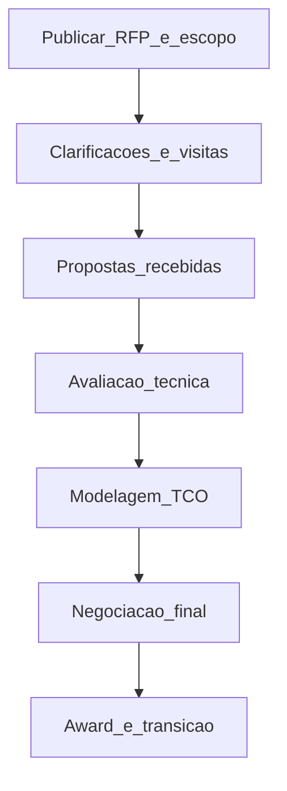

# TCO, RFP e leilão como ferramenta — o preço na nota fiscal quase nunca conta a história inteira

**TCO (*Total Cost of Ownership*)** soma **preço** mais **logística**, **qualidade**, **risco**, **capital de giro** e **custo de vida útil** (manutenção, treinamento, descontinuação). **RFP (*Request for Proposal*)** estrutura concorrência **justa** e **comparável**. **Leilões** (reverso ou dinâmico) podem **acelerar** negociação em categorias maduras — ou **destruir valor** se o escopo for ambíguo.

---

## Objetivos e resultado de aprendizagem

**Ao final desta aula**, você será capaz de:

- Montar uma **lista TCO** com 8–12 linhas para uma compra relevante.  
- Descrever etapas **RFP → avaliação → award** com critérios ponderados.  
- Posicionar **leilão** como **ferramenta**, não como dogma.

**Duração sugerida:** 60–75 minutos.

---

## Gancho — o fornecedor «barato» da TechLar

A **TechLar** premiou no RFP o menor **preço unitário** de **motores elétricos**. O vencedor tinha **lead time longo**, **defeitos** no primeiro lote e **peças** com vida útil menor — **TCO** 22% acima do segundo colocado em 36 meses. O comitê não tinha **ponderado** qualidade e PPM; tinha «feito média» de notas subjetivas.

**Analogia do voo *low cost*:** tarifa baixa com **bagagem**, **remarcação** e **assento** pagos à parte — o TCO da viagem pode perder para outra companhia «mais cara» no banner.

---

## Mapa do conteúdo

- Componentes típicos de TCO em B2B industrial e serviços logísticos.  
- RFP: requisitos, SLAs, anexos técnicos, confidencialidade.  
- Matriz de **ponderação** e armadilha do **preço disfarçado**.  
- Leilão: quando ajuda, quando corrói relacionamento ou qualidade.

---

## Conceito núcleo — TCO

**TCO (pedagógico):** custo **direto** + **indiretos alocados** + **risco esperado** (prêmio) + **capital** (dias de estoque, pagamento) + **pós-compra** (garantia, suporte, *obsolescence*).

| Bloco | Exemplos |
|-------|----------|
| Preço | lista, desconto, impostos recuperáveis ou não (*não orientação fiscal*) |
| Logística | frete, *cross-border*, seguro, manuseio |
| Qualidade | retrabalho, devolução, parada de linha |
| Capital | prazo de pagamento *versus* lead time |
| Risco | multa contratual, *single source*, câmbio |
| Ciclo de vida | peças, atualização de software, treinamento |

**Legenda:** fluxo **linear** simplificado; na prática, `R4`–`R6` podem iterar; **documento** de premissas do TCO é tão importante quanto a planilha.

**Leilão reverso:** fornecedores competem em **preço** em janela; útil quando **especificação** é estável, **múltiplos** qualificados e **pouco** valor em co-inovação. **Risco:** *race to the bottom* em qualidade ou **especificação** mal fechada (*consenso de mercado*).

**Mini-caso:** *sourcing* de **transporte spot** *versus* **dedicado**: TCO do dedicado inclui **flexibilidade**, **segurança** e **menos** gestão administrativa — preço por km não basta.

---

## Trade-offs

- TCO **completo** *versus* **tempo** de decisão — começar com **80/20** de linhas.  
- **Transparência** no RFP *versus* **vantagem competitiva** do fornecedor (NDA, *clean room*).  
- **Peso** de critério «inovação» pode **excluir** commodity pura — ou **incluir** *lock-in* se Mall definido.

---

## Aplicação — exercício

Para **um** item ou serviço real (ou fictício), liste **dez** linhas de TCO e atribua **H/M/L** (alto/médio/baixo impacto esperado) sem calcular valores. Em seguida, defina **três** critérios de award com pesos que somem 100%.

**Gabarito pedagógico:** deve haver **pelo menos** uma linha de **qualidade/risco** e **uma** de **capital/tempo**; pesos 100% só em preço = **alerta** pedagógico salvo commodity com escopo fechadíssimo.

---

## Erros comuns e armadilhas

- RFP com **100 páginas** e requisito impossível — só incumbente responde.  
- «Menor preço» legal no edital sem **definição** de TCO.  
- Leilão em categoria **estratégica** com **co-design** necessário.  
- Esquecer **custo de transição** (*switching cost*) no award.

---

## KPIs e decisão

- **TCO projetado** 12/24/36 meses (horizonte alinhado ao ativo).  
- **PPM** / *first pass yield* do fornecedor.  
- **OTIF** do fornecedor (quando aplicável à compra).  
- **Custo de gestão** (FTE de compras/qualidade sobre a categoria).

---

## Fechamento — três takeaways

1. TCO é **história financeira completa**, não só linha do pedido.  
2. RFP bom é **contrato de clareza** antes do contrato real.  
3. Leilão é **alicate**, não **martelo universal**.

**Pergunta de reflexão:** qual compra recente teve **surpresa de TCO** após 6 meses — e qual linha faltou no RFP?

---

## Referências

1. ELLRAM, L. M. *A framework for total cost of ownership*. *The International Journal of Logistics Management* — base acadêmica do constructo TCO.  
2. VAN WEELE, A. *Purchasing and Supply Chain Management* — processos, negociação e *sourcing*.  
3. ASCM — ética e práticas em *procurement* — [ascm.org](https://www.ascm.org/).  
4. World Bank / multilaterais — guias de RFP para grandes compras (*referência de processo*, adaptar ao B2B privado).

**Ponte:** [Fretes e negociação](../../trilha-fundamentos-e-estrategia/modulo-04-custos-logisticos-performance/aula-02-fretes-contratos-negociacao.md).
