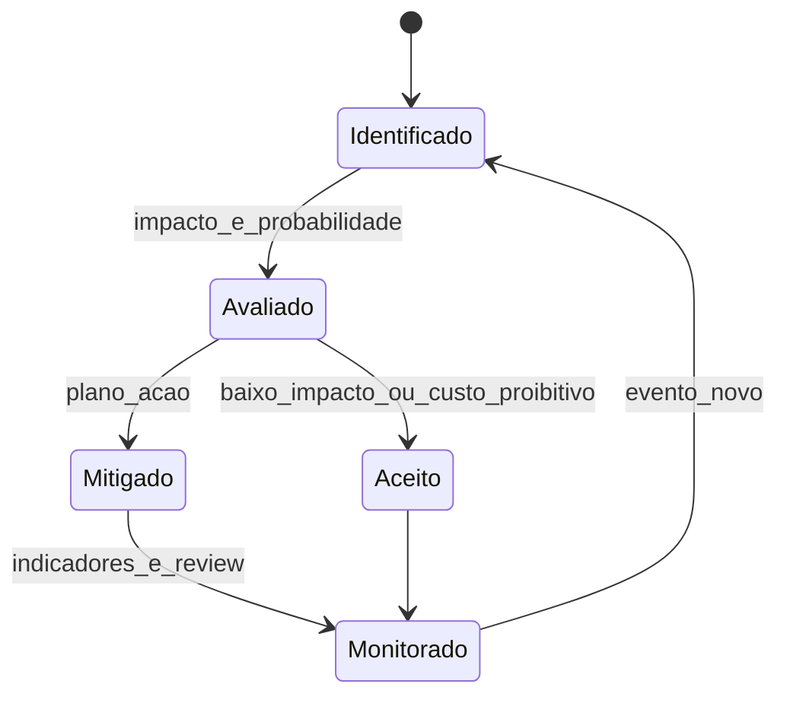

# Risco de fornecimento, ESG e geopolítica — *sourcing* quando o mapa pesa mais que a planilha

**Risco de fornecimento** inclui **concentração** (*single source*), **geografia** (corredor, porto, fronteira), **evento** (clima, greve, ciberataque), **regulatório** e **reputação**. **ESG** (ambiental, social, governança) entrou como **restrição** e **diferencial** em *sourcing*: não substitui **compliance legal** nem **due diligence** jurídica — mas **condiciona** elegibilidade e **prêmio** de marca. **Geopolítica** altera **tarifas**, **sanções** e **confiança** — variáveis que mudam mais rápido que contrato anual.

---

## Objetivos e resultado de aprendizagem

**Ao final desta aula**, você será capaz de:

- Mapear **riscos** de fornecimento em categorias acionáveis.  
- Propor **mitigações** (dual sourcing, estoque estratégico, desenho alternativo, nearshoring *conceitual*).  
- Posicionar **ESG** como **critério auditável** no *sourcing*, com limites do que **não** é papel de compras sozinha.

**Duração sugerida:** 60–75 minutos.

---

## Gancho — a TechLar e o país «longe demais»

Um fornecedor da **TechLar** concentrava **70%** de um subconjunto numa **única região** costeira. Um **evento climático** fechou porto por 12 dias; a linha de montagem parou. Compras dizia: «tinha **estoque de segurança**» — mas o MRP usava **lead time médio** de tempos calmos; o **percentil 95** do atraso **nunca** tinha alimentado o desenho. *Sourcing* e **risco** não conversavam.

**Analogia da agricultura:** monocultura em vale único dá **escala**; uma **geada** ou **enchente** zera a safra — **diversificação** tem custo, mas é **seguro**.

---

## Mapa do conteúdo

- Tipos de risco: fornecedor, país, logística, ciber, regulatório, reputacional.  
- *Dual sourcing* e **qualificação** alternativa (*second source*).  
- ESG: mínimos, auditoria, *greenwashing* e limites.  
- Geopolítica: cenários, não previsão de política.

---

## Conceito núcleo

**Matriz de risco (pedagógica):** probabilidade × impacto — com **dados fracos**, use **ordinais** (baixo/médio/alto) e **plano** de mitigação, não falsa precisão.

**Mitigações comuns (*consenso de mercado*):**

- **Inventário estratégico** ou **acordo** de capacidade reservada.  
- **Segundo fornecedor** qualificado (mesmo que mais caro).  
- **Engenharia** com desenho alternativo (*design for sourcing*).  
- **Contrato** com cláusulas de **força maior** claras e **playbook** de crise (jurídico participa).

**Legenda:** estados = **postura** frente ao risco; transições são **decisões** de governança; *não* substitui política corporativa de risco.

**ESG no *sourcing* (pedagógico):**

- **E:** pegada *scope* relevante (*não* ensinar contabilidade de carbono sem base); certificações como **gate** quando auditadas.  
- **S:** trabalho digno, saúde e segurança na cadeia — *due diligence* com especialistas.  
- **G:** anticorrupção, conflito de interesse, transparência em subcontratados.

**Hipótese pedagógica:** empresas maduras **integram** ESG a **scorecard** de fornecedor (módulo SRM), não só a *slide deck* de RFP.

**Mini-caso:** sanções ou **embargos** mudam **da noite para o dia** — *sourcing* precisa **lista** de país/material sensível e **canal** com compliance **antes** da negociação emocional.

---

## Trade-offs

- **Dual sourcing** aumenta **custo** e complexidade; reduz **risco de parada**.  
- **Nearshoring** pode subir **preço** e baixar **lead time** e risco geopolítico — **depende** de categoria (*não* regra universal).  
- ESG **rigoroso** sem capacidade de auditoria vira **papel** ou **exclusão** injusta de PMEs — precisa **escada** de maturidade.

---

## Aplicação — exercício

Escolha **uma** categoria crítica. Liste **cinco** riscos (um por tipo: operacional, geográfico, financeiro, regulatório/reputacional, tecnológico). Para **dois** deles, escreva **uma** mitigação **concreta** e **um** indicador de monitoramento.

**Gabarito pedagógico:** mitigação deve ser **acionável** (segunda fonte, estoque X dias, cláusula, desenho alternativo), não só «monitorar notícias»; indicador deve ser **mensurável** ou **verificável** em revisão.

---

## Erros comuns e armadilhas

- **Single source** «porque sempre deu certo» — *survivorship bias*.  
- ESG como **checklist** sem evidência ou sem **consequência** no award.  
- Compras **sozinha** decidindo **sanções** ou **classificação fiscal** — papel de **compliance** especializado.  
- Confundir **opinião política** com **cenário** de continuidade de negócio.

---

## KPIs e decisão

- **% gasto** em fornecedores **qualificados** como *second source*.  
- **Tempo** para ativar *plan B* (teste de mesa).  
- **Concentração** geográfica (Herfindahl simplificado por região, *opcional*).  
- **Incidentes** de fornecimento e **MTTR** (*mean time to recover*).

---

## Fechamento — três takeaways

1. Risco de fornecimento é **ativo** no balanço emocional da fábrica — trate com **processo**.  
2. ESG entra como **regra do jogo** e **vantagem** — com auditoria honesta.  
3. Geopolítica exige **cenários**, não aposta.

**Pergunta de reflexão:** qual fornecedor hoje falharia no teste «**e se fechasse por 30 dias**»?

---

## Referências

1. MANUJ, I.; MENTZER, J. T. *Global supply chain risk management*. *Journal of Business Logistics* — framework de risco internacional.  
2. WEF — *Global Risks Report* — cenários macro (atualizar edição ao usar).  
3. OECD *Guidelines for Multinational Enterprises* — referência de conduta e *due diligence* (contexto, não substituto jurídico).  
4. ASCM / CSCMP — resiliência e *supply chain risk* — [ascm.org](https://www.ascm.org/), [cscmp.org](https://cscmp.org/).

**Ponte:** [Riscos e resiliência em SCM](../../trilha-fundamentos-e-estrategia/modulo-02-supply-chain-management/aula-03-riscos-resiliencia-sustentabilidade-scm.md); [SRM — segmentação](../modulo-03-gestao-de-fornecedores-srm/aula-01-segmentacao-fornecedores-modelos-relacionamento.md).
