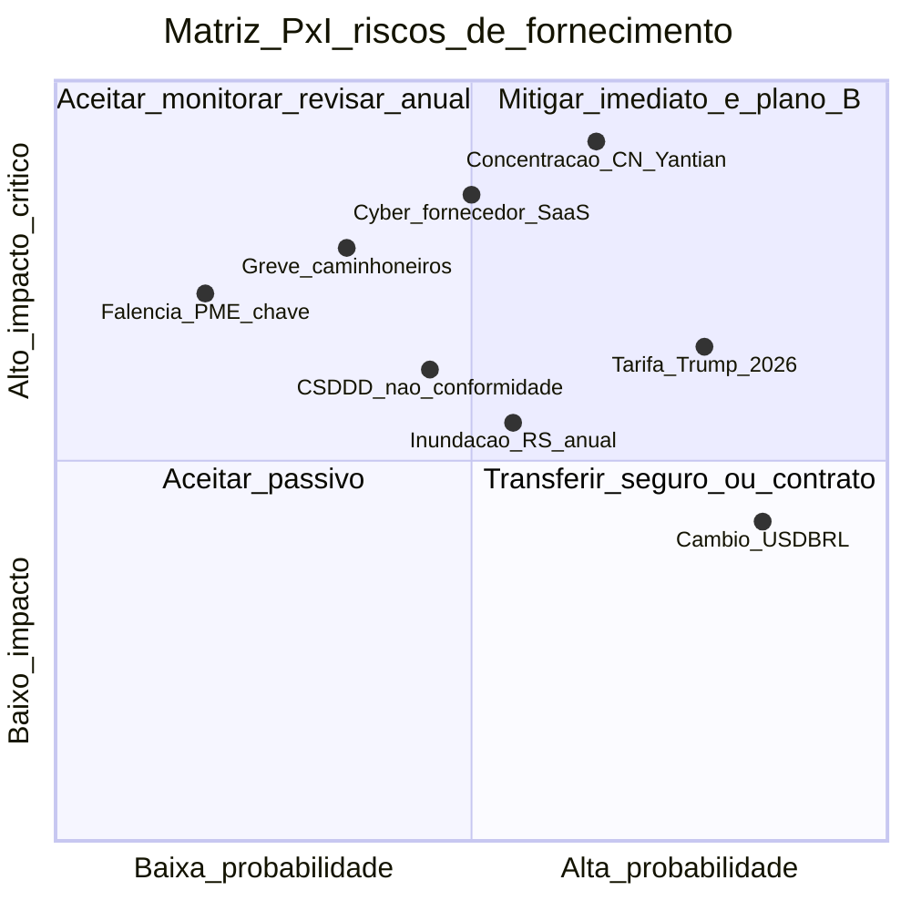
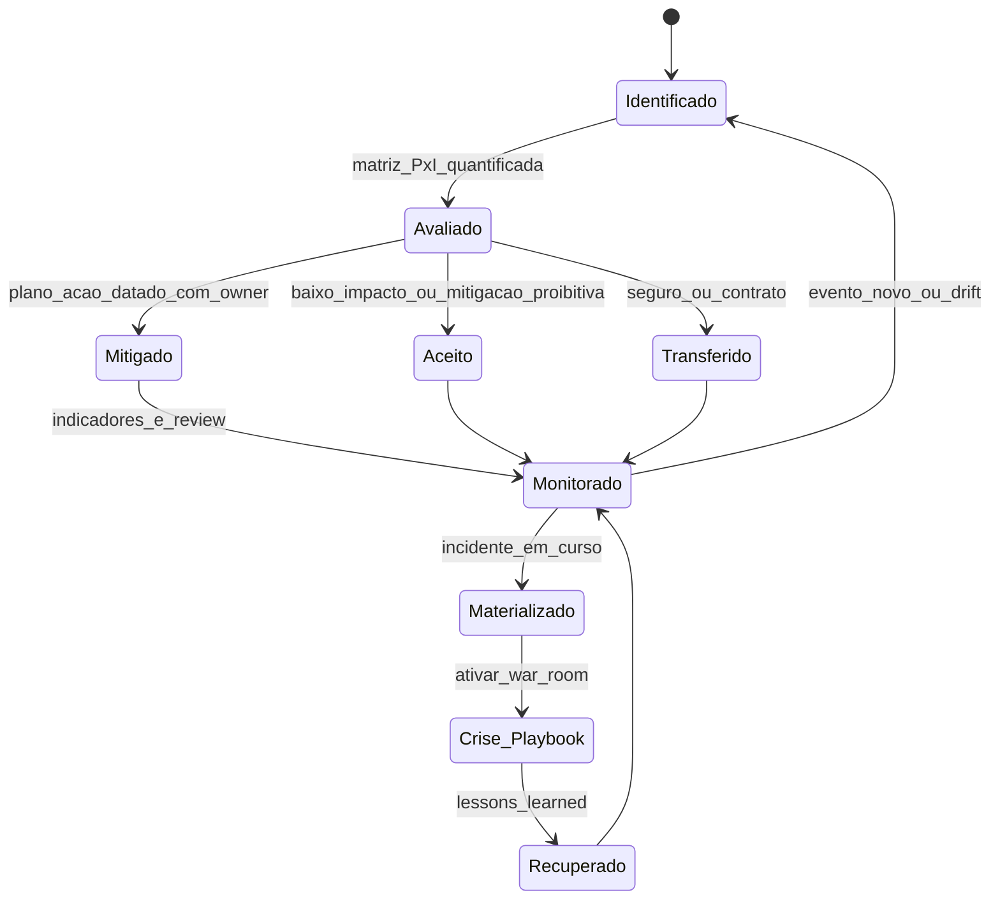
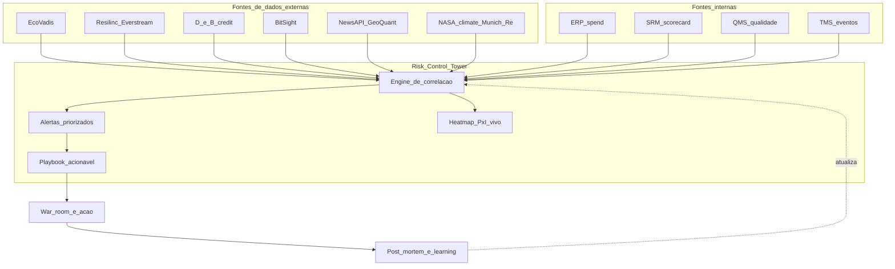

# Risco de fornecimento, ESG e geopolítica — *sourcing* quando o mapa pesa mais que a planilha

**Risco de fornecimento** é o conjunto de eventos que **interrompem, encarecem ou contaminam reputacionalmente** a cadeia: **concentração** (*single source* / *single country*), **geografia** (corredor, porto, fronteira), **clima** (ciclone, enchente, seca, rio sem calado), **trabalho** (greve, escassez), **ciber**, **regulatório**, **financeiro** (inadimplência) e **reputacional** (ESG na imprensa). **ESG** (ambiental, social, governança) **deixou de ser tema de comunicação** e virou **regra do jogo**: CSDDD na UE, SEC Climate Rule (US), Lei 14.946/2024 (BR — trabalho análogo a escravo), ISO 20400 (sustainable procurement), CSRD em vigor desde 2024–2025 — tudo gera *gates* de elegibilidade no RFP. **Geopolítica** alterou o **mapa-mundi de sourcing** em apenas 5 anos: Trump-tarifas (2018–2019 e nova rodada 2025–2026), pandemia 2020, Suez 2021, Rússia-Ucrânia 2022, Mar Vermelho 2023–2024, China+1, *friend-shoring* — variáveis que mudam **mais rápido** que contrato anual.

Esta aula entrega o **mapa de risco vivo** que CPO precisa ter em mãos: tipologia de risco, **matriz P×I** com Monte Carlo, mitigações com custo, ESG operacionalizada (EcoVadis, Sedex, *due diligence* CSDDD), geopolítica em **cenários** (não opinião), e *playbook* de crise.

---

## Objetivos e resultado de aprendizagem

Ao final desta aula, você será capaz de:

- Mapear **8 tipos de risco** de fornecimento com **proxies de medição** observáveis.
- Estruturar **matriz Probabilidade × Impacto** com mitigações datadas e custo.
- Operacionalizar **ESG** como *gate* + *scorecard* (não comunicação).
- Construir **2–4 cenários geopolíticos** com gatilhos e plano B precificado.
- Reconhecer **CSDDD, CSRD, CBAM, FOCB, ISO 20400** e seu impacto em *sourcing*.
- Conduzir uma **mesa de simulação** de crise com fornecedores tier-1.

**Duração sugerida:** 90 minutos. **Pré-requisitos:** aulas 2.1 e 2.2.

---

## Mapa do conteúdo

1. **Tipologia de 8 riscos** com proxies observáveis.
2. **Matriz P×I** + heatmap quantitativo (Monte Carlo simplificado).
3. **Mitigações catalogadas** com custo (*dual sourcing*, estoque estratégico, *design for sourcing*, *life-time buy*).
4. **ESG operacional**: EcoVadis, SMETA/Sedex, CDP, *due diligence* CSDDD.
5. **Geopolítica 2025–2026**: tarifa Trump, China+1, *friend-shoring*, *near-shoring*, *re-shoring*.
6. **Mapa de risco vivo** + *control tower* + *Resilinc* / *Everstream*.
7. ***Playbook* de crise** (papéis, SLAs, mesa de simulação trimestral).

---

## Gancho — a TechLar e o país «longe demais»

Um fornecedor da **TechLar** concentrava **70% de um subconjunto eletrônico** numa **única região costeira da China (Yantian, Shenzhen)**. Em fevereiro de 2025, **3 eventos** simultâneos:

1. **Surto pulmonar localizado** levou a **lockdown** de 5 dias do porto.
2. **Container ship Ever Forward bis** (caso fictício, padrão real) encalhou no **Canal de Suez**, congestionando rota Ásia–Europa por 9 dias.
3. **Houthis no Mar Vermelho** atacaram navios em rota tradicional, forçando desvio Cabo da Boa Esperança (+12 dias e +35% custo frete).

Resultado para TechLar:

- Lead time saltou de **45 dias** para **78 dias** (+73%).
- Frete por contêiner subiu de US$ 2.800 para US$ 8.400 (+200%).
- **Estoque de segurança** dimensionado para **lead time médio de 45d com σ pequeno** — reabastecimento atrasou; ruptura na linha de montagem **dia 21**.
- Linha parou **17 dias**; multa cliente **R$ 4,1 mi**; frete aéreo emergencial **R$ 1,8 mi**; perda de contrato montadora pernambucana (renovação não estendida).

Compras dizia: «**tinha** estoque de segurança». Mas o MRP usava **lead time médio de tempos calmos**; o **percentil 95 (P95)** do atraso **nunca** tinha alimentado o desenho. *Sourcing* e **risco** **não conversavam** — o time de risco corporativo (CRO) estava num andar diferente.

Diagnóstico final do CRO recém-empossado: **0 dos 14 fornecedores tier-1 críticos** tinha **mesa de simulação** anual, **plano B testado**, ou **mapa de exposição país**. Procurement era *world-class* em saving, **inválido** em resiliência.

**Analogia da agricultura:** **monocultura em vale único** dá **escala** e **eficiência** em ano bom; uma **geada**, **enchente** ou **praga** zera a safra inteira. **Diversificação** (rotação de culturas, rotação de solos, rotação de origens) tem custo, mas é **seguro agrícola embutido**. *Single source* / *single country* é monocultura logística.

**Analogia da diplomacia:** *sourcing* sem mapa de risco geopolítico é como **embaixada sem inteligência**: você descobre a guerra **pelo jornal**. ESG é o equivalente da **carta de credenciais**: sem ela, fornecedor não passa no portão de entrada das *blue chips* europeias.

**Analogia do paciente cardíaco:** monitorar PA uma vez por ano não é prevenção — é **necropsia agendada**. Mapa de risco precisa ser **vivo**, **diário**, integrado à *control tower*.

---

## Conceito-núcleo

### Tipologia em 8 dimensões + proxies

| Tipo de risco | Exemplos | Proxy mensurável |
|---|---|---|
| **Operacional / fornecedor** | falha qualidade, capacidade insuficiente, falência | PPM, OTIF, *Z-score Altman*, *days payable* |
| **Geográfico / clima** | enchente, ciclone, terremoto, seca | mapa de risco físico (Munich Re, NASA POWER) |
| **Logístico / corredor** | bloqueio porto, greve, pirataria, congestionamento | índice *Drewry*, *Baltic Dry*, *MarineTraffic* |
| **Financeiro / câmbio** | inadimplência, oscilação cambial, juros | *credit rating*, *CDS spread*, exposição moeda |
| **Regulatório / fiscal** | sanção, embargo, mudança tarifária, ICMS | OFAC, USTR, regulamentação setorial |
| **Reputacional / ESG** | trabalho infantil, desmatamento, vazamento | EcoVadis, Sedex, CDP, NewsAPI |
| ***Cyber*** | ransomware, vazamento, *supply chain attack* | SOC 2, ISO 27001, BitSight, SecurityScorecard |
| **Geopolítico** | guerra, tarifa, sanção, conflito comercial | EIU Country Risk, GeoQuant, S&P Global Country Risk |

### Matriz Probabilidade × Impacto (heatmap operacional)

**Legenda:** posicionar **cada risco** com **dado** (frequência histórica, impacto financeiro estimado P50/P90). Quadrante 1 = mitigação **imediata datada**; quadrante 4 = transferir via **seguro** (Marsh, Aon) ou **cláusula contratual**.

### Mitigações catalogadas — com custo

| Mitigação | Quando aplicar | Custo típico | Eficácia |
|---|---|---|---|
| ***Dual sourcing* (60-40 ou 80-20)** | estratégico + alavancagem com risco geográfico | +5–15% custo unitário (perda escala); custo qualificação 6–18m | reduz P(parada) ~80% |
| ***Triple sourcing* + região distinta** | gargalo crítico sem sub. técnica | +12–25% | reduz risco país ~95% |
| **Estoque estratégico (60–120d)** | bottleneck *life-saving*, semicondutor crítico | capital × 14% × meses | proteção temporal exata |
| ***Life-time buy*** (compra única vida útil) | descontinuação anunciada | espaço armazenagem + obsolescência risco | 100% durante vida produto |
| ***Capacity reservation* / *take-or-pay*** | estratégico com alta volatilidade | *option premium* 3–8% volume | acesso garantido |
| ***Design for sourcing*** (engineering) | médio prazo, redesenho viável | engenharia 80–400h + qualificação | elimina dependência técnica |
| ***Vertical integration* parcial** | core estratégico | capex elevado | controle, não eliminação risco |
| ***Near-shoring / friend-shoring*** | risco geopolítico crônico | preço unitário +15–40% | resiliência geopolítica |
| ***Cabotagem BR (Lei 14.301/22)*** | substituir rota crítica | +5 a 9 dias lead time, −30 a −40% custo | redundância modal |
| **Cláusula *step-in*** | falha contratual fornecedor | jurídico + auditoria | continuidade operacional |
| **Seguro *trade credit + business interruption*** | exposição financeira alta | prêmio 0,3–1,2%/ano sobre receita | transferência risco |

### *State machine* da gestão de risco

**Legenda:** estados = **postura** frente ao risco; transições são **decisões** de governança com **owner + data**. *Playbook* de crise é parte do *governance framework* corporativo (não improvisação).

---

## Frameworks-chave

### 1. **ISO 31000:2018** — *Risk Management Guidelines*

Framework genérico, base para construção do mapa.

### 2. **ISO 28000:2022** — *Security and Resilience: Security Management Systems for the Supply Chain*

Específico para cadeia.

### 3. **ISO 20400:2017** — *Sustainable Procurement Guidance*

Operacionalização ESG em compras.

### 4. **NIST SP 800-161** — *Supply Chain Risk Management for Federal Information Systems*

Excelente para risco *cyber* na cadeia.

### 5. **Sheffi (MIT)** — *The Power of Resilience: How the Best Companies Manage the Unexpected*

Casos clássicos (Nokia vs Ericsson em incêndio Philips 2000).

### 6. **WEF Global Risks Report** (anual) — taxonomia macro

### 7. **CSDDD (Diretiva 2024/1760/EU)** — *Corporate Sustainability Due Diligence Directive*

Empresas ≥1000 funcionários e €450M faturamento (em transição até 2027–2029) devem fazer **due diligence** em **toda cadeia de valor**, incluindo *tier-2 e tier-3*. Sanções: até **5% do faturamento global**.

### 8. **CSRD (Diretiva 2022/2464/EU)** — *Corporate Sustainability Reporting*

Obriga relato em padrão **ESRS** (European Sustainability Reporting Standards) — entrou em vigor 2024 para grandes; 2025 para listadas; 2026 para PMEs listadas.

### 9. **SEC Climate Rule (US, 2024)** — divulgação de emissões e risco climático

### 10. **ABNT NBR 16001:2012** + **PRO 2030 (Sebrae)** — equivalentes BR para *due diligence* e ESG em PME.

---

## Aprofundamentos — variações geográficas e geopolíticas (2025–2026)

### China+1 / China+N

Estratégia adotada por ~78% das multinacionais (McKinsey 2024). Destinos preferidos:

| Destino | Vantagem | Limitação |
|---|---|---|
| **Vietnã** | mão obra, FTAs, investimento japonês/coreano | infraestrutura sobrecarregada |
| **Índia** | escala, PLI scheme, demografia | logística, burocracia |
| **México** | USMCA, próximo aos EUA, tarifa zero | violência, dependência energia |
| **Indonésia / Malásia / Tailândia** | níquel, cobre, semicondutor downstream | risco político variável |
| **Brasil** | mercado interno, agribusiness, energia limpa | custo Brasil, infraestrutura |
| **Polônia / Hungria / Romênia** | porta UE, mão de obra qualificada | escassez talento, energia 2022+ |

### Tarifa Trump 2026 (segunda rodada)

Anúncios 2025: **eletrônicos CN +25 a +60%**, **automóveis CN+10 a +25%**, **aço/alumínio +universal 10%**. Efeitos no sourcing:

- Aceleração *near-shoring* México (USMCA).
- Pressão de redirecionamento para Vietnã (com risco de **transbordo** punido).
- *Re-shoring* US para semicondutor (CHIPS Act, US$ 52 bi subsídio) e baterias (IRA).
- BR como *swing producer* em commodities (alimentos, ferro, soja, café).

### *Friend-shoring* — Yellen 2022, US Treasury

«Movimento de cadeia para países **alinhados** geopoliticamente». Risco: politização da economia, fragmentação, perda de eficiência global.

### Mar Vermelho / Suez (2023–2024 → impacto duradouro)

Houthis atacam navios; rota desviada Cabo da Boa Esperança = **+10 a +14 dias** Ásia-Europa, **+25–60%** custo frete. Categorias afetadas: tudo importado da Ásia para UE/Med.

### Ucrânia / Rússia (2022–)

Agro (cereais, fertilizante), energia (gás), metais (paládio, níquel), neon (semicondutor). Sanções afetam *due diligence* de origem.

### Brasil — riscos específicos

- **Greve caminhoneiros 2018**: 11 dias parado, R$ 75 bi prejuízo nacional. Risco recorrente em ano eleitoral.
- **Enchentes RS 2024**: 50% PIB do estado interrompido por 60+ dias; atinge cadeia automotiva, calçados, mármore.
- ***Apagões cibernéticos***: ataque a sistema portuário/aduaneiro paralisa importação por dias.
- **Risco regulatório**: Reforma Tributária 2026–2033 redesenha competitividade fiscal de fornecedores estaduais.

---

## ESG operacionalizada — não comunicação

### Pillar E (Ambiental)

- **Pegada carbônica** *scope 1, 2, 3* (GHG Protocol). *Scope 3* (cadeia) é 70–95% do total para empresa típica.
- **CBAM (UE 2026)**: aço, cimento, alumínio, fertilizante, hidrogênio, eletricidade pagam **carbono** ao entrar UE; certificado CBAM exigido a partir 2026.
- **CDP (Carbon Disclosure Project)** scoring A–D-: investidores e clientes exigem.
- **Desmatamento (EUDR — EU Deforestation Regulation, 2025)**: soja, café, cacau, óleo palma, carne, madeira, borracha — produto não pode entrar UE se desmatar pós 31/12/2020.

### Pillar S (Social)

- **Trabalho digno**: SMETA/Sedex audit, SA8000.
- **Trabalho análogo a escravo (BR Lista Suja, MTE)**: empresa em lista suja → restrição comercial e bancária.
- **Direitos humanos**: princípios *Ruggie* (UN Guiding Principles on Business and Human Rights).

### Pillar G (Governança)

- **Anticorrupção**: FCPA, UK Bribery Act, Lei 12.846/13.
- **Conflito de interesse**, **transparência tier-2/3**, **whistleblower channels**.

### Operacionalização — gates + scorecard

| Estágio sourcing | Ação ESG | Ferramenta |
|---|---|---|
| Pré-qualificação RFI | gate ESG mínimo (EcoVadis ≥ 40) | EcoVadis, Sedex |
| RFP | scorecard ESG com peso 10–25% | scorecard interno |
| Award | cláusula contratual ESG + auditoria direito | template legal |
| Operação | monitoramento contínuo (ratings, news) | Resilinc, EcoVadis dashboard |
| QBR | painel ESG do fornecedor estratégico | SRM tool |
| Renovação | re-auditoria, melhoria documentada | auditoria 3ª parte |

### ABNT NBR 16001 + ISO 20400 — enquadramento BR

ABNT NBR 16001 (responsabilidade social) é o equivalente BR do SA8000; ISO 20400 entrega o framework integrado de *sustainable procurement*. Para PME BR, **PRO 2030 (Sebrae)** oferece autoavaliação acessível.

---

## Diagrama / Modelo principal — *risk control tower* integrada

**Legenda:** *risk control tower* é **sistema integrado** que correlaciona sinais externos (geopolítica, ESG, financeiro, clima) com posicionamento interno (spend, contratos, estoque). **Resilinc**, **Everstream Analytics**, **Interos** são líderes; **Coupa Risk Aware**, **SAP Ariba Risk** estão integrando.

---

## Trade-offs estratégicos

| Decisão | A favor | Contra |
|---|---|---|
| ***Dual sourcing*** | reduz risco parada | +5–15% custo, complexidade |
| ***Near-shoring*** | resiliência geopolítica, lead time | preço unitário +, capacidade local |
| **Estoque estratégico 60–120d** | proteção temporal | capital, obsolescência |
| **ESG rigoroso pré-qualif.** | conformidade, marca | exclui PMEs sem capability ESG |
| **Cobertura cambial (hedge)** | previsibilidade | custo opção; oportunidade perdida em câmbio favorável |
| **Transparência tier-2/3** | conformidade CSDDD, reputação | custo TPRM, resistência fornecedores |

---

## Caso prático — TechLar revê estratégia pós-incidente

**Situação:** 70% subconjunto eletrônico de 1 fornecedor em Yantian, 17 dias parados em 2025.

**Plano (mês 0–18):**

| Onda | Ação | Custo | Benefício esperado |
|---|---|---|---|
| **0–3m** | Mesa simulação **war room**; mapeia *tier-2/3*; aciona estoque estratégico 75d (R$ 4,2 mi capital) | R$ 4,2 mi capital + R$ 580k WACC/ano | Cobertura imediata |
| **3–9m** | Qualifica **2º fornecedor Vietnã** (CKD); auditoria EcoVadis, SMETA | R$ 320k | Reduz dependência CN para 60% |
| **9–18m** | Qualifica **3º fornecedor México (USMCA)** para mercado export US; redesign engineering substituindo 1 componente ASIC para *commodity* (sai do *bottleneck*) | R$ 980k engineering | Diversificação geopolítica + redução risco crítico |
| **Permanente** | Risk control tower (Resilinc); monitoramento contínuo; QBR ESG trimestral; cláusula *step-in* + *exit* em todos contratos novos | R$ 240k/ano licença + 1 FTE | Visibilidade vivo |

**Resultado projetado:** *Resilience Index* sobe de **22% → 78%**; concentração país top-1 cai 70% → 40%; conformidade CSDDD/CBAM atingida; custo estrutural +R$ 1,4 mi/ano (~0,4% do COGS) — preço da resiliência aceito pelo Conselho.

---

## Erros comuns e armadilhas

1. ***Single source* «porque sempre deu certo»** — *survivorship bias* clássico.
2. **ESG como checklist** sem evidência ou consequência (*greenwashing* corporativo).
3. **Compras decidindo sanções/classificação fiscal** — papel de *compliance* especializado.
4. **Confundir opinião política com cenário** de continuidade.
5. **Lead time médio no MRP** (sem P95) para item crítico vindo de país de risco alto.
6. **Plano B no PowerPoint** que ninguém testou em mesa de simulação.
7. **Tier-1 controlado, tier-2 invisível**: 60% das paralisias vem de tier-2/3 (Resilinc 2024).
8. **Hedge 100% câmbio** (caro) ou **0% hedge** (especulação) — política deveria ser **escalonada**.
9. **Seguro contratado sem análise**: *business interruption* sem cobertura *contingent BI* (parada por fornecedor) é seguro de fachada.

---

## Risco e governança — quem faz o quê

| Papel | Responsabilidade | Cadência |
|---|---|---|
| **CRO / Risco corporativo** | framework, apetite ao risco, *limits*, mesa simulação | Trimestral |
| **CPO / Procurement** | mapa fornecedores, *dual sourcing*, ESG operacional | Contínuo |
| **CSCO / Supply chain** | estoque estratégico, *risk control tower*, *playbook* | Contínuo |
| ***Compliance*** | sanções, FCPA, anticorrupção, *due diligence* legal | Trimestral |
| **Legal** | contratos com cláusulas; *step-in*, *exit*, *force majeure* moderna (pandemia, ciber) | Por contrato |
| **Sustentabilidade** | CSRD/ESRS, CBAM, GHG inventory | Anual + monitoramento |
| **Conselho / Comitê de Risco** | aprovação política, revisão *top 10 risks* | Trimestral |

---

## KPIs estratégicos

| KPI | Pergunta | Dono | Fonte | Cadência | Playbook |
|---|---|---|---|---|---|
| ***Resilience Index*** (% spend com plano B testado) | sobrevive a choque? | CRO + CPO | SRM + risco | Trimestral | Aumentar via *dual sourcing*, redesenho |
| ***Concentration*** (Herfindahl por país top categorias) | risco geográfico? | CPO | Spend cube | Trimestral | Diversificar |
| ***Single-source critical %*** | dependência aguda? | CPO | SRM | Mensal | Qualificar 2ª fonte |
| **Tempo de ativar plano B (h)** | velocidade de reação? | Procurement Ops | Mesa simulação | Trimestral (teste) | Treinar, automatizar |
| ***Mean Time to Recover* (MTTR)** | tempo real recuperação? | CSCO | Histórico incidentes | Por incidente | Pós-mortem |
| ***ESG score médio (EcoVadis)*** top 50 fornecedores | conformidade? | CPO + Sustentab. | EcoVadis | Semestral | Plano evolução PMEs |
| **% contratos com cláusula *step-in*, *exit*, *force majeure* moderna** | maturidade contratual? | Legal | CLM | Semestral | Atualizar template |
| ***Tier-2/3 mapped %*** críticos | conformidade CSDDD? | CPO + Sustentab. | Resilinc | Semestral | Investimento TPRM |
| ***Cyber risk score*** top fornecedores | exposição digital? | CISO + CPO | BitSight, SecurityScorecard | Trimestral | Auditoria SOC 2 |
| ***Coverage* CBAM-ready** (% spend UE conforme) | UE friendly? | Sustentab. + CPO | Inventory carbono | Anual | Migrar fornecedores |

---

## Tecnologias e ferramentas habilitadoras

- ***Supply chain risk management* (SCRM)**: **Resilinc** (líder, multi-tier mapping), **Everstream Analytics**, **Interos**, **Riskmethods** (Sphera), **Prewave**.
- ***ESG ratings* fornecedor**: **EcoVadis** (líder), **Sedex** (SMETA), **CDP**, **Sustainalytics**, **MSCI ESG Ratings**.
- ***Cyber risk* fornecedor**: **BitSight**, **SecurityScorecard**, **UpGuard**, **OneTrust TPRM**.
- ***Country risk***: **EIU Country Risk**, **GeoQuant**, **S&P Global Country Risk**, **Verisk Maplecroft**.
- ***Climate risk***: **Munich Re NatCatService**, **Swiss Re CatNet**, **Jupiter Intelligence**.
- ***Trade compliance***: **Descartes Visual Compliance**, **Amber Road (E2open)**, **Thomson Reuters ONESOURCE**.
- ***Insurance / Trade credit***: **Marsh**, **Aon**, **Coface**, **Atradius**, **Euler Hermes**.
- ***Crisis management***: **Everbridge**, **OnSolve** (alertas e *war room*).
- ***ERP nativo***: **SAP Ariba Risk Awareness**, **Coupa Risk Aware**, **Oracle Procurement Risk**.

---

## Glossário rápido

- **CSDDD**: Corporate Sustainability Due Diligence Directive (UE 2024).
- **CSRD / ESRS**: relato sustentabilidade UE.
- **CBAM**: Carbon Border Adjustment Mechanism.
- **EUDR**: EU Deforestation Regulation.
- **FOCB**: First-Order Country Bias.
- **OFAC**: Office of Foreign Assets Control (sanções US).
- **TPRM**: Third-Party Risk Management.
- **MTTR**: Mean Time to Recover.
- **Single source / Sole source**: 1 fornecedor escolhido / único existente.
- ***Force majeure***: cláusula contratual de eventos extraordinários.
- ***Step-in clause***: comprador assume operação se fornecedor falhar.
- ***Friend-shoring***: cadeia em países geopoliticamente alinhados.
- **PRO 2030 / ABNT NBR 16001**: padrões BR sustentabilidade.

---

## Aplicação — exercícios

**Exercício 1 (25 min) — Mapa P×I.** Para uma categoria crítica (real ou TechLar), liste **5 riscos** (um por dimensão: operacional, geográfico, financeiro, regulatório/ESG, *cyber*). Para cada, atribua probabilidade (B/M/A) e impacto (R$ ou %). Para **3 deles**, escreva mitigação **acionável e datada** com **owner**.

**Gabarito:** mitigação = ação, não «monitorar notícias»; indicador deve ser **mensurável**; sem owner = inação garantida.

**Exercício 2 (20 min) — Plano B testado.** Escolha **um fornecedor estratégico**. Imagine «cai por 30 dias». Detalhe: (a) primeira hora, (b) primeiros 3 dias, (c) primeira semana, (d) operação até dia 30. Quem comunica cliente? Qual o B2/B3? Qual o custo total?

**Gabarito:** se «sem plano» = vermelho na matriz risco; tempo ativação > 5 dias = mitigação ineficaz.

**Exercício 3 (15 min) — ESG real.** Para 3 fornecedores top spend, faça *due diligence* básica: site corporativo, EcoVadis (se disponível), CDP, notícias 12m. Atribua score 1–5. Quem está apto pré-CSDDD?

**Exercício 4 (15 min) — Cenário geopolítico.** Construa 2 cenários geopolíticos plausíveis 2026–2028 (eg. tarifa Trump intensifica; conflito Taiwan; greve caminhoneiros BR ano eleitoral). Para cada, **2 categorias** afetadas, **1 fornecedor** crítico em risco, **1 movimento** de mitigação preemptiva.

---

## Pergunta de reflexão

Qual fornecedor seu hoje **falharia no teste «e se fechasse por 30 dias?»** — e quanto custaria de **verdade**, somando produção parada, multa cliente, ar emergencial, hora extra, perda de contrato?

---

## Fechamento — takeaways

1. Risco de fornecimento é **ativo no balanço emocional** da fábrica — trate com **processo + dado + teste**.
2. **ESG** é regra do jogo nas blue chips (CSDDD, CBAM, EUDR) — quem não opera ESG não vende para Europa em 2027.
3. **Geopolítica** exige **cenários quantificados**, não opinião — Mar Vermelho, tarifa Trump, China+1 já redesenharam a malha global.
4. ***Risk control tower*** (Resilinc/Everstream) + **mesa de simulação** trimestral é o **mínimo viável** em 2026.
5. **Tier-2/3 mapeado** é a próxima fronteira — 60% das paralisias vêm dali.

---

## Referências

1. SHEFFI, Y. *The Power of Resilience: How the Best Companies Manage the Unexpected*. MIT Press, 2015.
2. SHEFFI, Y. *The New (Ab)Normal: Reshaping Business and Supply Chain Strategy Beyond COVID-19*. MIT, 2020.
3. MANUJ, I.; MENTZER, J. T. *Global supply chain risk management*. *Journal of Business Logistics*, 2008.
4. CHRISTOPHER, M.; PECK, H. *Building the Resilient Supply Chain*. *International Journal of Logistics Management*, 2004.
5. WORLD ECONOMIC FORUM — *Global Risks Report 2025*.
6. McKINSEY — *Risk, resilience, and rebalancing in global value chains* (2020); *Geopolitics and the geometry of global trade* (2024).
7. GARTNER — *Supply Chain Risk Management Hype Cycle* (anual).
8. ISO 31000:2018; ISO 28000:2022; ISO 20400:2017.
9. UNIÃO EUROPEIA — Diretiva (UE) 2024/1760 (CSDDD); Diretiva 2022/2464 (CSRD); Regulamento (UE) 2023/956 (CBAM); Regulamento (UE) 2023/1115 (EUDR).
10. RECEITA FEDERAL / CGU — *Lei 12.846/2013 (Anticorrupção)*; *Lei 14.946/2024*; lista MTE trabalho análogo escravo.
11. RESILINC, EVERSTREAM, ECOVADIS — relatórios anuais de risco (data points 2024–2025).
12. ASCM, CSCMP, ILOS, FUNDAÇÃO DOM CABRAL — publicações sobre resiliência BR.

---

**Ponte:** [Riscos e resiliência em SCM](../../trilha-fundamentos-e-estrategia/modulo-02-supply-chain-management/aula-03-riscos-resiliencia-sustentabilidade-scm.md); [SRM — segmentação](../modulo-03-gestao-de-fornecedores-srm/aula-01-segmentacao-fornecedores-modelos-relacionamento.md); próximo módulo (**SRM**) trata **com quem** trabalhar no tempo, alinhado ao risco mapeado aqui.
