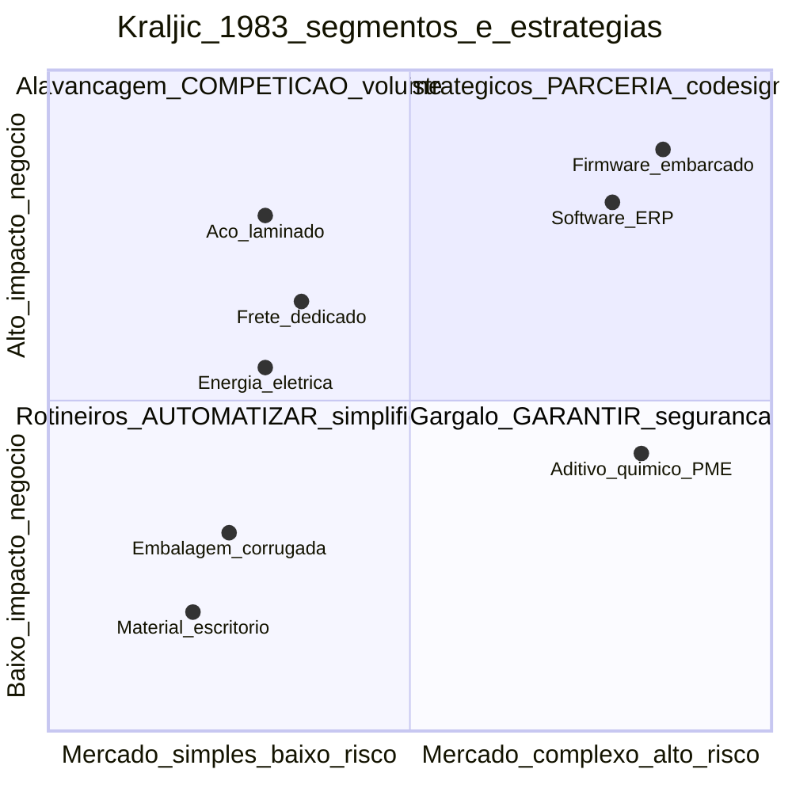
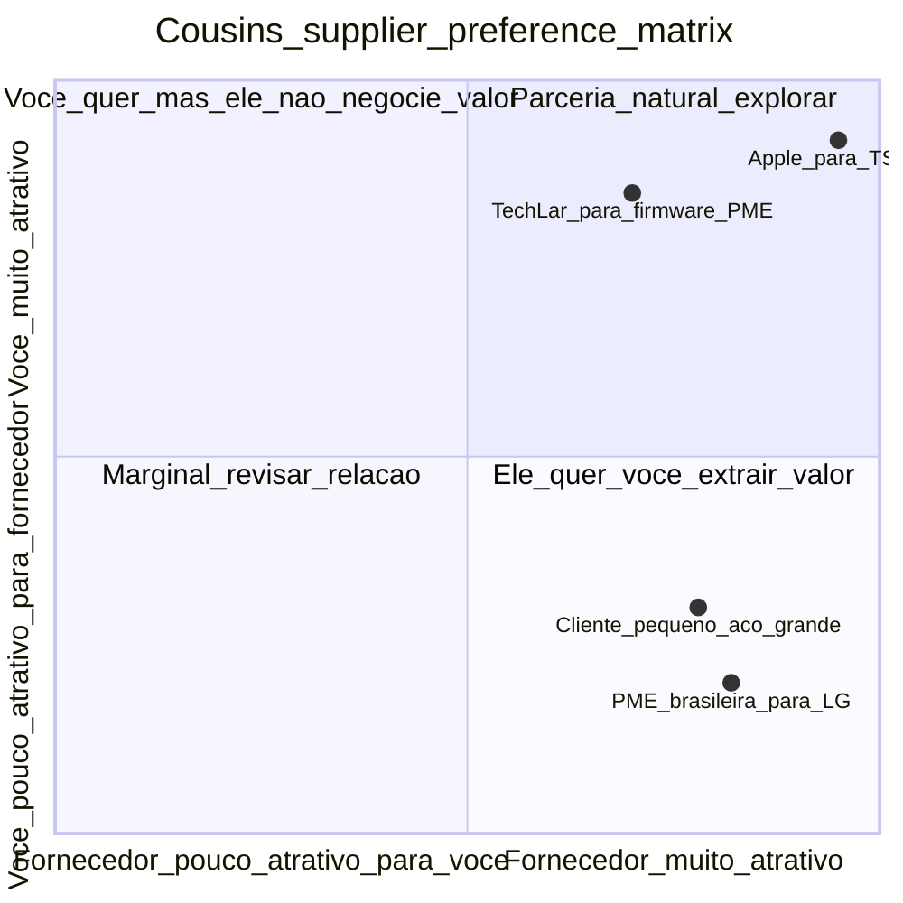
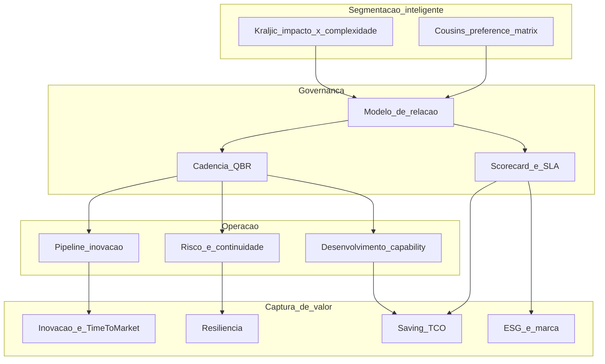

# Segmentação e modelos de relacionamento — nem todo fornecedor merece o mesmo abraço

**SRM (*Supplier Relationship Management*)** é a disciplina de **gerir o portfólio de fornecedores como ativo estratégico**: segmentar, dimensionar atenção, definir modelo de relação, governar performance e capturar inovação. Começa **sempre** por **segmentação**: fornecedores **estratégicos**, **alavancagem**, **rotineiros** e **gargalo** (Kraljic) — somados à dimensão complementar de **poder relativo** (sou cliente grande ou pequeno daquele fornecedor?, Cousins). Cada segmento merece **rituais**, **métricas**, **alocação de tempo executivo** e **modelo contratual** distintos. A matriz **Kraljic 1983** é o **mapa mental** clássico — usado **com dado**, não como quadrante decorado num *offsite* anual.

Esta aula entrega o **portfólio de relações** vivo, ligando **segmentação ↔ governança ↔ contrato ↔ scorecard ↔ QBR ↔ inovação**.

---

## Objetivos e resultado de aprendizagem

Ao final desta aula, você será capaz de:

- Posicionar fornecedores em **4 quadrantes Kraljic + matriz preferência Cousins** com critérios explícitos.
- Escolher **modelo de relacionamento** (transacional, colaborativo, parceria estratégica, *vested*) alinhado ao segmento.
- Calcular **alocação de tempo de SRM** por segmento (regra 80-20 invertida).
- Aplicar **Lambert framework** (8 processos SRM) e **Cousins** (poder relativo).
- Evitar **simpatia pessoal** como substituto de segmentação rigorosa.

**Duração sugerida:** 75 minutos. **Pré-requisitos:** módulo 2 deste conteúdo (Kraljic, TCO, ESG).

---

## Mapa do conteúdo

1. **SRM — definição** e por que é diferente de *Procurement*.
2. **Kraljic** + **Cousins (preference matrix)** — visão dupla.
3. **4 segmentos**, com **estratégias específicas** e **alocação de recursos**.
4. **Modelos de relação**: transacional, colaborativo, parceria, ***vested outsourcing***.
5. **Lambert framework** (8 processos SRM).
6. **Casamento corporativo**: contratos plurianuais com governança.
7. Casos: **Toyota Keiretsu**, **Apple Foxconn**, **P&G Open Innovation**.

---

## Gancho — a TechLar e o «fornecedor amigo»

Auditoria interna em janeiro de 2025 na TechLar revelou:

| Categoria | # fornecedores | % spend | Horas QBR/ano | Comentário |
|---|---|---|---|---|
| **Embalagem corrugada** (5 fornecedores qualificados, commodity) | 1 principal | 4% | **48 h** (mensal!) | dono da conta «adora» o vendedor desde 2014 |
| **Software ERP** (1 fornecedor único, custo R$ 1,2 mi/ano, parou empresa 2x) | 1 | 0,8% | 0 h | «sempre dá certo» |
| **Firmware embarcado** (1 fornecedor único, criticidade extrema, R$ 18 mi receita destravada) | 1 | 1,2% | **2 h** (e-mail) | engenheiro reclama, ninguém escala |
| **Frete dedicado** (3 transportadoras, multa SLA por trimestre) | 3 | 12% | 8 h | só QBR formal |
| **Energia elétrica** (CCEE livre, R$ 8 mi) | 2 | 4% | 1 h | conta automática |

**Diagnóstico:** atenção do SRM seguia **afeto histórico**, não **risco real**. O fornecedor de **embalagem** (commodity, plano B em 14 dias) absorvia **mais tempo executivo** que o **firmware** (sem alternativa, 9 meses para qualificar similar, paralisaria 30% da produção).

Quando o **firmware atrasou** em março/2025 (fornecedor problema interno), **não havia plano**, **não havia SLA**, **não havia escalação**, **não havia contrato** moderno (cláusula step-in/exit/MFN). A linha parou **9 dias**; multa cliente **R$ 2,3 mi**.

A **simpatia pessoal** tinha **substituído a segmentação** — erro estrutural #1 de SRM imaturo.

**Analogia da escola:** professor que gasta o **mesmo tempo** com aluno **autônomo de 9.0** e com aluno em **risco de evasão** — a turma inteira perde. Atenção é recurso **escasso**; rateio igualitário é **injustiça didática**.

**Analogia do casamento corporativo:** SRM é **portfólio de relações de longo prazo** — algumas viram **casamento de 30 anos com fé pública** (Toyota–Aisin), outras são *namoros táticos* (RFP anual com mesmo fornecedor), outras são *encontros casuais* via marketplace (commodity). Aplicar **mesma intensidade emocional** a todas é **caricatura**.

**Analogia do médico de família vs cirurgião eventual:** você visita o clínico geral 4×/ano para acompanhar pressão e colesterol; ao cirurgião só vai em emergência ou cirurgia eletiva — porém com **dossiê completo** preparado, anestesia certa, equipe coordenada. Cada um tem ritual e profundidade próprios.

---

## Conceito-núcleo

### Segmentação dupla — Kraljic + Cousins

**Eixo Kraljic 1 — impacto no negócio:** parada de linha, receita protegida, inovação destravada, marca, segurança.
**Eixo Kraljic 2 — complexidade/risco mercado:** poucos fornecedores, tecnologia volátil, *switching cost* alto, qualificação longa.



**Estratégias por quadrante:**

| Quadrante | Foco | Modelo de relação | Cadência QBR | % atenção/tempo SRM | Contratos |
|---|---|---|---|---|---|
| **Estratégicos** | inovação, *time-to-market*, exclusividade | **Parceria estratégica**, *open book*, *gain-share*, *vested* | **Mensal + steering trimestral** | 50–60% | Plurianual 3–7 anos, *exit* longo |
| **Alavancagem** | TCO, saving, capacidade | **Colaborativo competitivo**, RFP anual ou bianual, *benchmark* | Trimestral | 20–25% | Anual ou 2 anos, fáceis sair |
| **Rotineiros** | eficiência transacional | **Transacional**, marketplace, P-Card, *self-service* | Semestral ou anual (catálogo) | 5–10% | Catálogo automático |
| **Gargalo** | continuidade de fornecimento | **Asseguramento**, contratos take-or-pay, estoque estratégico | Mensal (P) ou bimestral | 15–20% | Médio prazo + cláusula step-in |

### Matriz de preferência (Cousins) — eu para o fornecedor

Pergunta crítica: **«eu sou cliente atrativo para esse fornecedor?»**. Determina o **poder relativo** real.



**Implicação chave:** se você é **pouco atrativo** para fornecedor estratégico (quadrante 2), parceria *com* ele é **ilusão** — vai pagar caro para receber pouco. Solução: agregar volume com pares (compra coletiva), mudar tecnologia (sair da dependência), ou aceitar e mitigar.

### Alocação de tempo SRM — regra 60-25-10-5 (heurística pedagógica)

| Segmento | % spend típico | % tempo SRM ideal | Reversão clássica TechLar |
|---|---|---|---|
| Estratégicos | 25–35% | 50–60% | TechLar dava 12% (firmware esquecido) |
| Alavancagem | 35–50% | 20–25% | TechLar dava 35% (saving micromanagement) |
| Rotineiros | 15–25% | 5–10% | TechLar dava 30% (afeto histórico) |
| Gargalo | 5–15% | 15–20% | TechLar dava 5% |

### Modelos de relação (Cousins / Lambert)

| Modelo | Característica | Investimento mútuo | Quando usar |
|---|---|---|---|
| **Transacional** | preço/SLA, intercambiável, marketplace | nenhum | rotineiros, commodity |
| **Colaborativo (arm's length plus)** | troca dados, reuniões periódicas, melhoria incremental | baixo | alavancagem, parte gargalo |
| **Parceria estratégica** | *roadmap* compartilhado, *open book*, IP conjunto | médio-alto | estratégicos top 5–15 |
| ***Vested outsourcing*** (Vitasek)** | *outcome-based*, *gain-share*, missão compartilhada (P&G–Jones Lang LaSalle) | alto | parceria madura plurianual |
| ***Joint venture***  | entidade jurídica nova | máximo | core capability terceirizada |

### **Lambert framework** — 8 processos SRM (visão integrada)

Dr. Doug Lambert (Ohio State, *Global Supply Chain Forum*) define **8 processos** que conectam SRM ao restante da empresa:

```
1. Customer Relationship Management (CRM)        — outro lado
2. Supplier Relationship Management (SRM)        — núcleo desta aula
3. Customer Service Management
4. Demand Management
5. Order Fulfillment
6. Manufacturing Flow Management
7. Product Development & Commercialization        — onde co-design entra
8. Returns Management                              — onde reverso aparece
```

SRM **não é silo de compras** — toca CRM, *order fulfillment*, *product development*. Maturidade SRM = capacidade de orquestrar **interfaces multifuncionais**.

---

## Frameworks-chave

### 1. **Kraljic, P. (1983)** — segmentação clássica.

### 2. **Cousins, P. (1999, 2008)** — *supplier preference matrix*, *strategic supply wheel*.

### 3. **Lambert, D.** — *Supply Chain Management: Processes, Partnerships, Performance* (Global SCF).

### 4. **Vitasek, K. (Tennessee)** — ***Vested Outsourcing***: *outcome-based* + *gain-share*.

### 5. **Lamming, R.** — *Beyond Partnership* (relação adulta ≠ subordinação).

### 6. **Bensaou, M. (1999)** — *Portfolios of Buyer-Supplier Relationships*: matriz investimento específico mútuo.

### 7. **Toyota Keiretsu** — caso seminal de **rede de parceria de longo prazo** com *target costing* e *kaizen* compartilhado.

### 8. **Apple-Foxconn / Apple-TSMC** — *exclusivity windows* + investimento em capacidade do fornecedor + *open book*.

### 9. **P&G Connect+Develop / Open Innovation** — fornecedor como **fonte de inovação externa**.

---

## Diagrama / Modelo principal — sistema SRM integrado



**Legenda:** SRM começa em **segmentação inteligente** (não afeto), define **governança específica** (modelo, cadência, métricas), opera em **três frentes** (inovação, risco, capability) e captura **4 famílias de valor**. Sem segmentação, todo o sistema cai.

---

## Aprofundamentos — variações setoriais e geográficas

### Brasil

- ***Mid-market BR***: SRM ainda imaturo; SUM (Spend Under Management) <30% típico; **EcoVadis** começando a entrar como gate para vender a multinacionais EU.
- **Cultura relacional BR** favorece SRM (analogia ao «jeitinho» — tem que **virar processo**, não cair em pessoalismo).
- **Reforma Tributária 2026–2033**: muda economia de fornecedores estaduais → segmentação precisa **revisão a cada 12m** durante transição.

### Indústria automotiva

- **Keiretsu Toyota** (anos 1950+): rede de parceria de décadas com sub-tier transparente, *target costing*, *kaizen* compartilhado. Replicável em **escala**, não em **PMEs típicas**.
- ***Tier-1, tier-2, tier-3*** explicitados; *consórcio modular* (caso VW Resende anos 1990) é evolução BR.

### Tecnologia / Big Tech

- **Apple-TSMC**: *exclusivity window* de 18 meses para nodes 3nm/2nm; investimento em capacidade do fornecedor (US$ bilhões); transparência operacional total.
- **Apple-Foxconn**: *open book*, *price down* anual programado, *target margin* explícito.

### Varejo

- **Walmart** (anos 1990–2000): pioneiro em **EDI mandatório**, *vendor managed inventory* (VMI), *category captain*.
- **P&G–Walmart**: parceria de cadeia integrada (P&G repõe estoque automaticamente em hub Walmart) — caso seminal.

### Casos célebres adicionais

- **P&G Connect+Develop**: 50%+ inovação vem de fora; fornecedores estratégicos contribuem com IP via portal aberto.
- **Tesla**: ***vertical integration agressiva*** + relação contratual rígida com tier-1; oposto do Toyota Keiretsu — modelo vertical.

---

## Trade-offs estratégicos

| Decisão | A favor | Contra |
|---|---|---|
| Parceria profunda | inovação, *time-to-market*, exclusividade | tempo executivo, risco de cegueira a alternativas, *lock-in* |
| Competição agressiva | saving curto prazo, ágil | erode inovação em categoria que precisa co-design |
| Mais fornecedores estratégicos | diversificação | diluição de tempo executivo, sem profundidade |
| ***Open book*** com fornecedor estratégico | confiança, dado real, *should-cost* validado | revela margem da própria empresa (reciprocidade) |
| ***Vested outsourcing*** *outcome-based* | alinhamento total | exige métrica robusta + relação madura |
| **Segmentação anual** | estabilidade, planejável | mercado mudou no Q2 e ninguém percebeu |

---

## Caso prático — TechLar reorganiza SRM em 12 meses

**Diagnóstico (mês 0):** atenção desalinhada, sem cobertura de risco, sem inovação capturada via fornecedor.

**Ações:**

| Onda | Ação | Resultado em 12 meses |
|---|---|---|
| **0–2m** | Re-segmentação Kraljic + Cousins de **top 50** fornecedores; **dossiê** por segmento | Mapa real do portfólio |
| **2–4m** | Reduz visitas mensais embalagem (rotineiro) para anuais; libera **40 h** de category manager | Redirecionamento de tempo |
| **2–4m** | **Mensaliza** firmware (estratégico) + escalada formal + auditoria contratual | Mitigação de risco crítico |
| **4–8m** | Implanta **scorecard** ESG + qualidade + SLA em top 12 estratégicos | Visão objetiva |
| **6–12m** | Estrutura **2 parcerias *vested*** com fornecedores top (firmware + frete dedicado prioritário) — *gain-share* sobre saving compartilhado | R$ 2,4 mi inovação, R$ 0,9 mi saving |
| **Permanente** | QBR formal trimestral top 30; mensal top 10; *steering* com C-level semestral em top 5 | Cadência viva |

---

## Erros comuns e armadilhas

1. **Kraljic feito num offsite** e **nunca atualizado** — segmentação morre em 12 meses.
2. **Confundir jantar com governança** de parceria — relacionamento sem dado é teatro.
3. **«Todos são parceiros»**: se 30 fornecedores são «estratégicos», ninguém é. Top 5–10 reais.
4. **PME estratégica tratada como commodity** porque faturamento é baixo — pode ter **única tecnologia/IP** crítico.
5. **Dependência emocional** de comprador antigo de relação — política de **rotação** ou *job rotation* mitiga.
6. **Cousins não considerado**: «sou estratégico para o fornecedor?» se você é 0,3% da receita dele e exige 30% do tempo, **não é**.
7. **Confundir *vested* com terceirização clássica**: *vested* exige métricas *outcome-based* e maturidade — não é só renomear contrato.
8. **Segmentação centralizada sem input local**: fica desconectada do *gemba*.

---

## Risco e governança

- **Política anti-conflito de interesse**: declaração anual; rotação de comprador estratégico a cada 4–6 anos.
- ***Vendor master*** com hierarquia (matriz–controlada–subsidiária) — risco *single source* invisível em ERP que duplica CNPJ.
- **Confidencialidade**: *open book* exige NDA mútuo robusto; saída do comprador → portabilidade do dado controlada.
- ***Lock-in* técnico**: *parceria* sem cláusula *exit* + IP mal definido vira **dependência crônica**.
- **Sucessão no fornecedor**: PME estratégica com risco geracional → planejar transição.

---

## KPIs estratégicos

| KPI | Pergunta | Dono | Fonte | Cadência | Playbook |
|---|---|---|---|---|---|
| ***Cobertura segmentação*** (% spend mapeado em quadrante) | base existe? | CPO | Spend cube + SRM | Trimestral | Categorizar tail |
| ***Time allocation alignment*** (% horas SRM em estratégicos) | alocação correta? | CPO | Time tracking SRM | Semestral | Realocar; treinar; cortar reuniões inúteis |
| ***Plano B documentado/testado*** em estratégicos+gargalo | resiliência | Category Mgr | SRM | Trimestral | Mesa simulação |
| ***Innovation pipeline*** via fornecedores estratégicos (R$ ou n) | inovação capturada? | CTO + CPO | SRM | Trimestral | QBR formal com pauta inovação |
| ***Saving estratégico vs commodity*** | onde valor é gerado? | CFO + CPO | ERP | Trimestral | Reorientar foco |
| ***Supplier engagement score*** (NPS fornecedor para você como cliente) | Cousins quadrante? | CPO | Survey anual | Anual | Programa de melhoria de atratividade |
| ***Turnover** de fornecedores estratégicos (eventos/ano)* | estabilidade da parceria | CPO | SRM | Anual | Pós-mortem das saídas |
| ***Tempo médio de qualificação* alternativa (dias)** | velocidade de troca | Category Mgr | SRM | Anual | Reduzir tempo via *pre-qualified pool* |

---

## Tecnologias e ferramentas habilitadoras

- **SRM dedicado**: **SAP Ariba Supplier Lifecycle and Performance (SLP)**, **Coupa Supplier Management**, **Jaggaer Supplier Management**, **GEP SMART SRM**, **Ivalua**, **HICX** (líder em complex supplier data).
- ***Supplier portal***: **OpenText**, **Tradeshift**, **Coupa Supplier Network**, **SAP Business Network**.
- ***Performance management***: **EcoVadis** (ESG ratings), **Sedex** (SMETA audit), **EMC2** (industry-specific).
- ***Innovation portals***: **Yet2.com**, **Vendorflow**, **InnoCentive** (para *open innovation* tipo P&G C+D).
- ***Contract Lifecycle (CLM)***: **Icertis**, **DocuSign CLM**, **SirionLabs**, **Conga CLM**.
- ***Vested* / *outcome-based* design***: **Tennessee Vested Center** (consultoria + framework).
- ***Spend visibility***: **Sievo**, **Coupa Spend Insights**, **GEP Smart Spend**.

---

## Glossário rápido

- **SRM**: *Supplier Relationship Management*.
- **Kraljic**: matriz impacto × complexidade (1983).
- **Cousins preference matrix**: poder relativo / atratividade mútua.
- **Vested**: modelo *outcome-based* (Vitasek/Tennessee).
- **Keiretsu**: rede japonesa de parceiros de longo prazo (Toyota).
- **Open book**: transparência total de custos/margens.
- **Gain-share**: divisão de saving conjunto.
- **VMI**: Vendor Managed Inventory.
- **NPS fornecedor**: *Net Promoter Score* aplicado ao fornecedor sobre você como cliente.
- **Tier-1/2/3**: níveis na cadeia de fornecimento.
- **MFN**: Most Favored Nation (cláusula).

---

## Aplicação — exercícios

**Exercício 1 (20 min) — Segmentação dupla.** Liste **8 fornecedores** (reais ou TechLar). Para cada, atribua: (a) Kraljic quadrante; (b) Cousins quadrante (você é atrativo?); (c) modelo de relação (transacional/colaborativo/parceria/vested); (d) cadência QBR.

**Gabarito:** todos «estratégicos» = falha de discriminação; todos no Cousins quadrante 1 = autoengano; modelo deve refletir **ambas** segmentações.

**Exercício 2 (15 min) — Realocação de tempo.** Para sua função SRM atual (real ou TechLar), some horas/ano por fornecedor. Calcule % atual em estratégicos vs ideal (50–60%). Cite **3 reuniões** que você cortaria e **3 fornecedores** que receberiam o tempo liberado.

**Gabarito:** corte deve incluir **reunião commodity mensal** que poderia ser anual; expansão em estratégicos esquecidos com mais risco.

**Exercício 3 (15 min) — Vested ou parceria comum?** Escolha **um fornecedor top**. Há **mensuração outcome** confiável? Há **gain-share** matemático possível? Qual *exit clause* protegeria ambos? Decida se *vested* faz sentido ou não.

**Exercício 4 (10 min) — Caso Toyota–Aisin.** Pesquise (5 min) o caso de **incêndio Aisin 1997** (incêndio na fábrica de válvulas de freio Aisin paralisou Toyota). O que **rede Keiretsu** fez em 5 dias? O que **isso ensina** para SRM moderno?

---

## Pergunta de reflexão

Qual fornecedor seu hoje **consome atenção desproporcional ao risco real** — e qual fornecedor **deveria estar no seu radar** mas você sequer lembra do nome do contato dele?

---

## Fechamento — takeaways

1. SRM é **priorização** — tempo executivo é o **recurso mais escasso**.
2. **Quadrante manda postura**; **contrato e dado** mandam execução.
3. **Cousins preference matrix** evita parceria-ilusão (você não é atrativo o suficiente).
4. **Parceria é rara**: top 5–15 reais. Se todos são parceiros, ninguém é.
5. ***Vested outsourcing*** e ***open book*** são fronteiras de SRM maduro — mas **exigem maturidade** e métrica robusta.
6. **Lambert framework** lembra que SRM **não é silo de compras** — toca produto, atendimento, retorno.

---

## Referências

1. KRALJIC, P. *Purchasing must become supply management*. *HBR*, 1983.
2. COUSINS, P. D. *A conceptual model for managing long-term inter-organisational relationships*. *European Journal of Purchasing & Supply Management*, 2002.
3. COUSINS, P.; LAMMING, R.; LAWSON, B.; SQUIRE, B. *Strategic Supply Management*. Pearson, 2008.
4. LAMBERT, D. M. *Supply Chain Management: Processes, Partnerships, Performance*. 4ª ed., SCMI, 2014.
5. GELDERMAN, C. J.; VAN WEELE, A. *Strategic direction through purchasing portfolio management*. *JPSM*, 2003.
6. VITASEK, K. *Vested Outsourcing: Five Rules That Will Transform Outsourcing*. Palgrave Macmillan, 2010.
7. BENSAOU, M. *Portfolios of Buyer–Supplier Relationships*. *Sloan Management Review*, 1999.
8. LAMMING, R. *Beyond Partnership: Strategies for Innovation and Lean Supply*. Prentice Hall, 1993.
9. NISHIGUCHI, T. *Strategic Industrial Sourcing: The Japanese Advantage*. Oxford, 1994 — *keiretsu*.
10. LIKER, J. *The Toyota Way*. McGraw-Hill, 2004.
11. CHESBROUGH, H. *Open Innovation*. HBS, 2003 — caso P&G Connect+Develop.
12. ASCM, CSCMP, CIPS — body of knowledge SRM.

---

**Ponte:** [Strategic Sourcing](../modulo-02-procurement-strategic-sourcing/README.md); [Integração na cadeia](../../trilha-fundamentos-e-estrategia/modulo-02-supply-chain-management/aula-02-integracao-colaboracao-cadeia.md); próxima aula deste módulo entra em **SLAs, scorecards e QBR** — o **artesanato técnico** da governança SRM.
