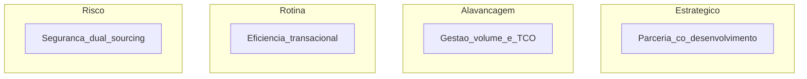

# Segmentação e modelos de relacionamento — nem todo fornecedor merece o mesmo abraço

**SRM (*Supplier Relationship Management*)** começa por **segmentar**: fornecedores **estratégicos**, **críticos**, **commodity** e **problemáticos** exigem **rituais**, **métricas** e **alocação de tempo** diferentes. A matriz **Kraljic** (impacto no negócio × complexidade de mercado) é **mapa mental** clássico — usar com **dados**, não como quadrante decorado.

---

## Objetivos e resultado de aprendizagem

**Ao final desta aula**, você será capaz de:

- Posicionar fornecedores em **quadrantes** com critérios explícitos.  
- Escolher **modelo de relacionamento** (competitivo, colaborativo, parceria de desenvolvimento) alinhado ao segmento.  
- Evitar **simpatia pessoal** como substituto de segmentação.

**Duração sugerida:** 60–75 minutos.

---

## Gancho — a TechLar e o «fornecedor amigo»

A **TechLar** dedicava **horas de QBR** a um fornecedor de **commodity** com **cinco** concorrentes qualificados — enquanto o **fornecedor único** de firmware recebia **e-mail esporádico**. Quando o firmware atrasou, não havia **plano**, **SLA** nem **escalação**. A **atenção** seguia **afeto**, não **risco**.

**Analogia da escola:** professor que gasta o mesmo tempo com aluno **autônomo** e com aluno em **risco de evasão** — a turma inteira perde.

---

## Mapa do conteúdo

- Kraljic em **literacia** (não certificação).  
- Segmentos e **política** de gestão (frequência, profundidade, dados).  
- Relacionamento **competitivo** *versus* **colaborativo**.  
- Armadilhas de **parceria** vazia.

---

## Conceito núcleo

**Eixo 1 — impacto no negócio:** parada de linha, receita, inovação, segurança, marca.  
**Eixo 2 — complexidade/risco de mercado:** poucos fornecedores, tecnologia volátil, entrada/saída cara.

**Legenda:** quadrantes **pedagógicos** simplificados; nomes variam na literatura — alinhar com o **glossário** interno da empresa. Setas de *impacto* e *complexidade* são **implícitas** (treinador desenha eixos no quadro).

**Modelos de relacionamento (*consenso de mercado*):**

- **Competitivo:** múltiplas fontes, foco em preço/TCO e conformidade.  
- **Colaborativo:** integração de planejamento, melhoria contínua conjunta.  
- **Parceria estratégica:** investimento mútuo, risco compartilhado, IP e governança **explícitos** — **poucos** fornecedores merecem.

**Mini-caso:** fornecedor em quadrante **estratégico** sem **acordo** de confidencialidade e **roadmap** conjunto — «parceria» só no discurso.

---

## Trade-offs

- **Parceria** profunda consome **tempo** de *executives*; mal aplicada, **cega** a alternativas.  
- **Competição** agressiva **erode** inovação em categorias que precisam de **co-design**.  
- Segmentação **estática** ignora que mercado **mudou** — revisão anual mínima.

---

## Aplicação — exercício

Liste **seis** fornecedores (reais ou fictícios). Para cada um, marque **H/M/L** em **impacto** e em **complexidade de mercado**. Escolha **dois** e defina: **frequência** de revisão (mensal, trimestral, anual) e **modelo** de relacionamento em **uma frase** cada.

**Gabarito pedagógico:** commodity com muitos players → **rotina** + revisão **anual** ou semestral; único fornecedor crítico → **risco/estratégico** + revisão **mensal** ou **quinzenal** com métricas; se todos forem «estratégicos», falta **discriminação**.

---

## Erros comuns e armadilhas

- **Kraljic** feito uma vez em **offsite** e nunca atualizado.  
- Confundir **jantar** com **governança** de parceria.  
- Tratar **PME estratégica** como commodity só porque o faturamento é baixo — pode ser **única** tecnologia.

---

## KPIs e decisão

- **Cobertura** de fornecedores críticos com **plano B** documentado.  
- **Horas** de gestão por segmento (sanidade de alocação).  
- **Inovação** entregue por fornecedores estratégicos (*pipeline*).  
- **Incidentes** e tempo de recuperação por segmento.

---

## Fechamento — três takeaways

1. SRM é **priorização** — tempo é recurso escasso.  
2. Quadrante manda **postura**; contrato e **dados** mandam **execução**.  
3. Parceria é **rara** — se todos são parceiros, ninguém é.

**Pergunta de reflexão:** qual fornecedor hoje consome **atenção** desproporcional ao **risco real**?

---

## Referências

1. KRALJIC, P. *Purchasing must become supply management*. *HBR*, 1983.  
2. GELDERMAN, C. J.; VAN WEELE, A. *Strategic direction through purchasing portfolio management*. *Journal of Purchasing and Supply Management* — evoluções da matriz.  
3. ASCM — *supplier relationship* e colaboração — [ascm.org](https://www.ascm.org/).

**Ponte:** [Strategic Sourcing](../modulo-02-procurement-strategic-sourcing/README.md); [Integração na cadeia](../../trilha-fundamentos-e-estrategia/modulo-02-supply-chain-management/aula-02-integracao-colaboracao-cadeia.md).
