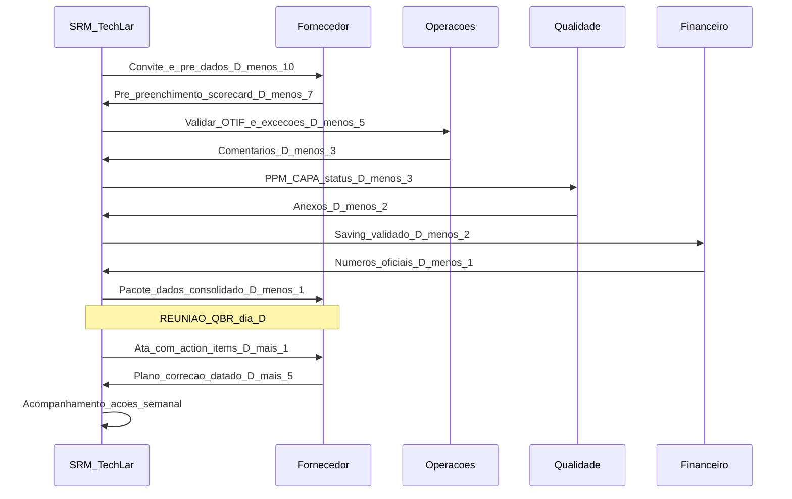
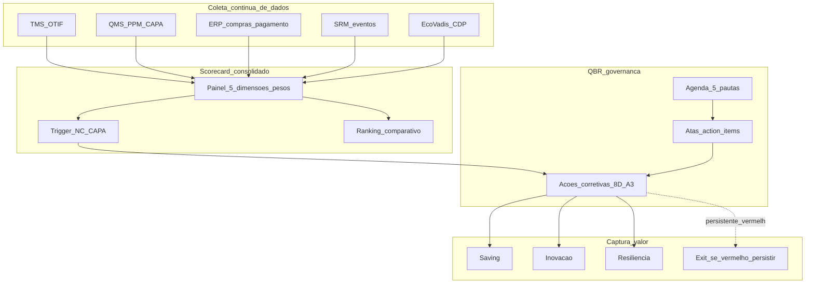

# SLAs, scorecards e QBR — amor mensurável (e revisão que não vira teatro)

**SLA (*Service Level Agreement*)** é a tradução de **expectativa em métrica auditável**: define **escopo**, **métrica**, **alvo (target)**, **medição** (fonte e fórmula), **janela de medição**, **exceções legítimas**, **escalação** e **consequência** (operacional ou comercial). **Scorecard** consolida poucos KPIs em **painel acionável** (5–8 KPIs com **pesos**, donos, fontes, *targets* e **trigger** de NC). **QBR (*Quarterly Business Review*)** é o **ritual** de governança: alinhar performance, decidir ação corretiva, capturar inovação e antecipar risco — se não houver **dado validado** + **decisão registrada**, vira **slide bonito sem efeito**.

Esta aula entrega o **artesanato técnico**: como escrever SLA que não vaza no jurídico, como montar scorecard com **pesos** e **NC/CAPA**, e como rodar QBR com **5 pautas obrigatórias** que produzem **decisão**.

---

## Objetivos e resultado de aprendizagem

Ao final desta aula, você será capaz de:

- Escrever **SLA** com 7 elementos obrigatórios (escopo, métrica, alvo, medição, janela, exclusão, consequência).
- Montar **scorecard** com 5–8 KPIs ponderados, *targets* e *trigger* de NC/CAPA.
- Estruturar **QBR** com **agenda de 5 pautas obrigatórias** + saídas (atas com *action items*).
- Distinguir **OTIF**, **OTD**, **OTIF-D**, **OTIF-X** e suas armadilhas de definição.
- Implementar **NC/CAPA** (8D ou A3) ligado ao scorecard.
- Aplicar **Service Credits** e **Earn-back** sem virar litígio.

**Duração sugerida:** 75 minutos. **Pré-requisitos:** aula 3.1 (segmentação SRM).

---

## Mapa do conteúdo

1. **SLA com 7 elementos** + redação técnica.
2. **Scorecard 5+1** (4 dimensões clássicas + ESG/inovação opcional).
3. **NC/CAPA** com **8D** (Ford 8D) ou **A3** (Toyota).
4. **QBR — 5 pautas obrigatórias** + papéis + cadência.
5. **Service Credits**, **Earn-back**, **Multas** — desenho contratual.
6. ***Joint Business Plan* (JBP)** — para parceria estratégica.
7. **Casos**: ITIL/SLA digital, Walmart-P&G CPFR, Toyota *kaizen* QBR.

---

## Gancho — o QBR da TechLar sem decisão

A **TechLar** rodava QBR trimestral com a transportadora dedicada **«TransRota»** (R$ 14 mi/ano em frete). Estrutura típica:

| Elemento QBR TechLar 2024 | Realidade |
|---|---|
| Duração | 90 minutos |
| Slides | **32** |
| Apresentador | TransRota (94% do tempo de fala) |
| Dados validados pré-reunião? | NÃO (TechLar via os números pela 1ª vez) |
| Comparação SLA × realizado | sem método: «OTIF foi bom» |
| Definição OTIF documentada | **3 versões diferentes** circulando |
| **Action items** registrados | 1 (genérico) |
| *Owner* + data nos itens | NÃO |
| Multa contratual aplicada | nenhuma (havia 4 trimestres de NC) |
| Próximo QBR | agendado em e-mail genérico |

Em **4 trimestres consecutivos** o **mesmo padrão de atraso no Nordeste** apareceu. A transportadora elogiava-se, compras elogiava de volta, ninguém aplicava multa nem decidia projeto de **integração de track & trace** (ferramenta existia mas não estava integrada). Era **relatório**, não **governança**.

**Diagnóstico do auditor externo:** TechLar tinha **SLA mal escrito** (definição de «no prazo» ambígua → 3 interpretações), **scorecard inflado** (15 KPIs → ninguém sabe ranking de prioridade), **QBR como teatro** (sem dado validado, sem decisão).

**Analogia da consulta médica anual com exames laudados:** chegar com **PA, exames, lista de medicamentos**, *aderência ao tratamento*, *eventos do trimestre* — médico **diagnostica**, **prescreve mudanças**, **agenda retorno**. Sem isso, é cafezinho com paciente, não consulta.

**Analogia do casal em terapia:** sessão produtiva tem **agenda**, **fatos** ("essa semana você não chegou em casa antes das 23h em 3 dias úteis"), **acordo** ("amanhã às 19h vamos jantar fora") e **revisão na semana seguinte**. Sem isso é **desabafo**, não terapia. Mesmo princípio para QBR fornecedor estratégico.

**Analogia do hospital com indicadores ANS:** plano de saúde mede *tempo de espera*, *cancelamentos*, *internação evitada*. Operadora medíocre apresenta «atendemos 120 mil consultas». **Contagem ≠ qualidade**. Scorecard maduro mede **outcome**, não atividade.

---

## Conceito-núcleo

### SLA — anatomia de 7 elementos

| Elemento | Pergunta | Exemplo bem-redigido |
|---|---|---|
| **Escopo** | que serviço/produto exatamente? | «Coleta e entrega rodoviária FTL ponto-a-ponto entre CD Itupeva e clientes Nordeste (lista anexa)» |
| **Métrica** | o que medimos? | «OTIF-D» = entrega no prazo acordado **na data exata do agendamento** **em quantidade integral** (sem split) |
| **Alvo (target)** | quanto? | 95% medido mensalmente; *trigger* NC abaixo de 92% |
| **Medição (fonte + fórmula)** | como medimos? | Sistema TMS Y; fórmula: pedidos OTIF / total pedidos elegíveis no período |
| **Janela** | em qual período? | Mês calendário, considerando data de entrega prometida pelo OMS |
| **Exclusões** | o que não conta? | *Force majeure* declarado, atraso por causa exclusiva do remetente (ASN incorreto), evento climático CAT-3 federal |
| **Consequência (Service Credit / multa)** | o que acontece se descumprir? | 92–94,9%: 5% *service credit* sobre fatura; <92%: 10% + plano CAPA mandatório; <85% por 2 meses consecutivos = direito de rescisão sem ônus |

**Erros típicos de SLA brasileiro:**

- «Entregar rapidamente» — não é métrica, é desejo.
- OTIF sem definição de «no prazo» (data prometida? data agendada? data revisada?).
- Sem janela de medição (cliente mede mês cheio; fornecedor mede dias úteis).
- Sem exclusões — vira batalha jurídica em cada incidente.
- Multa **alta** sem mecanismo prático de aplicação (vira «teatro contratual»).
- Sem ***earn-back*** (mecanismo de recuperação) — fornecedor desiste se cair em vermelho.

### **Scorecard — modelo 5+1**

| Dimensão | KPI clássico | Peso típico | Fonte |
|---|---|---|---|
| **Qualidade** | PPM, *FPY (First Pass Yield)*, *Cpk* | 25% | QMS, recebimento |
| **Entrega** | OTIF-D, lead time aderência, *fill rate* | 25% | TMS, OMS |
| **Custo / TCO** | aderência preço-índice, saving entregue, *should-cost gap* | 20% | ERP |
| **Responsividade** | tempo resposta P1/P2, *MTTR* incidente, *Q&A* RFP | 15% | tickets, SRM |
| **Sustentabilidade / ESG** | EcoVadis score, CDP, NC trabalhistas | 10% | EcoVadis, audit |
| **Inovação (+1)** | projetos co-design, ideias submetidas, IP gerado | 5% | SRM + R&D |

**Boas práticas:**

- **Trigger de NC/CAPA** explícito por KPI.
- **Score consolidado** (média ponderada) classifica fornecedor: **Verde (≥85)**, **Amarelo (70–84)**, **Vermelho (<70)**.
- **Ranking comparativo** entre fornecedores da mesma categoria (motivacional).
- **Trend (3–4 trimestres)**, não só foto pontual.

### **NC/CAPA — fluxo 8D (Ford 8 Disciplines)**

```mermaid
flowchart LR
  D1[D1_Time]
  D2[D2_Descrever_problema_5W2H]
  D3[D3_Containment_imediato]
  D4[D4_Causa_raiz_Ishikawa_5_Por_que]
  D5[D5_Acao_corretiva_AC]
  D6[D6_Implementar_AC_e_validar]
  D7[D7_Acao_preventiva_AP_e_lessons]
  D8[D8_Reconhecer_time_e_fechar]
  D1 --> D2 --> D3 --> D4 --> D5 --> D6 --> D7 --> D8
```



**Para PME/pedidos menores:** **A3 Toyota** (1 página A3 com problema, fundo, análise, ação, plano) é alternativa **mais leve**.

### **QBR — agenda de 5 pautas obrigatórias** + papéis

```
1. PERFORMANCE — scorecard vs SLA, trend 4 trimestres
   - Quem fala: SRM (não fornecedor!), com dados pré-validados
   - Saída: NC abertas? CAPA andando?

2. INCIDENTES & CAPA — análise raiz, status ações
   - Quem fala: Qualidade + fornecedor
   - Saída: % CAPA on-time, lições

3. INICIATIVAS DE VALOR — saving, melhoria, sustentabilidade
   - Quem fala: ambos lados em pauta conjunta
   - Saída: projetos com gates

4. RISCOS & CONTINUIDADE — capacidade, geopolítica, dependência
   - Quem fala: SRM + risco + fornecedor
   - Saída: planos B testados? Mesa simulação agendada?

5. INOVAÇÃO & ROADMAP — pipeline, IP, codesign (se estratégico)
   - Quem fala: R&D + fornecedor
   - Saída: gate decision em 90 dias

— DECISÕES E AÇÕES (10 min finais)
   - Cada item: O QUE, QUEM, ATÉ QUANDO, CRITÉRIO DE FECHO
   - Ata enviada em D+1 com confirmação
   - Próximo QBR agendado
```

### Cadência por segmento

| Segmento | QBR formal | Steering C-level | Operacional |
|---|---|---|---|
| Estratégico top 5 | Mensal | Trimestral | Semanal |
| Estratégico/Gargalo | Trimestral | Semestral | Mensal |
| Alavancagem | Trimestral | Anual | Mensal |
| Rotineiro | Anual ou bianual | n/a | Por exceção |

### Sequência QBR — fluxo informacional



**Legenda:** **dado validado** chega à reunião pré-aprovado por **operações + qualidade + finanças** — fornecedor não pode contestar a métrica na reunião (já contestou pré). Reunião foca em **decisão**, não disputa de número.

---

## Frameworks-chave

### 1. **OGSM** (*Objectives, Goals, Strategies, Measures*) aplicado ao scorecard de fornecedor

### 2. **Joint Business Plan (JBP)** — Walmart, P&G

Plano conjunto comprador-fornecedor com **objetivos compartilhados** (saving, inovação, sustentabilidade) e **gates trimestrais**.

### 3. **CPFR** (*Collaborative Planning, Forecasting, and Replenishment*) — VICS

Para fornecedores estratégicos, integrar **planejamento de demanda** + **estoque** + **reposição** num plano único.

### 4. **8D Ford** + **A3 Toyota** — análise raiz

### 5. **ITIL v4 — SLA, OLA, UC**

ITIL distingue **SLA** (cliente externo), **OLA** (interno entre áreas) e **UC** (*Underpinning Contract* com fornecedor) — vocabulário útil em logística complexa.

### 6. **Service Credits + Earn-back design** (telco / SaaS)

Mecanismo: fornecedor paga *credit* quando descumpre, mas pode **recuperar** parte ao manter performance acima de target por X meses.

### 7. **Kaplan-Norton Balanced Scorecard** aplicado a fornecedor

4 perspectivas (financeira, cliente, processo interno, aprendizado) — dá robustez ao scorecard.

---

## Diagrama / Modelo principal — sistema scorecard + QBR + CAPA integrado



**Legenda:** scorecard **automatizado** ↔ QBR **estruturado** ↔ CAPA **rastreado** = sistema vivo. Sem CAPA fechado, scorecard cai; sem ata, decisão evapora; sem dado validado, scorecard mente.

---

## Aprofundamentos — variações setoriais

### Telecom / TI

ITIL maturidade alta; SLA com **5 nove**s (99,999% uptime); *service credits* automatizados.

### Logística

OTIF mais comum, mas *fragmentação* de definição. Padrão emergente: **OTIF-D** (no dia exato), **OTIF-X** (com tolerância ±X horas).

### Indústria automotiva

PPM rigoroso (alvo <50 ppm para tier-1 estratégico); **APQP/PPAP** integrados; *kaizen* como CAPA contínuo.

### Varejo

Walmart **OTIF 95%** rigoroso, com multa por *under-* e por *over-shipment* (estoque indesejado também penaliza).

### Saúde

ANVISA exige *traceability* + *adverse event reporting*; SLA inclui **rastreabilidade lote** e **prazo notificação**.

### Brasil

Cultura **conflito-aversa** dificulta aplicação de multa — prática típica é **multa nominal alta + aplicação rara** = sinal fraco. Maturidade exige **service credit aplicado** mesmo simbolicamente, com **earn-back** facilitador.

---

## Trade-offs estratégicos

| Decisão | A favor | Contra |
|---|---|---|
| SLA rigoroso (95%+) | protege operação | encarece, pode espantar fornecedor |
| Muitos KPIs scorecard | cobertura total | nenhum melhora; ofusca ranking |
| Multa pesada | sinal forte | inaplicável → corrói credibilidade |
| Service credit + earn-back | flexibilidade, *win-win* | complexidade contratual |
| QBR mensal estratégico | proximidade | desperdício se sem dado novo |
| QBR anual rotineiro | eficiência | mercado mudou e ninguém percebeu |
| Scorecard transparente fornecedor | accountability | fornecedor *otimiza para métrica* (Goodhart) |
| Comparação ranking | competitividade | risco colusão se top tem 3 players |

---

## Caso prático — TechLar refaz QBR TransRota

**Mês 1:** SLA reescrito com 7 elementos (definição OTIF-D, exclusões, *service credit* + earn-back).

**Mês 2:** Scorecard 5+1 implementado (TMS + QMS + ERP integrados em Power BI).

**Mês 3:** Primeiro QBR novo formato:

| Antes | Agora |
|---|---|
| 32 slides apresentados pelo fornecedor | 8 slides pré-validados por TechLar |
| 90 min sem decisão | 60 min com 7 ações datadas |
| Sem ata | Ata D+1 com confirmação |
| 0 multas aplicadas | 3% *service credit* aplicado em fatura março (R$ 41k) |
| Sem CAPA estruturado | 2 CAPAs 8D abertos, fechamento 90d |
| Sem revisão | revisão semanal pelo SRM coordenador |

**Mês 9:** OTIF-D Nordeste subiu de **78% → 91%**; service credit caiu para 0,8% (earn-back recupera 50%); 1 projeto co-design de **integração track & trace** entrou em operação (saving R$ 280k/ano + redução 45% chamadas SAC).

---

## Erros comuns e armadilhas

1. **OTIF sem definição** de «no prazo» — qual data de referência?
2. **Multa contratual nunca aplicada** — corrói credibilidade.
3. **QBR só com fornecedor falando** — compras deve trazer **dados validados**.
4. **Exceções sem registro** — estatística mente no trimestre seguinte.
5. **Scorecard inflado** com 15+ KPIs — atenção dilui.
6. ***Goodhart's Law***: «quando uma métrica vira meta, deixa de ser boa métrica». Fornecedor otimiza para o KPI, não para o objetivo.
7. **CAPA sem fechamento** — abrem e ficam abertas, scorecard fantasma.
8. **Service credit invisível** em fatura — sem visibilidade, sem efeito comportamental.
9. **JBP/Steering só com top 1 cliente do fornecedor** — para ele, você vira «teste».

---

## Risco e governança

- **LGPD em portal SRM**: dados pessoais de contato e dados sensíveis (qualidade, financeiro) protegidos; *RBAC* (Role-Based Access Control).
- **Anticorrupção**: brindes, viagens, jantares acima de teto exigem aprovação; política e treinamento.
- **Conflito de interesse**: declaração anual obrigatória.
- **Confidencialidade**: scorecard de fornecedor não vaza para concorrente do fornecedor.
- **Continuidade**: dossiê SRM portátil — se o comprador sai, conhecimento fica.

---

## KPIs estratégicos

| KPI (do sistema SRM, não do fornecedor) | Pergunta | Dono | Fonte | Cadência | Playbook |
|---|---|---|---|---|---|
| **% scorecards atualizados no mês** | governança viva? | CPO | SRM tool | Mensal | Treinamento + automação |
| **% QBRs realizados conforme cadência** | disciplina | Category Mgr | Calendário SRM | Trimestral | Bloquear agenda |
| **% CAPAs fechados on-time** | execução | Quality + SRM | QMS | Mensal | Escalonamento P0 |
| ***Service credits* aplicados (R$)** | sinal contratual | Finance + Legal | ERP | Trimestral | Auditoria contratual |
| ***Earn-back recuperado %*** | mecanismo win-win funcionando? | Legal | Contratos | Trimestral | Reescrever cláusula |
| **Tempo médio entre QBR e ata enviada** | velocidade | SRM Ops | SRM | Por reunião | Template padrão |
| **% ações pós-QBR concluídas** | efetividade | Category Mgr | SRM | Trimestral | Disciplinar |
| ***NPS interno do QBR*** (operações + qualidade) | qualidade percebida | SRM | Survey trimestral | Trimestral | Iterar formato |

---

## Tecnologias e ferramentas habilitadoras

- ***SRM/SLP***: **SAP Ariba SLP**, **Coupa Supplier Performance**, **Jaggaer**, **GEP**, **HICX**, **Ivalua**.
- ***Scorecard automation***: **Microsoft Power BI**, **Tableau**, **Qlik Sense** + camada SRM.
- ***QMS integrado***: **TrackWise**, **Veeva Vault QMS**, **MasterControl**, **ETQ Reliance**.
- ***CLM***: **Icertis**, **DocuSign CLM**, **SirionLabs** — clausuração SLA, *service credits*, *earn-back*.
- ***Action item tracking***: **Asana**, **Monday.com**, **Microsoft Planner**.
- ***Visibility / Track & Trace***: **project44**, **FourKites**, **Shippeo**, **E2open**.
- ***ESG ratings***: **EcoVadis**, **Sedex**, **CDP**.
- ***A3/8D***: templates Lean (Sebrae, Lean Institute Brasil); *Visual Management* boards (físico ou digital — Trello/Miro).

---

## Glossário rápido

- **SLA / OLA / UC**: Service Level / Operational Level / Underpinning Contract (ITIL).
- **OTIF**: On-Time In-Full.
- **OTIF-D**: na **data exata** acordada.
- **OTD**: On-Time Delivery (sem checagem de quantidade).
- **Fill rate**: % itens entregues / pedidos.
- **PPM**: partes por milhão (defeitos).
- **FPY**: First Pass Yield.
- **Cpk**: capability index (capacidade do processo).
- **NC**: Não Conformidade.
- **CAPA**: Corrective and Preventive Action.
- **8D / A3**: ferramentas estruturadas de análise raiz.
- **Service credit**: valor abatido em fatura por NC.
- **Earn-back**: recuperação do credit por bom desempenho posterior.
- **JBP**: Joint Business Plan.
- **CPFR**: Collaborative Planning, Forecasting and Replenishment.
- **MTTR**: Mean Time to Recover.
- **Goodhart's Law**: quando métrica vira meta, perde valor.

---

## Aplicação — exercícios

**Exercício 1 (15 min) — SLA com 7 elementos.** Para um fornecedor de transporte fictício, escreva um SLA OTIF-D com **todos os 7 elementos** explícitos. Inclua **2 exclusões** legítimas e **1 mecanismo earn-back**.

**Gabarito:** sem definição operacional «no prazo» (data agendada vs prometida vs revisada) = SLA judicializável.

**Exercício 2 (20 min) — Scorecard 5+1.** Para um fornecedor estratégico (real ou TechLar), defina 6 KPIs com: nome, definição, fonte, frequência, alvo, peso, *trigger* NC. Pesos somam 100%.

**Gabarito:** se peso é só Custo+Entrega = sem qualidade nem ESG; sem dono diferente para cada métrica = falta multifuncionalidade.

**Exercício 3 (15 min) — Agenda QBR.** Estruture agenda de QBR de 60 min com as **5 pautas obrigatórias**, tempo por pauta, dado-âncora pré-reunião, output esperado. Liste **2 perguntas-chave** por pauta.

**Exercício 4 (10 min) — CAPA 8D.** Para um incidente fictício («3 entregas atrasadas em 2 semanas no NE»), preencha as **8 disciplinas** em 1 frase cada.

**Gabarito:** D4 (causa raiz) deve usar **5 Por Quês** ou **Ishikawa**, não «atraso porque atrasou».

---

## Pergunta de reflexão

Qual KPI do seu scorecard hoje **ninguém confia no dado** — e por quê? E qual decisão **séria** sua empresa tomou nos últimos 12 meses **com base nele**?

---

## Fechamento — takeaways

1. **SLA é contrato operacional** — 7 elementos não-opcionais; sem definição → judicialização.
2. **Scorecard curto (5+1)** vence painel de 20 KPIs — o que é tudo, é nada.
3. **NC/CAPA fechado** é o que separa governança de teatro.
4. **QBR sem ata com dono** é Netflix com gráfico — agenda em 5 pautas obrigatórias com saídas.
5. **Service credit + earn-back** é mecanismo *win-win* — multa cega corrói relação.
6. **Goodhart's Law** sempre presente: revisar métricas a cada 12–18 meses.

---

## Referências

1. MONCZKA, R.; HANDFIELD, R.; GIUNIPERO, L.; PATTERSON, J. *Purchasing and Supply Chain Management*. 7ª ed., Cengage, 2020 — *supplier evaluation*.
2. KAPLAN, R.; NORTON, D. *The Balanced Scorecard*. HBS Press, 1996.
3. FORD MOTOR CO. — *Team Oriented Problem Solving (TOPS) — 8D Methodology*, 1987.
4. LIKER, J. *The Toyota Way*. McGraw-Hill, 2004 — A3 thinking.
5. ITIL Foundation v4 — Axelos, 2019 — SLA/OLA/UC.
6. VICS — *CPFR — Collaborative Planning, Forecasting and Replenishment Voluntary Guidelines*.
7. IACCM (World Commerce & Contracting) — *SLA & Service Credit Best Practice*.
8. WALMART — *On-Time, In-Full (OTIF) Supplier Compliance Program* (2017+, evolução pública).
9. APQC — benchmarking *supplier performance management*.
10. ASCM, CSCMP — *supplier performance* body of knowledge.

---

**Ponte:** [KPIs logísticos](../../trilha-fundamentos-e-estrategia/modulo-04-custos-logisticos-performance/aula-03-nivel-servico-kpis-logisticos.md); [Fretes e contratos](../../trilha-fundamentos-e-estrategia/modulo-04-custos-logisticos-performance/aula-02-fretes-contratos-negociacao.md); próxima aula entra em **desenvolvimento, inovação e co-design** — onde a relação madura captura valor de longo prazo.
