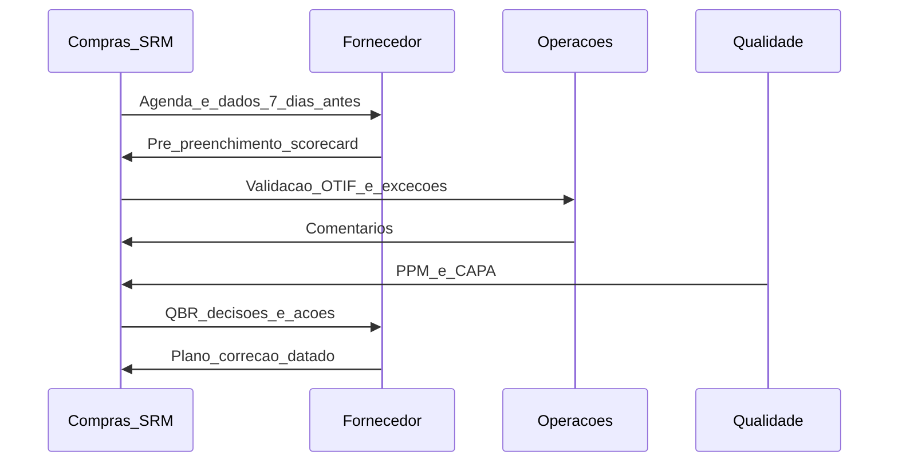

# SLAs, scorecards e QBR — amor mensurável (e revisão que não vira teatro)

**SLA (*Service Level Agreement*)** traduz expectativa em **métricas**, **alvos** e **consequências** (comerciais ou operacionais). **Scorecard** consolida **poucos** indicadores acionáveis. **QBR (*Quarterly Business Review*)** é o **ritual** de alinhar desempenho, iniciativas e riscos — se não houver **dado** e **decisão**, vira **apresentação bonita**.

---

## Objetivos e resultado de aprendizagem

**Ao final desta aula**, você será capaz de:

- Escrever **SLA** com definição mensurável (não «entregar rápido»).  
- Montar **scorecard** com 5–8 KPIs e pesos ou prioridades.  
- Estruturar **QBR** em agenda mínima com saídas (*action items*).

**Duração sugerida:** 60–75 minutos.

---

## Gancho — o QBR da TechLar sem decisão

A **TechLar** fazia QBR de **90 minutos** com **32 slides**. Transportadora mostrava **gráficos** de OTIF; compras elogiava; ninguém decidia **multa**, **capacidade extra** nem **projeto** de integração de *track & trace*. No trimestre seguinte, **os mesmos** atrasos repetiram. O QBR era **relatório**, não **governança**.

**Analogia da consulta médica:** exames bonitos sem **diagnóstico** e **plano** — saúde não melhora.

---

## Mapa do conteúdo

- SLA: escopo, métrica, medição, janela, exceções.  
- Scorecard: poucos KPIs, **donos**, fonte de dado.  
- QBR: participantes, dados pré-lidos, NC/CAPA.  
- Ligação com **contrato** e **S&OP** quando couber.

---

## Conceito núcleo

**SLA (pedagógico):** «Entregaremos **X** em **Y%** das vezes, medido por **Z**, excluindo **eventos** listados, com **escalação** em **W horas».»

**Scorecard:** painel **curto** ligado a **dinheiro**, **tempo**, **qualidade** e **inovação** (uma linha opcional) — *consenso de mercado* em SRM maduro.

**QBR — agenda mínima (*hipótese pedagógica*):**

1. Desempenho *versus* SLA e *versus* trimestre anterior.  
2. **Incidentes** e raiz (sem culpar clima só).  
3. **Iniciativas** (custo, serviço, sustentabilidade).  
4. **Riscos** e cenários próximos 90 dias.  
5. **Decisões** e donos até data.

**Legenda:** mensagens = **fluxo de informação** antes e durante o QBR; decisões ficam **registradas** (ferramenta: ata, sistema, e-mail formal — política interna).

**NC/CAPA:** não conformidade e ação corretiva/preventiva — ligação típica com **qualidade**; SRM **acompanha** *closure*.

---

## Trade-offs

- SLA **rigoroso** demais encarece ou **espanta** fornecedor; **frouxo** demais não protege operação.  
- **Muitos** KPIs no scorecard → **nenhum** melhora.  
- QBR **mensal** para commodity pode ser **desperdício**; **anual** para estratégico pode ser **tarde demais**.

---

## Aplicação — exercício

Escreva um **SLA** de **uma** frase para **OTIF** ou **lead time** de entrega de um fornecedor fictício, com **exclusões** (ex.: greve fora de controle do fornecedor — *exemplo*, não modelo jurídico). Monte um **scorecard** com **6** linhas: nome do KPI, definição, fonte, frequência, alvo, dono.

**Gabarito pedagógico:** SLA deve ter **%** ou **tempo** mensurável; scorecard deve ter **fonte** realista (TMS, ERP, planilha); se dono for sempre «compras», operação e qualidade podem estar **subrepresentados** — ajustar.

---

## Erros comuns e armadilhas

- OTIF sem **definição** de «no prazo» (qual data de referência?).  
- Multa no contrato que **ninguém aplica** — corrói credibilidade.  
- QBR só com **fornecedor falando** — compras deve trazer **dados validados**.  
- Exceções **sem registro** — estatística mente no trimestre seguinte.

---

## KPIs e decisão

- **OTIF** / OTD conforme contrato.  
- **PPM** ou *first pass yield*.  
- **Tempo de resposta** a incidente P1/P2.  
- **Projetos** entregues no trimestre (*innovation bucket*).  
- **Sustentabilidade** auditável (se política existir).

---

## Fechamento — três takeaways

1. SLA é **contrato operacional** — precisa de definição e medição.  
2. Scorecard **curto** vence painel de 20 métricas.  
3. QBR sem **ata com dono** é *Netflix* com gráfico.

**Pergunta de reflexão:** qual KPI do seu scorecard hoje **ninguém confia** no dado — e por quê?

---

## Referências

1. ITIL / SLAs em serviços — *analogia de disciplina* para contratos logísticos (adaptar vocabulário).  
2. MONCZKA, R. et al. *Purchasing and Supply Chain Management*. Cengage — *supplier evaluation* e desempenho.  
3. ASCM — métricas e alinhamento *supplier performance* — [ascm.org](https://www.ascm.org/).

**Ponte:** [KPIs logísticos](../../trilha-fundamentos-e-estrategia/modulo-04-custos-logisticos-performance/aula-03-nivel-servico-kpis-logisticos.md); [Fretes e contratos](../../trilha-fundamentos-e-estrategia/modulo-04-custos-logisticos-performance/aula-02-fretes-contratos-negociacao.md).
