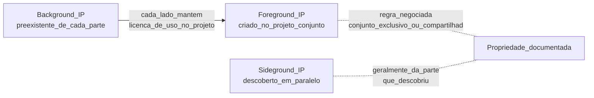
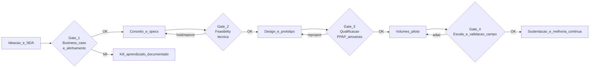
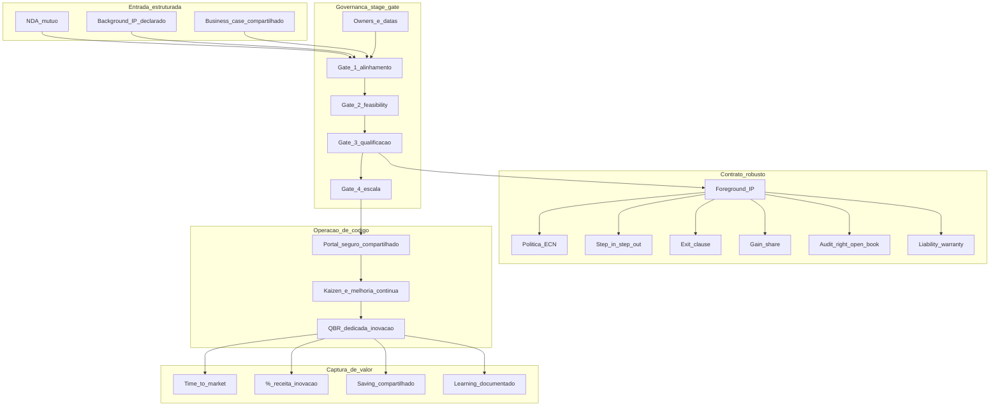

# Desenvolvimento, inovação e co-design — parceria que precisa de regras, não só de entusiasmo

***Supplier Development*** (SD) é o conjunto de **investimentos do comprador** para **elevar capability** do fornecedor (qualidade, custo, prazo, sustentabilidade, capacidade) com **metas e horizonte definidos** — modelo seminal **Honda BP (Best Position)** e **Toyota OMCD** (*Operations Management Consulting Division*). **Inovação conjunta** e **co-design** envolvem decisões que mudam a estrutura da relação: **propriedade intelectual (IP)**, **responsabilidade por falha**, **ritmo de mudança de engenharia** (ECN — *Engineering Change Notice*), **gates** de decisão, **divisão de risco e ganho**. Sem essas regras explícitas, **inovação rápida** vira **dependência crônica** e **disputa judicial** (caso clássico FoxConn–Apple sobre IP de processos).

Esta aula entrega o **arsenal contratual e processual** para co-criação **profissional**: stage-gate fornecedor, *background IP* × *foreground IP*, *step-in* / *step-out*, *gain-share*, *open innovation* (P&G C+D), e ***vested outsourcing*** (Vitasek).

---

## Objetivos e resultado de aprendizagem

Ao final desta aula, você será capaz de:

- Distinguir **desenvolvimento operacional** (SD) de **co-inovação estratégica** (joint NPD).
- Estruturar contrato de co-design com **9 cláusulas mínimas** (NDA, IP, ECN, *step-in*, *exit*, *non-compete*, *gain-share*, *liability*, *audit right*).
- Operar **stage-gate** de inovação com fornecedor (3–5 gates).
- Aplicar **PPAP/APQP** (automotivo) ou equivalente em qualificação.
- Conduzir **conflito sob pressão** com fatos e cadência (não emoção).
- Implementar **Open Innovation** (P&G *Connect+Develop* model).

**Duração sugerida:** 75–90 minutos. **Pré-requisitos:** aulas 3.1 e 3.2.

---

## Mapa do conteúdo

1. **SD vs co-inovação** — duas disciplinas, governança distinta.
2. **Cláusulas mínimas** de contrato de co-design (9 essenciais).
3. **IP**: ***background*** vs ***foreground*** vs ***sideground***; *march-in rights*; *non-compete*.
4. **Stage-gate** Cooper aplicado ao fornecedor.
5. **APQP/PPAP** (automotivo) e equivalentes.
6. **Open Innovation**: P&G C+D, NineSigma, Yet2.
7. ***Vested outsourcing*** (Vitasek): *outcome-based* + *gain-share*.
8. **Toyota OMCD** e **Honda BP** — escolas clássicas SD.

---

## Gancho — a TechLar e o desenho «meio de cada um»

A **TechLar** co-desenvolveu um **módulo eletrônico** com a fornecedora **EleTech** (PME paulista). Histórico:

| Marco | TechLar | EleTech | Resultado |
|---|---|---|---|
| **Mês 0** | Brief funcional, sem NDA formal | Aceita verbal | Risco aberto |
| **Mês 4** | Engenharia conjunta, 3 iterações | EleTech contribui 60% das ideias técnicas | Sem registro de quem detém |
| **Mês 9** | Versão final aprovada | Tooling pago 50/50 | Indefinição patrimonial |
| **Mês 14** | Entra produção, R$ 3,2 mi/ano para EleTech | Cresce 40% como fornecedor | Sucesso comercial |
| **Mês 20** | TechLar quer reduzir preço 6% (saving anual) | EleTech: «sem chance, é nosso desenho» | **Conflito** |
| **Mês 22** | TechLar busca alternativa | EleTech detém **molde físico** + know-how processo + nenhum desenho oficial está com TechLar | ***Lock-in*** |
| **Mês 24** | Migração estimada: 11 meses + R$ 1,8 mi requalificação + risco campo | Fornecedor sobe preço 14% | Custo total +R$ 1,2 mi/ano |

A inovação **rápida** dos primeiros meses virou **risco estrutural** de longo prazo. O CFO, ao ver o caso, perguntou: «**não tinha contrato?**». Tinha — um *blanket order* genérico, sem cláusula de IP, sem *step-in*, sem auditoria de processo. **Amor** ajudou; **regras** faltaram.

**Analogia do casamento sem contrato de convivência:** **amor ajuda** no dia a dia; mas, na **mudança de rotina** (filho, mudança de cidade, herança, divórcio), regras evitam que **convergência vire litígio**. Co-design é casamento — sem cláusulas, **separação patrimonial** vira novela.

**Analogia do co-roteirista de cinema sem contrato:** dois roteiristas escrevem juntos um filme; vendem sucesso; um quer fazer **sequência sem o outro** ou **vender direitos** para outro estúdio. Sem **acordo de IP** assinado **antes**, batalha jurídica de anos. Hollywood aprendeu — sua engenharia precisa aprender também.

**Analogia do Open Innovation P&G:** ao invés de tentar inventar tudo dentro de casa (P&G era fechada antes de 2000), **CEO A.G. Lafley** abriu para **fontes externas** (universidades, fornecedores, *amateur inventors*) com **regras claras de IP, royalty, escala**. Resultado: **50%+ inovação vem de fora**, **30%+ tempo desenvolvimento**, **margens maiores**. Modelo replicável.

---

## Conceito-núcleo

### SD vs co-inovação — tabela diferencial

| Dimensão | **Supplier Development** | **Co-inovação / Co-design** |
|---|---|---|
| **Objetivo** | melhorar capability existente (qualidade, custo, prazo, ESG) | criar **solução nova** conjunta |
| **Escopo** | processo do fornecedor | produto/serviço |
| **Investimento** | comprador investe (treinamento, ferramenta, *kaizen*, capital reembolsável) | ambos investem (engenharia, *tooling*, *prototyping*) |
| **Horizonte** | 6–18 meses | 12–48+ meses |
| **IP** | tipicamente do fornecedor (processo) | **conjunto** ou **negociado** (NDA + cláusula explícita) |
| **Métrica** | PPM, OTIF, custo unitário, EcoVadis | *time-to-market*, % inovação na receita, IP gerado |
| **Risco principal** | retorno não materializa | *lock-in*, disputa IP, falha de adoção |
| **Modelos clássicos** | Toyota OMCD, Honda BP | P&G C+D, Apple-TSMC node co-design, Tesla-Panasonic baterias |

### **9 cláusulas mínimas** num contrato de co-design

| # | Cláusula | O que protege | Pergunta-âncora |
|---|---|---|---|
| 1 | **NDA mútuo** | informação trocada | quem pode ver o quê, quanto tempo? |
| 2 | **Background IP** (cada lado declara seu IP **anterior**) | direitos preexistentes | o que cada um já tinha? |
| 3 | **Foreground IP** (criado durante o projeto) | propriedade do **novo** | conjunto, exclusivo, licença? |
| 4 | **Sideground IP** (descobertas paralelas durante o projeto) | extensões | quem fica com o quê? |
| 5 | **ECN — Engineering Change Notice** | mudanças após produção | quem aprova, qual *lead time*, qual custo? |
| 6 | ***Step-in* / *step-out*** | continuidade em falha | comprador pode assumir? prazo? |
| 7 | ***Exit clause*** + *transition assistance* | saída ordenada | dados, *tooling*, treinamento de sucessor |
| 8 | ***Liability* + *warranty* + *recall*** | falha de campo | quem responde por defeito de design vs manufatura |
| 9 | **Audit right** + ***open book*** + *should-cost* | transparência financeira | comprador pode auditar custo de manufatura? |

**Bônus (estratégico):**

- **Non-compete** temporal (fornecedor não pode vender a concorrente direto por X meses).
- **MFN** (Most Favored Nation) — preço justo vs outros clientes.
- **Gain-share** explícito (saving compartilhado a partir de baseline).
- ***March-in rights*** (direito de licença a terceiros se fornecedor descontinuar).

### IP — anatomia trinária

**Legenda:** sem **registro escrito** desde o **mês 0** (NDA + cláusula IP), todo trabalho conjunto vira **terreno cinzento** — quem litigar primeiro tem vantagem judicial.

### Stage-gate aplicado a co-inovação fornecedor (modelo Cooper)

**Legenda:** **gates** com **critério escrito**, **owner**, **data**, **dado de evidência** — sem isso, projeto **derrete escopo** ou vira **eterno piloto**. *Kill* não é fracasso: é **aprendizado documentado** que evita capex maior depois.

### **APQP / PPAP** — qualificação automotiva (replicável fora do setor)

**APQP** (*Advanced Product Quality Planning*) — planejamento estruturado em **5 fases** (planejamento, design, processo, validação, melhoria contínua), com entregáveis padronizados. Adotado em automotivo, aeroespacial, médico, industrial pesado.

**PPAP** (*Production Part Approval Process*) — pacote de **18 documentos** que fornecedor entrega para qualificação de peça (FMEA design, FMEA processo, plano de controle, capability Cpk, dimensional, *appearance approval*, etc.).

Para B2B fora de automotivo, padrões equivalentes existem (ISO 9001 + plano de validação interno, ABNT específicas).

### **Vested outsourcing** (Vitasek) — *next-level* co-design

Modelo proposto por **Kate Vitasek (University of Tennessee)** baseado em **5 regras**:

1. Foco em ***outcomes***, não atividades (medir entrega de **valor**, não horas).
2. Foco no **«what»**, fornecedor decide o **«how»**.
3. **Métricas claras de outcome** (5–6 KPIs).
4. ***Pricing model* alinhado a incentivos** (*gain-share*, *value-based*).
5. **Governança** *insight* (não *oversight*) — relação adulta.

Casos: **P&G–Jones Lang LaSalle** (gestão de imóveis P&G mundial); **Microsoft–Accenture** (folha pagamento global); **Ministério da Defesa Reino Unido**.

### **Open Innovation — P&G Connect+Develop**

Lafley (2000) abriu P&G a **fontes externas**:

- Portal público para **submissão de ideias** (NineSigma, InnoCentive, Yet2).
- ***Reverse* RFP**: «procura-se solução para X» (problema declarado publicamente).
- **Fornecedor estratégico** convidado a contribuir tecnologia (não só componente).
- **Royalty** + **licenciamento** estruturados.

Resultado: **35%+ produtos novos** vêm de fontes externas; tempo desenvolvimento −30%; ROI inovação +60%.

---

## Frameworks-chave

### 1. **Cooper, R.** — *Stage-Gate®* (NPD framework)

### 2. **Toyota OMCD** + **Honda BP** — *supplier development* clássico (1970s+)

### 3. **Wynstra & van Weele** — *Managing Supplier Involvement in Product Development*

### 4. **Vitasek, K.** — *Vested* (Tennessee)

### 5. **Chesbrough, H.** — *Open Innovation* (HBS, 2003)

### 6. **APQP/PPAP** — *AIAG* (Automotive Industry Action Group), 4ª ed.

### 7. **Liker, J.** — *The Toyota Way*; *Toyota Supply Chain Management*

### 8. **Apple-TSMC node 3nm/2nm co-design** — *exclusivity windows* + investimento

### 9. **Tesla-Panasonic baterias 18650/4680** — JV mais aberta de baterias

---

## Diagrama / Modelo principal — sistema completo de co-inovação

**Legenda:** **entrada estruturada** + **governança stage-gate** + **contrato robusto** = condição para **operação madura** que captura **valor mensurável**. Pular qualquer dos 4 blocos compromete o sistema.

---

## Aprofundamentos — variações setoriais

### Automotivo

PPAP/APQP rigorosos; ECN extremamente disciplinada (cada mudança custa qualificação); *tier-1* tipicamente detém **manufacturing IP**, **OEM** detém **product IP**.

### Tecnologia / semicondutores

**Apple-TSMC**: TSMC investe **bilhões** em capacidade nodal específica para Apple; Apple paga *exclusivity premium*; *foreground IP* dividido (TSMC: processo; Apple: design IC). Sem cláusulas robustas, JV teria implodido.

### Bens de consumo

**P&G Connect+Develop** — caso seminal; **Unilever Foundry** — versão Unilever; **Nestlé Henri** — fundo + portal interno.

### Saúde / farmacêutica

Co-design com fornecedor de **pharma device** (auto-injetor, embalagem) tem regulação ANVISA/FDA acoplada — qualquer ECN exige re-submissão. Contratos têm 50+ páginas.

### Brasil

- ***Empresa Brasileira de Pesquisa e Inovação Industrial (EMBRAPII)*** — fomenta co-desenvolvimento universidade-empresa-fornecedor (modelo aberto).
- **Lei do Bem (11.196/2005)**: incentivos fiscais para co-desenvolvimento P&D (76% das despesas dedutíveis).
- **Lei 14.948/2024** (estímulo P&D em logística) — incentivos a inovação na cadeia.
- ***Embraer-fornecedores tier-1***: modelo ***risk partnership*** (fornecedor entra como acionista do programa, divide risco e ganho proporcional ao volume entregue).

---

## Trade-offs estratégicos

| Decisão | A favor | Contra |
|---|---|---|
| Co-inovação profunda | *time-to-market*, IP novo, vantagem competitiva | dependência, complexidade contratual, IP cinza se mal feito |
| ***Foreground IP* exclusivo do comprador** | controle, *defensibility* | fornecedor desincentivado a investir |
| ***Foreground IP* compartilhado** | parceria genuína | gestão complexa de licenciamento |
| **Vested outsourcing** | alinhamento radical, inovação | exige métrica robusta + maturidade |
| **Open Innovation aberta** | acelera ideias, fontes externas | risco vazamento, dilui exclusividade |
| **Stage-gate rigoroso** | disciplina, kill cedo | percepção de burocracia |
| ***Tooling*** financiado pelo comprador | controle, switching protegido | capex, risco subutilização |

---

## Caso prático — TechLar refaz contrato com EleTech (e cria 2 outros co-designs)

**Mês 0–3 — Resolução do legado EleTech:**

1. Negociar com EleTech: TechLar paga **R$ 480k** pelo *foreground IP* + *tooling* + 12 meses de *transition assistance*.
2. Em paralelo, qualifica **2ª fonte** (FoTech), com **PPAP** completo em 6 meses.
3. Reduz dependência EleTech para 50%, com **MFN clause** e *open book* parcial.

**Mês 4–18 — Novos co-designs com regras desde mês 0:**

| Co-design | Fornecedor | Tipo | Investimento | Gate-1 | Resultado |
|---|---|---|---|---|---|
| **Sensor IoT integrado** | TechSensor (PME) | foreground compartilhado, royalty 4% | R$ 280k | aprovado mês 3 | em produção mês 14, 12% de receita pelo modelo novo |
| **Software embarcado v2** | SoftEmb (Israel) | foreground exclusivo TechLar, *open book* fornecedor, *gain-share* sobre saving | R$ 720k | reprovado em gate 2 | kill documentado, R$ 1,1 mi capex evitado |

**Aprendizado institucional:** SRM agora tem **template de contrato co-design** (24 páginas, jurídico revisou), processo **stage-gate** com 5 gates, *NDA mandatório* desde **dia 0**, *foreground IP* discutido **antes do whiteboard**.

---

## Erros comuns e armadilhas

1. ***Roadmap*** só no PowerPoint do fornecedor, sem *milestone* interno comprador.
2. **SD como consultoria grátis infinita** — sem *kill* nem *exit*, fornecedor vira parasita reverso.
3. **Ignorar segurança de informação** em portal colaborativo — concorrente pode acessar.
4. **Conflito só por e-mail longo** — falta reunião com **dados + ata + decisão**.
5. **NDA no mês 6** depois que tudo já foi falado — proteção *retrocedente* tem força jurídica fraca.
6. ***Tooling*** pago 50/50 sem definir propriedade — moinho de litígio.
7. **«*Tribal knowledge*» do fornecedor** sem documentação — saída do engenheiro chave do fornecedor é fim do projeto.
8. ***Lock-in* aceito por velocidade**: «agora é prioridade» vira *prison sentence* contratual.
9. ***Gates*** sem **critério escrito**: vira votação política em vez de decisão *evidence-based*.
10. **Cobrar inovação sem incentivo financeiro** — fornecedor não tem ROI; logo, não inova.

---

## Risco e governança

- **Anticorrupção**: pagamento por *kaizen* / consultoria pode ser *red flag* se sem nota fiscal e contrato — política rigorosa.
- **LGPD / segurança**: portal colaborativo + dados técnicos exigem **classificação** + **DLP** + **audit log**.
- ***Cyber***: fornecedor estratégico com acesso a sistema interno = *third-party risk* prioridade 1 (BitSight).
- **Liability** em produto co-projetado: contrato deve **separar** falha de design (potencialmente comprador) vs falha manufatura (fornecedor).
- **Compliance setor regulado**: Anvisa, INMETRO, ANATEL, ANP — co-design pode requerer recertificação que custa meses.

---

## KPIs estratégicos

| KPI | Pergunta | Dono | Fonte | Cadência | Playbook |
|---|---|---|---|---|---|
| ***Time-to-market* projetos co-design** (meses) | velocidade? | R&D + SRM | PMO | Por projeto | Stage-gate ágil |
| **% receita de produtos com co-design** | inovação capturada? | CTO + CFO | ERP + R&D | Anual | Pipeline estratégico |
| **% gates cumpridos no prazo** | disciplina | PMO | Stage-gate tool | Trimestral | Coaching |
| **Custo desenvolvimento *vs* baseline interno** | ROI co-design? | CTO + CPO | PMO + Finance | Anual | Comparar make alternative |
| **Defeitos pós-mudança ECN** (ppm) | qualidade? | QMS | QMS | Mensal | Stress-test ECN |
| **% projetos com 9 cláusulas no contrato** | maturidade contratual | Legal + SRM | CLM | Trimestral | Atualizar template |
| ***Lock-in* index** (% spend em SS sem 2ª fonte qualificada após 12m) | dependência crônica? | CRO + CPO | SRM | Semestral | Plano de qualificação |
| ***Gain-share* distribuído (R$)** | mecanismo *win-win*? | CFO + CPO | ERP | Anual | Auditoria de cálculo |
| ***Kill rate* em gates iniciais** | disciplina de matar cedo? | PMO | Stage-gate | Anual | Celebrar kill bem feito |

---

## Tecnologias e ferramentas habilitadoras

- ***Stage-gate / NPD***: **Sopheon Accolade**, **Planview**, **Sopheon**, **Microsoft Project for the Web**, **Asana**.
- ***PLM***: **Siemens Teamcenter**, **PTC Windchill**, **Dassault ENOVIA**, **Autodesk Vault**, **Aras Innovator**.
- ***Open Innovation portals***: **Yet2**, **NineSigma**, **InnoCentive (Wazoku)**, **Brightidea**.
- ***Collaboration secure***: **Microsoft Teams** + **Information Protection**, **Box**, **iManage**, **HighQ**.
- ***DLP / Cyber***: **Microsoft Purview**, **Forcepoint**, **Symantec DLP**.
- ***SRM com módulo SD***: **SAP Ariba SLP**, **Coupa**, **Jaggaer**.
- ***A3 / Lean tools***: **Visual Workplace**, **Trello/Miro**.
- ***Contract templates***: **DocuSign CLM**, **Icertis**, **SirionLabs** (templates específicos para co-design).

---

## Glossário rápido

- **SD**: Supplier Development.
- **NPD**: New Product Development.
- **Co-design / co-development**: criação conjunta.
- **NDA**: Non-Disclosure Agreement.
- **Background / Foreground / Sideground IP**: anterior, criado no projeto, descoberto em paralelo.
- **ECN**: Engineering Change Notice.
- **PPAP / APQP**: padrões automotivos qualificação.
- **FMEA**: Failure Mode and Effect Analysis.
- **Step-in clause**: comprador assume operação se fornecedor falhar.
- **Vested**: modelo *outcome-based* (Vitasek).
- **Gain-share**: divisão saving conjunto.
- **MFN**: Most Favored Nation.
- ***March-in rights***: direito de licenciar a terceiros se fornecedor descontinuar.
- **Risk partnership**: fornecedor entra como sócio do programa (Embraer model).
- **Open Innovation**: P&G C+D, Chesbrough.

---

## Aplicação — exercícios

**Exercício 1 (20 min) — Contrato fictício de co-design.** Para um projeto de inovação conjunta (sensor IoT, software, embalagem inovadora — escolha um), preencha as **9 cláusulas mínimas** em **uma frase cada**. Defina propriedade de **foreground IP** com justificativa.

**Gabarito:** se IP é «a combinar», projeto começa errado; *step-in* deve ter **gatilho mensurável** (X dias falha SLA).

**Exercício 2 (15 min) — Stage-gate.** Estruture **4 gates** para um projeto de 14 meses, com **critério de aprovação** + **dados de evidência** por gate. Quem decide cada um?

**Gabarito:** sem critério escrito = decisão política; sem owner = paralisia.

**Exercício 3 (15 min) — SD ou trocar?** Avalie um fornecedor problemático (PPM 8.500, OTIF 78%). Decida: (a) plano SD com investimento de comprador (treinamento Six Sigma, capex linha), prazo 9 meses, custo R$ 240k, ROI esperado +R$ 600k/ano; (b) trocar por concorrente, custo qualificação R$ 380k + 6 meses risco transição. Qual escolhe? Justifique com 3 critérios.

**Exercício 4 (15 min) — Vested check.** Para um fornecedor estratégico atual, há **outcome mensurável** confiável? **Gain-share** matemático possível? Maturidade da relação 4–5/5? Decida se *vested* faz sentido ou seria *upgrade* de parceria comum.

---

## Pergunta de reflexão

Qual inovação conjunta na sua empresa hoje **não** teria sobrevivido a um **gate honesto** em 90 dias — e qual **lock-in** silencioso você já aceitou em troca de velocidade que **agora** custa caro?

---

## Fechamento — takeaways

1. **Desenvolvimento** é **capacitação**; **co-design** é **criação** — governanças e contratos diferentes.
2. **IP** e **mudança de desenho (ECN)** não são detalhe — são **estrutura de risco** patrimonial.
3. **9 cláusulas mínimas** desde **dia 0**: NDA, IP triplo, ECN, *step-in*, *exit*, *liability*, *audit*, *gain-share*.
4. **Stage-gate** com **critério escrito** evita projeto eterno e celebra **kill bem feito**.
5. **Vested** e **Open Innovation** são fronteiras maduras — exigem **maturidade** + **métrica robusta**.
6. **Conflito** com fornecedor estratégico exige **ritual** (dados, cadência, ata), **não emoção**.

---

## Referências

1. WYNSTRA, F.; VAN WEELE, A.; WEGGEMAN, M. *Managing supplier involvement in product development*. *European Journal of Purchasing & Supply Management*, 2001.
2. LAMMING, R. *Beyond Partnership: Strategies for Innovation and Lean Supply*. Prentice Hall, 1993.
3. COOPER, R. G. *Winning at New Products: Creating Value Through Innovation*. 5ª ed., Basic Books, 2017 — *Stage-Gate*.
4. CHESBROUGH, H. *Open Innovation: The New Imperative for Creating and Profiting from Technology*. HBS, 2003.
5. HUSTON, L.; SAKKAB, N. *Connect and Develop: Inside Procter & Gamble's New Model for Innovation*. *HBR*, 2006.
6. LIKER, J.; CHOI, T. *Building deep supplier relationships*. *HBR*, 2004.
7. NISHIGUCHI, T. *Strategic Industrial Sourcing: The Japanese Advantage*. Oxford, 1994.
8. VITASEK, K.; LEDYARD, M.; MANRODT, K. *Vested: How P&G, McDonald's, and Microsoft are Redefining Winning in Business Relationships*. Palgrave, 2012.
9. AIAG (Automotive Industry Action Group) — *APQP* 2ª ed.; *PPAP* 4ª ed.
10. SAKO, M. *Prices, Quality and Trust: Inter-firm Relations in Britain and Japan*. Cambridge, 1992.
11. ASCM, CSCMP, ISM — *supplier development & innovation*.

---

**Ponte:** [Gestão de projetos logísticos](../../trilha-melhoria-continua-e-processos/modulo-04-gestao-de-projetos-logisticos/aula-01-charter-raci-wbs.md); [Strategic Sourcing](../modulo-02-procurement-strategic-sourcing/aula-01-compras-transacionais-vs-estrategia-categoria.md); próximo módulo (**Logística 4.0**) entra em **maturidade digital, IoT, digital twin e IA** — onde co-design moderno acontece em **arquitetura digital integrada**.
