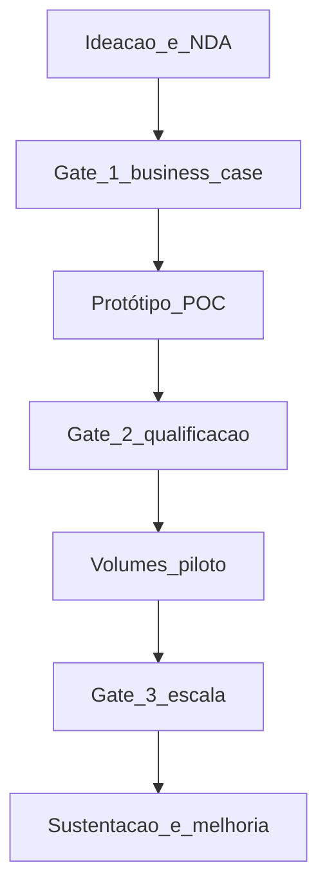

# Desenvolvimento, inovação e co-design — parceria que precisa de regras, não só de entusiasmo

***Supplier development*** melhora **capacidade** do fornecedor (qualidade, custo, prazo, sustentabilidade) com **recursos** e **metas** claras. **Inovação conjunta** e **co-design** envolvem **IP**, **responsabilidade** por falha e **ritmo** de mudança — sem **gates** de decisão, vira dependência ou disputa judicial.

---

## Objetivos e resultado de aprendizagem

**Ao final desta aula**, você será capaz de:

- Distinguir **desenvolvimento** operacional de **co-inovação** estratégica.  
- Listar **cláusulas e processos** mínimos para co-design (NDA, ownership, mudança de desenho).  
- Facilitar **conflito** sob pressão com **fatos** e **cadência** de revisão.

**Duração sugerida:** 60–75 minutos.

---

## Gancho — a TechLar e o desenho «meio de cada um»

A **TechLar** co-desenvolveu um **módulo eletrônico** com fornecedor **sem** registro claro de **quem** detinha o desenho após a terceira iteração. Quando o fornecedor subiu **preço**, a TechLar descobriu que **migrar** exigia **requalificação** longa — *lock-in* técnico. Inovação **rápida** no início virou **risco** estrutural.

**Analogia de casamento com contrato de convivência:** amor ajuda; **regras** evitam que a mudança de rotina vire **litígio**.

---

## Mapa do conteúdo

- *Supplier development*: auditoria, treinamento, projetos *kaizen* com fornecedor.  
- Inovação: *roadmap*, *stage-gate*, critérios de sucesso.  
- IP, confidencialidade, *background* *versus* *foreground* (*conceito pedagógico*, jurídico detalha).  
- Conflito: dados, escalação, preservação de relacionamento estratégico.

---

## Conceito núcleo

**Desenvolvimento de fornecedor:** quando o fornecedor **quer** melhorar mas **não consegue** sozinho — comprador investe em **capacitação**, **ferramenta** ou **layout**, com **ROI** esperado.

**Co-design / co-inovação:** criação conjunta de **solução nova** — exige **acordo** sobre:

- Propriedade de **desenhos**, **software**, **dados**.  
- Quem paga **protótipo** e **tooling**.  
- Como **mudanças** entram em produção (ECN — *engineering change*).  
- O que acontece em **falha** de campo (*warranty*, *recall* — alto nível, jurídico detalha).

**Legenda:** *gates* = **decisões** explícitas; sem eles, projeto **derrete** escopo ou vira **eterno piloto**.

**Mini-caso:** fornecedor sugere **material alternativo** que reduz custo — engenharia deve **validar** vida útil e **risco** regulatório antes de **premiar** fornecedor no scorecard de inovação.

---

## Trade-offs

- **Co-inovação** acelera *time-to-market*; aumenta **dependência** e **complexidade** contratual.  
- **Desenvolvimento** caro demais para **commodity** — melhor **trocar** fornecedor.  
- **Transparência total** de *roadmap* com fornecedor **estratégico** *versus* **vazamento** para concorrente — governança de informação.

---

## Aplicação — exercício

Descreva **um** projeto de inovação conjunta (fictício). Preencha: **objetivo**, **gate** de decisão em 90 dias, **dono** interno, **dono** no fornecedor, **um risco** e **mitigação**. Acrescente **uma** linha sobre **IP** («quem detém X após Y»).

**Gabarito pedagógico:** deve haver **gate** temporal e **donos** nomeados; IP não pode ficar «a combinar depois» — mesmo que a resposta seja «jurídico elaborará cláusula», o **princípio** deve estar escrito.

---

## Erros comuns e armadilhas

- *Roadmap* só no PowerPoint do fornecedor, **sem** *milestone* interno.  
- *Supplier development* como **consultoria grátis** infinita.  
- Ignorar **segurança da informação** em *portal* colaborativo.  
- Conflito **só** em e-mail longo — falta **reunião** com dados e ata.

---

## KPIs e decisão

- **Time-to-market** de *features* co-desenvolvidas.  
- **Custo** *versus* baseline após projeto de desenvolvimento.  
- **Defeitos** pós-mudança de desenho.  
- **Satisfação mútua** (*survey* simples *post-QBR* — opcional).  
- **Cumprimento** de *gates* no prazo.

---

## Fechamento — três takeaways

1. Desenvolvimento é **capacitação**; co-design é **criação** — governanças diferentes.  
2. IP e **mudança de desenho** não são detalhe — são **estrutura de risco**.  
3. Conflito com fornecedor estratégico exige **ritual**, não só emoção.

**Pergunta de reflexão:** qual inovação conjunta hoje **não** teria sobrevivido a um *gate* honesto em 90 dias?

---

## Referências

1. LAMMING, R. *Squaring lean supply with supply chain management*. *International Journal of Operations & Production Management* — relações comprador-fornecedor.  
2. WYNSTRA, F.; VAN WEELE, A. *Managing supplier involvement in product development*. *European Journal of Purchasing & Supply Management*.  
3. ASCM — colaboração e *supplier relationship* — [ascm.org](https://www.ascm.org/).

**Ponte:** [Gestão de projetos logísticos](../../trilha-melhoria-continua-e-processos/modulo-04-gestao-de-projetos-logisticos/aula-01-charter-raci-wbs.md); [Strategic Sourcing](../modulo-02-procurement-strategic-sourcing/aula-01-compras-transacionais-vs-estrategia-categoria.md).
