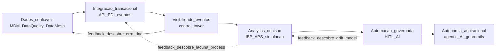
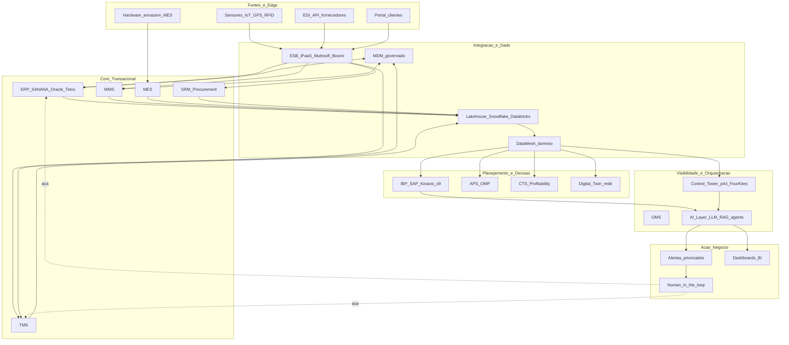

# Maturidade digital na *supply chain* — escada, não pôster de «IA»

**Maturidade digital** descreve a **capacidade progressiva** de uma cadeia de suprimentos em **dado**, **integração**, **visibilidade**, **decisão analítica** e **automação governada**. Frameworks públicos diferem nos nomes dos degraus (Gartner, McKinsey, Deloitte, MIT CTL, ASCM) — o **consenso pedagógico** é a **sequência lógica**: dados confiáveis → integração transacional → visibilidade *end-to-end* → analytics decisória → automação com *human-in-the-loop* → **autonomia controlada** (*autonomous SC*). Pular degraus produz o **anti-padrão clássico**: **«IA na previsão» com cadastros sujos** (*garbage in, garbage out*) e **dashboard bonito mentiroso**.

Esta aula entrega o **mapa estratégico** da jornada digital: 5–6 níveis com **evidência operacional**, *operating model* (DataMesh / DataOps / *digital twin board*), arquitetura referência (ERP + IBP + APS + WMS + TMS + control tower + CDP/lakehouse), e como evitar o **«PoC eterno»**.

---

## Objetivos e resultado de aprendizagem

Ao final desta aula, você será capaz de:

- Posicionar sua organização em **5–6 faixas de maturidade** com evidência observável.
- Distinguir **digitalização** (PDF no e-mail) de **integração** (API/evento) e **decisão automatizada**.
- Articular **roadmap em ondas** (12-24-36 meses) com *quick wins* + estrutural.
- Compor a **arquitetura referência** moderna (ERP, IBP, APS, MES, WMS, TMS, *control tower*, *lakehouse*, AI layer).
- Reconhecer **maturidade de governança de dado** (MDM, *data quality*, *data products*).
- Evitar **anti-padrão PoC eterno** com *gates* de produção.

**Duração sugerida:** 75 minutos. **Pré-requisitos:** trilha Tecnologia e Sistemas (módulo ERP/WMS/TMS) recomendado.

---

## Mapa do conteúdo

1. Por que **dado e integração** vêm antes de IA — caso TechLar.
2. **6 faixas de maturidade** (Fragmentado → Autônomo) com evidência.
3. **Arquitetura referência** Logística 4.0 (capability map).
4. **Operating model**: *Digital SC team*, *Center of Excellence*, *Product Owner* de capability.
5. ***Roadmap*** em **3 ondas** (12-24-36 meses).
6. Anti-padrões: PoC eterno, *RFP de plataforma antes de processo*, *digital washing*.
7. Casos: **DHL Resilience360**, **Maersk e Tradelens** (e por que falhou), **Walmart** (data integration).

---

## Gancho — a TechLar e o projeto «big data»

Em janeiro de 2024, o CIO da **TechLar** patrocinou:

| Iniciativa proposta | Investimento | Promessa |
|---|---|---|
| **IA para previsão de demanda** | R$ 1,8 mi (2 anos) | −20% erro previsão |
| **Control tower visibilidade** | R$ 920k licença + R$ 480k integração | OTIF 95% |
| **Digital twin de armazém Itupeva** | R$ 1,2 mi | −12% custo intralogística |

Em paralelo, o **CSCO** (não consultado no orçamento) trouxe diagnóstico:

| Realidade dos cadastros | Status |
|---|---|
| Acurácia cadastro SKU (peso, dimensão, lead time) | **62%** |
| Pedidos duplicados entre ERP e planilha vendas | **8% volume** |
| Lead time fornecedor cadastrado vs realizado | desvio mediano **+11 dias** |
| % fornecedores com EDI/ASN funcional | **17%** |
| % itens com BOM (lista de materiais) revisada nos 24m | **34%** |
| Pedidos com erro de unidade medida (un vs cx vs pal) | **12%** |
| MDM (master data) governado por? | **«ninguém»** (resposta literal) |

O modelo de IA, treinado com cadastro 62% acurado e demanda **distorcida por pedidos duplicados**, entregaria *garbage in / garbage out*. O *control tower* mostraria **sombra**, não cadeia (parceiros sem ASN). O *digital twin* simularia armazém com layout fictício (cadastro físico desatualizado).

O CIO pediu **higienização**; o VP Vendas pediu **demo para cliente** em 60 dias; o CFO viu o cheque do orçamento e perguntou **«o que vamos defender no Conselho?»**. Sem **mapa de maturidade** + **dono** + **roadmap em ondas**, o comitê discutiu **ferramenta** durante 6 reuniões em vez de **capability**.

**Decisão final** (após 4 meses perdidos): pausa nas 3 iniciativas; lançamento de **Onda 0 — Foundation** (R$ 480k em 6 meses): MDM + governança + integração ERP↔planilha vendas. Só depois ondas de **Visibilidade**, **Analytics**, **Automação**.

**Analogia da maratona aquática:** ninguém começa por **maratona aquática** sem antes **flutuar e respirar**, depois **nadar 100m**, depois **1km**, depois **5km**. Pular degraus na piscina **acaba em afogamento**. Maturidade digital tem **mesma fisiologia**.

**Analogia do prédio sem fundação:** o sonho do CEO é o **andar 25 com vista** (decisão automatizada). Mas o engenheiro lembra: precisa de **fundação** (dado), **estrutura** (integração), **paredes** (visibilidade), **instalações** (analytics). Decorar o 25º andar **antes** da fundação produz **rachaduras** (modelo de IA mentiroso) e **prédio que tomba** (audit financeiro reprova).

**Analogia da escada de Maslow para SC**: dado é **fisiológico**; integração é **segurança**; visibilidade é **pertencimento** (todo mundo vê o mesmo); analytics é **estima** (decisão informada); automação é **autorrealização** (cadeia adaptativa). Pular níveis = **patologia organizacional**.

---

## Conceito-núcleo

### **6 faixas de maturidade** com evidência observável

| Faixa | Nome | Sinais típicos | Risco se pular | Tempo médio de salto |
|---|---|---|---|---|
| **0 — Fragmentado** | planilhas paralelas, KPIs conflitantes, **sem MDM** | nenhuma — é o ponto de partida | n/a | — |
| **1 — Digitalizado** | ERP transacional core, processos com PO eletrônica, **mas dados ainda imperdoáveis** | dashboards bonitos mentirosos | 12–18m |
| **2 — Integrado core** | ERP + WMS + TMS conectados, **MDM governado**, EDI/API com top 30% fornecedores | lacunas *end-to-end*, BU usa Excel paralelo | 18–24m |
| **3 — Visível** | *control tower* com eventos pedido/estoque/transporte unificados, ASN >75% fornecedores, **single source of truth** | custo integração + *change management* | 24–36m |
| **4 — Analítico/Decisão** | IBP/APS rodando, *forecast* baseline + intervalo, simulação de cenários, **CTS por cliente vivo** | falta governança de modelo | 12–18m |
| **5 — Orquestrado** | decisões automatizadas com *human-in-the-loop* explícito; *digital twin* de rede, IA generativa em compras *guided* | risco operacional + ético + cyber | 18–36m |
| **6 — Autônomo (aspiracional)** | cadeia se reorganiza com *agentic AI* dentro de guardrails, *self-healing*, *self-orchestrating* | risco sistémico, regulatório, de dependência fornecedor | 5–10 anos+ |

**Realidade BR (ILOS 2024):** ~52% das empresas em **1–2**; ~28% em **2–3**; ~15% em **3–4**; ~5% em **4+**. **<1%** se aproxima de 5.

**Realidade global (Gartner SC Top 25 2024):** Apple, Schneider, Cisco, Colgate em **4–5**; *autonomous SC* ainda **promessa parcial**.

### Por que a sequência importa — fundação técnica

**Legenda:** setas = dependência **estrutural**; **retroalimentação** existe (descobrir erro de dado em A força volta a D). **«Pular D»** = *garbage in, garbage out* na A. **«Pular I»** = visibilidade fragmentada. **«Pular V»** = automação cega.

### Definições críticas (vocabulário que evita confusão executiva)

| Termo | Definição operacional |
|---|---|
| **Digitalização** | passar de **papel para digital** (PDF, planilha, e-mail estruturado) |
| **Digitização** | converter analógico → digital (scan, OCR) |
| **Integração** | sistemas trocam dado **automaticamente** via API/evento, não humano replicando |
| **Automação** | tarefa executada **sem humano** sob regra (RPA, ML) |
| **Orquestração** | múltiplas tarefas/sistemas coordenados em fluxo |
| **Autonomia** | sistema **decide** dentro de guardrails (AI assistante decide, humano aprova exceção) |

### Operating model — quem faz o quê

**Capability ownership moderna** (referência Spotify Squad model + Gartner Composable):

| Papel | Responsabilidade | Cadência |
|---|---|---|
| **CSCO/COO** | sponsor do roadmap digital SC | Mensal steering |
| **Chief Digital Officer / VP Digital SC** | orquestração transformação | Semanal squad |
| ***Product Owner* de capability** | dono do produto «forecast», «control tower», «MDM» | Diário stand-up |
| ***Data Steward*** | qualidade dado mestre por domínio (cliente, fornecedor, item) | Contínuo |
| ***Data Engineer / Architect*** | pipelines, *lakehouse*, *governance* | Sprint |
| ***Squad multidisciplinar*** | UX + dev + dado + ops + negócio | Sprint 2 semanas |
| ***Center of Excellence (CoE)*** | padrões, *playbooks*, treinamento | Mensal |
| **CIO/IT** | infra, segurança, *enterprise architecture* | Mensal |

### Arquitetura referência Logística 4.0

**Legenda:** **6 camadas** lógicas; um sistema pode atender múltiplas (ex.: SAP IBP cobre planejamento + analytics; Kinaxis Maestro entrega *control tower* nativo). Não confundir **logos** com **capabilities** — RFP deve ser por capability necessária, não brand.

---

## Frameworks-chave

### 1. **Gartner Supply Chain Maturity Model** (5 estágios) — *react / anticipate / integrate / collaborate / orchestrate*

### 2. **MIT CTL Digital SC Maturity** — academia, similar 5 níveis

### 3. **Deloitte / Capgemini / McKinsey** — modelos comerciais (usar como **inspiração**, não dogma)

### 4. **DCMM (Digital Capability Maturity Model)** — *DAMA International*, ênfase em dado

### 5. **CMMI for Services** — referência genérica de capability

### 6. **TOGAF / Zachman** — *enterprise architecture*

### 7. **DataOps / DataMesh (Zhamak Dehghani)** — descentralização governada do dado

### 8. **Composable SC (Gartner 2022+)** — capability modular, não monolito ERP

### 9. **Cooper Stage-Gate** aplicado a iniciativa digital

### 10. **Lean Digital** — Toyota *kata* aplicado a SC digital

---

## Diagrama / Modelo principal — *roadmap* em 3 ondas (12-24-36 meses)

```mermaid
flowchart LR
  subgraph onda1[Onda_1_Foundation_0_a_12m]
    O11[MDM_governado]
    O12[Integracao_API_top_30_fornecedores]
    O13[Quick_wins_RPA_back_office]
    O14[CSCO_e_PO_capability_nomeados]
  end
  subgraph onda2[Onda_2_Visibilidade_e_Analytics_12_a_24m]
    O21[Control_Tower_pedidos_estoque_transporte]
    O22[IBP_implementado_demanda_e_supply]
    O23[CTS_por_cliente_vivo]
    O24[Lakehouse_unificado]
  end
  subgraph onda3[Onda_3_Decisao_e_Automacao_24_a_36m]
    O31[Forecast_ML_em_producao_com_baseline]
    O32[Digital_Twin_de_rede]
    O33[GenAI_assistente_compras_e_planejamento]
    O34[HITL_governance_e_AI_Act_compliance]
  end
  onda1 --> onda2 --> onda3
  onda3 -.aspiracional.-> ONDA4[Onda_4_Autonomia_governada_36m_plus]
```

**Legenda:** ondas com **objetivo claro** + **gate de transição** + **investimento phaseado**. Tentar Onda 3 sem Onda 1 = TechLar 2024 (4 meses perdidos).

---

## Aprofundamentos — variações setoriais e geográficas

### Brasil — particularidades

- **Adoção AI/ML em SC BR**: ~12% empresas em produção (ILOS 2024); resto em PoC ou planejamento.
- **MDM maturidade BR**: **<25%** das empresas mid-market têm *master data steward* nomeado.
- **Reforma Tributária 2026–2033**: força **modernização ERP** (CBS/IBS no destino + apuração mensal complexa) — janela de oportunidade para *upgrade* digital embutido.
- **NF-e e SPED**: Brasil **lidera mundo** em digitalização fiscal — paradoxalmente, dado fiscal é melhor que dado operacional. Aproveitar.
- **Custo Brasil + Selic alta**: ROI digital deve ser **claro e curto** — Onda 1 com payback <12m vende-se melhor.

### Casos globais

- ***Walmart Data Café (Bentonville)***: integrou 200+ fontes em *data lake* desde 2010; base do RFID + visibilidade end-to-end + automação reposição.
- ***DHL Resilience360* / *MyDHLi***: *control tower* maduro + IA preditiva em risco — referência DHL desde 2018.
- ***Maersk TradeLens***: blockchain B2B — **descontinuado em 2022** por falta de adoção. Lição: tecnologia sem **incentivo cooperativo** dos *players* falha.
- ***Apple SC***: Top 1 Gartner por 7 anos consecutivos — *single source of truth* + integração tier-1/2/3 + governança extrema.
- ***Schneider Electric***: caso de jornada de maturidade L2→L4 em 6 anos com *Smart Factory* + IBP global.
- ***Unilever***: DataOps + *digital twin* de fábrica para 50% das unidades em 2025.

### EUA / UE

- **Subsídios à digitalização**: IRA (US, baterias e semicondutores), Digital Europe Programme (€7.5 bi 2021–2027) aceleram adoção.
- **EU AI Act (entrou vigor 2024–2025)**: classifica IA por risco; *high-risk* (ex.: decisão de crédito a fornecedor PME) tem obrigações específicas.

---

## Trade-offs estratégicos

| Decisão | A favor | Contra |
|---|---|---|
| **Investir em MDM** | base sólida | sem *quick win* visível, vendas não defende |
| ***Quick wins* RPA** | adoção, ROI rápido | risco de **dívida técnica** se sem governança |
| **Centralização analytics** | padrão, escala | desconexão local |
| **Empoderamento local** | ágil, contextual | torre de Babel sem padrão |
| **Velocidade go-live** | *time-to-value* | **dívida técnica** + auditoria futura difícil |
| ***Best-of-breed* (composable)** | melhor capability cada | integração complexa |
| ***All-in-one* (SAP/Oracle único)** | governança simples | rigidez, captive |
| **Build × Buy** | controle vs *time-to-value* | TCO de longo prazo |
| **Onda longa única (transformação 36m)** | visão, capital alocado | risco grande, *fatigue* organizacional |
| **Ondas curtas iterativas** | *learning*, ROI rápido | falta visão integrada |

---

## Caso prático — TechLar Onda 1 em 12 meses

| Mês | Ação | Investimento | Métrica chave | Resultado |
|---|---|---|---|---|
| 0–2 | CSCO sponsor + nomeação **Data Steward** (3 domínios: cliente, fornecedor, item); *roadmap* aprovado | R$ 60k consultoria | charter assinado | *Foundation* arrancada |
| 2–6 | Limpeza MDM (acurácia 62% → 87%); EDI/API top 12 fornecedores (17% → 48% ASN); RPA 4 processos back-office (NF-e, conciliação, recebimento) | R$ 280k licença + 2 FTE 4m | acurácia + ASN + 22% horas back-office liberadas | base sólida |
| 6–10 | Integração ERP↔planilha vendas eliminada (vendas no ERP/CRM); duplicidade pedido cai 8% → 0,7%; lead time fornecedor cadastrado revisado | R$ 80k integração | duplicidade | dados confiáveis |
| 10–12 | Dashboard BI unificado top 12 KPIs com 1 fonte; preparação Onda 2 (RFP control tower) | R$ 60k Power BI | NPS interno «confio nos números» 4,1/5 (de 2,3) | Foundation entregue |
| **Total Onda 1** | | **R$ 480k** | acurácia MDM 92%, RPA −22% horas, ASN 48%, NPS dado 4,1 | Onda 2 viabilizada |

**Onda 2 (12–24m)** entra: *control tower* (FourKites/p44), IBP (Kinaxis ou SAP IBP), CTS vivo. **Onda 3 (24–36m)**: ML forecast, *digital twin* rede, GenAI assistente compras.

---

## Erros comuns e armadilhas

1. ***RFP de plataforma*** antes de **processo + dado mínimo** — paga-se licença, não se usa.
2. **Confundir digitalização (PDF no e-mail)** com **integração (API/evento)**.
3. **Maturidade como checklist de TI** sem **métrica de negócio** (saving, OTIF, *time-to-cash*).
4. **«Estamos em 4.0»** por marketing interno — autoengano organizacional.
5. ***PoC eterno*** sem **gate de produção** — engenheiros felizes, ROI zero.
6. **MDM como projeto de TI de 2 anos** sem *quick win* — abandono político.
7. **Dois CTOs/CDOs em guerra** — *governance* destruída por silo.
8. ***Single vendor lock-in*** total (SAP everything) sem capability diferenciada.
9. **Best-of-breed sem ESB/iPaaS** — integração é *spaghetti*.
10. **Ignorar EU AI Act / LGPD** em modelos com dado pessoal/sensível.

---

## Risco e governança

- **Cyber**: superfície aumenta a cada nível; SOC 24×7, ISO 27001, NIST CSF, plano de resposta a incidente.
- **LGPD**: dado pessoal de cliente, fornecedor (PF), funcionário; bases legais explícitas; DPO nomeado.
- **EU AI Act**: classificar modelos por risco (mínimo/limitado/alto); *high-risk* tem obrigações de transparência, *human oversight*, documentação técnica.
- **Soberania de dado**: SaaS US tem subprocessador? Aprovação CISO/Compliance.
- ***Vendor risk***: SaaS crítico cai = SC para; *exit strategy* contratual + *data portability* obrigatórios.
- ***Change management***: 70% transformação digital fracassa por gente, não tech (McKinsey histórico).

---

## KPIs estratégicos

| KPI | Pergunta | Dono | Fonte | Cadência | Playbook |
|---|---|---|---|---|---|
| **Acurácia MDM por domínio (%)** | dado confiável? | Data Steward | MDM tool | Mensal | Limpeza + governança |
| **% pedidos com status *end-to-end* sem intervenção manual** | integração funcionando? | COO | OMS+TMS | Semanal | Eliminar gap |
| **Tempo fechamento ciclo S&OP com 1 número de demanda** | governança planejamento? | CSCO | IBP | Mensal | Reduzir versions |
| **% fornecedores com EDI/ASN funcional** | integração externa? | Procurement | SRM | Trimestral | *onboarding* programa |
| **ROI por iniciativa digital com horizonte explícito** | ROI real? | CFO | PMO | Trimestral | Kill iniciativas sem ROI |
| ***Time-to-data*** (dado novo do *gemba* até dashboard) | velocidade? | DataOps | pipeline | Semanal | Reduzir batches |
| **% iniciativas em produção (não PoC) após 12m** | *PoC eterno*? | CDO | PMO | Trimestral | Gate produção |
| **Maturidade por capability (5 níveis)** | jornada vivendo? | CDO | Self-assessment + auditoria | Anual | Roadmap por capability |
| ***User adoption*** (% usuários ativos / treinados) | adoção real? | Change Mgmt | Analytics produto | Mensal | Treinamento + UX |

---

## Tecnologias e ferramentas habilitadoras

- **ERP**: **SAP S/4HANA**, **Oracle Fusion Cloud SCM**, **Microsoft Dynamics 365**, **Infor CloudSuite**, **Totvs Protheus** (BR mid-market).
- **WMS**: **Manhattan Active Warehouse Management**, **SAP EWM**, **Oracle WMS Cloud**, **Blue Yonder WMS**, **Körber**, **Wise WMS** (BR).
- **TMS**: **Manhattan Active TM**, **Oracle TMS**, **SAP TM**, **Blue Yonder TMS**, **Maxiroute** (BR), **Senior** (BR).
- **IBP / S&OP**: **SAP IBP**, **Kinaxis Maestro (RapidResponse)**, **o9 Solutions**, **Anaplan**, **Blue Yonder Luminate Planning**, **OMP Unison**.
- **Control Tower**: **project44**, **FourKites**, **Shippeo**, **E2open**, **Blue Yonder Luminate Control Tower**, **Kinaxis Maestro Control Tower**.
- **MDM**: **Informatica MDM**, **Reltio**, **Stibo Systems**, **SAP Master Data Governance**, **Profisee**.
- **Lakehouse / DataOps**: **Snowflake**, **Databricks**, **Microsoft Fabric**, **Google BigQuery**, **AWS Redshift**.
- **Integração / iPaaS**: **MuleSoft (Salesforce)**, **Boomi**, **Informatica IICS**, **Microsoft Logic Apps**, **Workato**, **Tibco**.
- **BI**: **Power BI**, **Tableau**, **Qlik Sense**, **Looker**.
- **AI/ML platform**: **Databricks ML**, **AWS SageMaker**, **Azure ML**, **Google Vertex AI**, **DataRobot**, **Dataiku**.
- **GenAI/LLM**: **OpenAI GPT-4o/o1**, **Anthropic Claude 3.5**, **Google Gemini**, **Microsoft Copilot for Supply Chain**.
- **RPA**: **UiPath**, **Automation Anywhere**, **Microsoft Power Automate**.

---

## Glossário rápido

- **MDM**: Master Data Management.
- **DataOps**: práticas DevOps aplicadas a dado.
- **DataMesh**: descentralização governada do dado por domínio.
- **iPaaS**: Integration Platform as a Service.
- **Lakehouse**: arquitetura híbrida data lake + data warehouse.
- **IBP**: Integrated Business Planning (S&OP avançado).
- **APS**: Advanced Planning & Scheduling.
- **OMS / WMS / TMS**: Order / Warehouse / Transport Management System.
- **Control Tower**: visibilidade *end-to-end* + orquestração exceções.
- **Digital Twin**: modelo digital vivo de ativo, processo ou rede.
- **HITL**: Human-In-The-Loop.
- **GenAI / LLM**: IA generativa / Large Language Model.
- **PoC**: Proof of Concept.
- **MVP**: Minimum Viable Product.
- **Data Steward**: dono de qualidade do dado por domínio.
- **CoE**: Center of Excellence.
- **EU AI Act**: regulamento UE de IA (2024–2027).

---

## Aplicação — exercícios

**Exercício 1 (20 min) — Mapa de maturidade.** Para **3 processos** da sua empresa (ex: pedido B2B, expedição, compra MRO), atribua nota **0–6** com **uma evidência observável** por nota (ex: «expedição 3 porque temos ASN em 80% dos fornecedores»). Identifique **o maior buraco comum**.

**Gabarito:** evidências devem ser **observáveis** (não opinião); buraco comum frequentemente é **MDM** ou **integração externa**.

**Exercício 2 (20 min) — Roadmap em 3 ondas.** Para sua organização (ou TechLar), proponha Onda 1, Onda 2, Onda 3 com **3 ações**, **investimento estimado**, **KPI de sucesso** e **gate de transição** entre ondas. Quem patrocina cada?

**Gabarito:** Onda 1 sem MDM = futuro frágil; Onda 3 com IA sem dado = TechLar 2024.

**Exercício 3 (15 min) — Anti-padrão diagnóstico.** Identifique **2 anti-padrões** atuais na sua empresa (PoC eterno, RFP antes de processo, IA sem dado, maturidade-marketing). Como **interrompê-los** em 90 dias?

**Exercício 4 (10 min) — Capability vs ferramenta.** Liste **5 capabilities** (não ferramentas) que sua SC precisa em 24 meses. Para cada, liste **2–3 ferramentas candidatas**. Discuta: best-of-breed ou suíte?

---

## Pergunta de reflexão

Qual decisão diária na sua cadeia hoje ainda depende de **número que ninguém audita** — e o que você teria que mudar em **3 meses** para que o Conselho confiasse no painel sem pedir explicação?

---

## Fechamento — takeaways

1. Maturidade é **escada com fundação** — pular degraus produz prédio que tomba (TechLar 2024).
2. **Dado é ativo**; sem **Data Steward** nomeado, vira **passivo oculto**.
3. **TI e negócio** precisam **mesma definição de «pronto»** (sponsor + PO de capability + métrica de negócio).
4. ***Roadmap* em ondas** vence transformação big-bang em 90% dos casos.
5. **Capability** > ferramenta: RFP por necessidade funcional, não por logo.
6. **EU AI Act + LGPD + cyber** são parte do projeto, não anexo.
7. **Casos**: Apple, Schneider, Unilever, Walmart como inspiração; Maersk TradeLens como **lição de fracasso**.

---

## Referências

1. BRYNJOLFSSON, E.; MCAFEE, A. *The Second Machine Age*. W. W. Norton, 2014.
2. PORTER, M.; HEPPELMANN, J. *How Smart, Connected Products Are Transforming Competition*. *HBR*, 2014.
3. WESTERMAN, G.; BONNET, D.; MCAFEE, A. *Leading Digital*. HBS Press, 2014.
4. DEHGHANI, Z. *Data Mesh: Delivering Data-Driven Value at Scale*. O'Reilly, 2022.
5. GARTNER — *Supply Chain Top 25* (anual); *Hype Cycle for Supply Chain* (anual); *Composable Supply Chain*.
6. McKINSEY — *Digital supply chain transformation* (2020–2024).
7. DELOITTE — *Industry 4.0 Maturity Model*.
8. MIT CTL — *Digital Supply Chain Transformation*.
9. ASCM — *Digital Supply Chain* body of knowledge.
10. ILOS — *Maturidade Digital da Supply Chain Brasileira 2024*.
11. WORLD ECONOMIC FORUM — *Resetting Digital Foundations* (2024).
12. UNIÃO EUROPEIA — Regulamento (UE) 2024/1689 (EU AI Act).

---

**Ponte:** [Integrações batch](../../trilha-tecnologia-e-sistemas/modulo-02-erp-aplicado-supply-chain/aula-03-integracoes-batch.md); trilha [Automação e digitalização](../../trilhas.md) (RPA, Python, ML operacional); próximas aulas detalham **IoT/digital twin** (4.2) e **IA com governança** (4.3).
