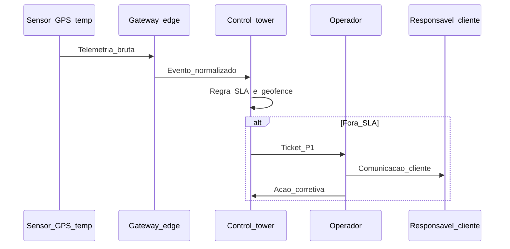

# IoT, visibilidade e *digital twin* da rede — sensores falam, mas alguém precisa decidir

**IoT (*Internet of Things*)** na cadeia costuma significar **sensores e telemetria**: posição, temperatura, umidade, vibração, abertura de porta. **Visibilidade** é quando esses eventos viram **estado confiável** no sistema (*in transit*, *delayed*, *compromised*). ***Digital twin*** da **rede** é um **modelo vivo** que replica nós, fluxos e regras para **simular** cenários (adição de CD, greve em corredor, pico de demanda) — distinto do *twin* de **um único ativo** industrial.

---

## Objetivos e resultado de aprendizagem

**Ao final desta aula**, você será capaz de:

- Listar **casos de uso** de IoT em logística com **pré-requisito** de dados.  
- Descrever o fluxo **evento → torre de controle → exceção**.  
- Posicionar *digital twin* de **rede** como decisão estratégica, não gadget de marketing.

**Duração sugerida:** 60–75 minutos.

---

## Gancho — a TechLar e o caminhão «invisível»

A **TechLar** colocou **rastreador** na frota própria, mas **subcontratados** mandavam posição por **WhatsApp**. Cliente B2B pedia **ETA**; *customer service* abria **cinco** sistemas. Um lote **refrigerado** atrasou; ninguém soube **quando** a cadeia fria falhou — **sensor** existia no papel, mas **alarme** não acionava **playbook**. IoT sem **workflow** é **custo** sem valor.

**Analogia do GPS sem destino:** ver o ponto no mapa não entrega a encomenda — precisa **rota**, **prioridade** e **quem** desvia trânsito.

---

## Mapa do conteúdo

- IoT: ativo, veículo, contêiner, doca, *wearable* operacional (com privacidade).  
- Eventos, latência, **qualidade** do sinal.  
- *Control tower*: papel humano + sistema; **exceção** como produto.  
- *Digital twin* de rede: dados mínimos, simulação, limites.

---

## Conceito núcleo

**Evento IoT (pedagógico):** tupla **(o quê, onde, quando, confiança)** — *confidence* importa para não disparar falso positivo.

**Torre de controle (*control tower*):** função que **integra** dados de pedido, estoque, transporte e fornecedor, prioriza **exceções** e **escala** donos (*consenso de mercado* em grandes redes).

***Digital twin* da rede:** modelo computacional com **topologia** (nós/elos), **tempos**, **capacidades** e **regras**; permite **cenários** (*what-if*). Não exige **metaverso** — exige **dados calibrados**.

**Legenda:** `S` = **dispositivo**; `C` = **sistema** + regras; decisão humana em **exceção** (`O`, `R`).

**Mini-caso:** *digital twin* mostra que **novo CD** reduz lead time mas **sobe** estoque de SKU de baixa rotação — decisão vai para **CTS** e *S&OP*, não só para TI.

---

## Trade-offs

- **Mais sensores** → mais custo e **falsos alarmes** se regras forem ruins.  
- **Edge** (*processar na borda*) reduz latência; aumenta **complexidade** de manutenção.  
- *Twin* **preciso** exige **disciplina** de atualização de modelo — senão vira **fantasma**.

---

## Aplicação — exercício

Escolha **um** fluxo (ex.: exportação refrigerada). Liste **cinco** eventos IoT desejáveis e, para cada um, **quem age** se o limiar for violado (papel, não nome). Desenhe **uma** melhoria no fluxo da sequência acima (texto).

**Gabarito pedagógico:** deve haver **limiar** explícito (tempo/temperatura); se «TI monitora» sem **escalação** para operações/cliente, falta **fechamento** do fluxo; melhoria pode ser **geofence**, **dupla confirmação** de sensor, ou **integração ASN**.

---

## Erros comuns e armadilhas

- Contratar **mapa bonito** sem **SLA de dados** dos parceiros.  
- IoT **sem cibersegurança** — dispositivo vira entrada (*consultar especialistas*).  
- Confundir **rastreamento** com **planejamento** — visibilidade não substitui **estoque** ou **capacidade**.  
- *Twin* vendido como **projeto único** sem *owner* e sem **re-calibração**.

---

## KPIs e decisão

- **Latência** média evento→visível no sistema.  
- **% exceções** resolvidas dentro do *playbook*.  
- **Falso positivo** / ruído de alarme (operadores param de acreditar).  
- **Custo** por evento útil *versus* custo total de IoT.

---

## Fechamento — três takeaways

1. IoT gera **evento**; valor nasce na **ação** e no **SLA**.  
2. Torre de controle é **processo + dado**, não só *dashboard*.  
3. *Twin* de rede liga **estratégia** a **cenário** — se o modelo está velho, a decisão também.

**Pergunta de reflexão:** qual exceção hoje **demora horas** só porque o evento **existe** mas não **cruza** com o pedido?

---

## Referências

1. IBM / AWS / Azure — arquiteturas de referência **IoT** (*technical papers* — usar como tipo de fonte, não como endorsement comercial).  
2. ISO/IEC 30141 (IoT Reference Architecture) — visão **normativa** de alto nível.  
3. Grieves, M. *Digital Twin* — origem conceitual (*literatura académica*).  
4. ASCM — visibilidade e *digital supply chain* — [ascm.org](https://www.ascm.org/).

**Ponte:** [TMS — faturação e auditoria](../../trilha-tecnologia-e-sistemas/modulo-04-tms/aula-03-faturacao-auditoria-frete.md); [WMS — eventos](../../trilha-tecnologia-e-sistemas/modulo-03-wms/aula-01-sinal-fisico-evento-wms.md).
