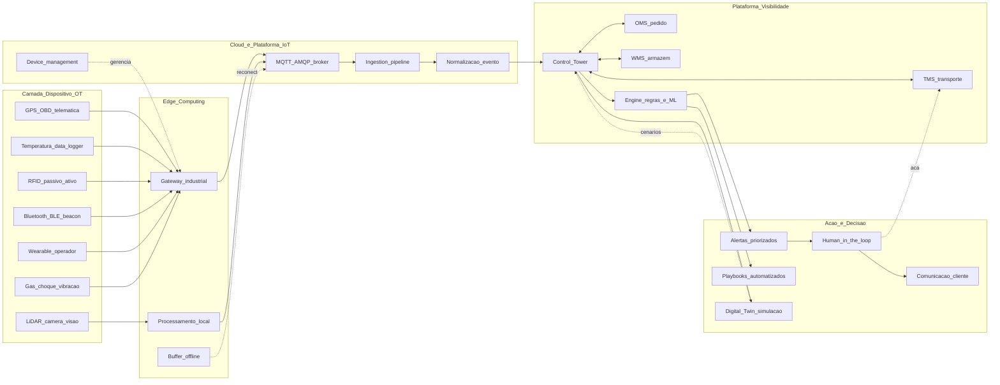
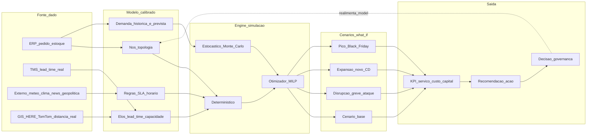

# IoT, visibilidade e *digital twin* da rede — sensores falam, mas alguém precisa decidir

**IoT (*Internet of Things*)** na cadeia significa **sensores e telemetria**: posição GPS, temperatura, umidade, vibração, abertura de porta, peso, choque, pressão, gás. **Visibilidade** é quando esses eventos viram **estado confiável** no sistema (*in transit*, *delayed*, *cold-chain breach*, *idle*, *exception*). ***Digital twin*** da **rede** é um **modelo vivo** que replica nós, fluxos e regras para **simular** cenários (greve, pico, novo CD, ruptura de Mar Vermelho) — distinto do *twin* de **um único ativo** (esteira de armazém, motor de empilhadeira) ou de **um único processo** (linha produtiva).

Esta aula apresenta o **arco completo** *sensor → evento → torre de controle → exceção → decisão → twin de rede*, com **arquitetura de referência**, *cardinalidade típica de sensores*, **diferenciação de níveis L0/L1/L2/L3 de control tower**, *digital twin* (geomático/asset/process/network), governança de dado IoT, **ROI por caso de uso**, *cyber* OT/IT e exemplos BR/global.

---

## Objetivos e resultado de aprendizagem

Ao final desta aula, você será capaz de:

- Listar **8 famílias de sensores** com **caso de uso**, **cardinalidade** e **payback**.
- Diferenciar **L0/L1/L2/L3** de **control tower** com responsabilidade clara.
- Diferenciar **4 tipos de digital twin** (asset / process / network / system).
- Compor a **arquitetura IoT** *device → edge → cloud → AI → action*.
- Estabelecer **SLA de evento** (latência, *confidence*, *resolução*).
- Reconhecer **risco cyber OT** e LGPD para sensores embarcados em produto/funcionário.

**Duração sugerida:** 70 minutos. **Pré-requisitos:** aula 4.1 (maturidade); fundamentos de TMS/WMS recomendados.

---

## Mapa do conteúdo

1. **Gancho TechLar** — caminhão invisível e cadeia fria sem alarme.
2. **Arquitetura referência IoT** *device→edge→cloud→action*.
3. **8 famílias de sensores** com cardinalidade e payback.
4. **Control tower** — definição, **L0–L3**, função humana + sistema.
5. **Digital twin** — 4 tipos (asset / process / network / system).
6. **Trade-offs** (cardinalidade, edge, falsos alarmes, cyber).
7. **Casos**: Maersk Captain Peter, FedEx SenseAware, Heineken e gemini-twin de rede.
8. **Cyber OT/IT** + **LGPD** para wearables e sensor em produto.

---

## Gancho — a TechLar e o caminhão «invisível»

A TechLar tem operação espalhada Brasil + exportação:

| Modal | Frota | Visibilidade atual |
|---|---|---|
| Frota própria 18 caminhões | rastreador OBD + telemetria | OK, mas **dado isolado** (não integra ERP) |
| Subcontratados 86 transportadoras | nada padronizado | **WhatsApp + planilha** |
| Cabotagem CN→BR | EDI armador irregular | atualiza **só na partida e chegada** |
| Importação CN aérea | *track and trace* DHL | **OK** mas só visível em DHL.com |
| Cadeia fria (medicamentos OEM) | data logger USB **manual** | descoberta **na entrega**, NC só após cliente reclamar |
| Armazém Itupeva (próprio) | RFID em paletes (apenas zonas A/B) | dado **não casa** com WMS |

**Eventos do trimestre 4T-2024**:

- **47 atrasos** identificados **só após cliente reclamar** (atendimento abria 5 sistemas).
- **3 lotes refrigerados** chegaram fora de spec; **NC** só descoberta **na entrega**, sem evidência de **quando** falhou — armador alegou *handover* à TechLar OK; TechLar alegou armador.
- **R$ 187k** em **multas SLA** B2B; **2 contratos** ameaçados.
- **R$ 2,1 mi** em ativos parados (paletes RFID em zona errada do CD, *picking team* gastou 380h procurando).

**Ato 1**: CIO propôs «**comprar IoT da Sigfox/Trackmind**» (R$ 480k licença + 12k sensores). CSCO perguntou: **«qual evento exatamente vamos processar, com que latência, quem age, qual SLA com cliente?»** — silêncio.

**Ato 2**: foi montado **caso de uso por caso de uso** com **dono**, **payback**, **integração mínima**. Resultado: 4 casos de uso justificados (cadeia fria, frota própria + subcontratado top 12, RFID zona armazém, contêiner cabotagem); **R$ 280k** investidos; payback 11 meses.

**Analogia do GPS sem destino:** ver o ponto no mapa **não entrega a encomenda**. Precisa **rota**, **prioridade**, **playbook** e **dono que age** quando algo desvia.

**Analogia do alarme de incêndio que ninguém atende:** sensor sem **playbook + escalação + responsabilidade** é como **alarme tocando às 3h da manhã** que ninguém escuta — pior que não ter alarme (gasta dinheiro, dá falsa segurança, gera *alert fatigue* — operador desliga porque cansa).

**Analogia do twin como sala de simulador de voo:** *digital twin* de rede é o **simulador de voo do CSCO** — não substitui voar, mas **permite errar barato**. Pilotar 747 sem simulador antes = mortalidade. Reorganizar rede sem twin antes = decisão de R$ 80 mi com base em planilha.

---

## Conceito-núcleo

### Definições críticas

**Evento IoT (modelo pedagógico):** tupla **(o quê, onde, quando, valor, *confidence*, contexto)**.

- **O quê**: tipo de medição (temp, GPS, vibração).
- **Onde**: ID do dispositivo + local físico inferido.
- **Quando**: timestamp do dispositivo + chegada cloud.
- **Valor**: leitura.
- ***Confidence***: 0–1, importa para não disparar falso positivo.
- **Contexto**: pedido/lote/SKU/contrato vinculado.

**Sem contexto, sensor é ruído.** É a integração ao **pedido/lote/SKU** que cria valor.

**Visibilidade ≠ Rastreamento ≠ Orquestração:**

| Capacidade | O que é |
|---|---|
| **Tracking** | onde está |
| **Tracing** | de onde veio (lote, origem) |
| **Visibilidade** | estado confiável + ETA + risco |
| **Orquestração** | decidir e agir (re-rotear, replanear, comunicar cliente) |

**Control Tower (CT)**: função (sistema + processo + gente) que **integra** dados de pedido, estoque, transporte e fornecedor, **prioriza exceções** e **escala donos**.

**Digital Twin**: modelo digital **vivo** (não estático) com **fluxo bidirecional** dado físico→digital e decisão digital→físico.

### Arquitetura referência IoT *end-to-end*

**Legenda:** **5 camadas**: **OT (operacional)**, **edge**, **cloud/plataforma**, **visibilidade integrada (CT + ERP/WMS/TMS)**, **ação (humana ou autônoma)**. Camada de **AI** é transversal. **Buffer offline** é crítico para zonas sem cobertura (rota Belém–Manaus).

### **8 famílias de sensores** com cardinalidade e payback

| Família | Caso de uso típico | Cardinalidade média (ativos vs sensor) | Payback |
|---|---|---|---|
| **GPS / Telemetria veicular** | rastreio frota | 1 sensor / veículo (próprio); 1 / contêiner | 6–12m |
| **Data logger temperatura/umidade** | cadeia fria farma, food, vinho | 1 / palete crítico ou 1 / contêiner refrigerado | 9–18m |
| **RFID passivo (UHF)** | inventário armazém, *yard mgmt* | 1 etiqueta / palete; antenas zonas | 12–24m |
| **RFID ativo / BLE beacon** | *yard*, ativo crítico, *people-tracking* | 1 / ativo + 1 *gateway* / 1.000 m² | 12–18m |
| **Choque/vibração/inclinação** | carga frágil (eletrônico, vidro, OEM) | 1 / palete crítico | 12m |
| **Gás / O2 / CO2 / etileno** | frutas, flores, food, química | 1 / contêiner refrigerado | 18–24m |
| **Wearable (operador)** | tarefas armazém, ergonomia, *lone worker* | 1 / operador (com **consentimento LGPD**) | 18m |
| **Visão / LiDAR / Câmera** | docas, qualidade, *yard*, segurança | 1 / doca; 1 / corredor | 24–36m |

**Cardinalidade típica de uma operação mid-market BR**: ~12k–60k *endpoints*; *enterprise* 500k–5M+ (Walmart, Amazon).

### **Control Tower — níveis L0/L1/L2/L3**

| Nível | Capacidade | Sistema típico | Quem usa |
|---|---|---|---|
| **L0 — Tracking** | só posição GPS / status pedido | Maxiroute, app TMS básico | despacho |
| **L1 — Visibilidade** | posição + ETA + alerta básico SLA | FourKites, project44 básico | atendimento, operações |
| **L2 — Orquestração de exceção** | priorização + workflow + escalação + comunicação cliente | project44 enterprise, Shippeo, Blue Yonder Luminate CT | torre dedicada (24×7) |
| **L3 — Predição + Decisão** | ML predição risco, recomendação ação, simulação what-if | Kinaxis Maestro CT, o9 CT, Blue Yonder Luminate avançado | torre + analytics + planejamento |

A maioria das empresas BR está em **L0–L1**. Top 3 BR (grandes varejistas + bens consumo) em L2. **L3 ainda raro** (operadores logísticos enterprise).

### **Digital Twin — 4 tipos**

| Tipo | Escopo | Exemplo | Stack típica |
|---|---|---|---|
| **Asset twin** | um ativo (esteira, motor empilhadeira, válvula) | manutenção preditiva motor empilhadeira | GE Predix, PTC ThingWorx, Siemens MindSphere |
| **Process twin** | uma linha/processo (linha produção, doca) | otimização *picking* dock-to-stock | AnyLogic, FlexSim, Dassault Delmia |
| **Network twin** | rede inteira (nós, elos, regras, tempos) | reorganização rede, what-if greve, novo CD | **anyLogistix**, AnyLogic, Coupa SC Modeler, Optilogic Cosmic Frog |
| **System twin** | múltiplos twins integrados, ecossistema cidade/porto | porto smart Roterdã, smart city | Siemens Xcelerator, Ansys Twin Builder |

**Network twin é o mais relevante para CSCO**: permite **what-if** de R$ 80 mi de capex sem errar.

### Arquitetura *digital twin* de rede

**Legenda:** twin **calibrado** (não inventado) com **fontes vivas**, simula 4+ cenários, sai em **KPIs comparáveis** + **recomendação**, fecha ciclo com decisão.

---

## Frameworks-chave

### 1. **ISO/IEC 30141** — IoT Reference Architecture (normativo)
### 2. **ISA-95 / Purdue Model** — camadas OT/IT (essencial cyber)
### 3. **MQTT / AMQP / OPC UA** — protocolos IoT industrial
### 4. **Industry 4.0 (RAMI 4.0)** — referência alemã para indústria conectada
### 5. **Grieves Digital Twin** — origem conceitual (NASA, Apollo)
### 6. **Tenfold of Visibility (Gartner)** — *find / track / predict / sense / decide*
### 7. **NIST Cybersecurity Framework** + **IEC 62443** — cyber OT
### 8. **ITU-T Y.4000** — IoT recomendações
### 9. **EU Data Act** (2024) — regula uso de dado de dispositivo conectado
### 10. **LGPD + GDPR** — wearable, biometria, dado funcionário

---

## Aprofundamentos — variações setoriais e geográficas

### Brasil — particularidades

- **Cobertura celular** ainda heterogênea — rota Belém–Manaus, sertão NE: **necessidade de buffer offline** + dual rede 4G/satélite (Starlink Logistics 2024).
- **Custo de sensor importado** + ICMS difal + DIFAL inviabiliza muitos *PoCs*. SUFRAMA pode ajudar (sensor montado ZFM).
- **Tributação** de evento IoT: armazenagem dado pessoal de motorista (LGPD) requer base legal.
- **Lei do Motorista (Lei 13.103/2015)**: tempo direção, descanso — telemetria obrigatória em frota >12t = aliada IoT.
- **Cadastro Bipartite ANTT** (RNTRC): integração sensor + obrigação fiscal facilita compliance.

### Casos globais

- ***Maersk Captain Peter***: sensor IoT em contêiner refrigerado entrega visibilidade temp/umidade/CO2/O2/etileno em tempo real para shipper de fruta — reduziu *claims* >40%.
- ***FedEx SenseAware ID***: BLE em pacote crítico, visibilidade *sub-meter* em hubs.
- ***Walmart RFID mandate*** (2022 retomado para vestuário): 100% itens RFID etiquetados na entrada.
- ***Amazon Kiva / robôs móveis***: **process twin** + **asset twin** para 750k+ robôs em CDs globais.
- ***Heineken Brewery 4.0***: digital twin de rede + asset twin de fabricação + IoT em ativos (Holanda, Brasil).
- ***Porto de Rotterdam***: ***system twin*** completo do porto (navios + cais + carga + clima + tide) — referência mundial.
- ***Ambev***: telemetria + RFID em armazém + control tower — caso BR avançado.
- ***JBS***: sensor temperatura cadeia fria proteína integrado a SAP — exportação UE/CN sem incidente.

---

## Trade-offs estratégicos

| Decisão | A favor | Contra |
|---|---|---|
| **Mais sensores** (cardinalidade alta) | precisão | custo, *alert fatigue*, *false positive* |
| **Edge computing** | latência baixa, autonomia offline | complexidade manutenção, OS/firmware |
| **Cloud puro** | escala, simplicidade | latência, dependência rede |
| **Sensor próprio** (compra) | controle, dado | capex, *lifecycle*, obsolescência |
| **Sensor as a Service** (Sigfox, Sensitech) | opex, atualização | dependência, dado vai p/ vendor |
| **Padrão aberto** (MQTT, OPC UA, GS1 EPCIS) | interop | esforço |
| **Padrão proprietário** (vendor X) | rapidez | lock-in |
| **Twin determinístico** | simples | não captura variabilidade |
| **Twin estocástico (Monte Carlo)** | realismo | exige dado e calibração |
| **Twin por capability** (rede, asset, process) | foco | múltiplos twins desconexos |

---

## Caso prático — TechLar 4 casos de uso IoT priorizados

| # | Caso de uso | Sensor | Cardinalidade | Investimento | Benefício/ano | Payback |
|---|---|---|---|---|---|---|
| 1 | **Cadeia fria farma B2B** | data logger temp + GPS contêiner | 480 contêineres/ano | R$ 86k | R$ 220k (NC −60%, multa −R$ 110k, claim cliente −R$ 95k) | 5m |
| 2 | **Frota própria + top 12 transp** integrada CT | telemetria veicular + API parceiros | 12 frota próp + 240 veículos parceiros | R$ 92k | R$ 180k (atendimento −2 FTE, multa SLA −R$ 70k) | 7m |
| 3 | **RFID zona armazém Itupeva** | RFID passivo zonas A/B/C | 12k paletes + 18 antenas | R$ 68k | R$ 145k (picking −18%, ativo perdido −R$ 60k) | 6m |
| 4 | **GPS contêiner cabotagem CN→BR** | GPS dual + temp | 180 contêineres/ano | R$ 34k | R$ 75k (visibilidade ETA, planejamento porto) | 5m |
| **Total** | | | | **R$ 280k** | **R$ 620k/ano** | **5,4m** |

**Comparação com proposta CIO original** (R$ 480k indistinto): saving R$ 200k + payback 8 meses melhor + cobertura **dos casos que doem**, não dos que aparecem em demo.

**Decisão de governança**: torre L1 contratada Shippeo (R$ 12k/mês); play-books escritos para 8 cenários de exceção; SLA com cliente revisto + bonificação por OTIF >97%.

---

## Erros comuns e armadilhas

1. **IoT como projeto de TI** sem dono operacional — sensores instalados, ninguém age.
2. ***Alert fatigue*** por **sem regra inteligente** (todo desvio é P1) — operador desliga.
3. **Sensor sem contexto** (temp sem lote/SKU vinculado) — útil para auditoria, inútil para ação.
4. ***PoC eterno*** em **uma rota piloto** sem definição de gate produção.
5. **Cybersecurity ignorada** — sensor invadido = entrada na rede OT (Stuxnet, Colonial Pipeline).
6. **LGPD ignorada** em wearable de operador (frequência, biometria, localização) — multa ANPD + sindicato.
7. **Twin desatualizado** = ficção. Modelo deve ter **owner** + **cadência re-calibração**.
8. **Twin como demo de marketing** sem decisão real sair dele.
9. **Vendor lock-in** sem estratégia de saída — dado IoT fica refém.
10. **Confundir tracking (sensor) com planning (otimização)** — visibilidade não substitui APS.
11. **Cardinalidade demais** (sensor em tudo) sem priorizar por **valor por evento**.
12. **Cobertura celular** ignorada em rotas remotas — buffer offline ausente.

---

## Risco e governança

### Cyber OT (Operational Technology)

- **Superfície de ataque** explode com IoT. **IEC 62443**, **NIST CSF**, segmentação de rede OT/IT obrigatória.
- ***Threat actors***: ransomware (Colonial Pipeline 2021), espionagem industrial, *insider*.
- **Update de firmware**: estratégia + janela; muitos sensores «*deploy and forget*» = vulneráveis 5+ anos.
- ***Zero trust*** em endpoint IoT.

### LGPD e *data minimization*

- **Wearable de operador**: frequência cardíaca, localização contínua = dado pessoal/sensível. **Base legal explícita** (consentimento ou legítimo interesse documentado).
- **Sensor em produto entregue cliente**: dado de uso pertence ao consumidor (interpretação ANPD em construção).
- **Câmera em armazém**: política de retenção, finalidade explícita, sinalização.

### EU Data Act (2024)

- **Dado de dispositivo conectado** deve ser portátil; usuário tem direito acesso.
- Impacta exportação BR→UE de produto com sensor embutido.

### Sustentabilidade

- ***E-waste*** de sensores end-of-life (bateria, eletrônica) — *take-back program* + reciclagem ABNT NBR 16156.
- Sensor consome energia; em escala de milhões, pegada não é zero.

### Regulatório BR

- **Lei 13.103/2015** (Lei do Motorista): telemetria obrigatória.
- **Resolução ANTT 5862/2019** (RNTRC): integração sensor/telemetria.
- **Decreto 9.244/2017**: registro biométrico em transporte coletivo.
- **MAPA** (Ministério Agricultura): cadeia fria proteína exportada exige rastreabilidade temp + lote.

---

## KPIs estratégicos

| KPI | Pergunta | Dono | Fonte | Cadência | Playbook |
|---|---|---|---|---|---|
| **Latência evento→sistema (s)** | dado em tempo? | IT IoT | pipeline | Tempo real | <30s p99; otimizar broker/ingest |
| **Taxa de exceção resolvida no SLA (%)** | torre funciona? | Control Tower head | CT | Diário | playbook + treinamento |
| ***False positive rate* (%)** | regras inteligentes? | Data scientist | CT log | Semanal | calibrar threshold; ML reduz |
| ***Mean time to detect / respond / resolve*** | ciclo exceção? | Operações | CT | Diário | reduzir cada etapa |
| **% pedidos com visibilidade *end-to-end*** | cobertura? | CSCO | CT | Mensal | onboarding parceiros |
| **% sensores com firmware atualizado** | cyber? | CISO | device mgmt | Mensal | patch program |
| ***Uptime* da plataforma IoT (%)** | confiabilidade? | IT IoT | monitoring | Semanal | redundância, SRE |
| **Custo por evento útil (R$)** | ROI? | CFO + IT | financeiro + CT | Trimestral | priorizar casos uso |
| **Twin *calibration accuracy* (% desvio simulado vs real)** | twin confiável? | Twin owner | log | Mensal | re-calibrar |
| **NPS interno «confio nos números do CT»** | adoção? | Change | survey | Trimestral | UX, treinamento |

---

## Tecnologias e ferramentas habilitadoras

- **Plataforma IoT**: **AWS IoT Core**, **Azure IoT Hub**, **Google Cloud IoT (Pub/Sub)**, **IBM Watson IoT (legacy)**, **PTC ThingWorx**, **Siemens MindSphere**, **GE Predix**.
- **Edge**: **AWS Greengrass**, **Azure IoT Edge**, **NVIDIA Jetson**, **Dell Edge Gateways**.
- **Sensores e SaaS**: **Sensitech** (cold chain), **Tive**, **Roambee**, **Controlant** (farma), **Sigfox**, **Quuppa** (RTLS), **Zebra Technologies**, **Honeywell**, **Impinj** (RFID).
- **Visibilidade / Control Tower**: **project44**, **FourKites**, **Shippeo**, **E2open**, **Blue Yonder Luminate CT**, **Kinaxis Maestro CT**, **SAP Logistics Business Network**.
- **Telemetria veicular BR**: **Sascar (Michelin)**, **Onixsat**, **Omnilink**, **Geotab**, **Cobli**.
- **Network twin**: **anyLogistix**, **AnyLogic**, **Coupa Supply Chain Modeler (Llamasoft Guru)**, **Optilogic Cosmic Frog**, **AIMMS**.
- **Asset twin**: **PTC ThingWorx**, **Siemens MindSphere/Xcelerator**, **GE Predix**, **Ansys Twin Builder**, **Bentley iTwin**.
- **Process twin**: **AnyLogic**, **FlexSim**, **Dassault Delmia**, **Siemens Tecnomatix**.
- **Cyber OT**: **Claroty**, **Nozomi Networks**, **Dragos**, **Tenable.OT**.
- **GIS / Map**: **HERE**, **TomTom**, **Esri ArcGIS**, **Google Maps Platform**, **Mapbox**.
- **MES / SCADA / Historian**: **Rockwell FactoryTalk**, **Siemens SIMATIC**, **AVEVA Historian (PI System)**.

---

## Glossário rápido

- **OT vs IT**: tecnologia operacional (chão de fábrica/armazém) vs informação (corporativa).
- **IoT, IIoT**: Internet of Things / Industrial IoT.
- **MQTT, AMQP, OPC UA**: protocolos mensageria/comunicação industrial.
- **RFID UHF / HF / LF**: faixas de frequência RFID.
- **BLE**: Bluetooth Low Energy.
- **RTLS**: Real-Time Location System.
- ***Geofence***: cerca virtual georreferenciada.
- **ASN**: Advanced Shipping Notice.
- **ETA / ETD**: Estimated Time of Arrival / Departure.
- ***Cold chain***: cadeia fria.
- **EPCIS (GS1)**: padrão de troca eventos visibilidade.
- **Edge / Fog**: processamento próximo à fonte.
- **SCADA / Historian / MES**: sistemas industriais de controle/historização/execução.
- **Digital Twin (asset/process/network/system)**: 4 escopos.
- **Control Tower (L0–L3)**: 4 níveis de capacidade.
- **NIST CSF, IEC 62443**: frameworks cyber OT.
- **EU Data Act**: regulamento UE de dado de dispositivo conectado.

---

## Aplicação — exercícios

**Exercício 1 (20 min) — Caso de uso IoT priorizado.** Para sua empresa, identifique **3 candidatos** a IoT (cadeia fria? frota? armazém? exportação?). Para cada, preencha: **sensor**, **cardinalidade**, **investimento estimado**, **benefício/ano**, **payback**, **owner**. Priorize **top 1**.

**Gabarito:** payback <12m + benefício mensurável + dono operacional (não TI) = candidato. Cobertura emocional («todos têm») não vale.

**Exercício 2 (15 min) — Playbook exceção.** Escolha **1 cenário** de exceção (ex.: temperatura fora de spec em contêiner cabotagem). Escreva o **playbook** com: **trigger**, **escalação L1→L2→L3**, **SLA de cada etapa**, **comunicação cliente**, **registro NC**.

**Gabarito:** trigger explícito (não vago «se der ruim»); escalação com tempo (15min L1, 30min L2, 1h L3); cliente avisado **antes** que descubra sozinho.

**Exercício 3 (15 min) — Twin de rede.** Para sua rede, descreva **3 cenários** que você simularia em twin: (1) novo CD, (2) disrupção fornecedor crítico, (3) pico de venda. Que **dado mínimo** precisa? Que **decisão** sai do twin?

**Gabarito:** dado mínimo = nó/elo/lead time/capacidade/demanda; decisão = capex CD novo ou plano de contingência ou capacidade extra contratada.

**Exercício 4 (10 min) — L0 a L3.** Posicione sua control tower atual (0–3) com **2 evidências** + **próximo nível** + **3 ações** para subir.

---

## Pergunta de reflexão

Qual exceção hoje **leva horas** para ser percebida por sua empresa apenas porque o **evento existe** mas **não cruza** com o pedido — e quanto custa, em receita perdida, NPS e multa SLA, **cada hora** de atraso na detecção?

---

## Fechamento — takeaways

1. IoT gera **evento**; valor nasce na **ação** orquestrada com **SLA + dono**.
2. **Cardinalidade inteligente** vence cardinalidade total — priorize por **valor por evento**.
3. **Control Tower** tem **4 níveis** (L0–L3); maioria BR está L0–L1.
4. **Digital twin** tem **4 tipos** (asset / process / network / system) — *network twin* é o mais estratégico para CSCO.
5. **Cyber OT + LGPD + EU Data Act** são parte do projeto, não anexo.
6. **Casos**: Maersk Captain Peter, FedEx SenseAware, Walmart RFID, Heineken twin, Porto Rotterdam system twin.
7. ***Alert fatigue*** mata torre. Regras inteligentes + ML para reduzir falso positivo.

---

## Referências

1. ISO/IEC 30141 — *IoT Reference Architecture*.
2. ISA-95, IEC 62264 — *Enterprise-Control System Integration*.
3. IEC 62443 — *Industrial communication networks - IT security*.
4. NIST — *Cybersecurity Framework 2.0* (2024).
5. GRIEVES, M. *Digital Twin: Manufacturing Excellence through Virtual Factory Replication*. White Paper, 2014.
6. PORTER, M.; HEPPELMANN, J. *How Smart, Connected Products Are Transforming Companies*. *HBR*, 2015.
7. GARTNER — *Hype Cycle for Supply Chain Execution Technologies* (anual); *Magic Quadrant for Real-Time Transportation Visibility* (anual).
8. UNIÃO EUROPEIA — Regulamento (UE) 2023/2854 (Data Act).
9. GS1 — EPCIS 2.0 (visibilidade padrão).
10. IBGE / ANATEL — cobertura celular Brasil.
11. ABNT NBR ISO/IEC 27001 (gestão segurança informação).

---

**Ponte:** [TMS — faturação e auditoria](../../trilha-tecnologia-e-sistemas/modulo-04-tms/aula-03-faturacao-auditoria-frete.md); [WMS — eventos](../../trilha-tecnologia-e-sistemas/modulo-03-wms/aula-01-sinal-fisico-evento-wms.md); aula 4.3 desta trilha cobre **IA com governança**, complementando control tower L3 (predição/decisão) e governança de modelo.
